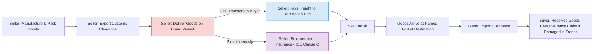

## CIF (Cost, Insurance and Freight)

### Definition

CIF (Cost, Insurance and Freight) is an Incoterms 2020 rule applicable exclusively to sea and inland waterway transport. The seller delivers the goods on board the vessel at the port of shipment, pays the costs and freight necessary to bring the goods to the named port of destination, and also procures marine insurance against the buyer's risk of loss or damage during carriage. Risk transfers from seller to buyer once the goods are on board the vessel, despite the seller continuing to pay for freight and insurance beyond that point.

### Key Points

- **Transport modes**: Sea and inland waterway transport only.
- **Risk transfer point**: When the goods are on board the vessel at the port of shipment — identical to CFR and FOB.
- **Cost transfer point**: Seller pays cost, insurance, and freight to the named port of destination.
- **Insurance obligation (unique to CIF/CIP)**: Seller must procure insurance covering, at minimum, Institute Cargo Clauses (C) or similar clauses, providing minimum cover. This is the lowest-tier insurance requirement among the Incoterms rules.
- **Divergence of risk and cost**: As with CFR, CIF splits the point of risk transfer (origin, on board) from the point to which costs are paid (destination port).
- **Buyer's option**: Buyer may require seller to obtain additional insurance cover (e.g., Institute Cargo Clauses A) at buyer's expense, since default seller cover is minimum only.
- **Container cargo caution**: Like CFR, CIF is not recommended for containerized cargo delivered to a terminal before vessel loading; CIP is the recommended alternative in such cases.
- **Named point required**: Always paired with a named port of destination, e.g., "CIF Singapore."

### Seller Obligations

- **Delivery**: Deliver goods on board the vessel (or procure goods so delivered) at the port of shipment.
- **Contract of carriage**: Contract for carriage to the named port of destination on usual terms, at seller's expense.
- **Insurance**: Contract for cargo insurance complying at least with Institute Cargo Clauses (C), covering the buyer's risk from the port of shipment to at least the port of destination; insurance must be in a freely transferable currency, cover the contract price plus 10% (i.e., 110% of contract value, per default ICC practice), and be obtained from a reputable insurer.
- **Export clearance**: Handle export licenses and customs formalities.
- **Documents**: Provide the buyer with the transport document (bill of lading), insurance policy or certificate, and commercial invoice.
- **Notice**: Notify the buyer that goods have been delivered on board.

### Buyer Obligations

- **Payment**: Pay the contract price.
- **Import clearance**: Handle import licenses, customs clearance, duties, and taxes.
- **Risk from loading**: Bear risk of loss or damage from the point goods are on board.
- **Additional insurance**: May arrange supplementary insurance beyond the seller's minimum cover if greater protection is desired.
- **Costs after risk transfer**: Bear costs arising after delivery, including destination unloading costs unless covered in the freight contract.
- **Destination handling**: Receive goods and manage onward transport as needed.

### Cost, Insurance, and Risk Transfer Diagram (svg_diagram)

<svg xmlns="http://www.w3.org/2000/svg" viewBox="0 0 800 280">
<text x="400" y="24" text-anchor="middle" font-size="16" font-weight="bold" fill="#1a1a1a">CIF Cost, Insurance &amp; Risk Transfer (svg_diagram)</text>
<line x1="60" y1="150" x2="740" y2="150" stroke="#333" stroke-width="2" />
<circle cx="120" cy="150" r="6" fill="#333" />
<text x="120" y="175" text-anchor="middle" font-size="12">Seller's Premises</text>
<circle cx="300" cy="150" r="6" fill="#c0392b" />
<text x="300" y="175" text-anchor="middle" font-size="12">Port of Shipment</text>
<text x="300" y="192" text-anchor="middle" font-size="12">(On Board Vessel)</text>
<circle cx="620" cy="150" r="6" fill="#2980b9" />
<text x="620" y="175" text-anchor="middle" font-size="12">Named Port</text>
<text x="620" y="192" text-anchor="middle" font-size="12">of Destination</text>
<line x1="120" y1="105" x2="300" y2="105" stroke="#c0392b" stroke-width="4" />
<line x1="300" y1="105" x2="620" y2="105" stroke="#c0392b" stroke-width="4" stroke-dasharray="6,4" />
<text x="210" y="95" text-anchor="middle" font-size="12" fill="#c0392b">Seller Risk</text>
<text x="460" y="95" text-anchor="middle" font-size="12" fill="#2980b9">Buyer Risk</text>
<line x1="120" y1="215" x2="620" y2="215" stroke="#27ae60" stroke-width="4" />
<text x="370" y="205" text-anchor="middle" font-size="12" fill="#27ae60">Seller Pays Cost, Insurance &amp; Freight</text>
<line x1="120" y1="240" x2="620" y2="240" stroke="#8e44ad" stroke-width="3" stroke-dasharray="4,3" />
<text x="370" y="255" text-anchor="middle" font-size="11" fill="#8e44ad">Seller-Procured Insurance Cover (min. ICC Clause C)</text>
<line x1="300" y1="120" x2="300" y2="180" stroke="#c0392b" stroke-width="1" stroke-dasharray="3,3" />
<text x="300" y="60" text-anchor="middle" font-size="11" fill="#c0392b">Risk Transfer Point</text>
</svg>

### Process Flow

### Example

A seller in Mumbai sells textiles to a buyer in Rotterdam under "CIF Rotterdam, Incoterms 2020." The seller loads goods on board at Mumbai port, pays freight to Rotterdam, and purchases marine cargo insurance covering 110% of invoice value under Institute Cargo Clauses (C) — a minimum-cover policy that protects against major casualties (e.g., vessel sinking, fire) but excludes many partial-loss scenarios. If the buyer wants broader protection (e.g., theft, water damage, handling damage), the buyer must either negotiate for Clause A cover from the seller (usually at buyer's added cost) or purchase supplementary insurance independently.

### CIF vs Related Terms

| Term | Risk Transfer | Insurance Obligation (Seller) | Transport Mode |
| --- | --- | --- | --- |
| CIF | On board vessel at port of shipment | Required (minimum cover, ICC Clause C) | Sea/inland waterway only |
| CFR | On board vessel at port of shipment | Not required | Sea/inland waterway only |
| CIP | On handing to first carrier | Required (ICC Clause A, all-risk) | Any mode |
| CPT | On handing to first carrier | Not required | Any mode |
| FOB | On board vessel at port of shipment | Not required | Sea/inland waterway only |

### Common Pitfalls

- **Assuming "all-risk" coverage**: CIF's default insurance requirement is minimum cover (Clause C), not all-risk (Clause A). Buyers who assume broader protection may be underinsured for partial losses, theft, or improper handling.
- **Using CIF for containerized cargo**: Same structural mismatch as CFR — risk transfers "on board," but containers are typically handed over at a terminal earlier in the logistics chain. CIP is the ICC-recommended alternative for container trade.
- **Confusing insured party obligations**: The seller procures the policy, but it is taken out for the buyer's benefit — the buyer (or an assignee) is typically the party who must pursue a claim against the insurer for in-transit loss, not the seller.
- **Underestimating insured value**: Default ICC guidance suggests insuring 110% of contract value (covering price plus anticipated profit margin); failing to negotiate this explicitly can leave gaps in claim recovery.

[Inference] Despite being architecturally similar to CFR with an added insurance layer, CIF remains widely used in commodity trades (e.g., grain, oil) partly due to entrenched trade finance and documentary credit practices that reference CIF terms by convention.

**Related Topics**

- CFR (Cost and Freight)
- CIP (Carriage and Insurance Paid To)
- Institute Cargo Clauses (A, B, C)
- Marine insurance policy vs. certificate
- Letters of credit and CIF documentary requirements
- Insurable interest in international sales contracts