## Why FOB and CIF Are Discouraged for Containerized Cargo

### Definition

This topic addresses a well-documented structural mismatch between the risk-transfer mechanics of the maritime-specific Incoterms rules (FOB, CFR, CIF) and the operational realities of modern containerized shipping. These rules transfer risk when goods are "on board the vessel," but containerized cargo is typically delivered to a carrier or terminal operator well before vessel loading — creating a gap in which the exact moment and location of risk transfer becomes ambiguous or commercially impractical to prove.

### Key Points

- **Core issue**: FOB, CFR, and CIF fix risk transfer at "on board the vessel" — a legally and physically identifiable event for break-bulk or bulk cargo loaded directly by ship's tackle, but poorly suited to container logistics.
- **Container handover reality**: Containerized goods are usually delivered to a Container Freight Station (CFS) or Container Yard (CY) days before the vessel arrives, then handled by the terminal operator, not the seller, for stuffing, staging, and eventual loading.
- **Consequence**: The seller loses practical control of and visibility into the goods before the contractual risk-transfer point is reached, yet remains contractually responsible for risk until on-board loading occurs — an exposure mismatch.
- **ICC recommendation**: The ICC's official guidance notes for Incoterms 2020 explicitly recommend FCA (Free Carrier), CPT (Carriage Paid To), and CIP (Carriage and Insurance Paid To) for containerized cargo, since these rules transfer risk upon handover to the carrier at a named place — matching actual container logistics practice.
- **Persistent industry usage**: Despite this guidance, FOB/CFR/CIF remain heavily used for containerized trade due to trade finance conventions, documentary letter of credit practices, and general market familiarity — a known gap between ICC recommendation and commercial practice.
- **Evidentiary problem**: If cargo is damaged between CFS/CY delivery and on-board loading, establishing whether the loss occurred before or after the "on board" moment can be extremely difficult, complicating insurance claims and liability allocation.

### Technical Explanation

**1. Origin of the "On Board" Standard**

The "on board the vessel" risk transfer point traces back to traditional break-bulk shipping, where goods were loaded individually via ship's tackle directly from quay to vessel. In that context, "on board" was a clear, observable, single event — cargo either crossed the ship's rail or it hadn't (the pre-2010 Incoterms even used "ship's rail" as the literal transfer point before FOB/CFR/CIF definitions were revised in Incoterms 2010 to "on board").

**2. Containerization's Structural Break**

Modern container shipping decouples physical handover from vessel loading:

- Seller delivers a stuffed and sealed container to a CY or CFS, often 3-7 days before vessel departure.
- The container is then handled by the terminal operator: staged, weighed (VGM - Verified Gross Mass), and eventually loaded onto the vessel by terminal crane operations — activities entirely outside the seller's control.
- If FOB/CFR/CIF terms are used, the seller technically bears risk during this entire dwell period at the terminal, despite having no operational involvement or ability to mitigate loss during that window.

**3. Practical and Legal Consequences**

- **Insurance gaps**: Marine cargo insurance policies are often drafted around "warehouse to warehouse" or transit-based coverage, which can create ambiguity when paired with an on-board risk transfer point that doesn't match the actual physical custody chain.
- **Claims complexity**: In the event of container damage, theft, or loss at the terminal (before vessel loading), parties may dispute whether FOB/CIF risk had technically transferred, since the goods were not yet "on board."
- **Multimodal incompatibility**: FOB/CFR/CIF are single-mode (sea/inland waterway) rules. Container shipments are frequently multimodal (e.g., truck-to-port-to-vessel-to-port-to-rail), and these rules do not cleanly address risk during inland pre-carriage or on-carriage legs.

**4. The Recommended Alternative Structure**

| Maritime-specific rule (discouraged for containers) | Recommended multimodal equivalent | Risk transfer point |
| --- | --- | --- |
| FOB (Free On Board) | FCA (Free Carrier) | Handover to carrier at named place (e.g., CY gate) |
| CFR (Cost and Freight) | CPT (Carriage Paid To) | Handover to first carrier |
| CIF (Cost, Insurance and Freight) | CIP (Carriage and Insurance Paid To) | Handover to first carrier (with all-risk insurance) |

FCA/CPT/CIP transfer risk at the point the seller hands the container to the carrier (e.g., at the CY gate or the seller's premises if the carrier collects there), which aligns with the actual moment the seller relinquishes physical control — closing the evidentiary and exposure gap.

### Risk Exposure Comparison Diagram (svg_diagram)

<svg xmlns="http://www.w3.org/2000/svg" viewBox="0 0 820 320">
<text x="410" y="24" text-anchor="middle" font-size="16" font-weight="bold" fill="#1a1a1a">FOB/CIF vs FCA/CIP Risk Exposure for Containers (svg_diagram)</text>

<text x="60" y="60" font-size="13" font-weight="bold" fill="`#c0392b`">FOB / CFR / CIF (Discouraged)</text>

<line x1="60" y1="90" x2="740" y2="90" stroke="#333" stroke-width="2" />

<circle cx="100" cy="90" r="6" fill="#333" />

<text x="100" y="110" text-anchor="middle" font-size="11">Seller Premises</text>

<circle cx="280" cy="90" r="6" fill="`#e67e22`" />

<text x="280" y="110" text-anchor="middle" font-size="11">Container Delivered</text>

<text x="280" y="124" text-anchor="middle" font-size="11">to CY/CFS</text>

<circle cx="500" cy="90" r="6" fill="`#c0392b`" />

<text x="500" y="110" text-anchor="middle" font-size="11">Loaded On Board</text>

<text x="500" y="124" text-anchor="middle" font-size="11">(Risk Transfer Point)</text>

<circle cx="700" cy="90" r="6" fill="`#2980b9`" />

<text x="700" y="110" text-anchor="middle" font-size="11">Destination</text>

<line x1="100" y1="70" x2="500" y2="70" stroke="#c0392b" stroke-width="5" />
<text x="300" y="55" text-anchor="middle" font-size="11" fill="#c0392b">Seller bears risk through unmonitored terminal dwell period</text>
<rect x="270" y="80" width="240" height="25" fill="#f9d5d3" opacity="0.5" />
<text x="390" y="140" text-anchor="middle" font-size="10" fill="#e67e22">Gap: seller has no operational control here</text>

<text x="60" y="200" font-size="13" font-weight="bold" fill="`#27ae60`">FCA / CPT / CIP (Recommended)</text>

<line x1="60" y1="230" x2="740" y2="230" stroke="#333" stroke-width="2" />

<circle cx="100" cy="230" r="6" fill="#333" />

<text x="100" y="250" text-anchor="middle" font-size="11">Seller Premises</text>

<circle cx="280" cy="230" r="6" fill="`#27ae60`" />

<text x="280" y="250" text-anchor="middle" font-size="11">Handover to Carrier</text>

<text x="280" y="264" text-anchor="middle" font-size="11">(Risk Transfer Point)</text>

<circle cx="500" cy="230" r="6" fill="`#2980b9`" />

<text x="500" y="250" text-anchor="middle" font-size="11">Loaded On Board</text>

<circle cx="700" cy="230" r="6" fill="`#2980b9`" />

<text x="700" y="250" text-anchor="middle" font-size="11">Destination</text>

<line x1="100" y1="210" x2="280" y2="210" stroke="#27ae60" stroke-width="5" />
<line x1="280" y1="210" x2="700" y2="210" stroke="#2980b9" stroke-width="5" stroke-dasharray="6,4" />
<text x="190" y="195" text-anchor="middle" font-size="11" fill="#27ae60">Seller Risk</text>
<text x="490" y="195" text-anchor="middle" font-size="11" fill="#2980b9">Buyer Risk (matches physical custody)</text>
</svg>

### Process Comparison

```mermaid
flowchart TD
    subgraph FOB_CIF["FOB / CFR / CIF - Discouraged for Containers"]
        A1[Seller Packs & Stuffs Container] --> A2[Container Delivered to CY/CFS]
        A2 --> A3[Terminal Operator Stages & Handles Container]
        A3 --> A4[Container Loaded On Board Vessel]
        A4 -->|Risk Transfers Here - Late & Hard to Evidence| A5[Buyer Assumes Risk]
    end

    subgraph FCA_CIP["FCA / CPT / CIP - Recommended for Containers"]
        B1[Seller Packs & Stuffs Container] --> B2[Container Handed to Carrier]
        B2 -->|Risk Transfers Here - Matches Physical Custody| B3[Buyer Assumes Risk]
        B3 --> B4[Terminal Handling, Staging, Vessel Loading]
        B4 --> B5[Sea Transit to Destination]
    end

    style A4 fill:#f9d5d3,stroke:#c0392b
    style B2 fill:#d5f5e3,stroke:#27ae60
```

### Example

A seller in Shenzhen agrees to sell electronics to a buyer in Los Angeles under "FOB Shenzhen, Incoterms 2020." The seller delivers a sealed container to the CY five days before vessel departure. During that dwell period, the container is damaged in a stacking accident at the terminal — before it is ever loaded on board. Under strict FOB terms, risk has not yet transferred (since the container was not yet on board), meaning the seller technically retains risk despite having no operational presence or control at the terminal when the accident occurred. This ambiguity often triggers disputes between seller, buyer, and terminal operator/insurer as to who bears the loss. Had the parties used FCA Shenzhen instead, risk would have transferred cleanly at the moment the container was handed to the carrier at the CY gate — before the accident — placing the loss unambiguously on the buyer's side (and their insurer) from that point forward.

### Common Pitfalls

- **Habitual use of FOB/CIF in LC documentation**: Letters of credit and shipping documentation templates are often built around FOB/CIF conventions, making it institutionally difficult for trading parties to switch to FCA/CPT/CIP even when advisable.
- **Assuming "on board" is provable in practice**: Bills of lading typically show a "shipped on board" notation and date, but this does not resolve disputes about custody or condition of goods during the pre-loading terminal dwell period.
- **Overlooking insurance timing**: Marine insurance procured under CIF (minimum cover, from on-board point) may not adequately cover losses occurring during earlier terminal handling if risk transfer is contested.
- **Multimodal blind spot**: Using a sea-only rule (FOB/CFR/CIF) for shipments that include substantial inland pre-carriage by truck or rail ignores risk during those legs, which FCA/CPT/CIP are structurally built to address via "any mode" applicability.

[Inference] The gap between ICC recommendations and continued market practice is likely to persist as long as trade finance infrastructure (LCs, customs valuation conventions) remains anchored to FOB/CIF terminology, even as logistics operations increasingly favor FCA/CIP mechanics.

**Related Topics**

- FCA (Free Carrier)
- CPT (Carriage Paid To)
- CIP (Carriage and Insurance Paid To)
- Container Yard (CY) and Container Freight Station (CFS) operations
- Bill of Lading "shipped on board" notation
- Verified Gross Mass (VGM) requirements under SOLAS