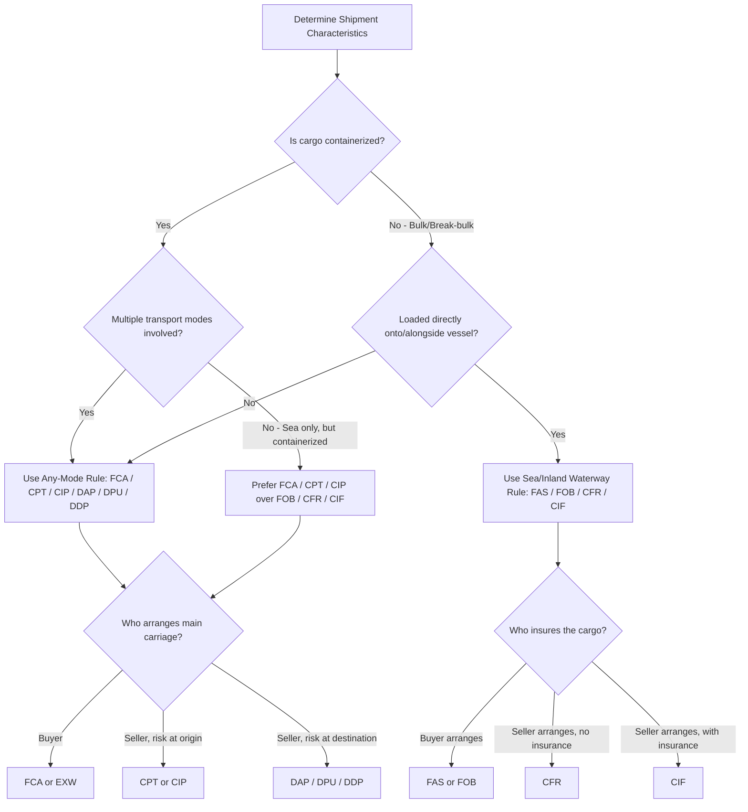

## Matching Incoterms to Mode of Transport

### Definition

Incoterms 2020 rules are organized into two functional categories based on transport mode compatibility: rules for **any mode of transport** (including multimodal) and rules **exclusive to sea and inland waterway transport**. Correctly matching a rule to the physical mode and logistics structure of a shipment is essential to ensuring risk, cost, and documentary obligations align with actual operational custody of the goods.

### Key Points

- **Two mode categories**: Incoterms 2020 defines 11 rules split into 7 "any mode" rules and 4 "sea/inland waterway only" rules.
- **Any mode of transport (7 rules)**: EXW, FCA, CPT, CIP, DAP, DPU, DDP — usable for road, rail, air, sea, inland waterway, or multimodal combinations.
- **Sea and inland waterway only (4 rules)**: FAS, FOB, CFR, CIF — risk transfer tied to vessel-specific events (alongside the ship, on board the vessel).
- **Selection driver**: The choice of rule should be driven by (1) the physical mode(s) involved, (2) who controls the goods at each stage, and (3) whether the shipment is unitized/containerized or bulk/break-bulk.
- **Container cargo default**: For containerized shipments (even if the containers travel by sea for part of the journey), FCA/CPT/CIP are the ICC-recommended defaults over FOB/CFR/CIF.
- **Bulk and break-bulk cargo**: FAS, FOB, CFR, and CIF remain well-suited where cargo is loaded directly onto/alongside a vessel without intermediate container handling (e.g., grain, ore, liquid bulk, oversized cargo).
- **Multimodal shipments**: Any shipment involving more than one mode (e.g., truck + vessel + rail) should default to the "any mode" category rules, since the sea-only rules cannot properly address risk during non-vessel legs.

### Mode-to-Rule Mapping Table

| Incoterm | Mode Category | Typical Physical Fit | Risk Transfer Point |
| --- | --- | --- | --- |
| EXW | Any mode | All modes; buyer arranges everything from seller's premises | At seller's premises, goods placed at buyer's disposal |
| FCA | Any mode | Road, rail, air, sea, container, multimodal | Handover to carrier at named place |
| CPT | Any mode | Road, rail, air, sea, container, multimodal | Handover to first carrier |
| CIP | Any mode | Road, rail, air, sea, container, multimodal | Handover to first carrier (with all-risk insurance) |
| DAP | Any mode | All modes; delivery to named destination, unloaded | Goods ready for unloading at destination |
| DPU | Any mode | All modes; only rule requiring seller to unload at destination | After unloading at named place |
| DDP | Any mode | All modes; seller handles import clearance too | Goods ready for unloading, duties paid |
| FAS | Sea/inland waterway only | Bulk/break-bulk cargo placed alongside vessel | Alongside the ship at named port |
| FOB | Sea/inland waterway only | Bulk/break-bulk cargo loaded onto vessel | On board the vessel |
| CFR | Sea/inland waterway only | Bulk/break-bulk cargo, seller pays freight | On board the vessel |
| CIF | Sea/inland waterway only | Bulk/break-bulk cargo, seller pays freight + insurance | On board the vessel |

### Decision Logic

### Selection Framework by Scenario

- **Full container load (FCL), sea freight, seller controls export logistics**: FCA (named place = seller's premises or a named CY) is preferred over FOB, since risk transfers when the container is handed to the carrier, not when later loaded on a vessel by a terminal operator.
- **Bulk commodity (grain, coal, crude oil), chartered vessel**: FOB, CFR, or CIF remain appropriate, since loading is a direct, observable, single event (cargo passes from quay/barge into vessel hold).
- **Air freight shipment**: Only "any mode" rules apply (commonly FCA); FOB/CFR/CIF/FAS are inapplicable since they require a vessel.
- **Door-to-door multimodal shipment (factory to buyer's warehouse via truck, rail, and sea)**: DAP, DPU, or DDP are typical, since these rules address the full multimodal journey to a named destination point rather than a single vessel-related event.
- **Seller wants to retain minimum obligation**: EXW places minimum obligation on the seller regardless of mode, though it exposes the seller to disputes over export clearance responsibility since the buyer technically handles export formalities under EXW despite often lacking standing to do so.
- **Buyer wants maximum seller obligation, including customs**: DDP places maximum obligation on the seller across any mode, including import duties and taxes — the mirror opposite of EXW.

### Example

A furniture manufacturer in Ho Chi Minh City ships a full container load to a retailer in Hamburg. The container travels by truck to the port, then by vessel to Hamburg, then by truck again to the retailer's warehouse — a multimodal journey. Because multiple modes are involved and the cargo is containerized, the appropriate rule is drawn from the any-mode category. If the manufacturer wants to hand off risk and cost early, FCA (named place: manufacturer's factory or the origin CY) is appropriate. If the manufacturer wants to retain responsibility (and cost) for the main sea leg while still transferring risk early, CPT or CIP would apply. Using FOB or CIF here would be structurally inappropriate, since neither properly resolves risk during the inland trucking legs, and both improperly peg risk transfer to a vessel-loading event within a journey that also includes non-vessel transport.

### Common Pitfalls

- **Defaulting to FOB/CIF out of habit**: Many exporters use FOB or CIF by convention regardless of whether the shipment is containerized or multimodal, creating the risk-cost mismatches described in the sea-only rules.
- **Using sea-only rules for air or rail shipments**: FAS, FOB, CFR, and CIF are contractually meaningless for air, rail, or road-only shipments since they require a vessel and a port.
- **Ignoring pre-carriage risk**: When goods travel by truck to a port before the sea leg, any-mode rules (FCA/CPT/CIP) more accurately capture risk during that inland leg than sea-only rules do.
- **Overlooking DPU's unique unloading requirement**: DPU is the only Incoterm requiring the seller to unload goods at the named destination — misapplying it without accounting for unloading capability/liability at destination is a frequent error.
- **Assuming rule choice is purely a shipping decision**: Rule selection also affects VAT/customs valuation, insurable interest, and financing (e.g., letter of credit) mechanics — cross-functional coordination with trade finance and customs teams is often necessary.

[Inference] While ICC guidance is explicit about matching rules to transport mode, real-world adoption lags due to entrenched contractual templates, meaning training on this mapping is as much about correcting habitual misuse as it is about teaching the formal rule structure.

**Next Steps**

- Incoterms Any-Mode Rules: EXW, FCA, CPT, CIP, DAP, DPU, DDP (detailed treatment)
- Incoterms Sea/Inland Waterway Rules: FAS, FOB, CFR, CIF (detailed treatment)
- Risk vs. Cost Transfer Point Analysis Across All 11 Rules
- Choosing Incoterms in Letter of Credit Transactions
- Multimodal Transport Documents (FBL, Multimodal B/L)
- Incoterms and Customs Valuation Implications