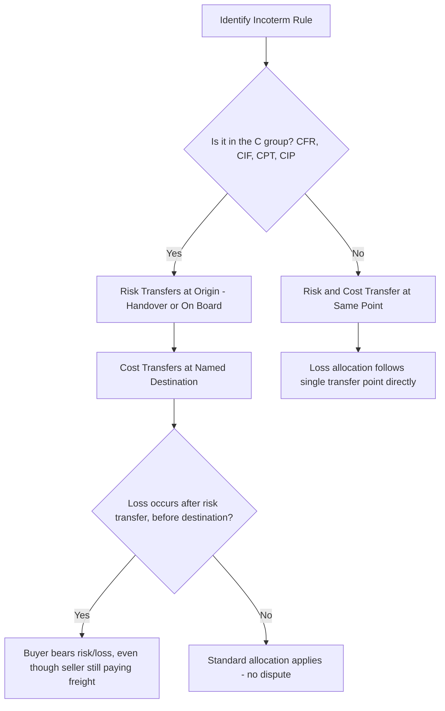

## Transfer of Risk Versus Transfer of Cost

### Definition

Transfer of risk and transfer of cost are two distinct legal and commercial concepts governed by Incoterms rules. Risk transfer determines the precise point at which responsibility for loss, damage, or deterioration of goods passes from seller to buyer. Cost transfer determines which party is financially responsible for specific expenses (freight, insurance, unloading, duties) incurred during the transaction. In most Incoterms rules these two points coincide; in the "C" group (CFR, CIF, CPT, CIP), they deliberately diverge.

### Key Points

- **Risk transfer**: Governs who bears the loss if goods are damaged, lost, or destroyed after a defined point — independent of who is paying for transport at that moment.
- **Cost transfer**: Governs which party pays for which components of the transaction — carriage, insurance, loading/unloading, customs duties, terminal handling charges.
- **Coincident points (most rules)**: In EXW, FCA, FAS, FOB, DAP, DPU, and DDP, risk and cost transfer at the same point.
- **Divergent points ("C" group only)**: In CFR, CIF, CPT, and CIP, the seller pays cost (freight, and for CIF/CIP, insurance) to a named destination, but risk transfers earlier — at origin, when goods are handed to the carrier or loaded on board.
- **Why divergence exists**: The "C" rules were designed so sellers could offer buyers a delivered price (cost to destination) while still limiting the seller's risk exposure to the origin point — a deliberate commercial compromise between "seller risk to destination" and "buyer risk from origin."
- **Practical implication**: Under a "C" rule, a buyer may be financially responsible for cargo insurance or claims during a transit leg the seller is contractually paying to transport — a frequent source of buyer confusion.

### Risk vs. Cost Transfer Matrix

| Incoterm | Risk Transfer Point | Cost Transfer Point | Divergence? |
| --- | --- | --- | --- |
| EXW | Seller's premises | Seller's premises | No |
| FCA | Handover to carrier at named place | Handover to carrier at named place | No |
| FAS | Alongside vessel at named port | Alongside vessel at named port | No |
| FOB | On board vessel | On board vessel | No |
| CPT | Handover to first carrier | Named place of destination | **Yes** |
| CIP | Handover to first carrier | Named place of destination (+ insurance) | **Yes** |
| CFR | On board vessel | Named port of destination | **Yes** |
| CIF | On board vessel | Named port of destination (+ insurance) | **Yes** |
| DAP | Goods ready for unloading at destination | Named place of destination | No |
| DPU | After unloading at named place | Named place of destination | No |
| DDP | Goods ready for unloading, duties paid | Named place of destination | No |

### Conceptual Diagram: Coincident vs Divergent Transfer (svg_diagram)

<svg viewBox="0 0 820 340" xmlns="http://www.w3.org/2000/svg">
<text x="410" y="24" text-anchor="middle" font-size="16" font-weight="bold" fill="#1a1a1a">Risk vs Cost Transfer Patterns (svg_diagram)</text>

<text x="60" y="60" font-size="13" font-weight="bold" fill="`#2c3e50`">Coincident Pattern (e.g., FOB, DAP)</text>

<line x1="60" y1="90" x2="740" y2="90" stroke="#333" stroke-width="2"/>

<circle cx="100" cy="90" r="6" fill="#333"/>

<text x="100" y="110" text-anchor="middle" font-size="11">Origin</text>

<circle cx="420" cy="90" r="8" fill="`#8e44ad`"/>

<text x="420" y="112" text-anchor="middle" font-size="11">Risk & Cost Transfer</text>

<text x="420" y="126" text-anchor="middle" font-size="11">(Same Point)</text>

<circle cx="700" cy="90" r="6" fill="#333"/>

<text x="700" y="110" text-anchor="middle" font-size="11">Destination</text>

<line x1="100" y1="75" x2="420" y2="75" stroke="`#c0392b`" stroke-width="4"/>

<line x1="420" y1="75" x2="700" y2="75" stroke="`#2980b9`" stroke-width="4"/>

<text x="260" y="65" text-anchor="middle" font-size="10" fill="`#c0392b`">Seller Risk & Cost</text>

<text x="560" y="65" text-anchor="middle" font-size="10" fill="`#2980b9`">Buyer Risk & Cost</text>

<text x="60" y="190" font-size="13" font-weight="bold" fill="`#2c3e50`">Divergent Pattern ("C" Group: CFR, CIF, CPT, CIP)</text>

<line x1="60" y1="220" x2="740" y2="220" stroke="#333" stroke-width="2"/>

<circle cx="100" cy="220" r="6" fill="#333"/>

<text x="100" y="240" text-anchor="middle" font-size="11">Origin</text>

<circle cx="260" cy="220" r="7" fill="`#c0392b`"/>

<text x="260" y="240" text-anchor="middle" font-size="11">Risk Transfers Here</text>

<circle cx="700" cy="220" r="7" fill="`#27ae60`"/>

<text x="700" y="240" text-anchor="middle" font-size="11">Cost Transfers Here</text>

<text x="700" y="254" text-anchor="middle" font-size="11">(Named Destination)</text>

<line x1="100" y1="200" x2="260" y2="200" stroke="#c0392b" stroke-width="4"/>
<line x1="260" y1="200" x2="700" y2="200" stroke="#2980b9" stroke-width="4" stroke-dasharray="6,4"/>
<text x="180" y="190" text-anchor="middle" font-size="10" fill="#c0392b">Seller Risk</text>
<text x="480" y="190" text-anchor="middle" font-size="10" fill="#2980b9">Buyer Risk</text>
<line x1="100" y1="270" x2="700" y2="270" stroke="#27ae60" stroke-width="4"/>
<text x="400" y="290" text-anchor="middle" font-size="10" fill="#27ae60">Seller Pays Cost (Freight/Insurance) All the Way to Destination</text>
<rect x="260" y="205" width="440" height="20" fill="#fdebd0" opacity="0.4"/>
<text x="480" y="320" text-anchor="middle" font-size="10" fill="#e67e22">Gap Zone: Buyer bears risk, seller still paying transport cost</text>
</svg>

### Process Logic

### Example

A seller in Busan sells auto parts to a buyer in Long Beach under "CIP Long Beach, Incoterms 2020." The seller hands the goods to the first carrier (a trucking company) in Busan — this is the risk transfer point. The seller then pays for trucking, ocean freight, and insurance (Institute Cargo Clauses A, all-risk) all the way to Long Beach — this is the cost transfer point. If the goods are damaged during the ocean leg (after risk transfer but while the seller is still paying for transport and insurance), the buyer bears the risk of loss, though the buyer benefits from the seller-procured all-risk insurance policy and would typically file the claim against that policy rather than seeking recovery from the seller directly.

### Common Pitfalls

- **Assuming "seller pays freight" means "seller bears risk"**: This is the most common misunderstanding with C-group rules — payment of freight does not equal retention of risk.
- **Conflating title transfer with risk transfer**: Incoterms govern risk and cost, not legal title/ownership, which is typically governed by the underlying sales contract or applicable law (e.g., UCC in the U.S., or the governing national sales law).
- **Overlooking insurance timing mismatches**: In CFR (no seller insurance obligation), a buyer who fails to independently insure cargo before the risk transfer point (which occurs early, at origin) may have an uninsured gap during the bulk of the transit.
- **Assuming cost allocation dictates liability in disputes**: Courts and arbitrators applying Incoterms-referenced contracts generally uphold the risk transfer point as controlling for loss allocation, regardless of which party was contractually paying transport costs at the time of loss.
- **Neglecting to specify named points precisely**: Vague or missing named places/ports (e.g., "CIP" without specifying which port) creates ambiguity in exactly where the cost transfer boundary lies, even when the risk transfer point (handover to first carrier) is otherwise clear.

[Inference] The C-group's risk/cost divergence is frequently cited as the single most misunderstood structural feature of Incoterms in trade disputes, since it counters the intuitive assumption that whoever pays for transport also bears the associated risk.

**Related Topics**

- The "C" Group of Incoterms: CFR, CIF, CPT, CIP
- Insurable Interest and Marine Cargo Insurance
- Title Transfer vs. Risk Transfer in International Sales Contracts
- Named Place/Port Precision in Incoterms Drafting
- Dispute Resolution Under Incoterms-Referenced Contracts
- Institute Cargo Clauses (A, B, C) Coverage Comparison