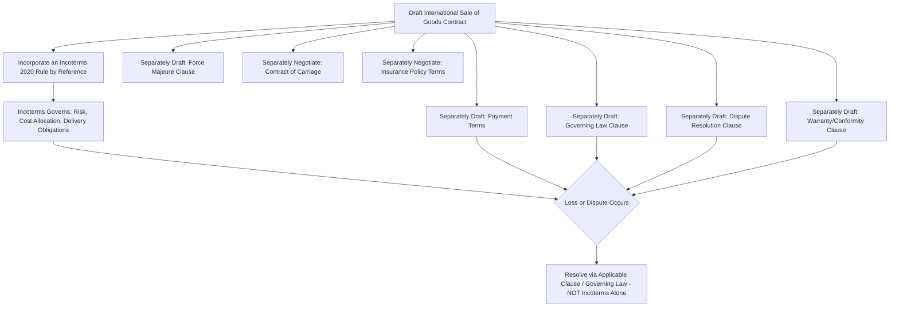

## What Incoterms Do Not Cover

### Definition

Incoterms 2020 rules define a narrow, specific scope: the allocation of costs, risk, and certain delivery/documentary obligations between buyer and seller in the physical movement of goods. They are frequently misapplied as a general framework for the entire sales transaction. Understanding what falls outside Incoterms' scope is essential to avoid contractual gaps that must be addressed elsewhere in the sales contract.

### Key Points

- **Scope limitation (per ICC)**: The ICC explicitly states Incoterms rules address only (1) delivery obligations, (2) transfer of risk, and (3) allocation of certain costs between buyer and seller. Everything else must be governed by the underlying sales contract, applicable national law, or other referenced instruments (e.g., CISG).
- **Not covered**: Transfer of title/ownership, payment terms and currency, price and price adjustment mechanisms, remedies for breach of contract, dispute resolution mechanisms, governing law, warranty and product conformity, force majeure, and intellectual property.
- **Not a substitute for a sales contract**: Incoterms are incorporated into a sales contract by reference; they are not themselves a complete contract and have no independent legal force outside such incorporation.
- **Not a transport contract**: Incoterms allocate who arranges and pays for carriage, but the actual contract of carriage (e.g., with a shipping line or freight forwarder) is a separate legal instrument between the arranging party and the carrier.
- **Not an insurance policy**: Even CIF/CIP, which impose insurance obligations, do not themselves constitute the insurance contract; a separate policy must be procured and its terms negotiated independently.
- **Not a customs or tax code**: Incoterms indicate which party handles export/import formalities and duties, but do not themselves specify tariff classifications, duty rates, or compliance procedures.

### Explicit Exclusions (Per ICC Guidance)

| Area | Covered by Incoterms? | Governed By |
| --- | --- | --- |
| Risk transfer point | Yes | Incoterms rule selected |
| Cost allocation (freight, insurance, duties) | Yes | Incoterms rule selected |
| Delivery obligations (where/how goods are handed over) | Yes | Incoterms rule selected |
| Transfer of title/ownership | **No** | Sales contract, applicable national law (e.g., UCC, CISG) |
| Price and payment terms | **No** | Sales contract |
| Currency and exchange rate risk | **No** | Sales contract |
| Remedies for breach (rejection, damages) | **No** | Sales contract, applicable law (e.g., CISG, UCC) |
| Governing law and jurisdiction | **No** | Sales contract's governing law clause |
| Dispute resolution (arbitration, litigation) | **No** | Sales contract's dispute resolution clause |
| Product conformity and warranty | **No** | Sales contract, applicable law |
| Force majeure / excused performance | **No** | Sales contract's force majeure clause |
| Intellectual property rights | **No** | Sales contract, IP law |
| Specific carrier/route selection | **No** | Contract of carriage (separate agreement) |
| Insurance policy terms and claims process | **No** | Insurance policy (separate contract) |
| Export/import license procurement procedures | Partial (allocates responsibility only) | Applicable trade regulation |

### Conceptual Diagram: Incoterms' Scope Within the Broader Contract (svg_diagram)

<svg xmlns="http://www.w3.org/2000/svg" viewBox="0 0 800 380">
<text x="400" y="24" text-anchor="middle" font-size="16" font-weight="bold" fill="#1a1a1a">Incoterms' Scope Within the Sales Contract (svg_diagram)</text>
<rect x="60" y="50" width="680" height="300" rx="12" fill="none" stroke="#2c3e50" stroke-width="2" />
<text x="400" y="75" text-anchor="middle" font-size="13" font-weight="bold" fill="#2c3e50">International Sales Contract</text>
<rect x="90" y="95" width="280" height="230" rx="8" fill="#d5f5e3" stroke="#27ae60" stroke-width="2" />
<text x="230" y="120" text-anchor="middle" font-size="12" font-weight="bold" fill="#1e8449">Covered by Incoterms</text>
<text x="230" y="145" text-anchor="middle" font-size="11" fill="#1e8449">Risk transfer point</text>
<text x="230" y="165" text-anchor="middle" font-size="11" fill="#1e8449">Cost allocation</text>
<text x="230" y="185" text-anchor="middle" font-size="11" fill="#1e8449">Delivery obligations</text>
<text x="230" y="205" text-anchor="middle" font-size="11" fill="#1e8449">Export/import formality</text>
<text x="230" y="225" text-anchor="middle" font-size="11" fill="#1e8449">responsibility allocation</text>
<text x="230" y="245" text-anchor="middle" font-size="11" fill="#1e8449">Documentary handover</text>
<text x="230" y="265" text-anchor="middle" font-size="11" fill="#1e8449">(B/L, insurance cert.)</text>
<rect x="400" y="95" width="310" height="230" rx="8" fill="#fdebd0" stroke="#e67e22" stroke-width="2" />
<text x="555" y="120" text-anchor="middle" font-size="12" font-weight="bold" fill="#af601a">NOT Covered - Needs Separate Terms</text>
<text x="555" y="145" text-anchor="middle" font-size="11" fill="#af601a">Title/ownership transfer</text>
<text x="555" y="165" text-anchor="middle" font-size="11" fill="#af601a">Price &amp; payment terms</text>
<text x="555" y="185" text-anchor="middle" font-size="11" fill="#af601a">Breach remedies</text>
<text x="555" y="205" text-anchor="middle" font-size="11" fill="#af601a">Governing law &amp; jurisdiction</text>
<text x="555" y="225" text-anchor="middle" font-size="11" fill="#af601a">Dispute resolution</text>
<text x="555" y="245" text-anchor="middle" font-size="11" fill="#af601a">Warranty / conformity</text>
<text x="555" y="265" text-anchor="middle" font-size="11" fill="#af601a">Force majeure</text>
<text x="555" y="285" text-anchor="middle" font-size="11" fill="#af601a">IP rights</text>
</svg>

### Process: Where Gaps Get Filled

### Example

A buyer and seller agree to "CIF Rotterdam, Incoterms 2020" but never specify governing law, dispute resolution, or a warranty clause in their contract. When a dispute arises over defective goods (a conformity issue unrelated to transit risk), CIF's rules provide no guidance — conformity, remedies, and applicable law must be resolved by whatever default rules apply (e.g., the CISG, if both countries are contracting states, or otherwise the forum's conflict-of-laws rules), often leading to costly uncertainty. Similarly, if the buyer disputes payment currency or timing, CIF is silent — payment terms exist entirely outside the Incoterms framework and must be separately negotiated (e.g., via a letter of credit agreement or open account terms).

### Common Pitfalls

- **Treating Incoterms as a complete contract**: Parties sometimes cite only an Incoterms rule (e.g., "FOB Shanghai") without a broader sales contract, leaving payment, remedies, and governing law entirely unaddressed.
- **Assuming Incoterms determine ownership**: A common misconception is that risk transfer under Incoterms equals title transfer — they are legally distinct and may occur at different points depending on the sales contract and applicable law.
- **Relying on Incoterms for dispute resolution**: Incoterms provide no arbitration or litigation mechanism; a separate dispute resolution clause is required.
- **Assuming Incoterms address quality/conformity**: Product specifications, inspection rights, and conformity standards must be defined elsewhere in the contract or governed by applicable sales law.
- **Overlooking the need for CISG or governing law analysis**: Since Incoterms don't address contract formation, breach, or remedies, understanding whether the UN Convention on Contracts for the International Sale of Goods (CISG) or another body of law applies is often essential to filling these gaps.

[Inference] Because Incoterms are widely known and easy to cite, contracting parties — particularly smaller exporters/importers — may under-invest in drafting the surrounding contractual terms, mistakenly treating Incoterms compliance as equivalent to full contractual protection.

**Related Topics**

- Incorporating Incoterms by Reference in Sales Contracts
- UN Convention on Contracts for the International Sale of Goods (CISG)
- Title Transfer Rules Under National Sales Law
- Contract of Carriage vs. Contract of Sale
- Letter of Credit Payment Mechanisms
- Force Majeure and Frustration in International Trade Contracts