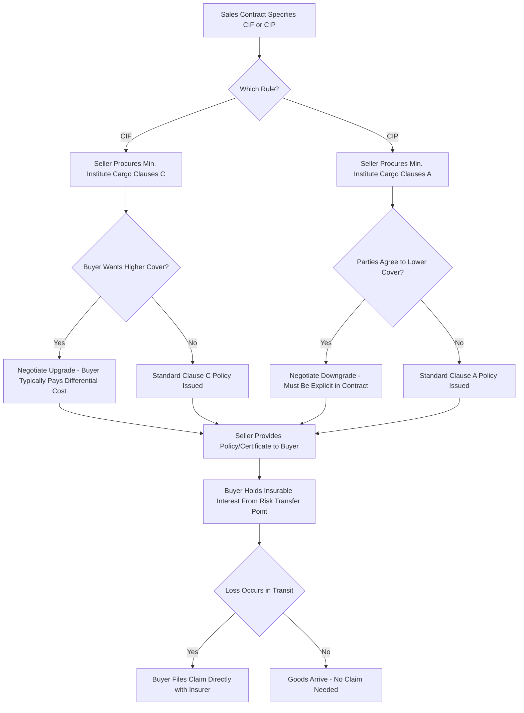

## Insurance Obligations Under CIF and CIP

### Definition

CIF (Cost, Insurance and Freight) and CIP (Carriage and Insurance Paid To) are the only two Incoterms 2020 rules that impose a mandatory cargo insurance obligation on the seller. While structurally similar in requiring seller-procured insurance for the buyer's benefit, Incoterms 2020 introduced a deliberate differentiation in the minimum required level of coverage between the two rules — a significant change from Incoterms 2010, where both used the same minimum standard.

### Key Points

- **CIF minimum coverage**: Institute Cargo Clauses (C), or similar clauses — the narrowest, most restrictive level of marine cargo insurance cover, covering only named major casualties (e.g., vessel sinking, fire, stranding).
- **CIP minimum coverage**: Institute Cargo Clauses (A), or similar clauses — an "all-risk" level of cover, insuring against all risks of loss or damage except specifically excluded perils, and considerably broader than Clause C.
- **Rationale for the CIF/CIP split**: Incoterms 2020 deliberately differentiated these two rules to reflect their differing typical use cases — CIF is more common in bulk commodity trades (where Clause C is traditional market practice), while CIP is more common in manufactured/finished goods trade (where broader protection better matches cargo value and vulnerability).
- **Opt-up/opt-down provision**: Both rules permit the parties to explicitly agree on a different level of coverage than the default (e.g., a CIF buyer can require Clause A cover instead of Clause C, or a CIP seller/buyer can agree to a lower level than Clause A).
- **Coverage amount**: Under both rules, the default minimum insured amount is 110% of the contract price (i.e., contract value plus 10%), a long-standing ICC/market convention accounting for anticipated profit margin.
- **Currency requirement**: Insurance must be procured in the currency of the sales contract, unless otherwise agreed.
- **Insurer requirement**: The policy must be obtained from an insurer or insurance company of good repute, entitling the buyer (or another party with insurable interest) to claim directly against the insurer.
- **Scope of cover (route)**: Insurance must cover the goods from the point of delivery (risk transfer) specified by the rule to at least the named port/place of destination.
- **Not the seller's benefit**: The insurance is procured for the buyer's protection — the seller has no direct financial interest in claim proceeds, though the seller must provide the buyer with the insurance policy or certificate as a required document.

### Institute Cargo Clauses Comparison

| Clause | Coverage Type | Typical Perils Covered | Typical Use |
| --- | --- | --- | --- |
| Clause A | All-risk (broadest) | All risks of physical loss/damage except specific exclusions (e.g., inherent vice, war, strikes unless added) | CIP default; high-value or finished goods |
| Clause B | Named perils (mid-tier) | Fire, explosion, stranding, sinking, capsizing, collision, general average, washing overboard, water damage from specified events | Occasionally negotiated as a middle-ground option |
| Clause C | Named perils (narrowest) | Fire, explosion, vessel stranding/sinking/capsizing, collision, general average sacrifice | CIF default; bulk commodities |

### Coverage Divergence Diagram (svg_diagram)

<svg xmlns="http://www.w3.org/2000/svg" viewBox="0 0 800 300">
<text x="400" y="24" text-anchor="middle" font-size="16" font-weight="bold" fill="#1a1a1a">CIF vs CIP Insurance Coverage Levels (svg_diagram)</text>

<text x="200" y="60" text-anchor="middle" font-size="13" font-weight="bold" fill="`#c0392b`">CIF - Clause C (Minimum)</text>

<rect x="80" y="80" width="240" height="100" rx="6" fill="`#fadbd8`" stroke="`#c0392b`" stroke-width="2" />

<text x="200" y="105" text-anchor="middle" font-size="11" fill="`#922b21`">Fire / Explosion</text>

<text x="200" y="125" text-anchor="middle" font-size="11" fill="`#922b21`">Stranding / Sinking</text>

<text x="200" y="145" text-anchor="middle" font-size="11" fill="`#922b21`">Collision</text>

<text x="200" y="165" text-anchor="middle" font-size="11" fill="`#922b21`">General Average</text>

<text x="600" y="60" text-anchor="middle" font-size="13" font-weight="bold" fill="`#27ae60`">CIP - Clause A (All-Risk)</text>

<rect x="480" y="80" width="240" height="160" rx="6" fill="`#d5f5e3`" stroke="`#27ae60`" stroke-width="2" />

<text x="600" y="105" text-anchor="middle" font-size="11" fill="`#1e8449`">All Clause C perils, PLUS:</text>

<text x="600" y="125" text-anchor="middle" font-size="11" fill="`#1e8449`">Theft / Pilferage</text>

<text x="600" y="145" text-anchor="middle" font-size="11" fill="`#1e8449`">Water/Moisture Damage</text>

<text x="600" y="165" text-anchor="middle" font-size="11" fill="`#1e8449`">Handling Damage</text>

<text x="600" y="185" text-anchor="middle" font-size="11" fill="`#1e8449`">Breakage</text>

<text x="600" y="205" text-anchor="middle" font-size="11" fill="`#1e8449`">Contact with Other Cargo</text>

<text x="600" y="225" text-anchor="middle" font-size="11" fill="`#1e8449`">(Subject to standard exclusions)</text>

<line x1="320" y1="130" x2="480" y2="130" stroke="#555" stroke-width="2" stroke-dasharray="5,3" />
<text x="400" y="270" text-anchor="middle" font-size="11" fill="#555">Both default to 110% of contract value, buyer/seller may opt for different cover by agreement</text>
</svg>

### Insurance Procurement Process

### Example

A seller in Rotterdam ships specialty coffee (bulk, in bags, not containerized) to a buyer in New Orleans under "CIF New Orleans, Incoterms 2020." The seller procures a Clause C policy — the CIF default. During the voyage, a hold leak causes moisture damage to some bags, a peril not clearly covered under Clause C's named-peril list. The buyer, having relied on the CIF default without negotiating an upgrade, discovers the loss is not covered and must absorb the cost. Contrast this with a seller shipping finished electronics from Shenzhen to Hamburg under "CIP Hamburg, Incoterms 2020" — the seller must procure Clause A (all-risk) cover by default, meaning a similar moisture-damage scenario would typically be covered, since Clause A insures against all risks except specifically excluded perils (e.g., inherent vice, inadequate packing, war, or strikes unless separately added).

### Common Pitfalls

- **Assuming CIF and CIP provide equal protection**: Since Incoterms 2020, this is no longer true — CIF defaults to the narrowest cover (Clause C), while CIP defaults to the broadest (Clause A). Parties relying on outdated Incoterms 2010 assumptions may be under-protected.
- **Failing to negotiate coverage level explicitly**: If a CIF buyer needs broader protection (common for higher-value or damage-prone cargo), silence in the contract means Clause C applies by default — an easily overlooked gap.
- **Confusing insured value with contract value**: The 110% convention (contract value + 10%) is a default, not a mandatory figure; parties can and sometimes should adjust based on anticipated resale value or profit margins.
- **Overlooking exclusions even under Clause A**: "All-risk" does not mean "all perils without exception" — standard exclusions (war, strikes, inherent vice, inadequate packing, wear and tear) still apply unless specifically added back via endorsement.
- **Assuming the seller bears claim responsibility**: Once the seller has procured and delivered a compliant policy, responsibility for pursuing a claim generally shifts to the buyer (or whoever holds insurable interest at the time of loss) — the seller's insurance obligation is procurement, not claims management.

[Inference] The Incoterms 2020 CIF/CIP insurance split is often cited as one of the most consequential substantive changes from the 2010 version, since it directly affects real financial exposure rather than merely clarifying definitions, yet many market participants continue to apply 2010-era assumptions out of habit.

**Related Topics**

- Institute Cargo Clauses A, B, and C in Detail
- Insurable Interest and Marine Insurance Law
- CIF (Cost, Insurance and Freight)
- CIP (Carriage and Insurance Paid To)
- Negotiating Insurance Coverage Upgrades/Downgrades in Sales Contracts
- Marine Insurance Claims Process and Documentation