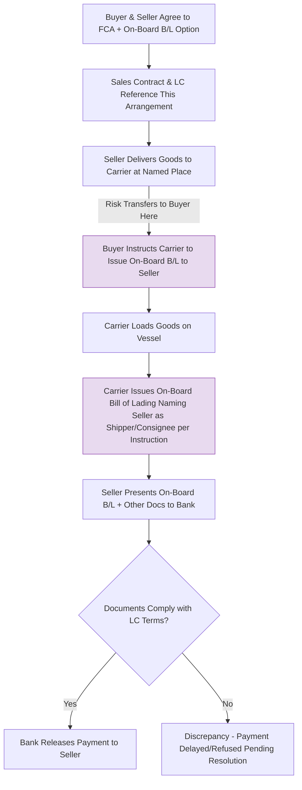

## The FCA Bill of Lading Option for Documentary Credits

### Definition

The FCA Bill of Lading Option is a mechanism introduced in Incoterms 2020 to resolve a long-standing documentary mismatch between FCA (Free Carrier) and letter of credit (documentary credit) practice. It allows the buyer to instruct the carrier to issue an on-board bill of lading to the seller after loading, even though risk under FCA has already transferred earlier — at the point of handover to the carrier, not at on-board loading.

### Key Points

- **The underlying problem**: Under FCA, risk transfers when goods are handed to the carrier at the named place (often before or without vessel loading), but banks under documentary credits (letters of credit) traditionally require an "on-board" bill of lading as proof of shipment before releasing payment — a document FCA does not naturally generate at the point of delivery.
- **Pre-2020 workaround problem**: Before Incoterms 2020, sellers using FCA for sea shipments under an LC often had no straightforward way to obtain an on-board B/L, since the carrier typically only issues that document once the goods are actually loaded onto the vessel — a later event than FCA's risk/delivery point, and one the seller has no direct visibility into once the carrier takes custody.
- **Incoterms 2020 solution**: Introduced an optional mechanism whereby the buyer and seller can agree that the buyer will instruct the carrier to issue an on-board bill of lading to the seller, after loading, which the seller can then present to the bank/buyer to satisfy documentary credit requirements — without changing FCA's underlying risk transfer point.
- **Does not change risk transfer**: This mechanism is purely documentary. Risk under FCA still transfers at the point of handover to the carrier at the named place, regardless of when or whether the on-board B/L is subsequently issued.
- **Optional, not automatic**: The FCA rule text notes that the parties "should agree" on this arrangement; it does not happen automatically simply by using FCA — it must be contemplated and structured, typically also reflected in the contract of carriage and coordinated with the bank issuing the LC.
- **Practical function**: Bridges the gap that previously pushed many container shippers toward using FOB (despite its being discouraged for containerized cargo) purely to satisfy LC documentary requirements for an on-board B/L.

### Why This Matters: The Historical Driver

Historically, exporters using containerized shipments under documentary credits often defaulted to FOB — even when FCA was operationally more appropriate — because banks required an on-board bill of lading and FOB's risk-transfer point ("on board the vessel") naturally aligned with the timing of that document's issuance. FCA's earlier risk-transfer point (handover to carrier) created a structural gap: the seller would relinquish goods and risk before the on-board B/L could even be generated, making it operationally awkward to obtain the LC-required document. Incoterms 2020's FCA B/L option directly addresses this by decoupling the documentary mechanism from the risk transfer point.

### Documentary Flow Diagram (svg_diagram)

<svg xmlns="http://www.w3.org/2000/svg" viewBox="0 0 820 320">
<text x="410" y="24" text-anchor="middle" font-size="16" font-weight="bold" fill="#1a1a1a">FCA Bill of Lading Option Flow (svg_diagram)</text>
<line x1="60" y1="140" x2="740" y2="140" stroke="#333" stroke-width="2" />
<circle cx="120" cy="140" r="6" fill="#333" />
<text x="120" y="165" text-anchor="middle" font-size="11">Seller's Premises</text>
<circle cx="300" cy="140" r="7" fill="#c0392b" />
<text x="300" y="165" text-anchor="middle" font-size="11">Handover to Carrier</text>
<text x="300" y="179" text-anchor="middle" font-size="11">(Risk Transfers Here)</text>
<circle cx="500" cy="140" r="7" fill="#8e44ad" />
<text x="500" y="165" text-anchor="middle" font-size="11">Goods Loaded On Board</text>
<text x="500" y="179" text-anchor="middle" font-size="11">(On-Board B/L Issued)</text>
<circle cx="680" cy="140" r="6" fill="#2980b9" />
<text x="680" y="165" text-anchor="middle" font-size="11">Bank / Buyer</text>
<line x1="120" y1="105" x2="300" y2="105" stroke="#c0392b" stroke-width="4" />
<line x1="300" y1="105" x2="680" y2="105" stroke="#2980b9" stroke-width="4" stroke-dasharray="6,4" />
<text x="210" y="95" text-anchor="middle" font-size="10" fill="#c0392b">Seller Risk</text>
<text x="490" y="95" text-anchor="middle" font-size="10" fill="#2980b9">Buyer Risk</text>
<path d="M 500 155 C 500 220, 320 220, 300 200" fill="none" stroke="#8e44ad" stroke-width="2" stroke-dasharray="4,3" marker-end="url(#arrow)" />
<text x="400" y="240" text-anchor="middle" font-size="10" fill="#8e44ad">Carrier issues on-board B/L TO SELLER per buyer's instruction</text>
<path d="M 300 220 C 300 260, 600 260, 680 200" fill="none" stroke="#2980b9" stroke-width="2" stroke-dasharray="4,3" marker-end="url(#arrow)" />
<text x="480" y="285" text-anchor="middle" font-size="10" fill="#2980b9">Seller presents B/L to bank to satisfy documentary credit</text>
</svg>

### Process Flow

### Example

A seller in Ho Chi Minh City ships a full container load of garments to a buyer in New York under "FCA Ho Chi Minh City, Incoterms 2020," with payment via an irrevocable letter of credit that requires a clean on-board bill of lading. The seller delivers the sealed container to the carrier's CY — risk transfers to the buyer at that moment. Per the FCA B/L option agreed in the sales contract, the buyer has instructed its freight forwarder/carrier in advance to issue an on-board B/L to the seller once the container is loaded onto the vessel days later. The carrier does so, and the seller presents this on-board B/L, along with the commercial invoice and packing list, to the negotiating bank to draw payment under the LC — all while the underlying FCA risk transfer point (at the CY, prior to vessel loading) remains unchanged.

### Common Pitfalls

- **Assuming the option is automatic**: Simply using "FCA" does not trigger this mechanism; it requires explicit agreement between the parties and coordination with the carrier and the issuing/negotiating bank.
- **Confusing documentary mechanism with risk allocation**: Obtaining an on-board B/L under this option does not retroactively shift risk to the on-board loading point — risk remains at the original FCA handover point, creating a scenario where the seller may hold a document referencing a later event than when their risk actually ended.
- **Carrier non-cooperation**: Carriers are not obligated to issue a B/L naming the seller as shipper/consignee unless specifically instructed by the buyer and operationally willing to do so; this must be arranged in advance, not assumed.
- **Bank scrutiny under UCP 600**: Banks examining documents under a documentary credit (typically governed by UCP 600) will scrutinize the B/L for compliance with LC terms regardless of the underlying Incoterms arrangement; discrepancies (e.g., late shipment, unclean B/L) can still cause payment delays independent of the FCA option's use.
- **Overlooking that this doesn't fully replicate FOB**: Parties sometimes assume the FCA B/L option makes FCA functionally identical to FOB for documentary purposes — but the risk allocation, cost structure, and multimodal flexibility of FCA remain distinct from FOB even when this documentary bridge is used.

[Inference] While this mechanism directly addresses a known pain point, its uptake in practice likely depends heavily on carrier and bank familiarity with the arrangement, meaning some markets or trade lanes may see slower adoption than the rule's design would suggest.

**Related Topics**

- FCA (Free Carrier)
- Documentary Credits and UCP 600
- Bill of Lading as a Document of Title
- Why FOB and CIF Are Discouraged for Containerized Cargo
- Multimodal Transport Documents (FBL)
- Bank Document Examination Standards Under Letters of Credit