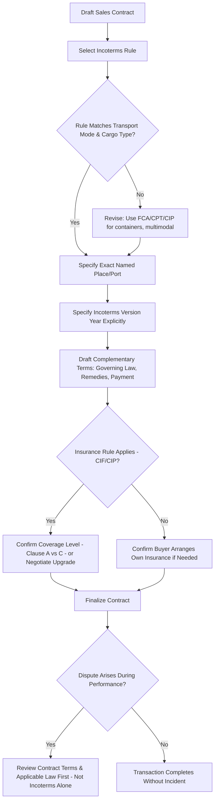

## Common Incoterms Misapplications and Disputes

### Definition

Despite being a well-established international standard, Incoterms rules are frequently misapplied in contract drafting and operational practice, leading to disputes over risk allocation, cost responsibility, and documentary compliance. These misapplications typically stem from outdated conventions, imprecise drafting, mode/rule mismatches, or misunderstanding of what Incoterms do and do not govern.

### Key Points

- **Root causes of disputes**: Imprecise named place/port designation, use of superseded Incoterms versions without specifying the year, mode-rule mismatches (e.g., FOB for air freight), conflating risk transfer with cost or title transfer, and silence on matters Incoterms don't cover.
- **Version ambiguity**: Failing to specify which Incoterms version applies (e.g., "FOB" alone vs. "FOB, Incoterms 2020") can create disputes if the parties assume different editions, since obligations have changed across revisions (2000, 2010, 2020).
- **Named place precision**: Many disputes arise from vague or missing named places/ports — e.g., "FCA Shanghai" without specifying whether the named place is the seller's factory, a named terminal, or a broader city designation, each of which shifts the precise risk transfer point.
- **Mode-mismatch disputes**: Using sea-only rules (FAS, FOB, CFR, CIF) for containerized or multimodal shipments creates disputes over whether risk transferred at a "phantom" on-board event when the loss occurred during terminal dwell time.
- **Silence on non-covered matters**: Disputes frequently arise not from the Incoterms rule itself but from the absence of complementary contract terms (governing law, remedies, conformity standards) that Incoterms do not address.
- **Unilateral modification without clear drafting**: Parties sometimes vary standard Incoterms obligations informally (e.g., "FOB but seller pays destination unloading") without clearly documenting the variation, leading to conflicting interpretations at the time of a claim.

### Dispute Category Breakdown

| Dispute Category | Typical Trigger | Underlying Misapplication |
| --- | --- | --- |
| Risk transfer timing disputes | Loss occurs near a transfer point (e.g., during terminal dwell) | Using a vessel-based rule (FOB/CIF) for containerized cargo |
| Cost allocation disputes | Unexpected charges at destination (unloading, demurrage) | Ambiguity over whether freight contract includes destination handling |
| Insurance coverage gap disputes | Loss not covered by default insurance clause | Assuming CIF/CIP cover is broader than the applicable default (Clause C vs A) |
| Documentary compliance disputes | Bank rejects documents under an LC | FCA used without the on-board B/L option properly arranged |
| Version/edition disputes | Parties assume different Incoterms obligations | Contract references "Incoterms" without specifying 2010 vs 2020 |
| Named place ambiguity disputes | Unclear where risk/cost actually transferred | Vague named place (e.g., "FCA China" instead of a specific facility) |
| Scope-of-coverage disputes | Non-Incoterms matters (title, remedies) left unresolved | Mistaking Incoterms as a complete contract |

### Dispute Root-Cause Diagram (svg_diagram)

<svg xmlns="http://www.w3.org/2000/svg" viewBox="0 0 820 360">
<text x="410" y="24" text-anchor="middle" font-size="16" font-weight="bold" fill="#1a1a1a">Common Incoterms Dispute Pathways (svg_diagram)</text>
<rect x="330" y="45" width="160" height="40" rx="6" fill="#2c3e50" />
<text x="410" y="70" text-anchor="middle" font-size="12" fill="#fff">Contract Drafted</text>
<line x1="410" y1="85" x2="150" y2="130" stroke="#555" stroke-width="1.5" />
<line x1="410" y1="85" x2="410" y2="130" stroke="#555" stroke-width="1.5" />
<line x1="410" y1="85" x2="670" y2="130" stroke="#555" stroke-width="1.5" />
<rect x="60" y="130" width="180" height="50" rx="6" fill="#fadbd8" stroke="#c0392b" />
<text x="150" y="150" text-anchor="middle" font-size="11" fill="#922b21">Wrong Rule for Mode</text>
<text x="150" y="166" text-anchor="middle" font-size="11" fill="#922b21">(e.g., FOB for containers)</text>
<rect x="320" y="130" width="180" height="50" rx="6" fill="#fdebd0" stroke="#e67e22" />
<text x="410" y="150" text-anchor="middle" font-size="11" fill="#af601a">Vague Named Place</text>
<text x="410" y="166" text-anchor="middle" font-size="11" fill="#af601a">or Missing Version Year</text>
<rect x="580" y="130" width="180" height="50" rx="6" fill="#e8daef" stroke="#8e44ad" />
<text x="670" y="150" text-anchor="middle" font-size="11" fill="#5b2c6f">Non-Incoterms Gaps</text>
<text x="670" y="166" text-anchor="middle" font-size="11" fill="#5b2c6f">(law, remedies, title)</text>
<line x1="150" y1="180" x2="150" y2="220" stroke="#555" stroke-width="1.5" />
<line x1="410" y1="180" x2="410" y2="220" stroke="#555" stroke-width="1.5" />
<line x1="670" y1="180" x2="670" y2="220" stroke="#555" stroke-width="1.5" />
<rect x="60" y="220" width="180" height="50" rx="6" fill="#fadbd8" stroke="#c0392b" />
<text x="150" y="240" text-anchor="middle" font-size="11" fill="#922b21">Risk Transfer</text>
<text x="150" y="256" text-anchor="middle" font-size="11" fill="#922b21">Timing Dispute</text>
<rect x="320" y="220" width="180" height="50" rx="6" fill="#fdebd0" stroke="#e67e22" />
<text x="410" y="240" text-anchor="middle" font-size="11" fill="#af601a">Cost Allocation</text>
<text x="410" y="256" text-anchor="middle" font-size="11" fill="#af601a">Dispute</text>
<rect x="580" y="220" width="180" height="50" rx="6" fill="#e8daef" stroke="#8e44ad" />
<text x="670" y="240" text-anchor="middle" font-size="11" fill="#5b2c6f">Governing Law /</text>
<text x="670" y="256" text-anchor="middle" font-size="11" fill="#5b2c6f">Remedy Gap Dispute</text>
<line x1="150" y1="270" x2="410" y2="310" stroke="#555" stroke-width="1.5" />
<line x1="410" y1="270" x2="410" y2="310" stroke="#555" stroke-width="1.5" />
<line x1="670" y1="270" x2="410" y2="310" stroke="#555" stroke-width="1.5" />
<rect x="290" y="310" width="240" height="40" rx="6" fill="#2c3e50" />
<text x="410" y="335" text-anchor="middle" font-size="12" fill="#fff">Dispute Resolution / Negotiation</text>
</svg>

### Dispute Prevention Process

### Example

A buyer and seller contract for "FOB Shanghai" without specifying an Incoterms version or clarifying whether the shipment is containerized. The container is damaged during a stacking incident at the terminal, three days before vessel loading. The buyer argues risk had not yet transferred (since goods were not yet "on board"), while the seller argues that under general market practice, delivery to the carrier should have triggered risk transfer. Because the parties used FOB (a vessel-loading-based rule) for a containerized shipment — a known misapplication per ICC guidance — the dispute centers on an ambiguous gap in physical custody, and the outcome may depend heavily on how national courts or arbitrators interpret "on board" in a container context, or whether trade usage/custom is found to modify the strict FOB definition. Had FCA been used with a precisely named place (e.g., "FCA Shanghai, Yangshan Terminal Gate"), the risk transfer point would have been unambiguous, and the loss would have clearly fallen on the seller's side (pre-handover).

### Common Pitfalls Leading to Disputes

- **Citing "Incoterms" generically**: Failing to specify "Incoterms 2020" (or the applicable edition) leaves room for argument about which edition's rule text governs, especially where editions have changed substantive obligations (e.g., the CIF/CIP insurance split introduced in 2020).
- **Copy-pasting outdated contract templates**: Many disputes stem from templates that still specify "FOB" or "CIF" by habit, carried over from older trade documentation without reassessment against current cargo/mode characteristics.
- **Failing to name a precise place**: A named place like "FCA China" is too broad to establish a clear delivery point; the more specific the named place (e.g., a specific address, terminal, or gate), the lower the dispute risk.
- **Silent modification of standard terms**: When parties agree informally to deviate from a rule's standard allocation (e.g., "CIF but buyer pays destination unloading"), failing to document this clearly in the written contract creates significant dispute exposure.
- **Assuming Incoterms resolve non-scope issues**: As established, Incoterms are silent on title, remedies, and governing law — disputes in these areas cannot be resolved by pointing to the Incoterms rule alone, regardless of how precisely it was applied.
- **Overlooking trade usage and custom**: In some jurisdictions or industries, established trade usage may be argued to modify strict Incoterms definitions, adding an additional layer of interpretive uncertainty that can surprise parties expecting literal application.

[Inference] Given that most disputes trace back to drafting precision rather than the substantive rules themselves, many practitioners consider careful, explicit contract drafting — precise named places, explicit version citation, and complementary clauses — to be a more effective dispute-prevention measure than rule selection alone.

**Related Topics**

- Precision in Naming Places/Ports Under Incoterms
- Incoterms 2010 vs. 2020: Key Changes
- Why FOB and CIF Are Discouraged for Containerized Cargo
- Transfer of Risk Versus Transfer of Cost
- What Incoterms Do Not Cover
- International Commercial Arbitration and Incoterms-Referenced Contracts