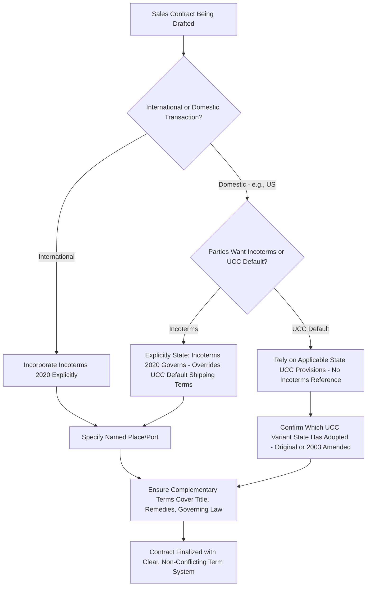

## Incoterms Compared to Domestic Trade Terms

### Definition

Incoterms are internationally standardized trade terms published by the International Chamber of Commerce (ICC) for use primarily in cross-border transactions, though they may also be used domestically. Domestic trade terms are jurisdiction-specific rules governing risk and cost allocation in sales of goods within a single country, most notably shipping terms under Article 2 of the U.S. Uniform Commercial Code (UCC). Although some terminology overlaps (e.g., "FOB"), the underlying legal frameworks, sources of authority, and interpretive rules differ substantially.

### Key Points

- **Source of authority**: Incoterms are a privately published set of standardized trade term definitions by the ICC, incorporated into contracts by reference; they have no independent legal force absent such incorporation. Domestic terms like UCC shipping terms are statutory law, automatically applicable by default within their jurisdiction unless the parties contract around them.
- **Geographic scope**: Incoterms are designed primarily for international sale of goods, though the ICC has stated they can be used domestically as well (particularly since the 2010 revision explicitly acknowledged domestic use). U.S. UCC terms apply within U.S. domestic (and sometimes international, if UCC governs) transactions.
- **Terminology overlap and conflict risk**: Both systems use terms like "FOB," but their legal meanings differ. Under the UCC, "FOB" historically had two variants (FOB place of shipment vs. FOB place of destination) with different risk allocations, and UCC Article 2's shipping term provisions were significantly narrowed/removed in the 2003 UCC amendments (though few states adopted these amendments, creating jurisdictional variation). Under Incoterms, "FOB" has one specific meaning tied to on-board vessel loading and applies only to sea/inland waterway transport.
- **Risk of miscommunication**: Using "FOB" in a U.S. domestic contract without specifying whether UCC or Incoterms definitions apply can create serious ambiguity, since the two systems allocate risk differently and Incoterms FOB is invalid for non-vessel shipments (e.g., truck shipments), a common use case for domestic "FOB" references.
- **Scope differences**: Incoterms address risk, cost, and delivery obligations only (not title transfer, remedies, or payment). The UCC, by contrast, is a comprehensive commercial code addressing contract formation, warranties, remedies, title transfer, and risk of loss together within an integrated statutory framework.
- **Other domestic frameworks**: Other jurisdictions have their own domestic sales law frameworks (e.g., national civil/commercial codes) that may include default risk-of-loss rules distinct from both Incoterms and the UCC, relevant when Incoterms are not expressly incorporated.

### Comparative Framework

| Dimension | Incoterms (ICC) | UCC Shipping Terms (U.S. Domestic) |
| --- | --- | --- |
| Publishing body | International Chamber of Commerce | State legislatures (via UCC adoption) |
| Legal status | Private standard; binding only if incorporated by contract | Statutory default law |
| Primary scope | Risk, cost, and delivery obligation allocation | Full commercial code: formation, title, risk, warranties, remedies |
| Geographic use | Designed for international trade; usable domestically | Domestic (primarily U.S.) sales of goods |
| "FOB" meaning | Single meaning: risk transfers on board vessel, sea/inland waterway only | Historically two variants (shipment vs. destination); provisions narrowed in 2003 amendments (inconsistently adopted) |
| Covers title transfer | No | Yes |
| Covers remedies for breach | No | Yes |
| Requires explicit incorporation | Yes | No (applies by default unless contracted around) |
| Version citation needed | Yes (e.g., "Incoterms 2020") | No (governed by the applicable state's UCC version) |

### Structural Comparison Diagram (svg_diagram)

<svg xmlns="http://www.w3.org/2000/svg" viewBox="0 0 820 320">
<text x="410" y="24" text-anchor="middle" font-size="16" font-weight="bold" fill="#1a1a1a">Incoterms vs UCC Domestic Terms (svg_diagram)</text>
<rect x="60" y="50" width="330" height="240" rx="10" fill="#d5f5e3" stroke="#27ae60" stroke-width="2" />
<text x="225" y="75" text-anchor="middle" font-size="13" font-weight="bold" fill="#1e8449">Incoterms (ICC)</text>
<text x="225" y="100" text-anchor="middle" font-size="11" fill="#1e8449">Private standard, needs</text>
<text x="225" y="115" text-anchor="middle" font-size="11" fill="#1e8449">explicit contract incorporation</text>
<text x="225" y="140" text-anchor="middle" font-size="11" fill="#1e8449">Scope: risk, cost,</text>
<text x="225" y="155" text-anchor="middle" font-size="11" fill="#1e8449">delivery obligations only</text>
<text x="225" y="180" text-anchor="middle" font-size="11" fill="#1e8449">International focus,</text>
<text x="225" y="195" text-anchor="middle" font-size="11" fill="#1e8449">usable domestically</text>
<text x="225" y="220" text-anchor="middle" font-size="11" fill="#1e8449">Version must be specified</text>
<text x="225" y="235" text-anchor="middle" font-size="11" fill="#1e8449">(e.g., "2020")</text>
<text x="225" y="260" text-anchor="middle" font-size="11" fill="#1e8449">Silent on title, remedies,</text>
<text x="225" y="275" text-anchor="middle" font-size="11" fill="#1e8449">governing law</text>
<rect x="430" y="50" width="330" height="240" rx="10" fill="#d6eaf8" stroke="#2980b9" stroke-width="2" />
<text x="595" y="75" text-anchor="middle" font-size="13" font-weight="bold" fill="#1a5276">UCC Shipping Terms (US)</text>
<text x="595" y="100" text-anchor="middle" font-size="11" fill="#1a5276">Statutory default,</text>
<text x="595" y="115" text-anchor="middle" font-size="11" fill="#1a5276">applies unless contracted around</text>
<text x="595" y="140" text-anchor="middle" font-size="11" fill="#1a5276">Scope: full commercial code</text>
<text x="595" y="155" text-anchor="middle" font-size="11" fill="#1a5276">(formation, title, remedies, risk)</text>
<text x="595" y="180" text-anchor="middle" font-size="11" fill="#1a5276">Domestic (US) focus</text>
<text x="595" y="220" text-anchor="middle" font-size="11" fill="#1a5276">Governed by state's</text>
<text x="595" y="235" text-anchor="middle" font-size="11" fill="#1a5276">adopted UCC version</text>
<text x="595" y="260" text-anchor="middle" font-size="11" fill="#1a5276">Addresses title, remedies,</text>
<text x="595" y="275" text-anchor="middle" font-size="11" fill="#1a5276">warranty directly</text>

<text x="410" y="300" text-anchor="middle" font-size="11" fill="#555" font-weight="bold">Overlapping term ("FOB") - different legal meaning in each system</text>

</svg>

### Contract Drafting Decision Logic

### Example

A manufacturer in Ohio sells industrial equipment to a distributor in Texas, both U.S. entities, under a contract stating "FOB Cleveland." Absent any reference to Incoterms, this is presumptively governed by the applicable state's UCC provisions on shipping terms, where "FOB place of shipment" (the traditional UCC variant) would place risk on the buyer once goods are duly delivered to the carrier at Cleveland — a domestic risk allocation rule. If the same manufacturer instead sells to a distributor in Mexico under "FOB Veracruz, Incoterms 2020," the term takes on Incoterms' specific meaning: risk transfers when goods are on board the vessel at Veracruz, and the rule requires sea/inland waterway transport — a materially different framework requiring explicit incorporation to apply, since Mexican and U.S. domestic default rules would not automatically apply Incoterms definitions absent that reference.

### Common Pitfalls

- **Assuming "FOB" means the same thing everywhere**: The single largest source of confusion is treating UCC "FOB" and Incoterms "FOB" as interchangeable; they carry different risk allocation rules and different scope restrictions (Incoterms FOB requires a vessel; UCC FOB does not).
- **Failing to explicitly incorporate Incoterms in domestic contracts**: If a U.S. domestic contract intends to use Incoterms definitions rather than UCC defaults, this must be stated explicitly (e.g., "the term FOB shall have the meaning given in Incoterms 2020"), or a court/arbitrator may default to UCC interpretation.
- **Overlooking jurisdictional variation in UCC adoption**: Since the 2003 UCC amendments narrowed shipping term provisions but were adopted inconsistently across states, the applicable domestic rule can vary depending on which state's law governs.
- **Using Incoterms domestically without checking mode compatibility**: If Incoterms are used in a domestic sale involving truck-only transport, sea-only rules (FOB, CFR, CIF, FAS) are inapplicable; any-mode rules (EXW, FCA, CPT, CIP, DAP, DPU, DDP) must be used instead.
- **Ignoring other countries' domestic default rules**: Outside the U.S., many jurisdictions have their own civil or commercial code default rules for risk of loss that apply when Incoterms are not incorporated — assuming Incoterms as a universal fallback is inaccurate.

[Inference] Because both systems share vocabulary but diverge substantively, contract drafters operating across both domestic and international transactions likely benefit most from maintaining explicit, consistent internal conventions (e.g., always citing "Incoterms 2020" when that framework is intended) to avoid inadvertent reliance on default domestic rules.

**Related Topics**

- U.S. Uniform Commercial Code (UCC) Article 2 Shipping Terms
- Incoterms 2010 vs. 2020: Key Changes
- Choice of Law Clauses in International Sales Contracts
- UN Convention on Contracts for the International Sale of Goods (CISG)
- What Incoterms Do Not Cover
- Common Incoterms Misapplications and Disputes