## Incoterms 2010 to 2020: Key Changes

### Definition

Incoterms 2020, published by the International Chamber of Commerce (ICC) and effective from January 1, 2020, revised the prior Incoterms 2010 edition to better align with modern trade practices, particularly container logistics, financing requirements, and evolving security concerns. The ICC stated that the Incoterms 2020 rules "take account of the increased attention to security in the movement of goods, the need for flexibility in insurance coverage depending on the nature of goods and transport, and the call by banks for an on-board bill of lading in certain financed sales under the FCA [Free Carrier] rule." [foley](https://www.foley.com/?p=48362)

### Key Points

- **Both editions remain valid**: Incoterms 2010 was not withdrawn or invalidated; parties may still contract under either edition, provided the contract explicitly specifies which year's rules apply.
- **Rule count unchanged**: Incoterms 2020 retains 11 rules, with 7 applicable to any mode of carriage (EXW, FCA, CPT, CIP, DAP, DPU and DDP) and 4 applicable to sea and inland waterway transport only (FAS, FOB, CFR and CIF). [acuitylaw](https://acuitylaw.com/incoterms-2020-key-changes/)
- **DAT renamed to DPU**: DAT (Delivered at Terminal) was removed and DPU (Delivered at Place Unloaded) was introduced, reflecting that the place of destination where the seller unloads goods could be a location other than a formal terminal. [acuitylaw](https://acuitylaw.com/incoterms-2020-key-changes/)
- **FCA on-board B/L option**: The FCA rule was amended so that, if the parties agree, the buyer, at its own cost and risk, must instruct the carrier to issue an on-board bill of lading to the seller once goods are loaded, which the seller then provides to the buyer. [addleshawgoddard](https://www.addleshawgoddard.com/en/insights/insights-briefings/2019/commercial-services/incoterms-2020-whats-changed/)
- **CIP insurance upgraded**: The seller's insurance obligation under CIP was increased to require coverage complying with Clause A of the Institute Cargo Clauses (all-risk), a higher default than CIF, which retained the Clause C minimum. [acuitylaw](https://acuitylaw.com/incoterms-2020-key-changes/)
- **Use of own means of transport**: Incoterms 2010 assumed carriage would always be performed by a third-party carrier; Incoterms 2020 added provisions addressing situations where the seller or buyer uses its own transportation rather than contracting an external carrier, relevant to FCA, DAP, DPU, and DDP. [fieldfisher](https://www.fieldfisher.com/en/insights/international-supply-terms-what-s-new-in-incoterms)
- **Security-related obligations**: Express allocation of security-related obligations was added to the relevant articles of each Incoterms rule, reflecting growing security concerns in international trade. [fieldfisher](https://www.fieldfisher.com/en/insights/international-supply-terms-what-s-new-in-incoterms)
- **Clarified domestic usability**: The 2020 edition clarified that EXW, FCA, DAP, and DPU terms can be used for domestic trade, not only cross-border transactions. [acuitylaw](https://acuitylaw.com/incoterms-2020-key-changes/)
- **Explicit container guidance**: FAS, FOB, CFR, and CIF are recommended for conventional (bulk/break-bulk) sea freight only, not containerized freight, formalizing longstanding ICC guidance on the mode-mismatch issue. [acuitylaw](https://acuitylaw.com/incoterms-2020-key-changes/)
- **Reordered presentation**: The internal structure of each rule was reordered so the most critical features — such as delivery and risk transfer — appear first, rather than being presented in the numbered A1–A10/B1–B10 sequence used in 2010, intended to reduce misapplication and disputes. [hfw](https://hfw.com/downloads/001487-HFW-Incoterms-2020-At-a-Glance-and-Commentary.pdf)

### Summary of Substantive Changes

| Area | Incoterms 2010 | Incoterms 2020 |
| --- | --- | --- |
| Terminal delivery rule | DAT (Delivered at Terminal) | DPU (Delivered at Place Unloaded) — any unloading-capable place, not just a terminal |
| FCA bill of lading | No mechanism for seller to obtain on-board B/L | Optional mechanism: buyer instructs carrier to issue on-board B/L to seller |
| CIP insurance minimum | Institute Cargo Clauses (C) (same as CIF) | Institute Cargo Clauses (A) — all-risk, higher than CIF |
| CIF insurance minimum | Institute Cargo Clauses (C) | Institute Cargo Clauses (C) — unchanged |
| Own-means transport | Assumed third-party carrier throughout | Explicit provisions for seller/buyer using own transport (FCA, DAP, DPU, DDP) |
| Security obligations | Not explicitly allocated | Explicitly allocated within each rule's articles |
| Domestic use guidance | Implicit | Explicitly clarified for EXW, FCA, DAP, DPU |
| Container cargo guidance | General guidance notes only | Explicit recommendation against FAS/FOB/CFR/CIF for containerized freight |
| Rule article ordering | Standard A1–A10/B1–B10 sequence | Reordered to foreground delivery and risk provisions |

### Change Impact Diagram (svg_diagram)

<svg xmlns="http://www.w3.org/2000/svg" viewBox="0 0 820 340">
<text x="410" y="24" text-anchor="middle" font-size="16" font-weight="bold" fill="#1a1a1a">Incoterms 2010 to 2020: Key Changes (svg_diagram)</text>
<rect x="40" y="50" width="740" height="270" rx="10" fill="none" stroke="#2c3e50" stroke-width="2" />
<rect x="60" y="70" width="220" height="60" rx="6" fill="#d6eaf8" stroke="#2980b9" />
<text x="170" y="95" text-anchor="middle" font-size="11" font-weight="bold" fill="#1a5276">DAT to DPU</text>
<text x="170" y="115" text-anchor="middle" font-size="10" fill="#1a5276">Any unloading place, not just terminal</text>
<rect x="300" y="70" width="220" height="60" rx="6" fill="#e8daef" stroke="#8e44ad" />
<text x="410" y="95" text-anchor="middle" font-size="11" font-weight="bold" fill="#5b2c6f">FCA On-Board B/L</text>
<text x="410" y="115" text-anchor="middle" font-size="10" fill="#5b2c6f">Optional documentary bridge for LCs</text>
<rect x="540" y="70" width="220" height="60" rx="6" fill="#d5f5e3" stroke="#27ae60" />
<text x="650" y="95" text-anchor="middle" font-size="11" font-weight="bold" fill="#1e8449">CIP Insurance Upgrade</text>
<text x="650" y="115" text-anchor="middle" font-size="10" fill="#1e8449">Clause C to Clause A (all-risk)</text>
<rect x="60" y="150" width="220" height="60" rx="6" fill="#fdebd0" stroke="#e67e22" />
<text x="170" y="175" text-anchor="middle" font-size="11" font-weight="bold" fill="#af601a">Own-Means Transport</text>
<text x="170" y="195" text-anchor="middle" font-size="10" fill="#af601a">No longer assumes third-party carrier</text>
<rect x="300" y="150" width="220" height="60" rx="6" fill="#fadbd8" stroke="#c0392b" />
<text x="410" y="175" text-anchor="middle" font-size="11" font-weight="bold" fill="#922b21">Security Obligations</text>
<text x="410" y="195" text-anchor="middle" font-size="10" fill="#922b21">Explicitly allocated per rule</text>
<rect x="540" y="150" width="220" height="60" rx="6" fill="#d6eaf8" stroke="#2980b9" />
<text x="650" y="175" text-anchor="middle" font-size="11" font-weight="bold" fill="#1a5276">Domestic Use Clarified</text>
<text x="650" y="195" text-anchor="middle" font-size="10" fill="#1a5276">EXW, FCA, DAP, DPU</text>
<rect x="180" y="230" width="460" height="60" rx="6" fill="#eaeded" stroke="#2c3e50" />
<text x="410" y="255" text-anchor="middle" font-size="11" font-weight="bold" fill="#2c3e50">Presentation Reordered + Container Guidance</text>
<text x="410" y="275" text-anchor="middle" font-size="10" fill="#2c3e50">Delivery/risk emphasized first; FOB/CFR/CIF flagged as unsuitable for containers</text>
</svg>

### Revision Process

```mermaid
flowchart TD
    A[ICC Gathers Stakeholder Feedback - Over 3000 Comments] --> B[Draft Incoterms 2020 Rules]
    B --> C[Published September 2019]
    C --> D[Entered Into Force January 1, 2020]
    D --> E{Which Rule Changed?}

    E --> F[DAT Renamed to DPU]
    E --> G[FCA Gains On-Board B/L Option]
    E --> H[CIP Insurance Raised to Clause A]
    E --> I[Own-Means Transport Provisions Added]
    E --> J[Security Obligations Explicitly Allocated]
    E --> K[Container Guidance Formalized for FAS/FOB/CFR/CIF]

    F --> L[Contract Drafters Must Specify Version Year]
    G --> L
    H --> L
    I --> L
    J --> L
    K --> L

    L --> M[Incoterms 2010 Remains Valid If Explicitly Cited]
```

### Example

A seller and buyer negotiating a container shipment of electronics in 2019 would have used "CIP Rotterdam, Incoterms 2010," under which the seller's minimum insurance obligation was Institute Cargo Clauses (C) — the same narrow, named-peril cover as CIF. Under "CIP Rotterdam, Incoterms 2020," the same seller is now required to procure Clause A (all-risk) cover by default — a materially broader and typically more expensive policy. A contract that simply states "CIP Rotterdam" without specifying the year creates ambiguity as to which insurance standard applies, illustrating why explicit version citation became more operationally significant after the 2020 revision.

### Common Pitfalls

- **Assuming Incoterms 2010 is obsolete**: Nothing happened to Incoterms 2010 — it remains usable, and parties can continue trading under those terms if the contract specifies that edition. [customssupport](https://www.customssupport.com/insights/incoterms-new-version-released-incoterms-2020)
- **Overlooking the CIP insurance change's cost impact**: Buyers and sellers negotiating CIP contracts post-2020 may be surprised by higher premiums tied to the new Clause A default if they assume 2010-era Clause C pricing.
- **Misapplying DAT/DPU terminology**: Contracts still referencing "DAT" after 2020 create ambiguity, since DAT (Delivered at Terminal) meant goods were delivered once unloaded at the agreed terminal under the 2010 edition, a narrower concept than DPU's broader "any place" formulation. [cargo-partner](https://www.cargo-partner.com/trendletter/issue-13/incoterms-2020-key-changes)
- **Failing to specify the edition year**: As with any Incoterms usage, omitting "2010" or "2020" from the contract leaves open which substantive rule set (particularly for FCA documentation and CIP insurance) governs.
- **Assuming the FCA B/L option is automatic**: As with the underlying mechanism itself, this 2020 addition requires the parties to explicitly agree that the buyer's carrier can issue an on-board bill of lading to the seller after loading — it does not apply by default merely by selecting FCA. [acuitylaw](https://acuitylaw.com/incoterms-2020-key-changes/)

**Related Topics**

- The FCA Bill of Lading Option for Documentary Credits
- Insurance Obligations Under CIF and CIP
- DPU (Delivered at Place Unloaded)
- Why FOB and CIF Are Discouraged for Containerized Cargo
- Matching Incoterms to Mode of Transport
- Common Incoterms Misapplications and Disputes