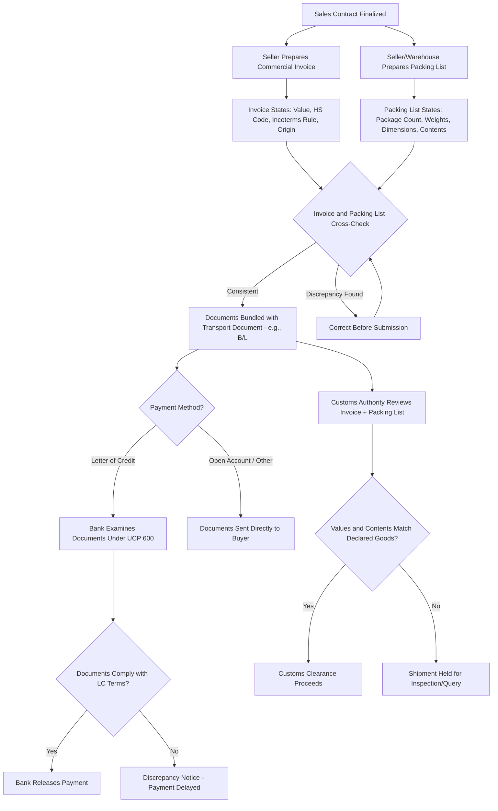

## Commercial Invoice and Packing List

### Definition

The commercial invoice and packing list are two foundational documents in international trade documentation. The commercial invoice is the seller's formal bill for goods sold, serving as the primary basis for customs valuation, duty assessment, and payment. The packing list details the physical contents, packaging configuration, and weights/measurements of a shipment, enabling carriers, customs authorities, and the buyer to verify and handle the cargo correctly.

### Key Points

- **Distinct but complementary functions**: The commercial invoice establishes the financial/contractual record of the sale (what was sold, at what price, to whom); the packing list establishes the physical/logistical record (how the goods are packed, in what quantities, with what weights and dimensions).
- **Not interchangeable**: Customs authorities, carriers, and banks require both documents independently — the invoice cannot substitute for the packing list's physical detail, and vice versa.
- **Universal requirement**: Virtually all cross-border shipments require a commercial invoice for customs clearance; a packing list is required in the vast majority of commercial shipments, particularly multi-item or multi-package shipments.
- **Basis for customs duty calculation**: Customs authorities primarily use the commercial invoice's declared value (often applying the transaction value method under WTO Customs Valuation Agreement principles) to assess applicable duties and taxes.
- **Role in documentary credits**: Under letters of credit, both documents are typically listed as required documents, and banks examine them for consistency with each other and with the LC terms under UCP 600 document examination standards.
- **Consistency requirement**: Discrepancies between the invoice, packing list, and transport documents (e.g., mismatched quantities, weights, or descriptions) are among the most common causes of customs delays and LC document rejection.
- **No universal mandatory format**: Neither document has a single globally mandated format, though certain minimum content elements are expected by customs authorities and banking practice; some countries or trade blocs impose specific formatting or content requirements (e.g., EU customs, U.S. CBP requirements).

### Commercial Invoice: Standard Content Elements

| Element | Purpose |
| --- | --- |
| Seller and buyer names/addresses | Identifies contracting parties |
| Invoice number and date | Unique reference for tracking and payment |
| Description of goods | Basis for customs classification (e.g., HS code) |
| Quantity and unit price | Basis for value calculation |
| Total invoice value and currency | Basis for customs valuation and payment |
| Incoterms rule and named place | Clarifies risk/cost allocation referenced in the sale |
| Country of origin | Required for tariff/preferential treatment determination |
| Harmonized System (HS) code | Enables customs tariff classification |
| Terms of payment | Clarifies payment method/timing (e.g., LC, open account) |
| Shipping marks and numbers | Cross-references packing list and transport documents |

### Packing List: Standard Content Elements

| Element | Purpose |
| --- | --- |
| Shipper and consignee details | Identifies parties, cross-referenced with invoice |
| Invoice number reference | Links packing list to corresponding commercial invoice |
| Package count and type | Identifies number of cartons, pallets, crates, etc. |
| Gross weight and net weight | Required for carrier booking, customs, and freight calculation |
| Dimensions (per package or total) | Required for carrier space allocation and freight calculation |
| Contents per package | Itemizes what is inside each specific package |
| Shipping marks and numbers | Matches markings physically applied to packages |
| Container number (if applicable) | Cross-references transport document (e.g., bill of lading) |

### Documentary Relationship Diagram (svg_diagram)

<svg xmlns="http://www.w3.org/2000/svg" viewBox="0 0 820 320">
<text x="410" y="24" text-anchor="middle" font-size="16" font-weight="bold" fill="#1a1a1a">Commercial Invoice &amp; Packing List Relationships (svg_diagram)</text>
<rect x="60" y="60" width="280" height="180" rx="8" fill="#d6eaf8" stroke="#2980b9" stroke-width="2" />
<text x="200" y="85" text-anchor="middle" font-size="13" font-weight="bold" fill="#1a5276">Commercial Invoice</text>
<text x="200" y="110" text-anchor="middle" font-size="11" fill="#1a5276">Financial record of sale</text>
<text x="200" y="130" text-anchor="middle" font-size="11" fill="#1a5276">Price, value, HS code</text>
<text x="200" y="150" text-anchor="middle" font-size="11" fill="#1a5276">Basis for customs duty</text>
<text x="200" y="170" text-anchor="middle" font-size="11" fill="#1a5276">Payment reference</text>
<text x="200" y="190" text-anchor="middle" font-size="11" fill="#1a5276">Incoterms rule stated</text>
<text x="200" y="210" text-anchor="middle" font-size="11" fill="#1a5276">Country of origin</text>
<rect x="480" y="60" width="280" height="180" rx="8" fill="#d5f5e3" stroke="#27ae60" stroke-width="2" />
<text x="620" y="85" text-anchor="middle" font-size="13" font-weight="bold" fill="#1e8449">Packing List</text>
<text x="620" y="110" text-anchor="middle" font-size="11" fill="#1e8449">Physical record of shipment</text>
<text x="620" y="130" text-anchor="middle" font-size="11" fill="#1e8449">Package count, weight</text>
<text x="620" y="150" text-anchor="middle" font-size="11" fill="#1e8449">Dimensions</text>
<text x="620" y="170" text-anchor="middle" font-size="11" fill="#1e8449">Contents per package</text>
<text x="620" y="190" text-anchor="middle" font-size="11" fill="#1e8449">Shipping marks</text>
<text x="620" y="210" text-anchor="middle" font-size="11" fill="#1e8449">Container/package numbers</text>
<line x1="340" y1="150" x2="480" y2="150" stroke="#8e44ad" stroke-width="3" stroke-dasharray="6,4" />
<text x="410" y="140" text-anchor="middle" font-size="10" fill="#8e44ad">Cross-Referenced</text>
<text x="410" y="270" text-anchor="middle" font-size="11" fill="#555">Both examined together by customs, carriers, and banks under LC terms</text>
</svg>

### Document Preparation and Verification Flow

### Example

A seller in Vietnam exports 1,000 units of furniture components to a buyer in Canada under "FCA Ho Chi Minh City, Incoterms 2020," paid via letter of credit. The commercial invoice lists the unit price, total value ($45,000), HS code for the furniture components, country of origin (Vietnam), and the stated Incoterms rule. The packing list separately details that the shipment consists of 40 cartons across 2 pallets, with gross weight of 3,200 kg, net weight of 2,900 kg, and specific carton-by-carton contents matching shipping marks physically affixed to each package. When the negotiating bank examines the documents under the LC, it checks that the invoice value and description align with the LC terms, and that the packing list's package count and weights are consistent with the bill of lading's stated container/package details — any mismatch (e.g., invoice listing 1,000 units but packing list totaling only 950) would constitute a discrepancy potentially delaying payment.

### Common Pitfalls

- **Inconsistent quantities or descriptions**: A frequent cause of both customs delays and LC discrepancies is a mismatch between the commercial invoice's stated quantity/description and the packing list's itemized contents.
- **Omitting HS codes or country of origin**: Missing or incorrect Harmonized System codes and origin declarations on the commercial invoice can result in customs misclassification, incorrect duty assessment, or denial of preferential tariff treatment under applicable trade agreements.
- **Confusing gross and net weight**: Packing lists that fail to clearly distinguish gross weight (including packaging) from net weight (goods only) can create disputes or miscalculations in freight billing and customs assessment.
- **Missing Incoterms reference on the invoice**: Omitting the applicable Incoterms rule and named place from the commercial invoice can create ambiguity about which costs (freight, insurance, duties) are included in the stated invoice value.
- **Treating either document as optional**: Some exporters mistakenly omit a packing list for small or single-item shipments, but most customs regimes and carrier requirements expect both documents regardless of shipment size or complexity.
- **Undervaluing goods on the invoice**: Understating the commercial invoice value to reduce duty liability is a customs valuation fraud risk that can result in penalties, shipment seizure, or criminal liability, independent of the underlying Incoterms rule used.

**Related Topics**

- Bill of Lading as a Transport and Title Document
- Harmonized System (HS) Codes and Tariff Classification
- Documentary Credits and UCP 600 Examination Standards
- Certificate of Origin
- Customs Valuation Methods (Transaction Value Method)
- Incoterms Reference in Trade Documentation