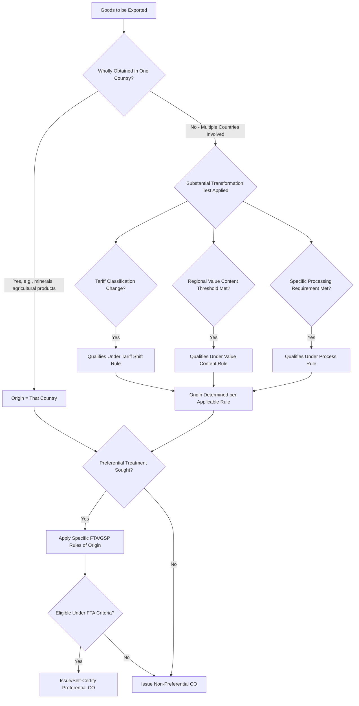

## Certificate of Origin

### Definition

A Certificate of Origin (CO) is a trade document that certifies the country in which goods being exported were manufactured, produced, or substantially transformed. It is used by customs authorities in the importing country to determine applicable tariff rates, assess eligibility for preferential trade agreement treatment, enforce trade sanctions or quotas, and verify compliance with country-specific import regulations.

### Key Points

- **Two principal categories**: Non-preferential (ordinary) Certificates of Origin, which simply state the country of origin for general customs and statistical purposes, and preferential Certificates of Origin, which certify eligibility for reduced or zero tariff rates under a specific free trade agreement (FTA) or preferential trade scheme.
- **"Origin" is not simply "shipped from"**: Origin is determined by where goods were wholly obtained or underwent "substantial transformation," not merely the country from which they were physically shipped — a good assembled in Country A from components sourced in Country B may still qualify as originating in Country A if sufficient transformation occurred there, subject to the applicable origin rules.
- **Issuing authority varies**: Non-preferential COs are commonly issued by chambers of commerce or authorized trade bodies in the exporting country; preferential COs under specific FTAs are often issued or self-certified according to that agreement's specific procedural rules, which vary by agreement.
- **Rules of origin complexity**: Determining eligibility for preferential treatment typically requires applying detailed "rules of origin" specific to each trade agreement, which may include criteria such as regional value content thresholds, tariff classification change requirements, or specific processing requirements.
- **Self-certification trend**: Some modern trade agreements (e.g., USMCA, and various EU FTAs) allow exporters or producers to self-certify origin rather than requiring a third-party issuing body, shifting compliance responsibility and audit exposure to the certifying party.
- **Sanctions and embargo enforcement**: Certificates of Origin also serve as a compliance tool for enforcing trade sanctions, embargoes, and country-specific import bans, since customs authorities use declared origin to screen against restricted-country lists.
- **Distinct from country of manufacture on packaging**: A CO is a formal trade document distinct from (though related to) physical "Made in [Country]" labeling requirements, which may be governed by separate consumer protection or labeling regulations.

### Certificate of Origin Types Comparison

| Type | Purpose | Typical Issuer | Basis |
| --- | --- | --- | --- |
| Non-preferential CO | General customs/statistical declaration of origin | Chamber of commerce or trade body | Basic country-of-origin determination |
| Preferential CO (FTA-specific) | Claim reduced/zero tariff under a trade agreement | Government authority, chamber, or self-certifying exporter (per agreement rules) | Agreement-specific rules of origin |
| GSP Certificate (Form A or equivalent) | Claim preferential tariff under Generalized System of Preferences schemes | Issuing authority per the granting country's GSP scheme | GSP-specific origin criteria |
| Self-certified origin declaration | Exporter/producer directly certifies origin without third-party issuance | Exporter or producer (authorized under the FTA) | Agreement-specific self-certification rules |

### Origin Determination Logic

### Documentary Role Diagram (svg_diagram)

<svg xmlns="http://www.w3.org/2000/svg" viewBox="0 0 800 300">
<text x="400" y="24" text-anchor="middle" font-size="16" font-weight="bold" fill="#1a1a1a">Certificate of Origin's Role in Customs Clearance (svg_diagram)</text>
<rect x="40" y="60" width="200" height="90" rx="8" fill="#d6eaf8" stroke="#2980b9" stroke-width="2" />
<text x="140" y="90" text-anchor="middle" font-size="12" font-weight="bold" fill="#1a5276">Commercial Invoice</text>
<text x="140" y="110" text-anchor="middle" font-size="11" fill="#1a5276">Declares value,</text>
<text x="140" y="126" text-anchor="middle" font-size="11" fill="#1a5276">HS code, price</text>
<rect x="300" y="60" width="200" height="90" rx="8" fill="#d5f5e3" stroke="#27ae60" stroke-width="2" />
<text x="400" y="90" text-anchor="middle" font-size="12" font-weight="bold" fill="#1e8449">Certificate of Origin</text>
<text x="400" y="110" text-anchor="middle" font-size="11" fill="#1e8449">Certifies country</text>
<text x="400" y="126" text-anchor="middle" font-size="11" fill="#1e8449">where goods originated</text>
<rect x="560" y="60" width="200" height="90" rx="8" fill="#e8daef" stroke="#8e44ad" stroke-width="2" />
<text x="660" y="90" text-anchor="middle" font-size="12" font-weight="bold" fill="#5b2c6f">Bill of Lading</text>
<text x="660" y="110" text-anchor="middle" font-size="11" fill="#5b2c6f">Confirms transport</text>
<text x="660" y="126" text-anchor="middle" font-size="11" fill="#5b2c6f">and shipment details</text>
<line x1="240" y1="105" x2="300" y2="105" stroke="#555" stroke-width="2" />
<line x1="500" y1="105" x2="560" y2="105" stroke="#555" stroke-width="2" />
<path d="M140,150 L400,220 L660,150" fill="none" stroke="#555" stroke-width="2" />
<rect x="300" y="220" width="200" height="60" rx="8" fill="#fdebd0" stroke="#e67e22" stroke-width="2" />
<text x="400" y="245" text-anchor="middle" font-size="12" font-weight="bold" fill="#af601a">Customs Authority</text>
<text x="400" y="263" text-anchor="middle" font-size="11" fill="#af601a">Determines duty rate &amp; eligibility</text>
</svg>

### Example

A manufacturer in Vietnam exports textiles to a buyer in the United States. If the textiles were wholly manufactured in Vietnam from Vietnamese-grown cotton, a non-preferential Certificate of Origin declaring "Vietnam" as the country of origin would typically accompany the shipment for standard customs clearance and tariff assessment under normal Most Favored Nation (MFN) rates. However, if the same manufacturer wished to claim preferential tariff treatment under a specific trade agreement Vietnam participates in, they would instead need to apply that agreement's specific rules of origin — potentially requiring the certificate to demonstrate a defined percentage of regional value content or a qualifying tariff classification shift from the imported components used — and issue or self-certify a preferential Certificate of Origin under that agreement's specific procedural requirements, rather than relying on the simpler non-preferential form.

### Common Pitfalls

- **Confusing "shipped from" with "origin"**: A common error is assuming the country of export equals the country of origin; goods merely transshipped through or repackaged in a third country without substantial transformation typically retain their original country of origin, not the transshipment country.
- **Applying the wrong rules of origin**: Each free trade agreement has its own specific rules of origin; applying one agreement's criteria to a shipment intended for preferential treatment under a different agreement can result in denied preferential treatment.
- **Overlooking self-certification eligibility requirements**: Where an FTA permits self-certification, exporters must still meet specific authorization or documentation-retention requirements; assuming self-certification is available or automatically valid without meeting these conditions risks denial of preferential treatment upon audit.
- **Inconsistency with the commercial invoice or packing list**: Discrepancies between the declared origin on the CO and details on the accompanying commercial invoice or packing list can trigger customs holds or LC document discrepancies.
- **Assuming a single global CO format**: No universal Certificate of Origin format exists; format and required content vary by issuing body, destination country, and whether preferential treatment is being claimed.
- **Underestimating audit exposure under self-certification regimes**: Self-certifying exporters bear direct liability for inaccurate origin claims and are typically subject to retroactive audit and penalty exposure if origin claims are later found unsupported.

**Related Topics**

- Commercial Invoice and Packing List
- Harmonized System (HS) Codes and Tariff Classification
- Free Trade Agreements and Rules of Origin
- Generalized System of Preferences (GSP)
- Customs Valuation Methods
- Trade Sanctions and Restricted Party Screening