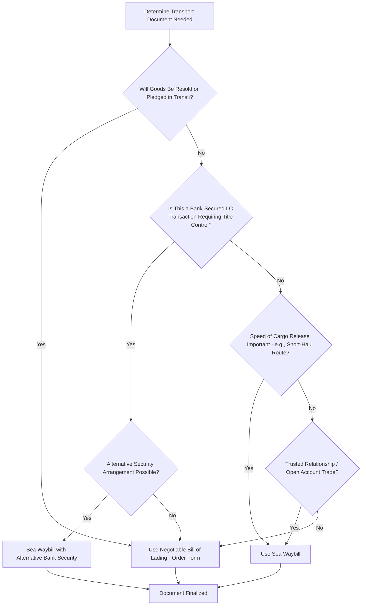

## Sea Waybills and Non Negotiable Documents

### Definition

A sea waybill is a non-negotiable transport document issued by a carrier acknowledging receipt of goods for shipment and evidencing the contract of carriage, but which — unlike a negotiable bill of lading — does not function as a document of title. Goods are released to the named consignee identified on the waybill upon proof of identity, without requiring presentation and surrender of an original physical document, making sea waybills significantly faster and simpler to use where the negotiability of a traditional bill of lading is not commercially necessary.

### Key Points

- **Not a document of title**: A sea waybill does not need to be physically presented to the carrier to obtain delivery of the goods; the carrier releases cargo to the named consignee upon proof of identity, not upon surrender of an original document.
- **Non-negotiable by design**: Sea waybills cannot be transferred to a third party by endorsement; the named consignee is fixed from the point of issuance, functionally similar to a straight bill of lading in this respect, but distinguished by not requiring physical presentation at all.
- **Speed and efficiency advantage**: Because the consignee need not wait for an original physical document to arrive (which can lag behind fast transit times, especially on short sea routes), waybills reduce the risk of cargo arriving before the paper document, avoiding delays or the need for costly letters of indemnity to release goods without an original B/L.
- **Suitability**: Best suited for transactions where there is no need to trade or pledge the goods while in transit — typically intra-company shipments, trusted long-term trading relationships, open account trade, or short-haul routes where speed matters more than negotiability.
- **Unsuitability for LC-financed transactions requiring control**: Because banks in documentary credit transactions often rely on the negotiability of an order bill of lading to maintain security interest in the goods, sea waybills are generally unsuitable where a bank needs to retain control over the cargo as collateral, unless alternative security arrangements are made.
- **Other non-negotiable transport documents**: Waybills exist across other transport modes with similar characteristics — air waybills (AWB) for air freight and road/rail consignment notes (e.g., CMR notes for road transport) are also inherently non-negotiable documents by convention, distinguishing them structurally from negotiable ocean bills of lading.
- **Legal framework**: Sea waybills are commonly governed by standard terms such as the CMI Uniform Rules for Sea Waybills, and are typically also subject to the carrier's standard terms and conditions incorporated by reference.

### Comparison: Sea Waybill vs. Negotiable Bill of Lading

| Feature | Sea Waybill | Negotiable Bill of Lading (Order/Bearer) |
| --- | --- | --- |
| Document of title | No | Yes |
| Requires physical presentation for delivery | No — proof of identity suffices | Yes — original must be surrendered |
| Transferable to third party | No | Yes, by endorsement or delivery |
| Speed of cargo release at destination | Fast — no waiting for original document | Can be delayed if original document lags shipment |
| Suitable for LC bank security | Generally no (without added arrangements) | Yes — standard form for LC transactions |
| Risk of lost original document causing delay | Low (no original required for release) | Higher (lost B/L can delay release, require indemnity) |
| Typical use case | Trusted trading relationships, intra-company, open account, short-haul | Trade finance, resale-in-transit, LC-secured transactions |

### Comparable Non-Negotiable Documents Across Modes

| Transport Mode | Non-Negotiable Document | Negotiable Equivalent (if any) |
| --- | --- | --- |
| Sea/inland waterway | Sea Waybill | Ocean Bill of Lading (order/bearer) |
| Air | Air Waybill (AWB) | None — AWBs are inherently non-negotiable |
| Road | CMR Consignment Note | Generally non-negotiable by convention |
| Rail | Rail Consignment Note | Generally non-negotiable by convention |
| Multimodal | Multimodal Transport Document (can be issued in negotiable or non-negotiable form) | FBL (FIATA Bill of Lading) — negotiable form available |

### Document Function Diagram (svg_diagram)

<svg xmlns="http://www.w3.org/2000/svg" viewBox="0 0 820 300">
<text x="410" y="24" text-anchor="middle" font-size="16" font-weight="bold" fill="#1a1a1a">Sea Waybill vs Negotiable B/L: Release Process (svg_diagram)</text>

<text x="200" y="55" text-anchor="middle" font-size="13" font-weight="bold" fill="`#27ae60`">Sea Waybill</text>

<circle cx="100" cy="90" r="6" fill="`#27ae60`" />

<text x="100" y="112" text-anchor="middle" font-size="10">Carrier Issues</text>

<text x="100" y="125" text-anchor="middle" font-size="10">Waybill</text>

<line x1="106" y1="90" x2="234" y2="90" stroke="`#27ae60`" stroke-width="2" marker-end="url(#a1)" />

<circle cx="240" cy="90" r="6" fill="`#27ae60`" />

<text x="240" y="112" text-anchor="middle" font-size="10">Named Consignee</text>

<text x="240" y="125" text-anchor="middle" font-size="10">Fixed - No Transfer</text>

<line x1="246" y1="90" x2="374" y2="90" stroke="`#27ae60`" stroke-width="2" marker-end="url(#a1)" />

<circle cx="380" cy="90" r="6" fill="`#27ae60`" />

<text x="380" y="112" text-anchor="middle" font-size="10">Goods Released on</text>

<text x="380" y="125" text-anchor="middle" font-size="10">Proof of ID Only</text>

<text x="620" y="55" text-anchor="middle" font-size="13" font-weight="bold" fill="`#2980b9`">Negotiable Bill of Lading</text>

<circle cx="500" cy="200" r="6" fill="`#2980b9`" />

<text x="500" y="222" text-anchor="middle" font-size="10">Carrier Issues</text>

<text x="500" y="235" text-anchor="middle" font-size="10">Order B/L</text>

<line x1="506" y1="200" x2="614" y2="200" stroke="`#2980b9`" stroke-width="2" marker-end="url(#a1)" />

<circle cx="620" cy="200" r="6" fill="`#2980b9`" />

<text x="620" y="222" text-anchor="middle" font-size="10">Endorsed/Traded</text>

<text x="620" y="235" text-anchor="middle" font-size="10">In Transit</text>

<line x1="626" y1="200" x2="734" y2="200" stroke="`#2980b9`" stroke-width="2" marker-end="url(#a1)" />

<circle cx="740" cy="200" r="6" fill="`#2980b9`" />

<text x="740" y="222" text-anchor="middle" font-size="10">Goods Released ONLY</text>

<text x="740" y="235" text-anchor="middle" font-size="10">on Original Surrender</text>

</svg>

### Selection Logic

### Example

A manufacturer's overseas subsidiary in Vietnam regularly ships components to the parent company's factory in Germany under an intercompany open account arrangement — no letter of credit, no intent to resell goods in transit, and a well-established trusted relationship. The parties use a sea waybill: the carrier releases the shipment to the German factory upon proof of identity as soon as the vessel arrives, without waiting for a physical original document to be couriered separately — often arriving well after the cargo on short sea routes. Contrast this with an independent commodity trader purchasing crude oil under a letter of credit, intending to potentially resell the cargo to another buyer before the vessel reaches its final destination; here, a negotiable order bill of lading is required, since only a document of title allows the cargo to be sold and the title transferred via endorsement while still at sea.

### Common Pitfalls

- **Using a sea waybill when resale-in-transit is possible**: Because a waybill fixes the named consignee non-negotiably, using one forecloses the option to trade the goods while in transit — a significant limitation for commodity or resale-oriented trade.
- **Assuming a waybill provides equivalent bank security to an order B/L**: Banks financing transactions via letter of credit typically rely on the negotiability and title-document function of an order B/L as collateral; a sea waybill does not replicate this function unless supplemented by other security arrangements.
- **Confusing "non-negotiable" with "no legal value"**: A sea waybill remains fully valid evidence of the contract of carriage and receipt of goods — it is only non-negotiable in the sense that it cannot be transferred to a new holder, not that it lacks legal effect.
- **Overlooking proof-of-identity requirements at destination**: While waybills avoid the need to present an original document, carriers still require the named consignee to establish their identity before releasing cargo — failing to arrange this in advance can cause its own delays.
- **Applying air waybill or CMR assumptions to sea shipments without verification**: While air waybills and road consignment notes are conventionally non-negotiable across most jurisdictions, the specific legal framework governing sea waybills (e.g., CMI Uniform Rules or carrier-specific terms) should still be confirmed for the applicable trade lane, since specific incorporated terms can vary.

**Related Topics**

- Bills of Lading: Straight, Order, and Bearer Forms
- Bill of Lading as a Document of Title
- Air Waybills and Road/Rail Consignment Notes
- Documentary Credits and UCP 600
- Multimodal Transport Documents (FBL)
- Letters of Indemnity for Missing Original Bills of Lading