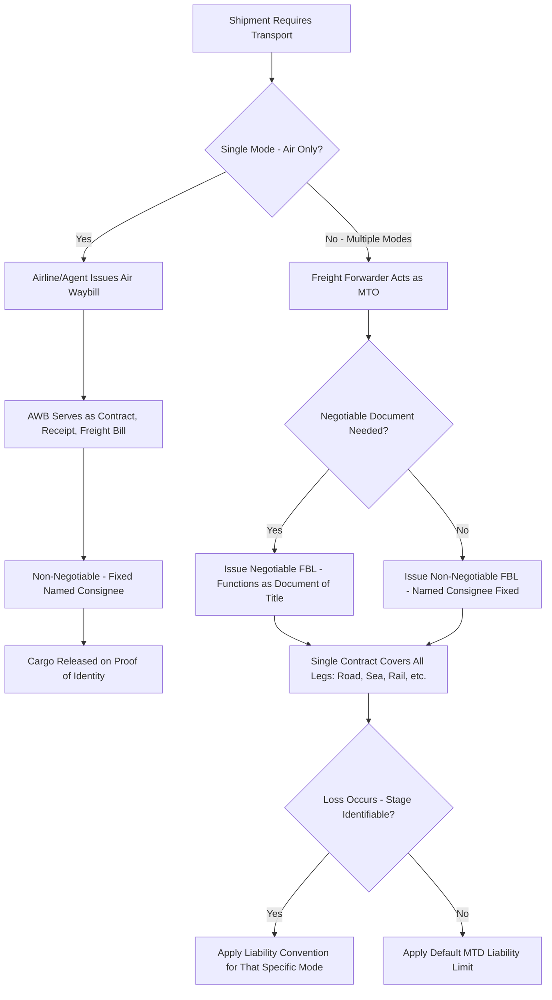

## Air Waybills and Multimodal Transport Documents

### Definition

An air waybill (AWB) is the transport document used for air freight shipments, issued by an airline or its agent, evidencing the contract of carriage and receipt of goods for air transport. A multimodal transport document (MTD) is issued by a multimodal transport operator (MTO) covering a shipment carried by at least two different modes of transport (e.g., truck, rail, sea, air) under a single contract, from origin to final destination. Both are structurally distinct from the negotiable ocean bill of lading, though multimodal documents can be issued in either negotiable or non-negotiable form.

### Key Points

- **AWB is inherently non-negotiable**: Unlike ocean bills of lading, an air waybill is never issued in negotiable form; it is not a document of title, and cargo is released to the named consignee upon proof of identity rather than upon surrender of an original document — structurally similar to a sea waybill.
- **AWB governing framework**: Air waybills are governed by international air carriage conventions, primarily the Warsaw Convention (1929, as amended) and its successor, the Montreal Convention (1999), which establish carrier liability limits and mandatory document content.
- **AWB serves three roles**: Evidence of the contract of carriage, a receipt for the goods, and a freight bill — it is issued in a standardized multi-copy set (typically an original for the carrier, one for the consignee, and one for the shipper, plus additional copies for handling agents/customs).
- **Multimodal transport document flexibility**: An MTD can be issued in either negotiable form (transferable by endorsement, functioning as a document of title similar to an order bill of lading) or non-negotiable form (naming a fixed consignee, similar to a waybill) — the choice depends on the parties' commercial needs.
- **FIATA Bill of Lading (FBL)**: A widely used standardized multimodal transport document, developed by the International Federation of Freight Forwarders Associations (FIATA), issued by freight forwarders acting as multimodal transport operators; the FBL can be issued in negotiable form.
- **Single carrier responsibility under MTD**: A key feature of multimodal transport documents is that the MTO assumes responsibility for the entire door-to-door movement under one contract, even though multiple sub-carriers (trucking company, ocean carrier, rail operator) may physically perform different legs — contrasted with separate, mode-specific documents issued for each leg under a segmented (non-multimodal) shipment.
- **Liability regime complexity under multimodal transport**: Because different transport modes are subject to different international liability conventions (e.g., Hague-Visby Rules for sea, Montreal Convention for air, CMR for road), multimodal transport documents typically incorporate a "network liability system," applying the liability rules of whichever mode was in use at the time of loss, where the stage of loss can be identified — a source of legal complexity when the stage of loss is unknown.

### Document Comparison

| Feature | Air Waybill (AWB) | Multimodal Transport Document (MTD) |
| --- | --- | --- |
| Transport mode(s) | Air only | Two or more modes under one contract |
| Negotiable form available | No — always non-negotiable | Yes — can be issued negotiable or non-negotiable |
| Issuing party | Airline or its agent | Multimodal Transport Operator (MTO) — often a freight forwarder |
| Document of title | No | Only if issued in negotiable form |
| Governing framework | Montreal Convention / Warsaw Convention | Varies — network liability system referencing multiple mode-specific conventions |
| Standardized industry form | IATA-standard AWB format | FIATA Bill of Lading (FBL) commonly used |
| Liability limits | Set by applicable air convention (weight-based limits) | Depends on identified stage of loss, or a default MTD limit if unidentifiable |

### Multimodal Transport Structure Diagram (svg_diagram)

<svg xmlns="http://www.w3.org/2000/svg" viewBox="0 0 820 300">
<text x="410" y="24" text-anchor="middle" font-size="16" font-weight="bold" fill="#1a1a1a">Multimodal Transport Document Structure (svg_diagram)</text>
<rect x="60" y="50" width="700" height="50" rx="8" fill="#e8daef" stroke="#8e44ad" stroke-width="2" />
<text x="410" y="80" text-anchor="middle" font-size="12" font-weight="bold" fill="#5b2c6f">Single Multimodal Transport Document (e.g., FBL) - One Contract, One MTO</text>
<line x1="410" y1="100" x2="150" y2="150" stroke="#555" stroke-width="1.5" />
<line x1="410" y1="100" x2="410" y2="150" stroke="#555" stroke-width="1.5" />
<line x1="410" y1="100" x2="670" y2="150" stroke="#555" stroke-width="1.5" />
<rect x="60" y="150" width="180" height="60" rx="6" fill="#d6eaf8" stroke="#2980b9" />
<text x="150" y="175" text-anchor="middle" font-size="11" font-weight="bold" fill="#1a5276">Road Leg</text>
<text x="150" y="192" text-anchor="middle" font-size="10" fill="#1a5276">Factory to Port</text>
<rect x="320" y="150" width="180" height="60" rx="6" fill="#d5f5e3" stroke="#27ae60" />
<text x="410" y="175" text-anchor="middle" font-size="11" font-weight="bold" fill="#1e8449">Sea Leg</text>
<text x="410" y="192" text-anchor="middle" font-size="10" fill="#1e8449">Port to Port</text>
<rect x="580" y="150" width="180" height="60" rx="6" fill="#fdebd0" stroke="#e67e22" />
<text x="670" y="175" text-anchor="middle" font-size="11" font-weight="bold" fill="#af601a">Rail/Road Leg</text>
<text x="670" y="192" text-anchor="middle" font-size="10" fill="#af601a">Port to Warehouse</text>

<text x="410" y="250" text-anchor="middle" font-size="11" fill="#555">Loss allocated by network liability system: applicable convention</text>

<text x="410" y="266" text-anchor="middle" font-size="11" fill="#555">depends on which leg the loss occurred in, if identifiable</text>

</svg>

### Process Flow: AWB vs MTD Issuance

### Example

A freight forwarder in China arranges a door-to-door shipment of consumer electronics from a factory in Shenzhen to a distribution center in Chicago, involving trucking from the factory to the port, ocean carriage to Los Angeles, and rail transport onward to Chicago. The forwarder, acting as the multimodal transport operator, issues a single FIATA Bill of Lading (FBL) covering the entire door-to-door movement under one contract, rather than requiring the shipper to obtain separate documents for each leg. If damage is discovered upon arrival and can be traced to the ocean leg specifically, the Hague-Visby Rules (or applicable maritime liability regime) would typically govern the carrier's liability for that portion; if the stage of loss cannot be determined, a default liability limit under the multimodal contract or applicable law would apply instead. Contrast this with a separate air freight shipment of urgent replacement parts sent directly from Shenzhen to Chicago by air only — here, the airline issues a standard IATA-format air waybill, non-negotiable, naming the distribution center as consignee, governed by the Montreal Convention's liability framework.

### Common Pitfalls

- **Assuming an AWB can be issued negotiably**: Air waybills are never negotiable under standard industry and legal convention — attempting to use one for resale-in-transit purposes is not supported by the instrument.
- **Confusing a multimodal document with a series of separate mode-specific documents**: A true multimodal transport document reflects one integrated contract with one responsible party (the MTO); separately issued documents for each leg (e.g., a CMR note plus an ocean B/L) do not constitute a multimodal transport document and split liability across separate contracts and parties.
- **Overlooking the network liability system's complexity**: Parties may assume a single uniform liability standard applies throughout a multimodal shipment, when in fact liability often depends on identifying which specific leg a loss occurred in — a factual determination that can itself become contentious.
- **Failing to confirm negotiable vs. non-negotiable MTD form**: Since multimodal transport documents can be issued in either form, failing to specify which form is required (particularly relevant for LC-financed transactions needing title-document security) can create a documentary mismatch with banking requirements.
- **Assuming FBL is universally recognized**: While widely used, the FIATA Bill of Lading's acceptance can depend on the freight forwarder's FIATA membership/authorization and the destination country's customs and banking practices — verifying acceptance in advance is advisable for LC-financed trades.

**Related Topics**

- Bills of Lading: Straight, Order, and Bearer Forms
- Sea Waybills and Non-Negotiable Documents
- Montreal Convention and Air Carrier Liability
- Hague-Visby Rules and Maritime Carrier Liability
- FIATA Bill of Lading (FBL) in Freight Forwarding
- Documentary Credits and UCP 600