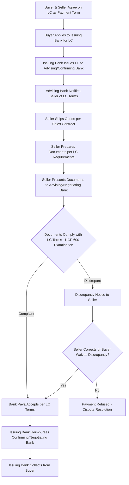
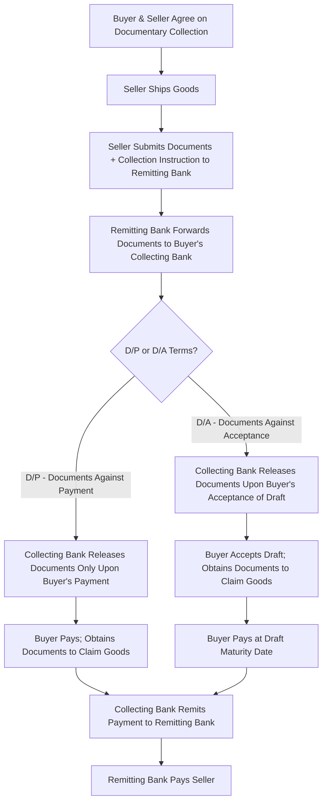

## Letters of Credit and Documentary Collections

### Definition

Letters of credit (LCs) and documentary collections are the two principal bank-intermediated payment mechanisms used in international trade to manage payment and performance risk between buyers and sellers who may lack an established trust relationship. A letter of credit is a conditional bank payment undertaking, where a bank commits to pay the seller upon presentation of compliant documents. A documentary collection is a payment mechanism in which banks act as intermediaries to exchange trade documents for payment or acceptance, without providing a payment guarantee themselves.

### Key Points

- **Fundamental distinction**: Under an LC, the issuing bank itself undertakes a binding payment obligation, contingent solely on document compliance; under a documentary collection, banks merely act as agents to facilitate exchange of documents and payment/acceptance instructions, with no independent payment guarantee.
- **Governing rules**: Letters of credit are primarily governed by the ICC's Uniform Customs and Practice for Documentary Credits (UCP 600); documentary collections are governed by the ICC's Uniform Rules for Collections (URC 522).
- **Risk allocation shift**: LCs shift payment risk substantially from the seller to the issuing bank (assuming compliant documents are presented), making them the higher-security option for sellers; documentary collections leave more payment risk with the seller, since the buyer's bank has no independent obligation to pay if the buyer refuses or is unable to pay.
- **Cost and complexity**: LCs are generally more expensive (issuance fees, confirmation fees, document examination fees) and procedurally complex than documentary collections, which are comparatively simpler and cheaper but offer less security.
- **Documents against Payment (D/P) vs. Documents against Acceptance (D/A)**: Within documentary collections, D/P requires the buyer to pay before receiving documents (and thus before obtaining the goods); D/A allows the buyer to obtain documents by accepting a time draft (bill of exchange), deferring actual payment to a later maturity date.
- **Independence principle (LCs)**: A core feature of LCs under UCP 600 is that the bank's payment obligation is independent of the underlying sales contract — the bank examines only whether the presented documents comply with the LC's terms, not whether the underlying goods actually conform to the contract.
- **Strict compliance standard**: Banks examining documents under an LC apply a strict/complying presentation standard — even minor discrepancies between presented documents and LC terms can result in a rejected presentation and delayed or refused payment, independent of whether the goods themselves are satisfactory.

### Comparison: Letters of Credit vs. Documentary Collections

| Feature | Letter of Credit | Documentary Collection |
| --- | --- | --- |
| Governing ICC rules | UCP 600 | URC 522 |
| Bank payment obligation | Yes — issuing bank's own binding commitment | No — banks act only as agents |
| Relative cost | Higher (issuance, confirmation, examination fees) | Lower |
| Relative security for seller | High | Moderate to low |
| Relative security for buyer | Moderate (pays only on compliant documents) | Higher (retains more control/discretion) |
| Typical use case | New or lower-trust trading relationships, higher-value transactions | Established trading relationships, moderate trust |
| Payment trigger | Compliant document presentation to issuing/confirming bank | Buyer's payment (D/P) or acceptance of draft (D/A) |
| Risk of buyer non-payment | Low (bank obligated once documents comply) | Higher (seller relies on buyer's willingness/ability to pay) |

### Letter of Credit Process Flow

### Documentary Collection Process Flow

### Payment Mechanism Risk Diagram (svg_diagram)

<svg xmlns="http://www.w3.org/2000/svg" viewBox="0 0 800 260">
<text x="400" y="24" text-anchor="middle" font-size="16" font-weight="bold" fill="#1a1a1a">Seller Payment Risk Spectrum (svg_diagram)</text>
<line x1="60" y1="130" x2="740" y2="130" stroke="#333" stroke-width="3" />
<circle cx="100" cy="130" r="8" fill="#c0392b" />
<text x="100" y="155" text-anchor="middle" font-size="11">Open Account</text>
<text x="100" y="170" text-anchor="middle" font-size="11">(Highest Seller Risk)</text>
<circle cx="300" cy="130" r="8" fill="#e67e22" />
<text x="300" y="155" text-anchor="middle" font-size="11">Documentary Collection</text>
<text x="300" y="170" text-anchor="middle" font-size="11">(D/A then D/P)</text>
<circle cx="550" cy="130" r="8" fill="#f1c40f" />
<text x="550" y="155" text-anchor="middle" font-size="11">Letter of Credit</text>
<text x="550" y="170" text-anchor="middle" font-size="11">(Unconfirmed)</text>
<circle cx="700" cy="130" r="8" fill="#27ae60" />
<text x="700" y="155" text-anchor="middle" font-size="11">Confirmed LC /</text>
<text x="700" y="170" text-anchor="middle" font-size="11">Cash in Advance</text>

<text x="400" y="200" text-anchor="middle" font-size="11" fill="#555">Seller risk decreases left to right; buyer flexibility/risk generally moves inversely</text>

</svg>

### Example

A first-time exporter in Bangladesh sells textiles to a new buyer in Brazil with no prior trading history. Given the lack of established trust, the parties agree to a confirmed irrevocable letter of credit: the buyer's bank issues the LC, and a bank in the exporter's country confirms it, adding its own payment guarantee. The exporter ships the goods, presents the commercial invoice, packing list, and bill of lading to the confirming bank, and upon confirming the documents strictly comply with the LC's terms under UCP 600, receives payment directly from the confirming bank — regardless of whether the buyer ultimately pays its own bank. Contrast this with an established relationship between a German auto parts manufacturer and a longtime Polish buyer: here, the parties might use a documentary collection on D/A terms, where the manufacturer ships goods and forwards documents through its bank, the Polish buyer's bank releases the documents once the buyer accepts a 60-day time draft, and the buyer pays at maturity — a lower-cost, lower-security arrangement appropriate given the established trust between the parties.

### Common Pitfalls

- **Assuming a documentary collection guarantees payment**: Unlike an LC, a documentary collection provides no independent bank payment obligation; if the buyer refuses to pay (D/P) or accept (D/A), the seller's goods may be stranded at the destination port with limited recourse.
- **Overlooking the LC independence principle**: Parties sometimes assume that shipping non-conforming goods will prevent LC payment — but banks examine only document compliance, not actual goods condition, meaning a seller could technically receive LC payment for goods that do not match the contract's substantive quality requirements, a risk the buyer must separately manage through other contractual protections.
- **Underestimating strict compliance risk**: Even minor discrepancies (e.g., a misspelled name, mismatched dates, or inconsistent quantities across documents) can result in a rejected LC presentation, delaying or jeopardizing payment despite the underlying transaction being commercially sound.
- **Confusing confirmed and unconfirmed LCs**: An unconfirmed LC relies solely on the issuing bank's creditworthiness and country risk; a confirmed LC adds a second bank's independent payment obligation, materially increasing security for the seller — conflating the two can lead to inadequate risk protection.
- **Failing to align Incoterms with payment mechanism requirements**: As covered under the FCA bill of lading option, certain payment mechanisms (particularly LCs) may require specific transport document types (e.g., on-board bills of lading) that must be coordinated with the chosen Incoterms rule to avoid documentary mismatches.
- **Assuming D/A is equivalent in security to an LC**: D/A terms depend entirely on the buyer's willingness and ability to honor the accepted draft at maturity; unlike an LC, no bank has independently guaranteed that payment will occur.

**Related Topics**

- UCP 600 and Documentary Credit Examination Standards
- URC 522 and Documentary Collection Rules
- Bills of Lading: Straight, Order, and Bearer Forms
- The FCA Bill of Lading Option for Documentary Credits
- Trade Finance Risk Spectrum: Open Account to Cash in Advance
- Confirmed vs. Unconfirmed Letters of Credit