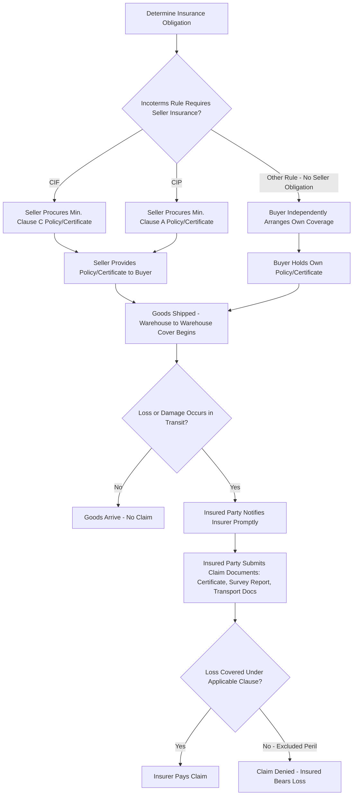

## Cargo Insurance Certificates and Policies

### Definition

Cargo insurance policies and certificates are documents evidencing marine (or multimodal) cargo insurance coverage for goods in transit, protecting the insured party against financial loss from damage, loss, or destruction during carriage. A policy is the master insurance contract issued directly for a specific shipment or under an open/floating arrangement, while a certificate is a document evidencing coverage under a pre-existing open policy, issued per shipment for practical/documentary purposes.

### Key Points

- **Policy vs. certificate distinction**: A marine insurance policy is the full contractual document setting out all terms, conditions, and exclusions of coverage; a certificate of insurance is typically a shorter document evidencing that coverage exists under an underlying open (floating) policy already in place — both are generally accepted as compliant insurance documents under standard banking practice, including UCP 600, unless the LC specifically requires a policy.
- **Open (floating) policies**: Many regular shippers/importers maintain an open cargo policy covering all qualifying shipments automatically over a defined period, with individual certificates issued per shipment referencing that master policy — more efficient than negotiating a new policy for every individual shipment.
- **Institute Cargo Clauses as standard coverage basis**: Most marine cargo insurance is written with reference to the Institute Cargo Clauses (A, B, or C), which define the scope of covered perils, ranging from Clause A (broadest, all-risk subject to exclusions) to Clause C (narrowest, named major casualties only).
- **Required under CIF and CIP**: As the only two Incoterms rules imposing an insurance obligation on the seller, CIF (minimum Clause C) and CIP (minimum Clause A) require the seller to provide the buyer with the insurance policy or certificate as one of the required trade documents.
- **Insurable interest requirement**: The party claiming under a cargo insurance policy must generally have an insurable interest in the goods at the time of loss — a legal principle meaning only a party with a genuine financial stake in the goods' safe arrival can recover under the policy.
- **Standard coverage amount convention**: Absent other agreement, marine cargo insurance is commonly procured for 110% of the CIF/CIP contract value — the additional 10% conventionally representing anticipated profit margin on resale.
- **Route and duration of cover**: Cargo policies typically specify a "warehouse to warehouse" clause extending cover from the point goods leave the seller's warehouse through ordinary transit to the buyer's final warehouse, subject to specified time limits after discharge — broader than covering only the main international carriage leg.
- **Claims process**: Upon loss or damage, the insured party (typically the buyer, or whoever holds insurable interest at the time) must notify the insurer promptly, often within specified time limits, and provide supporting documentation (survey reports, photographs, the insurance certificate/policy, and transport/commercial documents) to substantiate the claim.

### Institute Cargo Clauses Coverage Summary

| Clause | Coverage Basis | Typical Exclusions (Subject to Policy Terms) |
| --- | --- | --- |
| Clause A | All risks of physical loss/damage, subject to specific exclusions | War, strikes/riots (unless separately added), inherent vice, inadequate packing, deliberate damage by insured |
| Clause B | Named perils, broader than Clause C (includes some water damage, washing overboard) | Same general exclusion categories as Clause A, but narrower named-peril basis |
| Clause C | Named perils only — fire, explosion, stranding, sinking, capsizing, collision, general average | Broadest exclusions; does not cover many partial losses, theft, or handling damage |

### Policy vs. Certificate Structure Diagram (svg_diagram)

<svg xmlns="http://www.w3.org/2000/svg" viewBox="0 0 820 300">
<text x="410" y="24" text-anchor="middle" font-size="16" font-weight="bold" fill="#1a1a1a">Open Policy and Per-Shipment Certificates (svg_diagram)</text>
<rect x="280" y="50" width="260" height="60" rx="8" fill="#2c3e50" />
<text x="410" y="75" text-anchor="middle" font-size="12" fill="#fff" font-weight="bold">Master Open (Floating) Policy</text>
<text x="410" y="95" text-anchor="middle" font-size="10" fill="#ecf0f1">Full terms, conditions, exclusions</text>
<line x1="330" y1="110" x2="150" y2="160" stroke="#555" stroke-width="1.5" />
<line x1="410" y1="110" x2="410" y2="160" stroke="#555" stroke-width="1.5" />
<line x1="490" y1="110" x2="670" y2="160" stroke="#555" stroke-width="1.5" />
<rect x="60" y="160" width="180" height="70" rx="6" fill="#d6eaf8" stroke="#2980b9" />
<text x="150" y="185" text-anchor="middle" font-size="11" font-weight="bold" fill="#1a5276">Shipment 1</text>
<text x="150" y="203" text-anchor="middle" font-size="10" fill="#1a5276">Certificate Issued</text>
<text x="150" y="218" text-anchor="middle" font-size="10" fill="#1a5276">References Master Policy</text>
<rect x="320" y="160" width="180" height="70" rx="6" fill="#d5f5e3" stroke="#27ae60" />
<text x="410" y="185" text-anchor="middle" font-size="11" font-weight="bold" fill="#1e8449">Shipment 2</text>
<text x="410" y="203" text-anchor="middle" font-size="10" fill="#1e8449">Certificate Issued</text>
<text x="410" y="218" text-anchor="middle" font-size="10" fill="#1e8449">References Master Policy</text>
<rect x="580" y="160" width="180" height="70" rx="6" fill="#fdebd0" stroke="#e67e22" />
<text x="670" y="185" text-anchor="middle" font-size="11" font-weight="bold" fill="#af601a">Shipment 3</text>
<text x="670" y="203" text-anchor="middle" font-size="10" fill="#af601a">Certificate Issued</text>
<text x="670" y="218" text-anchor="middle" font-size="10" fill="#af601a">References Master Policy</text>
</svg>

### Insurance Procurement and Claims Process

### Example

A trading company regularly imports raw materials under CIF terms from multiple overseas suppliers. Rather than requiring each supplier to negotiate a new insurance policy for every shipment, the trading company (or its designated party under the CIF arrangement) may rely on the seller procuring coverage under a general open cargo policy already in place with a marine insurer, with an individual insurance certificate issued for each specific shipment referencing that master policy's terms. When one shipment's container is later found to have sustained water damage during a storm at sea — a peril covered under Clause C (general average/casualty-related) — the buyer submits the shipment-specific certificate along with survey reports and the bill of lading to the insurer to substantiate the claim, without needing to reference or renegotiate the entire underlying open policy.

### Common Pitfalls

- **Assuming a certificate provides weaker protection than a policy**: In most cases, a properly issued certificate referencing a compliant open policy provides the same substantive coverage as a standalone policy; the difference is primarily documentary form, though certain LCs may specifically require a full policy rather than a certificate — a requirement that should be checked in advance.
- **Overlooking the CIF/CIP coverage-level distinction**: As established elsewhere, CIF's default minimum (Clause C) is materially narrower than CIP's default minimum (Clause A); assuming both rules provide equivalent protection can leave the buyer under-protected under CIF unless an upgrade is explicitly negotiated.
- **Failing to confirm insurable interest at time of loss**: A party attempting to claim under a cargo policy without a valid insurable interest at the time the loss occurred may find their claim denied, regardless of the policy's stated coverage — timing of risk transfer under the applicable Incoterms rule is directly relevant here.
- **Missing claim notification deadlines**: Marine cargo policies commonly impose specific time limits for notifying the insurer and submitting claims documentation; delayed notification can jeopardize an otherwise valid claim.
- **Assuming 110% coverage is mandatory rather than conventional**: The 110% of contract value convention is a common default, not a universal legal requirement; parties can and sometimes should negotiate a different insured value based on actual resale value, anticipated profit margin, or specific risk factors.
- **Neglecting to verify "warehouse to warehouse" scope**: Assuming coverage is limited strictly to the main international carriage leg, when in fact standard policies often extend cover to inland transit at both origin and destination, subject to specified time limits — failing to understand this scope can lead to either underinsurance or unnecessary duplicate coverage.

**Related Topics**

- Insurance Obligations Under CIF and CIP
- Institute Cargo Clauses A, B, and C in Detail
- Commercial Invoice and Packing List
- Documentary Credits and UCP 600
- Insurable Interest in Marine Insurance Law
- Marine Insurance Claims Documentation and Survey Reports