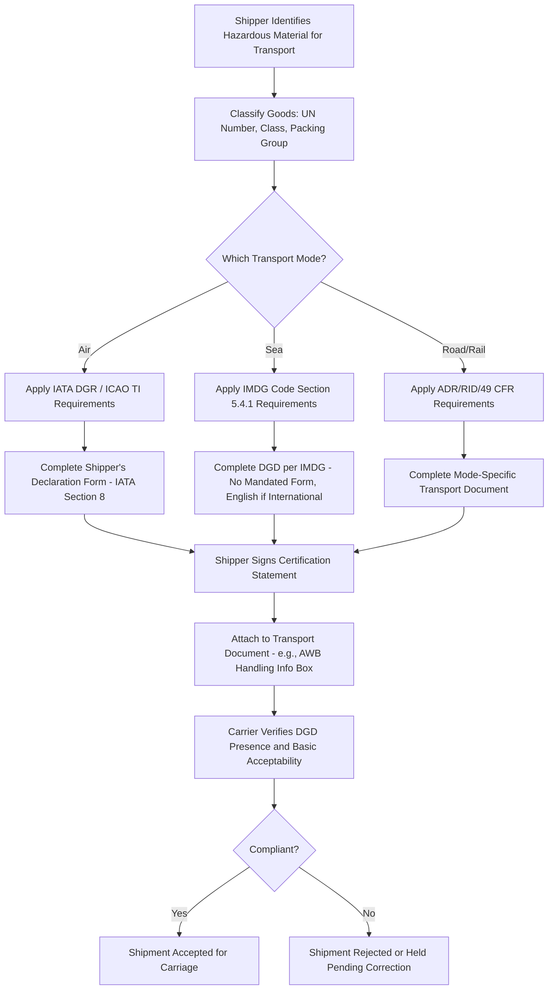

## Dangerous Goods Declarations

### Definition

A Dangerous Goods Declaration (DGD) is a legally mandated shipping document, completed and signed by the shipper (consignor), certifying that hazardous materials being transported have been correctly classified, packaged, marked, labeled, and are in proper condition for carriage according to the applicable mode-specific dangerous goods regulations. It functions as both a compliance certification and a critical safety communication tool for carriers, handlers, and emergency responders.

### Key Points

- **Mode-specific regulatory frameworks**: Regulations for dangerous goods vary depending on the mode of transport: air transport is governed by the IATA Dangerous Goods Regulations (DGR), sea transport is regulated by the International Maritime Dangerous Goods (IMDG) Code, and road and rail transport follow related guidelines. [credlix](https://blog.credlix.com/?p=15225)
- **Underlying international basis**: Air transport guidance is fully detailed in the ICAO Technical Instructions for the Safe Transport of Dangerous Goods by Air (Doc 9284), and states may apply this guidance through national regulations, giving it legal force; separately, consignors may need to certify cargo has been packed, labelled, and declared in accordance with IATA's Dangerous Goods Regulations. [digitalizetrade](https://www.digitalizetrade.org/ktdde/trade-documents/DGD)
- **Maritime declaration basis**: The IMDG Code requires a declaration from the consignor stating that the particular dangerous goods declared are identified, classified, packaged, marked, labeled and placarded correctly, along with a separate declaration from the person packing the container. [shippingsolutionssoftware](https://shippingsolutionssoftware.com/download-dangerous-goods-hazmat-forms)
- **No single mandatory form for sea shipments**: The information required for a maritime DGD is specified in IMDG Code section 5.4.1; there is no requirement for a special form, though a recommended form is commonly used, and if the transport is international, the DGD information must be in English. [transportstyrelsen](https://transportstyrelsen.se/en/shipping/Environmental-protection/Freight--Cargo/Bulk-Cargoes/DGD---Dangerous-Goods-Declaration)
- **Mandatory with limited exceptions**: A DGD is required for all hazardous shipments except for certain accepted quantities specified in IATA and IMDG guidelines, and shipping hazardous goods without a declaration is illegal, potentially resulting in fines or shipment rejection. [credlix](https://blog.credlix.com/?p=15225)
- **No true multimodal form**: The UN Recommendations on the Transport of Dangerous Goods: Model Regulations lay down provisions for required documentation across all transport modes, but IATA does not authorize use of multimodal forms permitted under those model regulations within its own Dangerous Goods Regulations — an exclusion that creates duplicated documentation requirements for multimodal shipments. [digitalizetrade](https://www.digitalizetrade.org/ktdde/trade-documents/DGD)
- **Electronic declarations increasingly accepted**: The declaration may be in hard copy or electronic form, and electronic data exchange is permitted to satisfy documentation requirements under certain road/rail frameworks, provided the data capture and storage process meets an evidentiary standard equivalent to paper documentation; a dedicated IATA electronic DGD (e-DGD) initiative was launched at the end of 2016. [digitalizetrade](https://www.digitalizetrade.org/ktdde/trade-documents/DGD)
- **Responsibility allocation**: The shipper (the party offering the goods for transport) is usually the primary party responsible for correctly classifying the goods and providing a correct DGD, though carriers must verify the DGD's presence and basic acceptability, and freight forwarders who help prepare or sign a DGD on the shipper's behalf must ensure its accuracy. [racklify](https://racklify.com/encyclopedia/the-dangerous-goods-declaration-your-legal-passport-for-hazardous-shipping/)

### Standard DGD Content Elements

| Element | Purpose |
| --- | --- |
| Shipper and consignee details | Full name and address of shipper and consignee, per IATA Section 8 requirements. |
| Transport document reference | Air waybill number for air cargo, or tracking number for small package shipments. |
| Proper shipping name, class, UN number | Identifies the specific hazardous material and its regulatory classification |
| Packing group and quantity | Specifies packaging category and quantity per package/container |
| Transport instructions and applicable regulation reference | References the applicable regulation (e.g., IMDG Code, IATA DGR, 49 CFR) and any special provisions or remarks. |
| Certification statement and signature | The shipper's declaration that the goods are properly classified, packed, marked, and labeled, along with name, date, and signature or an authorized electronic equivalent. |
| Emergency contact information | A 24/7 emergency phone number is mandatory for many transports and should not be omitted. |
| IMDG-specific stowage/segregation details | For sea shipments under the IMDG Code, specific details include stowage categories, marine pollutant information, and segregation groups. |

### Air Waybill Handling Notation Requirement

Air waybills accompanying dangerous goods consignments for which a dangerous goods declaration is required must include specific statements in the Handling Information box, such as "Dangerous goods as per attached Shipper's Declaration," and possibly "Cargo Aircraft Only" where applicable. Some airlines apply operational variations beyond the base DGR, which are always more restrictive than the DGR itself, and certain carriers maintain especially specific documentation requirements that shippers should be aware of. [shippingsolutionssoftware](https://shippingsolutionssoftware.com/download-dangerous-goods-hazmat-forms)[shippingsolutionssoftware](https://shippingsolutionssoftware.com/download-dangerous-goods-hazmat-forms)

### DGD Requirements by Mode Comparison

| Transport Mode | Governing Framework | Form Requirement |
| --- | --- | --- |
| Air | IATA DGR / ICAO TI — mandatory Shipper's Declaration following strict wording and quantity limits. | Standardized IATA form (Section 8) |
| Sea | IMDG Code — DGD required for most dangerous goods, with IMDG-specific stowage, marine pollutant, and segregation details. | No special mandated form; a recommended form is commonly used. |
| Road/Rail | ADR, RID, or 49 CFR for U.S. highway transport — similar data requirements adapted to land transport, including transport document and placarding rules. | Mode/jurisdiction-specific formats |

### DGD Preparation and Verification Flow

### Responsibility Allocation Diagram (svg_diagram)

<svg xmlns="http://www.w3.org/2000/svg" viewBox="0 0 800 260">
<text x="400" y="24" text-anchor="middle" font-size="16" font-weight="bold" fill="#1a1a1a">DGD Responsibility Allocation (svg_diagram)</text>
<rect x="60" y="60" width="220" height="90" rx="8" fill="#d6eaf8" stroke="#2980b9" stroke-width="2" />
<text x="170" y="85" text-anchor="middle" font-size="12" font-weight="bold" fill="#1a5276">Shipper / Consignor</text>
<text x="170" y="108" text-anchor="middle" font-size="10" fill="#1a5276">Primary responsibility:</text>
<text x="170" y="123" text-anchor="middle" font-size="10" fill="#1a5276">classification, accuracy,</text>
<text x="170" y="138" text-anchor="middle" font-size="10" fill="#1a5276">signature/certification</text>
<rect x="300" y="60" width="220" height="90" rx="8" fill="#d5f5e3" stroke="#27ae60" stroke-width="2" />
<text x="410" y="85" text-anchor="middle" font-size="12" font-weight="bold" fill="#1e8449">Freight Forwarder</text>
<text x="410" y="108" text-anchor="middle" font-size="10" fill="#1e8449">May prepare/review DGD,</text>
<text x="410" y="123" text-anchor="middle" font-size="10" fill="#1e8449">must ensure accuracy if</text>
<text x="410" y="138" text-anchor="middle" font-size="10" fill="#1e8449">signing on shipper's behalf</text>
<rect x="540" y="60" width="220" height="90" rx="8" fill="#fdebd0" stroke="#e67e22" stroke-width="2" />
<text x="650" y="85" text-anchor="middle" font-size="12" font-weight="bold" fill="#af601a">Carrier</text>
<text x="650" y="108" text-anchor="middle" font-size="10" fill="#af601a">Verifies DGD presence</text>
<text x="650" y="123" text-anchor="middle" font-size="10" fill="#af601a">and basic acceptability;</text>
<text x="650" y="138" text-anchor="middle" font-size="10" fill="#af601a">performs required checks</text>
</svg>

### Example

An exporter shipping lithium batteries by air from Singapore to Rotterdam must complete an IATA Shipper's Declaration for Dangerous Goods, entering the shipper's and consignee's full name and address, the air waybill number, and paging information (e.g., "Page 1 of 1 Pages"), along with applicable aircraft limitations. The accompanying air waybill must carry the required handling notation referencing the attached declaration. Only individuals trained in the applicable hazardous materials regulations are qualified to sign this document. If the same exporter instead ships the batteries by sea, a different DGD prepared under IMDG Code requirements would be needed — using no mandated form but including the information specified in IMDG section 5.4.1, in English for international transport — illustrating that a single hazardous shipment cannot rely on one universal multimodal declaration if its journey spans both modes. [Dangerous Goods Declaration (IATA) +2](https://www.ups.com/mx/en/support/shipping-support/shipping-special-care-regulated-items/hazardous-materials-guide/shippers-responsibilities/dangerous-goods-declaration)

### Common Pitfalls

- **Assuming one DGD covers all transport modes**: IATA does not authorize multimodal forms permitted under the UN Model Regulations within its own regulations, creating duplicated documentation requirements for shipments spanning multiple modes. [digitalizetrade](https://www.digitalizetrade.org/ktdde/trade-documents/DGD)
- **Overlooking small-quantity exceptions**: While a DGD is required for most hazardous shipments, certain quantities specified under IATA and IMDG guidelines may be exempt — misapplying this exception (or failing to verify it) can result in either unnecessary paperwork or unlawful under-declaration. [credlix](https://blog.credlix.com/?p=15225)
- **Unqualified personnel signing the declaration**: Only individuals specifically trained in the applicable hazardous materials regulations are qualified to sign a DGD; having an untrained employee sign is a compliance failure independent of the document's factual accuracy. [credlix](https://blog.credlix.com/?p=15225)
- **Missing emergency contact information**: A 24/7 emergency contact phone number is mandatory for many dangerous goods transports and is a commonly overlooked required element. [racklify](https://racklify.com/encyclopedia/the-dangerous-goods-declaration-your-legal-passport-for-hazardous-shipping/)
- **Failing to verify carrier-specific variations**: Some airlines apply operational variations to the base IATA DGR that are always more restrictive, and shippers who are unaware of a specific carrier's additional requirements risk non-compliant declarations. [shippingsolutionssoftware](https://shippingsolutionssoftware.com/download-dangerous-goods-hazmat-forms)
- **Incomplete container packing certification for sea freight**: Beyond the consignor's DGD, the IMDG Code also requires a separate declaration from the person who physically packed the container, confirming correct identification, classification, packaging, marking, labeling, and placarding — omitting this separate certification is a common gap. [shippingsolutionssoftware](https://shippingsolutionssoftware.com/download-dangerous-goods-hazmat-forms)

**Related Topics**

- IMDG Code Classification and Segregation Requirements
- IATA Dangerous Goods Regulations (DGR) and ICAO Technical Instructions
- Air Waybills and Multimodal Transport Documents
- Hazmat Placarding and Package Marking Requirements
- Commercial Invoice and Packing List
- Electronic Dangerous Goods Declarations (e-DGD)