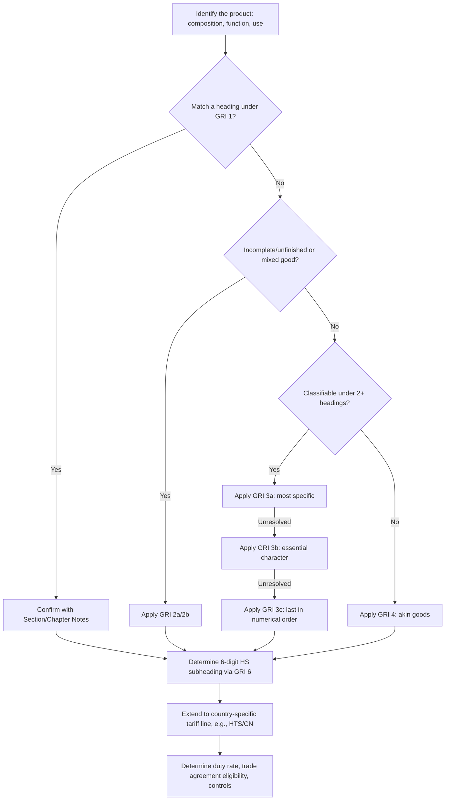

## Harmonized System Classification

### Overview

The Harmonized System (HS) is a standardized international nomenclature developed and maintained by the World Customs Organization (WCO) for classifying traded products. It provides a common numerical coding structure used by more than 200 countries and economies as the basis for customs tariffs, trade statistics, and regulatory controls. Correct HS classification determines duty rates, eligibility for trade agreement preferences, applicable non-tariff regulations (licensing, quotas, sanitary/phytosanitary rules), and admissibility at the border.

### Structure of the HS Code

The HS is organized hierarchically:

- **Sections (1–21)** — broad groupings (e.g., Section XI: Textiles and Textile Articles)
- **Chapters (2 digits)** — 99 chapters, each covering a product category (e.g., Chapter 84: Machinery)
- **Headings (4 digits)** — narrower groupings within a chapter (e.g., 84.71: Automatic data processing machines)
- **Subheadings (6 digits)** — the internationally harmonized level, identical across all WCO members (e.g., 8471.30)

Beyond the 6-digit level, individual countries extend the code for their own tariff and statistical purposes:

| Level | Digits | Example | Maintained by |
| --- | --- | --- | --- |
| HS Subheading | 6 | 8471.30 | WCO (international) |
| US HTS | 8 (+2 stat suffix = 10) | 8471.30.01.00 | USITC |
| EU Combined Nomenclature (CN) | 8 | 8471.30.00 | European Commission |
| EU TARIC | 10 | 8471.30.00.10 | European Commission |

Because only the first six digits are internationally standardized, the same product can carry different full codes depending on the importing country, even though the 6-digit "root" matches.

### General Rules of Interpretation (GRI)

Classification decisions follow six General Rules of Interpretation (GRI), applied in strict sequential order — a later rule is consulted only if an earlier rule fails to resolve the classification:

1. **GRI 1** — Classification is determined first by the terms of the headings and any relevant Section or Chapter Notes; section/chapter titles are for reference only and not legally binding.
2. **GRI 2(a)** — Incomplete or unfinished articles are classified as the finished article if they have the essential character of the complete item; unassembled/disassembled goods are classified as if assembled.
3. **GRI 2(b)** — Mixtures and combinations of a material with other substances are classified under the heading for that material or article, extended to cover such mixtures.
4. **GRI 3** — Governs goods prima facie classifiable under two or more headings:
   - **3(a)**: the most specific description prevails over a general one
   - **3(b)**: mixtures/composite goods are classified by the material or component giving essential character
   - **3(c)**: if neither applies, use the heading that occurs last in numerical order among those equally meriting consideration
5. **GRI 4** — Goods not classifiable under the above rules are classified under the heading appropriate to the goods to which they are most akin.
6. **GRI 5** — Rules for classification of cases, containers, and packing materials presented with the goods they contain.
7. **GRI 6** — Classification at the subheading level follows the same principles as GRI 1–5, applied *mutatis mutandis*, but only among subheadings at the same level.

**Key Points**

- GRI rules are applied in order; you do not skip to GRI 3 if GRI 1 already resolves the classification.
- Section and Chapter Notes are legally binding text, unlike titles, which are not.
- Essential character (used in GRI 2(a) and 3(b)) is a judgment based on factors such as bulk, quantity, weight, value, or the role of the material/component in relation to the use of the goods.

### Classification Workflow

### Example

**Item:** A laptop computer imported into the United States.

1. **Identify function:** Automatic data processing machine.
2. **Locate heading:** Chapter 84 (Machinery), Heading 84.71 covers "automatic data processing machines and units thereof."
3. **Apply GRI 1:** The heading text directly describes the product — no need to proceed to GRI 2 or 3.
4. **Subheading (GRI 6):** 8471.30 — "portable automatic data processing machines, weighing not more than 10 kg."
5. **US HTS extension:** 8471.30.01.00.
6. **Duty determination:** Under the US HTS, this line typically carries a Most Favored Nation (MFN) rate of Free, subject to change based on active trade remedies (e.g., Section 301 tariffs on China-origin goods). [Unverified — current rates should be checked against the live HTS schedule, as duty rates and trade remedy actions change frequently]

### Binding Rulings and Advance Classification

Many customs administrations offer a mechanism to obtain a legally binding classification decision in advance of importation:

- **United States**: CBP Binding Ruling (via the CROSS database or electronic ruling request), binding on all US ports for the importer who requested it.
- **European Union**: Binding Tariff Information (BTI), valid for 3 years, binding EU-wide.
- **WCO**: Publishes Explanatory Notes and Compendium of Classification Opinions to promote international consistency, though these are advisory rather than binding on individual customs authorities.

Binding rulings reduce classification risk, support customs valuation and duty planning, and provide a defensible position in the event of an audit.

### Consequences of Misclassification

- **Underpayment of duties** — can trigger penalties, interest, and retroactive duty demands (e.g., under 19 U.S.C. § 1592 in the US, based on the degree of culpability: negligence, gross negligence, or fraud).
- **Overpayment of duties** — generally recoverable but often only within a limited protest/reliquidation window (e.g., 180 days under US CBP protest procedures).
- **Regulatory non-compliance** — incorrect classification can bypass required licenses, quotas, or admissibility checks (e.g., FDA, USDA, EPA, ITAR/EAR controls in the US).
- **Loss of trade agreement eligibility** — HS classification is a prerequisite for determining rules-of-origin qualification under FTAs (e.g., USMCA, EU FTAs).

### Tools and Resources

- **WCO Explanatory Notes** — the authoritative interpretive guide to HS headings and subheadings.
- **National tariff databases** — e.g., USITC HTS Search, EU TARIC Consultation, UK Trade Tariff.
- **Classification software/AI tools** — increasingly used for first-pass suggestions, though final determinations typically require expert or customs broker review given the legal and financial consequences of error. [Inference — the degree of reliance on automated classification tools varies significantly by industry and company risk tolerance]

**Next Steps**

- Rules of Origin and Preferential Trade Agreements
- Customs Valuation Methods (Transaction Value, Deductive Value, Computed Value)
- Section 301 / Section 232 Tariff Actions and Exclusion Processes
- Free Trade Zones and Bonded Warehouses
- Import Compliance Programs and Reasonable Care Standards