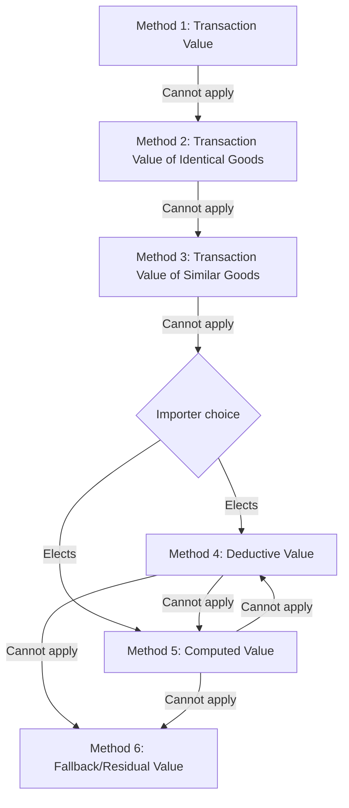

## Customs Valuation Methods

### Overview

Customs valuation is the process of determining the monetary value of imported goods for the purpose of assessing ad valorem duties, taxes, and statistical reporting. The dominant international framework is the WTO Customs Valuation Agreement (formally the Agreement on Implementation of Article VII of GATT 1994), which establishes six sequential valuation methods. Most national customs regimes (US, EU, and WCO members generally) implement this framework with only minor procedural variation.

### The Six Valuation Methods (WTO Hierarchy)

The methods must be applied in strict sequential order — a method is used only if the preceding method cannot be applied to the goods in question.

**Key Points**

- Methods 4 and 5 may be applied in either order at the importer's request (a reversal of the strict WTO sequence, per Article 4 of the Agreement).
- Method 6 is a "fallback" that applies flexible, reasonable means consistent with the principles of Methods 1–5, but explicitly prohibits arbitrary or fictitious values.

### Method 1: Transaction Value

The primary and most commonly used method — the price actually paid or payable for the goods when sold for export to the country of importation, adjusted per specified additions and exclusions.

**Statutory additions to price paid/payable:**

- Commissions and brokerage (except buying commissions)
- Cost of containers and packing
- Value of "assists" (materials, tools, dies, engineering, design work supplied by the buyer free or at reduced cost)
- Royalties and license fees related to the goods that the buyer must pay as a condition of sale
- Proceeds of subsequent resale, disposal, or use accruing to the seller

**Exclusions (if separately identified):**

- International freight and insurance (under FOB-based systems like the US; the EU/most others use CIF-based valuation, which includes freight and insurance)
- Post-importation construction, erection, assembly, maintenance charges
- Duties and taxes of the importing country

**Conditions for use** — Transaction Value cannot be used when:

1. Restrictions exist on the disposition or use of the goods (with limited exceptions)
2. The sale or price is subject to a condition/consideration for which a value cannot be determined
3. Proceeds of resale accrue to the seller and cannot be adjusted
4. Buyer and seller are related, *unless* the relationship did not influence the price (tested via the circumstances-of-sale test or a "test value" comparison)

**Related-party test values** — when parties are related, the transaction value is acceptable if it closely approximates one of:

- Transaction value of identical/similar goods in sales to unrelated buyers
- Deductive value or computed value for identical/similar goods

### Method 2: Transaction Value of Identical Goods

Used when Method 1 is unavailable. Requires the transaction value of goods that are identical in all respects — same physical characteristics, quality, and reputation, produced in the same country, and (generally) by the same producer — sold for export to the same country at or about the same time.

### Method 3: Transaction Value of Similar Goods

Applied when identical goods are unavailable. "Similar" goods share like characteristics and component materials, perform the same functions, and are commercially interchangeable, though not identical.

**Key Points (Methods 2 & 3)**

- Adjustments are required for differences in commercial level, quantity, and transport distance/mode.
- If multiple transaction values qualify, the *lowest* value is used.

### Method 4: Deductive Value

Based on the resale price of the imported goods (or identical/similar goods) in the importing country, working backward to an import value. Formula:

$$V_{deductive} = P_{unit\ resale} - (Commissions + Profit\ and\ General\ Expenses + Transport/Insurance\ post\text{-}import + Duties/Taxes)$$

The unit price used is generally the price in the greatest aggregate quantity sold to unrelated persons at or about the time of importation (with defined time windows if no sales occur at that time, up to 90 days after importation in the US).

### Method 5: Computed Value

A "build-up" approach based on the cost of production, computed from:

- Cost of materials and fabrication/processing
- An amount for profit and general expenses (usually reflecting the producer's normal practice for goods of the same class or kind)
- Cost of assists, packing, and any other additions applicable under Method 1

This method requires cooperation from the foreign producer to disclose cost data, making it comparatively rare in practice due to confidentiality constraints. [Inference — practical usage frequency is not formally published by most customs authorities but is widely reported as low relative to Method 1]

### Method 6: Fallback (Residual) Value

Applied when none of Methods 1–5 can be used. Uses reasonable means consistent with the general principles of the Agreement and Article VII of GATT, based on data available in the country of importation. Explicitly **prohibited** bases include:

- Selling price in the importing country of goods produced domestically
- A system allowing the higher of two alternative values
- Price of goods in the domestic market of the exporting country
- Cost of production other than computed values determined for identical/similar goods
- Price for export to a third country
- Minimum customs values
- Arbitrary or fictitious values

### Comparative Summary

| Method | Basis | Typical Use Frequency |
| --- | --- | --- |
| 1. Transaction Value | Price paid/payable, adjusted | Very high (majority of imports) |
| 2. Identical Goods | Comparable transaction values | Low |
| 3. Similar Goods | Comparable transaction values | Low |
| 4. Deductive Value | Resale price, worked backward | Moderate (related-party imports, no sale) |
| 5. Computed Value | Cost-based build-up | Low |
| 6. Fallback | Reasonable means, flexible application of 1–5 | Rare |

### Example

A US importer buys machinery from a related foreign manufacturer for $50,000. The importer also separately paid $3,000 for tooling ("assists") supplied to the manufacturer and owes a $2,000 royalty to the manufacturer as a condition of sale.

1. **Test relationship:** Confirm whether the related-party relationship influenced the price (circumstances-of-sale or test-value analysis).
2. **If Transaction Value applies:**

$$V_{customs} = 50{,}000 + 3{,}000 + 2{,}000 = 55{,}000$$

3. **If Transaction Value cannot be used** (relationship influenced price, test values unavailable), proceed to Method 2 (identical goods), then Method 3, then importer's choice of Method 4 or 5.

### Consequences of Valuation Errors

- **Underdeclaration** — exposes the importer to back duties, interest, and civil/criminal penalties depending on culpability (negligence, gross negligence, fraud).
- **Overdeclaration** — overpayment of duty, generally recoverable through protest/reliquidation within statutory deadlines.
- **Related-party audits** — a frequent customs enforcement focus, since transfer pricing between affiliates can diverge from arm's-length customs value; transfer pricing studies for tax purposes do not automatically satisfy customs valuation requirements. [Unverified — the degree of alignment required between tax transfer pricing and customs valuation varies by jurisdiction and is an active area of policy discussion]

**Related Topics**

- Harmonized System Classification
- Rules of Origin and Preferential Trade Agreements
- Related-Party Transactions and Transfer Pricing in Customs Valuation
- First Sale for Export Valuation Rule
- Customs Bonds and Post-Entry Amendments (e.g., US Reconciliation Program)