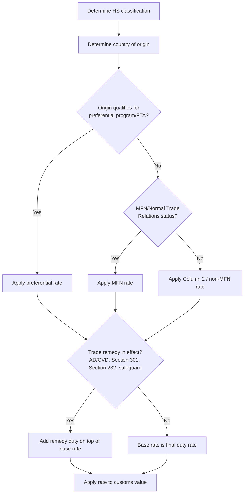

## Duties, Tariffs, and Import Taxes

### Overview

Duties, tariffs, and import taxes are charges levied by a government on goods crossing its customs border. While the terms are often used interchangeably in casual usage, they represent distinct legal instruments with different bases, purposes, and calculation methods. These charges serve revenue-generation, protectionist, and trade-policy objectives, and their correct calculation depends directly on two upstream determinations: HS classification and customs valuation.

### Terminology Distinctions

- **Duty** — a tax specifically imposed on imported (or occasionally exported) goods, assessed under a country's tariff schedule.
- **Tariff** — often used synonymously with duty, but more precisely refers to the schedule or rate structure itself (e.g., "the US HTS tariff schedule"); also used to describe trade-policy actions (e.g., "Section 301 tariffs").
- **Import tax** — a broader category that can include duties as well as other border taxes such as VAT, GST, excise taxes, and processing fees, which may apply in addition to duty.

### Duty Rate Structures

| Type | Basis | Example |
| --- | --- | --- |
| **Ad valorem** | Percentage of customs value | 5% of $10,000 = $500 |
| **Specific** | Fixed amount per unit of quantity | $0.50 per kg |
| **Compound** | Combination of ad valorem + specific | 3% + $0.20/unit |
| **Tariff-rate quota (TRQ)** | Lower rate within a quota volume, higher rate above it | 2% up to 10,000 MT, 15% thereafter |

$$Duty_{ad\ valorem} = V_{customs} \times r$$

where $V_{customs}$ is the customs value (per the applicable valuation method) and $r$ is the applicable ad valorem rate.

### Duty Rate Determination

### Categories of Import Charges

**1. Normal/Base Tariff Rates**

- **MFN (Most Favored Nation)** rate — the standard rate a WTO member applies to imports from other WTO members absent a preferential agreement; referred to as the "Normal Trade Relations" (NTR) rate in the US.
- **Preferential rates** — reduced or zero rates under free trade agreements (e.g., USMCA, EU-Japan EPA) or unilateral preference programs (e.g., GSP, AGOA), contingent on the goods meeting rules-of-origin requirements.
- **Column 2 / non-MFN rates** — higher statutory rates applied to countries without normal trade relations status (rare; e.g., historically applied to specific sanctioned countries).

**2. Trade Remedy Duties** (additional to base rate)

- **Antidumping duties (AD)** — imposed when foreign goods are sold in the importing market below fair value (normal value in the home market), causing or threatening material injury to domestic industry.
- **Countervailing duties (CVD)** — imposed to offset foreign government subsidies that unfairly benefit exporters.
- **Safeguard duties** — temporary measures to protect domestic industry from a surge in imports, applied regardless of unfair trade practice (WTO Agreement on Safeguards, Section 201 in the US).
- **Section 301 duties (US)** — imposed in response to unfair trade practices by a foreign government (notably used against China-origin goods since 2018).
- **Section 232 duties (US)** — imposed on national security grounds (notably steel and aluminum).

**3. Other Border Taxes**

- **Value Added Tax (VAT) / Goods and Services Tax (GST)** — consumption tax applied at import, typically calculated on customs value plus duty (common in the EU, UK, Canada, and most non-US jurisdictions).
- **Excise taxes** — targeted taxes on specific goods (alcohol, tobacco, fuel) regardless of origin.
- **Merchandise Processing Fee (MPF) / Harbor Maintenance Fee (HMF)** — US-specific administrative fees, generally ad valorem with caps/floors, unrelated to the tariff rate itself.

### Calculation Example (Compound Charges)

Importing $20,000 worth of goods into the EU, HS code carries a 4% MFN duty rate, subject to a 15% antidumping duty (on the same base), plus 20% VAT.

$$Duty_{MFN} = 20{,}000 \times 0.04 = 800$$

$$Duty_{AD} = 20{,}000 \times 0.15 = 3{,}000$$

$$V_{VAT\ base} = 20{,}000 + 800 + 3{,}000 = 23{,}800$$

$$VAT = 23{,}800 \times 0.20 = 4{,}760$$

$$Total\ landed\ duty/tax = 800 + 3{,}000 + 4{,}760 = 8{,}560$$

**Key Points**

- VAT/GST is typically calculated on a base that already includes duty — duty is not simply additive with VAT in isolation.
- Trade remedy duties (AD/CVD, Section 301/232) generally stack on top of, rather than replace, the base MFN or preferential rate.
- The specific stacking order and VAT base calculation vary by jurisdiction; the example above reflects the general EU approach. [Unverified — exact base calculation rules should be confirmed against the specific importing country's current regulations]

### Duty Mitigation Strategies

- **Free Trade Agreement qualification** — structuring sourcing/production to meet rules-of-origin thresholds for preferential rates.
- **Tariff engineering** — legally designing or modifying a product so it falls under a more favorable HS classification (must reflect genuine product characteristics, not artificial circumvention).
- **First Sale for Export** — using the price in an earlier sale in a multi-tiered transaction as the customs value basis, where legally permitted.
- **Duty drawback** — refund of duties paid on imported goods that are subsequently exported or destroyed.
- **Foreign Trade Zones (FTZs) / Bonded warehouses** — deferral or elimination of duty on goods stored, processed, or re-exported without entering domestic commerce.
- **Section 301/232 exclusion requests** — formal petitions for product-specific exemptions from certain trade remedy duties, where an exclusion process is open.

### Consequences of Non-Payment or Misdeclaration

- **Penalties** scaled to culpability level (negligence, gross negligence, fraud), often as a multiple of the duty loss.
- **Liquidated damages** against customs bonds for procedural violations.
- **Seizure and forfeiture** of goods in serious cases.
- **Loss of trusted trader status** (e.g., removal from CTPAT/AEO programs), increasing future inspection rates.

**Next Steps**

- Rules of Origin and Preferential Trade Agreements
- Antidumping and Countervailing Duty Investigations
- Duty Drawback Programs
- Foreign Trade Zones and Bonded Warehouses
- Trusted Trader Programs (CTPAT, AEO)