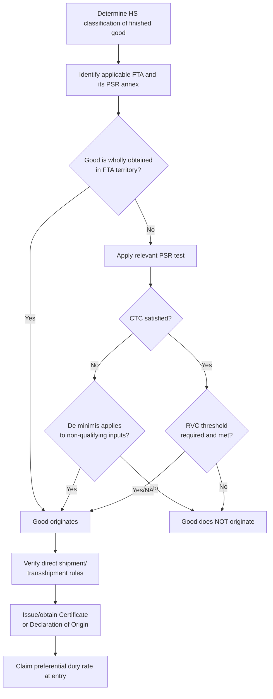

## Free Trade Agreements and Rules of Origin

### Overview

Free Trade Agreements (FTAs) are treaties between two or more countries that reduce or eliminate tariffs and other trade barriers on qualifying goods traded between them. The right to claim a preferential (reduced/zero) duty rate under an FTA is never automatic — it depends entirely on satisfying that agreement's **rules of origin (RoO)**, which determine whether a good is legally considered as "originating" in a party to the agreement. Origin is conceptually distinct from HS classification and customs valuation, though all three interact directly in duty calculation.

### Why Rules of Origin Exist

Without rules of origin, an FTA would create "trade deflection" — goods from a non-member country could be transshipped through a low-tariff FTA member to reach a high-tariff member duty-free. RoO close this loophole by defining the minimum degree of local production, processing, or value-add required for a good to earn preferential treatment.

### Categories of Rules of Origin

**1. Wholly Obtained (WO)**

Goods entirely grown, harvested, mined, or produced in a single country with no imported inputs (e.g., minerals extracted domestically, live animals born and raised domestically, fish caught by domestically flagged vessels).

**2. Substantial Transformation**

Applied to goods made from materials originating in more than one country. A good "originates" if non-originating materials undergo sufficient processing to be considered a new and different article. Substantial transformation is typically tested via one or more of:

- **Change in Tariff Classification (CTC)** — non-originating inputs must shift to a different HS heading/subheading/chapter than the finished good, per a product-specific rule (PSR) list (e.g., "change from any heading outside 84.71").
- **Regional Value Content (RVC)** — a minimum percentage of the good's value must originate within the FTA region, calculated via:

$$RVC_{build\text{-}up} = \frac{V_{originating}}{V_{good}} \times 100$$

$$RVC_{build\text{-}down} = \frac{V_{good} - V_{non\text{-}originating}}{V_{good}} \times 100$$

where $V_{good}$ is typically the adjusted transaction value or net cost of the finished good.

- **Specific manufacturing/processing operation** — certain products require a defined technical process to occur within the region (e.g., "dyed and printed" for certain textiles), regardless of tariff shift or value content.

**3. De Minimis**

Allows a small percentage (commonly 7–10%) of non-originating material value that fails the CTC test to be disregarded, provided the good otherwise qualifies.

**Key Points**

- Each FTA has its own Product-Specific Rules (PSR) annex — a rule that qualifies a good under USMCA does not automatically qualify the same good under, say, the EU-Korea FTA.
- Multiple test methods may be layered: some PSRs require CTC *and* RVC to be satisfied simultaneously.

### Qualification Workflow

### Certification and Documentation

- **Certificate of Origin (CO)** — traditional format issued by a chamber of commerce or authorized body (used in many legacy FTAs).
- **Self-certification** — increasingly common in modern FTAs (e.g., USMCA), where the importer, exporter, or producer certifies origin directly without third-party issuance, based on a defined minimum data set.
- **Advance rulings** — many customs authorities allow importers to request a binding origin determination before importation, similar to binding classification rulings.
- **Record-keeping** — exporters/producers must retain supporting documentation (bills of materials, supplier declarations, production records) for a defined retention period (commonly 5 years), as origin claims are subject to post-entry verification/audit.

### Direct Shipment / Transshipment Rules

Most FTAs require that originating goods move directly from the exporting party to the importing party, or that any transit through a non-party does not involve further processing beyond activities like unloading, reloading, storage, or splitting shipments — otherwise originating status can be lost.

### Example: USMCA Automotive Rule (Illustrative)

Passenger vehicles under USMCA require, among other conditions:

- A minimum Regional Value Content (RVC), calculated via the net cost method, generally in the 75% range for core parts by the agreement's phase-in schedule.
- A minimum percentage of steel and aluminum purchases sourced from North America.
- A Labor Value Content (LVC) requirement tied to production wages.

$$RVC_{net\ cost} = \frac{NC - VNM}{NC} \times 100$$

where $NC$ is net cost of the vehicle and $VNM$ is the value of non-originating materials.

[Unverified — exact current USMCA automotive RVC/LVC percentages and phase-in schedules should be confirmed against the current agreement text, as thresholds were subject to a multi-year phase-in and periodic review]

### Major FTA and Preference Program Examples

| Agreement/Program | Parties | Primary Origin Test |
| --- | --- | --- |
| USMCA | US, Canada, Mexico | CTC + RVC (net cost or transaction value) |
| EU FTAs (general pattern) | EU + partner country | CTC, with RVC or specific process alternatives |
| ASEAN Trade in Goods Agreement | ASEAN members | RVC (40%) or CTC |
| GSP (Generalized System of Preferences) | Unilateral, US/EU/others to developing countries | Substantial transformation + minimum value-add |
| AGOA | US to eligible Sub-Saharan African countries | Substantial transformation, special textile rules |

### Consequences of Improper Origin Claims

- **Denial of preferential treatment** and retroactive assessment of the full MFN/normal duty rate plus interest.
- **Penalties** for false certification, scaled by culpability (negligence through fraud), similar to classification and valuation violations.
- **Verification audits/origin verifications** — many FTAs empower the importing customs authority to directly verify a claim with the foreign producer/exporter, sometimes resulting in on-site visits.
- **Supply chain disruption** — loss of preferential status can retroactively affect downstream customers relying on origin certifications for their own products (relevant in tiered/nested RVC calculations).

**Related Topics**

- Harmonized System Classification
- Customs Valuation Methods
- Duties, Tariffs, and Import Taxes
- Antidumping and Countervailing Duty Investigations
- Duty Drawback Programs
- Certificates of Origin and Self-Certification Systems