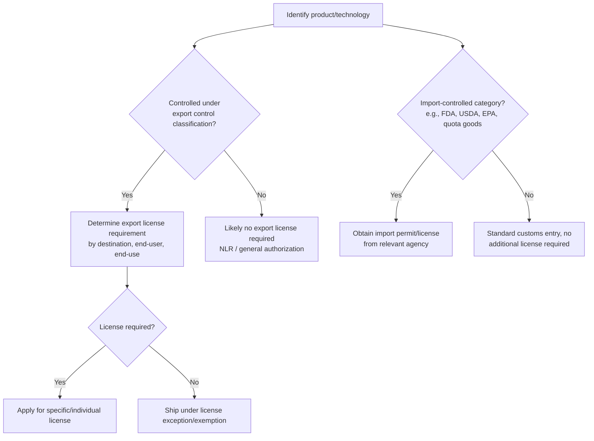
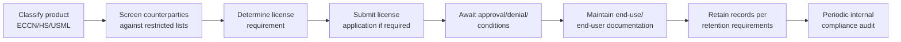

## Import and Export Licensing

### Overview

Import and export licensing refers to the regulatory authorizations required to legally move certain goods, technologies, or services across a customs border, separate from and in addition to standard customs duty payment. Licensing requirements are typically tied to the nature of the product (dual-use, military, controlled substances), its destination or end-user, or broader policy objectives (national security, public health, environmental protection, sanctions compliance). Unlike duty payment, a missing or invalid license generally makes a shipment inadmissible entirely, regardless of willingness to pay duty.

### Why Licensing Exists (Policy Bases)

- **National security** — controls on military and dual-use items (civilian goods with potential military application).
- **Foreign policy / sanctions** — restrictions tied to specific countries, entities, or individuals.
- **Non-proliferation** — controls on items related to nuclear, chemical, biological weapons, and missile technology.
- **Public health and safety** — pharmaceuticals, food, medical devices, hazardous chemicals.
- **Environmental protection** — endangered species (CITES), ozone-depleting substances, hazardous waste (Basel Convention).
- **Economic/market protection** — quota administration, protection of domestic industries (e.g., steel import licensing regimes in some countries).

### Licensing Regime Categories

### Export Licensing Frameworks (Illustrative — US-Centric)

**Export Administration Regulations (EAR)** — administered by the US Department of Commerce Bureau of Industry and Security (BIS); governs "dual-use" items with both civilian and potential military application.

- **Commerce Control List (CCL)** — classifies items by **Export Control Classification Number (ECCN)**.
- **Country Chart** — cross-references ECCN reason for control against destination country to determine license requirements.
- **EAR99** — a catch-all classification for items not specifically listed on the CCL; generally exportable without a license to most destinations, subject to end-use/end-user and embargo restrictions.
- **License exceptions** — defined circumstances (e.g., temporary exports, servicing, certain encryption items) permitting export without an individual license despite an otherwise-applicable control.

**International Traffic in Arms Regulations (ITAR)** — administered by the US Department of State Directorate of Defense Trade Controls (DDTC); governs defense articles and services on the **US Munitions List (USML)**. ITAR is generally more restrictive than EAR, with narrower exemptions and mandatory registration for manufacturers/exporters of controlled defense articles.

**Key Points**

- A single item may require review under both frameworks; jurisdiction (EAR vs. ITAR) must be determined first via a **commodity jurisdiction** request where ambiguous.
- Restricted party screening (checking counterparties against denied/restricted/sanctioned party lists) is a mandatory compliance step independent of ECCN/USML classification.

### Import Licensing Examples by Agency Type (Illustrative — US-Centric)

| Category | Example agency | Typical requirement |
| --- | --- | --- |
| Food, drugs, cosmetics | FDA | Prior notice, registration, import permits |
| Agricultural products, plants, animals | USDA/APHIS | Import permits, phytosanitary certificates |
| Chemicals, pesticides | EPA | TSCA certification, pesticide registration |
| Firearms, ammunition | ATF | Import permits |
| Wildlife and wildlife products | Fish & Wildlife Service | CITES permits, declarations |
| Textiles under quota | Commerce/CBP | Visa or quota charge documentation |
| Steel and aluminum | Commerce (Section 232 monitoring) | Import license/monitoring system registration |

[Inference — this table illustrates a representative but non-exhaustive set of US agency licensing touchpoints; actual agency jurisdiction should be confirmed per product against current regulations, as agency roles and specific requirements are subject to change]

### Sanctions and Restricted/Denied Party Screening

Export and import transactions must be screened against government-maintained lists identifying prohibited or restricted counterparties, such as:

- Denied Persons List, Entity List, Unverified List (BIS)
- Specially Designated Nationals (SDN) List (Office of Foreign Assets Control, OFAC)
- Debarred List (DDTC)

A transaction with a listed party, a comprehensively sanctioned country/region, or a prohibited end-use (e.g., nuclear proliferation) can be prohibited even when the item itself is not otherwise controlled — this is often described as a "catch-all" or "knowledge" provision.

### License Application and Compliance Process

### Example

A US company wants to export a specialized encryption-enabled networking device to a distributor in a non-embargoed country.

1. **Classify** the item under the EAR — determine the ECCN (e.g., a 5A002 classification for certain encryption items).
2. **Consult the Country Chart** — cross-reference the ECCN's reasons for control (e.g., National Security, Encryption) against the destination country.
3. **Screen the distributor** against denied/restricted/SDN party lists.
4. **Determine license need** — if the Country Chart indicates a license is required for that destination/reason combination and no license exception applies, submit a license application to BIS.
5. **Obtain end-use statement** from the distributor confirming the product will not be re-exported to a prohibited destination or used for a prohibited purpose.
6. **Retain records** of classification, screening, and license documentation for the required retention period.

### Consequences of Licensing Violations

- **Civil penalties** — substantial monetary fines per violation, assessed by the enforcing agency (e.g., BIS, OFAC, DDTC).
- **Criminal penalties** — for willful violations, including potential imprisonment for responsible individuals.
- **Loss of export privileges** — denial orders barring a company or individual from participating in future export transactions.
- **Debarment** — exclusion from government contracting and, for ITAR violations, from future defense trade.
- **Reputational and supply chain impact** — restricted/denied party status can cascade to business partners who transacted with the violator.

[Unverified — specific penalty amounts and thresholds change periodically via regulatory updates and should be confirmed against current agency guidance]

**Next Steps**

- Restricted Party Screening and Sanctions Compliance Programs
- Export Control Classification (ECCN) Determination Process
- Antidumping and Countervailing Duty Investigations
- Trusted Trader Programs (CTPAT, AEO)
- Free Trade Zones and Bonded Warehouses