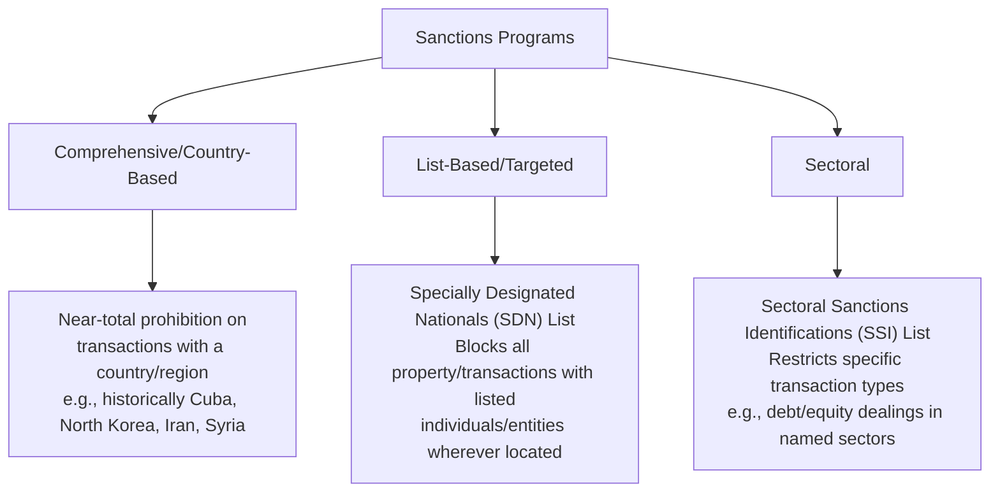
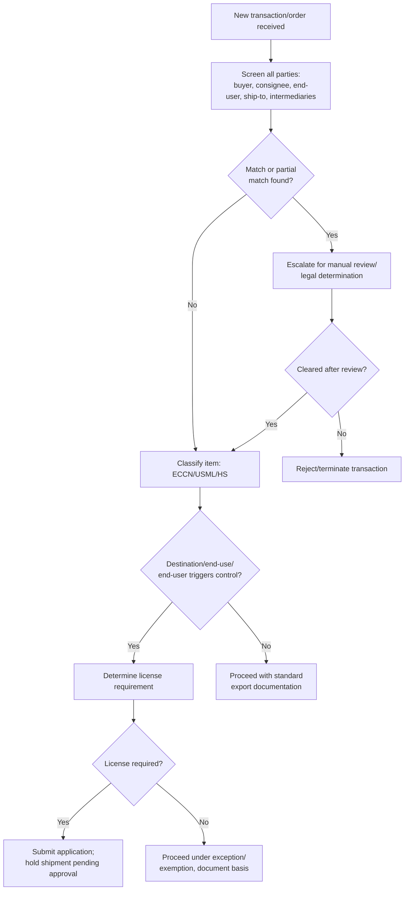

## Export Controls and Trade Sanctions

### Overview

Export controls and trade sanctions are regulatory regimes that restrict or prohibit specific cross-border transactions — the transfer of goods, technology, software, services, or funds — based on the item involved, the destination, the end-user, the end-use, or broader foreign policy objectives. While closely related to import/export licensing, this topic focuses specifically on the two major regulatory pillars: **export controls** (item/technology-based restrictions) and **sanctions** (country/party-based restrictions), including the compliance infrastructure required to manage them.

### Export Controls vs. Sanctions — Conceptual Distinction

| Dimension | Export Controls | Trade Sanctions |
| --- | --- | --- |
| Primary trigger | Nature of the item/technology | Identity of the country, entity, or individual |
| Administering bodies (US) | BIS (EAR), DDTC (ITAR) | OFAC (Treasury), supplemented by BIS/State |
| Typical scope | Dual-use and defense items, regardless of destination in many cases | Broad transaction bans (goods, services, financial dealings) tied to a target |
| Legal basis (US) | Export Control Reform Act, Arms Export Control Act | International Emergency Economic Powers Act (IEEPA), Trading with the Enemy Act |

In practice, the two regimes overlap heavily — a transaction can simultaneously require an export license (item-based) and be prohibited by sanctions (party-based).

### Sanctions Program Types

**Key Points**

- Comprehensive sanctions generally require a specific license (general or specific) to engage in any otherwise-prohibited activity with the target country.
- The "50% Rule" (OFAC guidance) extends blocked status to entities owned 50% or more, in aggregate, by one or more blocked persons — even if the entity itself is not separately listed.
- Sectoral sanctions are narrower than comprehensive sanctions — they restrict defined transaction types (e.g., new debt with maturity beyond a threshold) rather than all dealings.

### Screening and Compliance Infrastructure

An effective export control/sanctions compliance program typically includes:

1. **Restricted/Denied Party Screening (RPS/DPS)** — automated screening of customers, suppliers, freight forwarders, and other counterparties against government watchlists (SDN, Entity List, Denied Persons List, Debarred List, and country-specific equivalents in other jurisdictions such as the EU Consolidated List, UK Sanctions List, UN Security Council lists).
2. **Classification determination** — ECCN (EAR) or USML category (ITAR) assignment for each product/technology.
3. **End-use and end-user due diligence** — evaluating "red flags" such as reluctance to provide end-use information, unusual shipping routes, or a buyer's business inconsistent with the product's typical use.
4. **License determination and application** — where required, based on the classification/destination/end-user matrix.
5. **Recordkeeping** — retention of classification, screening, and transaction records for the applicable statutory period (commonly 5 years under US regimes).
6. **Voluntary self-disclosure (VSD)** — a formal mechanism to proactively report discovered violations to the relevant agency, generally resulting in more favorable penalty treatment than if the violation is discovered independently by the agency.

### Compliance Workflow

### Extraterritorial Reach

Certain control regimes apply beyond the territory of the issuing country:

- **Re-export controls (EAR)** — items subject to the EAR can require a license for re-export from a third country to another destination, and in some cases for re-export of foreign-made items incorporating a threshold percentage of controlled US-origin content (the **de minimis rule**) or produced using certain US-origin technology/software (the **Foreign Direct Product Rule**, notably expanded in recent years for certain semiconductor and advanced computing controls).
- **US person restrictions** — sanctions and ITAR obligations can apply to US citizens/permanent residents regardless of physical location, and to non-US entities employing or engaging US persons in controlled activities.

[Unverified — the precise current scope of Foreign Direct Product Rule expansions and de minimis thresholds should be confirmed against current BIS regulations, as these provisions have been subject to frequent revision in response to evolving policy priorities]

### Example

A US-based electronics manufacturer receives a purchase order from a distributor in a third country for a networking component with dual-use application.

1. **Screen** the distributor and named end-user against SDN, Entity List, and other applicable lists — no match found.
2. **Classify** the component under the EAR; determine its ECCN and reasons for control (e.g., National Security).
3. **Check the Country Chart** for the destination country against that ECCN's reasons for control — license required.
4. **Red-flag review** — the shipping address is a freight forwarder rather than the named end-user's facility, and the order quantity is inconsistent with the distributor's stated business; this triggers enhanced due diligence per BIS "Know Your Customer" guidance.
5. **Resolution** — obtain a documented end-use statement and, if red flags cannot be resolved, decline the transaction or file an application with BIS disclosing the concerns.

### Consequences of Violations

- **Civil monetary penalties** — assessed per violation, which can compound quickly across multiple shipments/transactions.
- **Criminal penalties** — for willful or knowing violations, including imprisonment for responsible individuals and substantial corporate fines.
- **Denial orders** — temporary or permanent loss of export privileges.
- **Designation risk** — in severe cases, a company itself can be added to a restricted/denied party list, effectively cutting it off from further US-regulated trade.
- **Secondary sanctions exposure** — non-US entities can face US sanctions consequences for engaging in significant transactions with sanctioned parties, even without direct US nexus, under certain sanctions programs.

**Related Topics**

- Import and Export Licensing
- Antidumping and Countervailing Duty Investigations
- Trusted Trader Programs (CTPAT, AEO)
- Free Trade Agreements and Rules of Origin
- Restricted Party Screening Systems and Red Flag Indicators