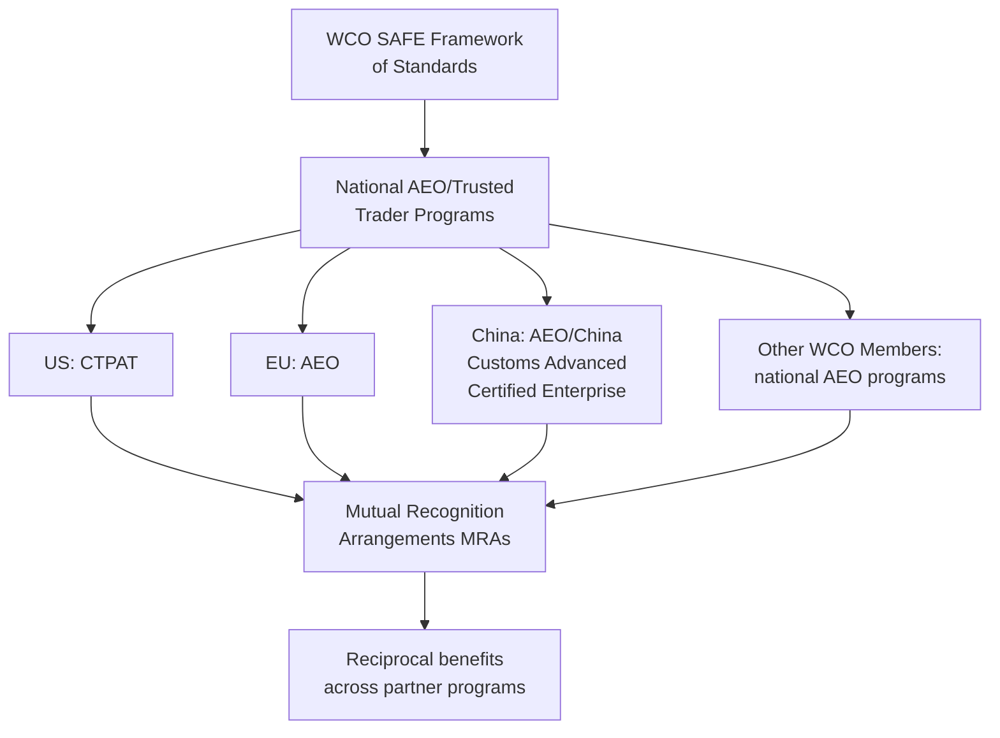
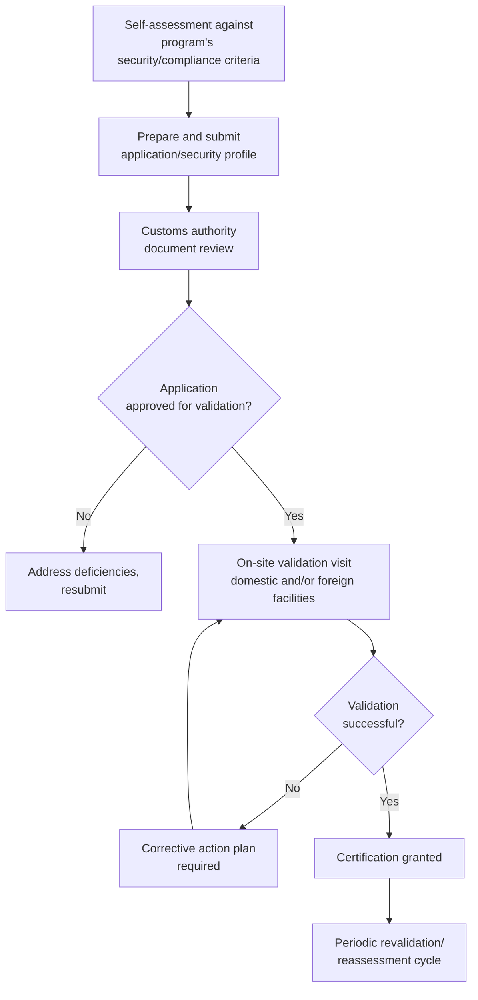

## Authorized Economic Operator Programs

### Overview

Authorized Economic Operator (AEO) programs are voluntary customs-business partnership frameworks in which an economic operator (importer, exporter, customs broker, carrier, warehouse operator, or other supply chain participant) undergoes a security and/or compliance review by customs authorities in exchange for defined trade facilitation benefits. AEO programs originated from the World Customs Organization's **SAFE Framework of Standards to Secure and Facilitate Global Trade** (2005), which most WCO members have implemented through national programs. The concept is the international generalization of what is known in the United States as **CTPAT** (Customs-Trade Partnership Against Terrorism).

### Origins and Policy Rationale

AEO programs emerged from a post-9/11 shift in customs philosophy: rather than relying solely on border inspection to manage risk, customs authorities extend trusted-trader status to companies that proactively secure their supply chains and demonstrate compliance reliability, allowing enforcement resources to concentrate on higher-risk shipments.

### Core Pillars of AEO/CTPAT Certification

Applicants must demonstrate and document security practices across the supply chain, typically covering:

- **Business partner requirements** — screening and requiring security commitments from suppliers, vendors, and service providers.
- **Container/conveyance security** — seal integrity, inspection procedures (e.g., the "seven-point inspection" concept common in container security), and tracking.
- **Physical security** — facility access controls, fencing, lighting, surveillance.
- **Personnel security** — background screening, access authorization procedures.
- **Procedural security** — documentation controls, manifest accuracy, cargo discrepancy reporting.
- **Information technology (IT) security** — access controls, password protocols, system security to prevent unauthorized manipulation of trade data.
- **Security training and threat awareness** — employee training programs covering security procedures and threat recognition.
- **Cybersecurity** — increasingly formalized as a distinct pillar in updated program iterations. [Inference — the specific weighting and structure of pillars vary by program version and jurisdiction and are periodically revised]

### AEO Certification Tiers (Illustrative — EU/General Pattern)

Many AEO programs offer differentiated certification levels reflecting the scope of benefits:

| Tier | Focus | Typical benefit scope |
| --- | --- | --- |
| AEOC (Customs Simplifications) | Compliance and recordkeeping | Simplified customs procedures |
| AEOS (Security and Safety) | Supply chain security | Reduced security-related border checks |
| AEOF (Full/Combined) | Both compliance and security | Combined benefits of AEOC + AEOS |

[Unverified — tier names and structures vary by jurisdiction; the EU three-tier model is used here as a representative illustration and should be confirmed against the specific program's current documentation]

### CTPAT Structure (US)

- **CTPAT Trade Compliance** — for importers focused on customs compliance/classification/valuation accuracy.
- **CTPAT Security** — for importers, and separately for other supply chain roles (carriers, brokers, consolidators, marine port authorities, third-party logistics providers).
- Applicants submit a security profile addressing the Minimum Security Criteria (MSC) for their business type, followed by CBP validation, which may include a site visit.

### Certification and Validation Process

### Benefits of AEO/Trusted Trader Status

- **Reduced examination rates** — fewer physical and documentary inspections at the border.
- **Priority processing** — front-of-line treatment for any inspections that do occur.
- **Front-of-line at ports of entry** — expedited lane access at certain crossings (notably significant for land border trade, e.g., US-Mexico, US-Canada).
- **Reduced/waived bond or guarantee requirements** in some programs.
- **Access to dedicated support** — a designated account/supply chain security specialist for compliance questions.
- **Eligibility prerequisite** — in some jurisdictions, AEO status is a prerequisite for other simplified procedures (e.g., centralized clearance, self-assessment programs).
- **Resilience benefit** — trusted traders are often prioritized for resumed processing during disruptions (e.g., post-incident border reopening), though this is program- and event-specific. [Inference — this benefit's application is generally discretionary and event-dependent rather than a guaranteed contractual entitlement]

### Mutual Recognition Arrangements (MRAs)

Because AEO programs are nationally administered, MRAs are bilateral or plurilateral agreements between customs authorities to recognize each other's AEO certifications, extending reciprocal benefits to operators certified under a partner program (e.g., a US CTPAT member receiving facilitation benefits when exporting to an MRA partner's AEO-recognizing customs administration, and vice versa).

### Example

A mid-sized US importer of consumer electronics, sourcing primarily from certified AEO manufacturers in the EU:

1. **Assess readiness** against CTPAT Minimum Security Criteria for importers — physical security, IT access controls, business partner screening.
2. **Verify supplier status** — confirm the EU manufacturer holds AEOS or AEOF certification, supporting supply chain security claims in the CTPAT application.
3. **Submit application and security profile** to CBP via the CTPAT portal.
4. **Undergo validation** — CBP reviews documentation and may conduct a site visit to the importer's US facilities.
5. **Certification granted** — the importer benefits from reduced CBP exam rates; because the EU operates an MRA with the US CTPAT program, the underlying EU AEOS certification of the supplier further reinforces the reliability of the end-to-end supply chain. [Unverified — the specific scope and current status of the US-EU CTPAT/AEO Mutual Recognition Arrangement should be confirmed against current CBP/EU documentation, as MRA scope and reciprocal benefits are periodically updated]

### Ongoing Obligations and Risks

- **Periodic revalidation** — certified operators undergo reassessment on a defined cycle (commonly every few years, or triggered by a significant security incident or compliance violation).
- **Suspension/removal** — status can be suspended or revoked for security breaches, significant compliance violations, or failure to maintain required criteria.
- **Continuous improvement expectation** — most programs expect security practices to evolve with the threat environment rather than remain static post-certification.

**Related Topics**

- Import and Export Licensing
- Export Controls and Trade Sanctions
- Free Trade Zones and Bonded Warehouses
- Customs Valuation Methods
- Supply Chain Security Risk Assessment