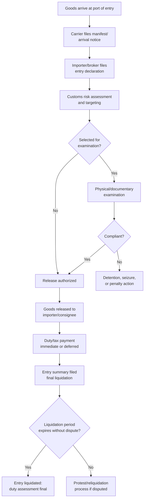
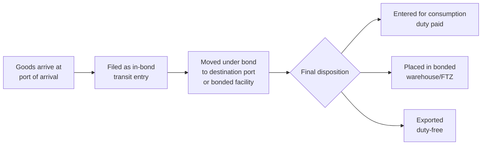

## Customs Clearance Procedures and Bonded Cargo

### Overview

Customs clearance is the formal process by which imported or exported goods are declared to a customs authority, examined for admissibility and compliance, assessed for applicable duties/taxes, and released into (or removed from) domestic commerce. Bonded cargo refers to goods held under customs control — typically secured by a financial bond — before duties are paid or final disposition is determined, allowing storage, manipulation, or transit without immediate duty liability.

### The Customs Clearance Lifecycle

### Key Documentation for Entry

- **Bill of Lading / Air Waybill** — carrier's contract of carriage and receipt for goods.
- **Commercial Invoice** — states transaction value, parties, and goods description; foundational to valuation.
- **Packing List** — itemizes physical contents, weights, and packaging.
- **Entry/Import Declaration** — the formal customs filing declaring HS classification, value, origin, and other required data elements (e.g., CBP Form 3461/7501 in the US, Single Administrative Document (SAD) in the EU).
- **Certificate of Origin** — where preferential treatment or origin marking is claimed.
- **Permits/Licenses** — where the goods fall under a regulated category (see licensing topic).
- **Customs Bond** — a financial guarantee ensuring payment of duties, taxes, and penalties (required for most formal commercial entries in bond-based systems like the US).

### Modes of Declaration and Release

- **Formal entry** — required for higher-value or regulated shipments; involves full documentation, bond, and potential exam.
- **Informal entry** — simplified procedure for lower-value shipments below a defined threshold, generally with reduced documentation.
- **De minimis entry** — shipments below a very low value threshold may be admitted with minimal or no formal entry and duty-free (thresholds and rules vary significantly and are subject to policy change; several jurisdictions have tightened de minimis treatment in recent years, particularly for e-commerce shipments). [Unverified — current de minimis thresholds and any recent regulatory changes should be confirmed against the specific importing country's current rules, as this is an actively evolving policy area]
- **Pre-clearance/pre-arrival processing** — electronic filing of entry data before physical arrival, allowing risk assessment and, in many cases, release determination prior to or immediately upon arrival.

### Customs Bonds

A customs bond is a contractual, tri-party financial instrument (principal/importer, surety, and customs authority as obligee) guaranteeing that duties, taxes, and any penalties will be paid.

**Common bond types:**

- **Single Transaction Bond (STB)** — covers one specific entry.
- **Continuous Bond** — covers all entries by the principal over a defined period (commonly one year, auto-renewing), sized to a percentage of the importer's annual duty/tax/fee liability.
- **Custodial/Carrier Bonds** — cover carriers and other parties with custody of unreleased cargo.
- **Warehouse/FTZ Bonds** — cover goods held in bonded facilities.

### Bonded Cargo and Bonded Facilities

Goods that have not yet been "entered for consumption" (i.e., not released into free circulation with duties paid) can be held under bond in several facility types:

| Facility type | Purpose | Duty treatment |
| --- | --- | --- |
| **Bonded warehouse** | Storage of imported goods, duty-deferred | Duty paid only upon withdrawal for domestic consumption |
| **Foreign Trade Zone (FTZ) / Free Zone** | Storage, manipulation, assembly, manufacturing | Duty deferred; duty may be eliminated on re-exports; in some cases duty rate can shift favorably ("inverted tariff" relief) based on the finished product's classification |
| **In-bond transit** | Movement of goods under customs control between ports without duty payment | Duty deferred until final destination entry |
| **Temporary Importation under Bond (TIB)** | Time-limited import (e.g., trade show goods, repair items) without duty payment, subject to re-export | Duty-free if conditions met; liquidated damages if not re-exported/destroyed timely |
| **Duty-Free Store / Transit Shed** | Retail or transit holding, typically for export or traveler sale | Duty-free under program conditions |

**Key Points**

- Goods in a bonded warehouse or FTZ can often undergo manipulation, storage, repackaging, or manufacturing without triggering duty liability until (and unless) they enter domestic commerce.
- FTZs can offer duty savings when a finished product carries a lower duty rate than its imported components (a benefit sometimes called "inverted tariff" relief), subject to program-specific eligibility rules.
- In-bond transit allows goods to move from the port of arrival to an inland port of entry (or to export) without paying duty at the initial port.

### Bonded Movement Workflow (In-Bond Transit)

### Example

An importer brings machinery into the US that will be stored, then partially assembled into a larger finished unit for eventual re-export to a third country.

1. **Arrival and manifest** — carrier files arrival documentation with CBP.
2. **In-bond transit** — goods move under bond from the port of arrival to an FTZ facility without duty payment at the border.
3. **FTZ admission** — goods are admitted into the zone under "privileged foreign status" or "non-privileged foreign status" (an election affecting which HS classification/duty rate applies upon eventual entry).
4. **Manufacturing/assembly** within the zone combines the machinery with other components.
5. **Disposition options:**
   - If the finished unit is **exported**, no US duty is owed on the foreign-origin content.
   - If the finished unit is **entered into US commerce**, duty is assessed at that point — potentially at the finished product's rate rather than the individual components' rates, depending on zone status elected and applicable regulations.

### Liquidation and Post-Entry Adjustment

- **Liquidation** is the final computation and fixing of duties/taxes owed on an entry, typically becoming final after a statutory period (e.g., 314 days from entry, extendable, under US practice) absent action.
- **Protest** — a formal mechanism to dispute a liquidated entry within a defined window (e.g., 180 days under US CBP procedures).
- **Post-Summary Correction / Reconciliation** — mechanisms in some regimes (e.g., US Reconciliation Program) allowing importers to file entries with flagged issues (e.g., value, classification, or origin still under review) and true up later without individual entry-by-entry amendment.

### Consequences of Non-Compliance

- **Liquidated damages** against the bond for failure to timely export TIB goods, failure to properly close an in-bond movement, or other procedural breaches.
- **Penalties** for misdeclaration, scaled by culpability, as in classification/valuation/origin violations.
- **Cargo holds, seizure, or forfeiture** for prohibited goods, unresolved compliance issues, or repeated violations.
- **Increased scrutiny** — non-compliant importers face a higher future examination rate, the inverse of AEO/CTPAT trusted-trader benefits.

**Related Topics**

- Harmonized System Classification
- Customs Valuation Methods
- Authorized Economic Operator Programs
- Free Trade Zones and Bonded Warehouses (facility-specific deep dive)
- Duty Drawback Programs