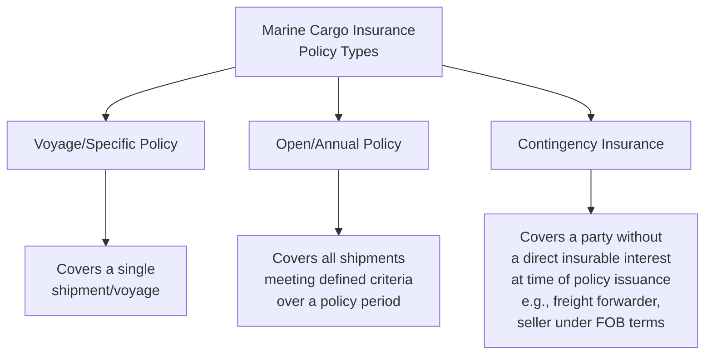
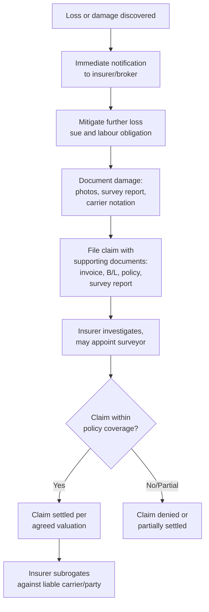

## Marine Cargo Insurance Fundamentals

### Overview

Marine cargo insurance is a form of property insurance that indemnifies the insured (typically a cargo owner, shipper, or consignee) against physical loss or damage to goods while in transit by sea, air, road, or rail — despite the "marine" name, modern policies routinely cover multimodal transit. Cargo insurance is legally and commercially distinct from carrier liability: a carrier's liability under a bill of lading or air waybill is typically capped and fault-based, whereas cargo insurance provides first-party indemnification largely independent of carrier fault, subject to policy terms.

### Why Cargo Insurance Is Necessary (Relationship to Carrier Liability)

International carrier liability conventions (e.g., the Hague-Visby Rules, Hamburg Rules, Montreal Convention for air) impose *limited* liability on carriers, often calculated per package or per kilogram rather than based on the goods' actual value. This creates a substantial "liability gap" between what a carrier must pay in the event of loss and the actual value of the goods.

$$Liability\ Gap = V_{actual\ goods} - L_{carrier\ liability\ limit}$$

Cargo insurance closes this gap by insuring the goods themselves, regardless of whether the carrier is ultimately liable or able to pay.

### Core Marine Insurance Principles

- **Insurable interest** — the insured must have a legal or financial stake in the goods at the time of loss (ownership, risk of loss under Incoterms, or a secured interest).
- **Utmost good faith (*uberrimae fidei*)** — both parties must disclose all material facts affecting the risk; non-disclosure can void the policy.
- **Indemnity** — the policy compensates for actual loss, not more (subject to agreed valuation methods, see below).
- **Proximate cause** — coverage responds to loss where the insured peril is the proximate (immediate, dominant) cause of loss, not merely a remote or contributing factor.
- **Subrogation** — upon paying a claim, the insurer acquires the insured's right to pursue recovery from a liable third party (e.g., the carrier), up to the amount paid.

### Types of Marine Cargo Policies

- **Voyage/Specific policy** — a one-off policy for a single, defined shipment.
- **Open (or "floating") policy** — a standing policy automatically covering all qualifying shipments over a period, with periodic declaration and premium adjustment; the standard approach for regular shippers.
- **Contingency insurance** — covers a party (e.g., a seller who has technically transferred risk under the sale terms, or a freight forwarder) against loss where the primary cargo insurance may fail to respond or does not exist.

### Institute Cargo Clauses (ICC) — Coverage Levels

The most widely used standard coverage forms internationally are the **Institute Cargo Clauses**, published by the Lloyd's Market Association/International Underwriting Association (successors to the historical Institute of London Underwriters):

| Clause | Coverage basis | Approximate scope |
| --- | --- | --- |
| **ICC (A)** | All risks | Broadest coverage; covers all risks of physical loss/damage except specifically excluded perils |
| **ICC (B)** | Named perils, broader | Covers a defined list of perils (fire, explosion, vessel stranding/sinking, general average, etc.) plus some additional risks |
| **ICC (C)** | Named perils, narrower | Covers a shorter list of major casualty perils only (e.g., fire, vessel sinking/stranding, general average) |

**Key Points**

- ICC (A) is "all risks" in the sense of covering risks not specifically excluded — it is not literally "all loss" coverage; standard exclusions still apply.
- ICC (B) and (C) are narrower "named perils" forms — a loss must fall within an enumerated peril to be covered.
- Common exclusions across all ICC forms include: willful misconduct of the insured, inherent vice or nature of the goods, ordinary leakage/wear and tear, insufficiency of packing, delay (even if caused by an insured peril, unless specifically extended), war and strikes (available as separate, optional extensions — Institute War Clauses and Institute Strikes Clauses).

### Valuation Methods for Claims

- **Agreed value** — the insured value is fixed in the policy at inception (commonly CIF/CIP value plus an uplift, e.g., 10%, to cover anticipated profit — the "CIF + 10%" convention).
- **Actual cash value (ACV)** — market value of goods at the time and place of loss, less depreciation where applicable.
- **Replacement cost** — cost to replace the goods with new ones of like kind, without depreciation deduction (less common in standard cargo policies, more typical for certain specialty coverages).

$$V_{insured} = V_{CIF/CIP} \times (1 + Markup\%)$$

### Claims Process Workflow

**Key Points**

- The insured has a duty to mitigate loss (the "sue and labour" clause obligates the insured to take reasonable steps to minimize loss, with reasonable mitigation costs themselves recoverable under the policy).
- Cargo should generally be inspected upon arrival, with any damage noted on the delivery receipt/proof of delivery — failure to note damage at delivery can complicate both the insurance claim and any recourse against the carrier.
- Claims are typically time-barred if not filed within a specified period (both under the policy and under applicable carrier liability conventions, which often impose their own separate, shorter notice/suit periods).

### General Average

A distinct marine law doctrine (not incorporated in air or land transport) — when part of a vessel's cargo or equipment is sacrificed to save the vessel and the remaining cargo from a common peril (e.g., jettisoning cargo during a storm), all cargo interests share proportionally in the loss, regardless of whose cargo was actually sacrificed.

$$Contribution_{party} = \frac{V_{party's\ contributory\ value}}{V_{total\ contributory\ value}} \times Loss_{general\ average}$$

Cargo insurance (including ICC B and C forms) typically covers the insured's general average contribution, making this a material reason to carry insurance even when using more limited coverage forms.

### Example

A shipper exports $100,000 (CIF value) of electronics from Shanghai to Rotterdam under an open marine cargo policy with ICC (A) coverage and a 10% agreed-value uplift.

$$V_{insured} = 100{,}000 \times 1.10 = 110{,}000$$

During the voyage, a container is damaged by seawater ingress during heavy weather (a fortuity covered under "all risks" ICC (A), assuming no exclusion applies, such as inadequate packing).

1. Shipper notifies the insurer immediately upon discovering the damage at destination.
2. A cargo surveyor is appointed to assess the extent of damage.
3. Damaged goods are documented with photos and a formal survey report; damage is noted on the delivery documentation.
4. Claim is filed for the assessed loss, up to the insured value of $110,000 (pro-rated if the loss is partial).
5. Insurer settles the claim and separately pursues subrogation against the ocean carrier if carrier negligence contributed to the loss (subject to the carrier's liability limitation under the applicable convention, e.g., Hague-Visby package limitation).

### Interaction with Incoterms

The Incoterms rule governing a sale determines *when risk transfers* from seller to buyer, which in turn determines which party has the insurable interest requiring coverage at each stage:

- **CIF/CIP** — the seller is contractually obligated to procure minimum insurance coverage (historically ICC (C) equivalent under CIF, with CIP under Incoterms 2020 requiring a higher minimum, ICC (A) equivalent, unless otherwise agreed) for the buyer's benefit.
- **EXW, FOB, FCA, and other terms** — insurance responsibility follows the risk transfer point defined by the specific term; the party bearing risk at a given stage typically should hold appropriate coverage.

[Unverified — specific Incoterms 2020 minimum insurance obligations under CIP should be confirmed against the current ICC rules text, as this represented a notable change from prior Incoterms versions]

**Related Topics**

- Carrier Liability Conventions (Hague-Visby, Hamburg, Montreal)
- Incoterms and Risk Transfer Points
- General Average and York-Antwerp Rules
- Freight Forwarder Liability and Errors & Omissions Coverage
- Claims Documentation and Survey Reports