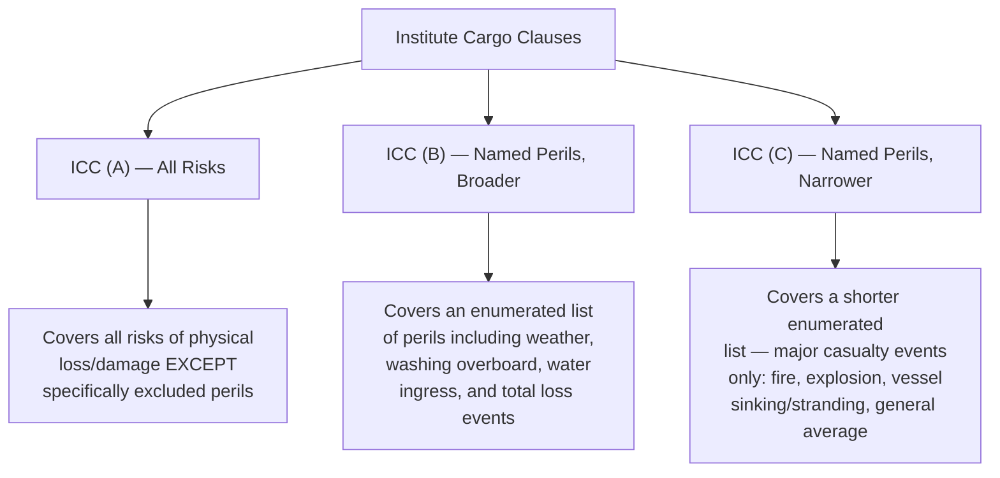
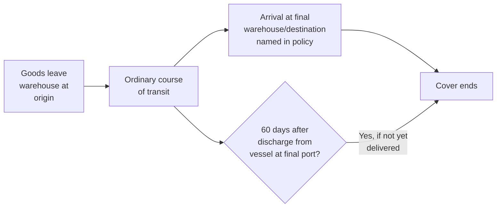

## Institute Cargo Clauses A, B, and C

### Overview

The Institute Cargo Clauses (ICC) are the standard set of coverage wordings used internationally to define the scope of marine cargo insurance policies. Originally drafted under the auspices of the Institute of London Underwriters and now maintained by the Lloyd's Market Association (LMA) and International Underwriting Association (IUA), the clauses were substantially revised in 1982 and again in 2009 (the current standard version, commonly cited as "ICC 1/1/09"). The three clause sets — A, B, and C — provide a tiered structure of coverage breadth, from broadest to narrowest, and are incorporated by reference into the great majority of marine cargo policies worldwide.

### Structural Logic: All Risks vs. Named Perils

**Key Points**

- ICC (A) uses an **exclusionary** drafting approach — coverage exists unless specifically excluded.
- ICC (B) and (C) use an **inclusionary** drafting approach — coverage exists only for perils specifically listed.
- All three clause sets share an identical structure of clause numbers (Risks Covered, Exclusions, Duration, Claims, Benefit of Insurance, Minimizing Losses, Avoidance of Delay, Law and Practice), differing primarily in the scope of Clause 1 (Risks Covered).

### ICC (A) — All Risks Coverage

**Risks Covered (Clause 1):** All risks of loss or damage to the subject-matter insured, except as excluded under Clauses 4, 5, 6, and 7.

**General Average and Salvage Charges (Clause 2):** Covered in accordance with governing contract/law (e.g., York-Antwerp Rules), adjusted or determined per the contract of carriage/applicable law.

**"Both to Blame Collision" Clause (Clause 3):** Extends coverage to indemnify the insured against liability arising under the "Both to Blame Collision Clause" of the contract of carriage.

This is the broadest standard form and is the typical default choice for high-value or sensitive cargo where the shipper wants coverage against the widest possible range of fortuitous events.

### ICC (B) — Named Perils, Intermediate Scope

**Risks Covered (Clause 1)** enumerates specific perils, generally including:

- Fire or explosion
- Vessel or craft stranded, grounded, sunk, or capsized
- Overturning or derailment of land conveyance
- Collision or contact of vessel/craft/conveyance with any external object other than water
- Discharge of cargo at a port of distress
- Earthquake, volcanic eruption, or lightning
- General average sacrifice
- Jettison
- Washing overboard
- Entry of sea, lake, or river water into vessel, craft, hold, conveyance, container, or place of storage
- Total loss of any package lost overboard or dropped while loading onto or unloading from vessel or craft

ICC (B) notably **excludes** ordinary theft, non-delivery, freshwater/rain damage (unless resulting from an insured peril), and malicious damage unless separately extended — these are covered under ICC (A) as part of its broader "all risks" scope, subject to standard exclusions.

### ICC (C) — Named Perils, Narrowest Scope

**Risks Covered (Clause 1)** is a subset of the ICC (B) list, generally including only major casualty-type events:

- Fire or explosion
- Vessel or craft stranded, grounded, sunk, or capsized
- Overturning or derailment of land conveyance
- Collision or contact of vessel/craft/conveyance with any external object other than water
- Discharge of cargo at a port of distress
- General average sacrifice
- Jettison

ICC (C) notably **excludes** earthquake, volcanic eruption, lightning, washing overboard, and water ingress damage — perils that ARE covered under ICC (B). ICC (C) is typically used for lower-value, non-fragile, bulk commodities where the shipper accepts a higher risk tolerance in exchange for lower premium cost.

### Comparative Coverage Table

| Peril | ICC (A) | ICC (B) | ICC (C) |
| --- | --- | --- | --- |
| Fire/explosion | ✓ | ✓ | ✓ |
| Vessel sinking/stranding | ✓ | ✓ | ✓ |
| General average sacrifice | ✓ | ✓ | ✓ |
| Jettison | ✓ | ✓ | ✓ |
| Earthquake, volcanic eruption, lightning | ✓ | ✓ | ✗ |
| Washing overboard | ✓ | ✓ | ✗ |
| Seawater/river water ingress | ✓ | ✓ | ✗ |
| Theft, pilferage, non-delivery | ✓ (subject to exclusions) | ✗ | ✗ |
| Freshwater/rain damage | ✓ (subject to exclusions) | ✗ | ✗ |
| Malicious damage/vandalism | ✓ (subject to exclusions) | ✗ | ✗ |
| Rough handling/breakage | ✓ (subject to exclusions) | ✗ | ✗ |

[Unverified — this table reflects the general, widely-cited structure of the 2009 ICC forms; exact clause wording and coverage boundaries should always be confirmed against the current official Institute Cargo Clauses text, as precise inclusion/exclusion language is legally determinative]

### Common Exclusions (All Three Clause Sets)

Regardless of which clause set applies, certain exclusions are standard across ICC (A), (B), and (C):

- **Clause 4** — willful misconduct of the insured; ordinary leakage, loss in weight/volume, or wear and tear; insufficiency/unsuitability of packing or preparation; inherent vice or nature of the goods; delay (even if proximately caused by an insured peril); insolvency/financial default of vessel owners/operators; deliberate damage by wrongful act of any person (varies by clause); use of any weapon employing atomic/nuclear fission or radioactive force.
- **Clause 5** — unseaworthiness of vessel/craft or unfitness of conveyance/container, where the insured is privy to such unseaworthiness/unfitness at time of loading.
- **Clause 6** — war and war-like perils (available as a separate extension via Institute War Clauses).
- **Clause 7** — strikes, riots, and civil commotion perils (available as a separate extension via Institute Strikes Clauses).

### Duration of Cover ("Warehouse to Warehouse")

All three clause sets share an identical **Transit Clause (Clause 8)**, providing "warehouse to warehouse" coverage:

Coverage generally attaches when goods leave the warehouse/place of storage named for commencement of transit, continues through the ordinary course of transit, and terminates at the earliest of: delivery to the final warehouse/destination named in the policy, delivery to any other warehouse used for storage outside the ordinary course of transit, or expiration of a defined period (commonly 60 days) after discharge from the oceangoing vessel at the final port of discharge. [Unverified — the specific day count and precise attachment/termination triggers should be confirmed against the current Institute Cargo Clauses (Transit Clause) text, as this clause contains multiple technical sub-conditions]

### Choosing Among ICC (A), (B), and (C)

**Key Points**

- **ICC (A)** is generally recommended for: high-value goods, fragile/sensitive cargo, containerized general cargo, goods with high theft/pilferage risk, and situations where the buyer contractually requires the broadest coverage.
- **ICC (B)** may be selected for: goods where weather/water damage is a material concern but theft/handling risk is lower (e.g., certain bulk agricultural commodities in weather-exposed transit).
- **ICC (C)** is typically limited to: low-value bulk commodities, scrap materials, or cargo where the insured accepts coverage only against catastrophic total-loss-type events to minimize premium cost.
- Under Incoterms 2020, **CIF** requires the seller to procure only minimum cover (historically referenced to something like ICC (C)), while **CIP** requires a higher minimum (historically referenced to something like ICC (A)), unless the parties agree otherwise — making the choice of clause set directly relevant to sale contract negotiations. [Unverified — exact minimum coverage equivalence should be confirmed against current Incoterms 2020 rules text]

### Example

A buyer purchasing $500,000 of consumer electronics under CIP terms wants to confirm the seller's insurance obligation is adequate.

1. Under Incoterms 2020 CIP, the seller must procure a minimum level of cover equivalent to ICC (A) (or similar "all risks" clauses), unless the contract specifies otherwise.
2. The buyer reviews the certificate of insurance to confirm ICC (A) (not B or C) is stated, and checks the insured value reflects an appropriate uplift over the CIP contract value (commonly a 10% markup convention).
3. The buyer confirms the policy's Transit Clause duration covers the full intended routing, including any planned transshipment or inland movement beyond the port of discharge.

### Related Extensions

- **Institute War Clauses (Cargo)** — separately purchased extension covering war-related perils excluded under Clause 6.
- **Institute Strikes Clauses (Cargo)** — separately purchased extension covering strikes, riots, and civil commotion excluded under Clause 7.
- **Institute Cargo Clauses (Air)** — a parallel set of clauses adapted for air cargo shipments, with duration and peril language adjusted for air transit.

**Related Topics**

- Marine Cargo Insurance Fundamentals
- Carrier Liability Conventions (Hague-Visby, Hamburg, Montreal)
- General Average and York-Antwerp Rules
- Incoterms and Risk Transfer Points
- Institute War and Strikes Clauses