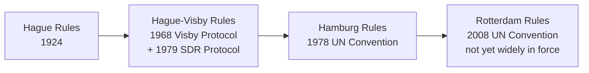
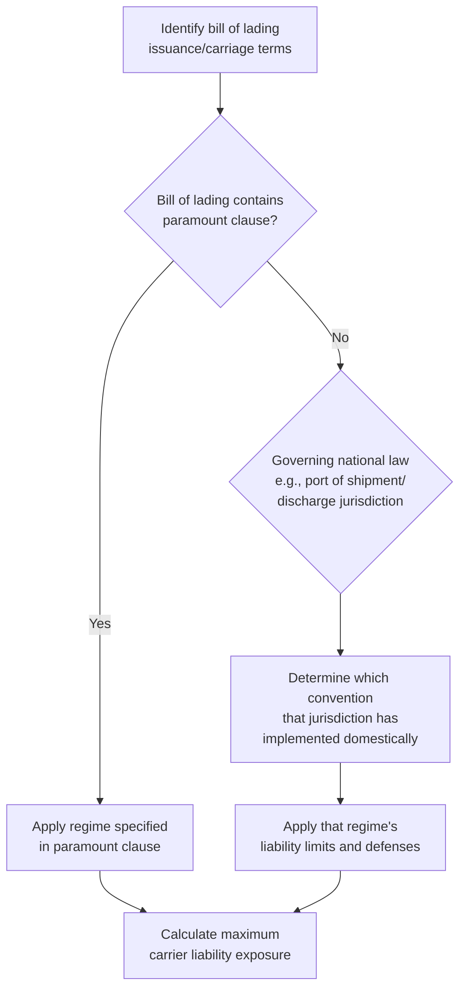

## Sea Carrier Liability: Hague, Hague Visby, Hamburg, and Rotterdam Rules

### Overview

Ocean carrier liability for loss or damage to cargo carried under a bill of lading is governed by a succession of international conventions, each reflecting a different historical balance between carrier and cargo-interest protections. Four major regimes — the **Hague Rules**, **Hague-Visby Rules**, **Hamburg Rules**, and **Rotterdam Rules** — coexist globally today, with different countries having ratified different (and sometimes multiple, sequential) regimes. Understanding which regime governs a given shipment is essential to assessing a carrier's maximum liability exposure and the cargo interest's realistic recovery in the event of loss.

### Historical Development

**Key Points**

- Each successive regime generally shifted the liability balance further toward cargo interests (higher liability limits, narrower carrier defenses), though Rotterdam introduces a more complex, multimodal-oriented structure rather than a simple linear extension.
- Many countries still operate under Hague or Hague-Visby via domestic legislation (e.g., the US Carriage of Goods by Sea Act, COGSA, is based on the original 1924 Hague Rules, not Hague-Visby).
- The Rotterdam Rules, despite being signed by a number of states, have not achieved the ratification threshold needed for widespread entry into force and remain a minority regime globally. [Unverified — ratification status changes over time and should be confirmed against current UNCITRAL/depositary records]

### The Hague Rules (1924)

The original international convention establishing a mandatory minimum standard of carrier liability, developed to standardize bill of lading terms and prevent carriers from contracting out of all liability.

- **Period of responsibility:** "Tackle to tackle" — from the time goods are loaded onto the vessel until discharge.
- **Carrier obligations:** Exercise due diligence to make the vessel seaworthy; properly and carefully load, handle, stow, carry, keep, care for, and discharge the goods.
- **Liability limit:** £100 per package or unit (gold value basis, later interpreted/converted variably by national courts — a major source of the regime's inconsistency).
- **Carrier defenses ("excepted perils"):** A lengthy list including act of God, perils of the sea, act of war, act of public enemies, quarantine restrictions, act or omission of the shipper, inherent defect/quality/vice of the goods, insufficiency of packing, and notably, the **nautical fault defense** — the carrier is not liable for loss caused by the master, mariner, pilot, or servants' negligence in the *navigation or management* of the vessel (as opposed to negligence in the care of cargo).

### The Hague-Visby Rules (1968/1979)

An amendment (via the "Visby Protocol") to the Hague Rules that preserved the core structure but addressed several major weaknesses.

**Key changes from Hague:**

- **Higher, dual-basis liability limit:** the greater of a per-package/unit limit or a per-kilogram limit, calculated in **Special Drawing Rights (SDR)**, the IMF's reserve asset — commonly cited as 666.67 SDR per package/unit or 2 SDR per kilogram of gross weight, whichever is higher.
- **Container clause:** where goods are consolidated in a container, the number of packages/units listed on the bill of lading (rather than the container itself) is used for liability calculation, closing a loophole where carriers argued the container itself was the single "package."
- **Extended applicability:** broadened to cover bills of lading issued in a contracting state, or covering carriage from a port in a contracting state, or where the bill of lading incorporates the Rules by contract (a "paramount clause").
- **Time bar:** one year from delivery (or date goods should have been delivered) to bring suit — retained from Hague.
- Nautical fault defense and the general Hague excepted-perils list are retained largely unchanged.

$$L_{Hague\text{-}Visby} = \max(666.67 \times N_{packages},\ 2 \times W_{kg})\ SDR$$

[Unverified — exact current SDR figures should be confirmed, as later protocols in some jurisdictions further amended these figures]

### The Hamburg Rules (1978)

A UN convention developed primarily to address perceived imbalances favoring carriers under Hague/Hague-Visby, particularly advocated by cargo-owning (often developing) nations.

**Key changes from Hague-Visby:**

- **Expanded period of responsibility:** "Port to port" (or door-to-door where applicable) rather than strictly tackle-to-tackle — covers the entire period the carrier is in charge of the goods at the port of loading, during carriage, and at the port of discharge.
- **Elimination of the nautical fault defense** — carriers are liable for negligence in navigation/management of the vessel, removing a defense cargo interests considered unfair.
- **Presumption of fault:** shifts the burden — the carrier is presumed liable for loss, damage, or delay unless it proves it took all reasonable measures to avoid the occurrence and its consequences.
- **Higher liability limits:** 835 SDR per package/unit or 2.5 SDR per kilogram, whichever is higher (or a specific formula for delay claims).
- **Extended time bar:** two years (versus one year under Hague/Hague-Visby).
- **Delay is explicitly compensable** — a more explicit basis for delay-related claims than under Hague/Hague-Visby.

$$L_{Hamburg} = \max(835 \times N_{packages},\ 2.5 \times W_{kg})\ SDR$$

Hamburg has been ratified by a meaningful number of states but has not achieved the near-universal adoption of Hague/Hague-Visby, particularly among major shipping nations, creating a fragmented global liability landscape.

### The Rotterdam Rules (2008)

A more ambitious UN convention (formally, the "United Nations Convention on Contracts for the International Carriage of Goods Wholly or Partly by Sea") intended to modernize carrier liability for the container/multimodal era and unify the fragmented patchwork of prior regimes.

**Key features:**

- **"Door to door" scope** — explicitly designed to cover multimodal contracts where sea carriage is one leg, addressing container/intermodal shipping patterns that didn't exist when Hague was drafted.
- **Electronic transport records** — explicit provision for electronic bills of lading and transport documents, reflecting digitalization of trade documentation.
- **Liability limits:** 875 SDR per package/unit or 3 SDR per kilogram, whichever is higher — higher than Hamburg.
- **Modified carrier obligations and defenses** — retains a due diligence seaworthiness obligation but restructures the burden-of-proof framework relative to both Hague-Visby and Hamburg.
- **Extended time bar:** two years, aligned with Hamburg.

$$L_{Rotterdam} = \max(875 \times N_{packages},\ 3 \times W_{kg})\ SDR$$

As of general industry understanding, the Rotterdam Rules have not entered into force due to an insufficient number of ratifications relative to the convention's own threshold requirement, despite a number of signatory states. [Unverified — current signatory/ratification counts change and should be confirmed against current UNCITRAL treaty status records before relying on this for a specific transaction]

### Comparative Summary

| Feature | Hague (1924) | Hague-Visby (1968/79) | Hamburg (1978) | Rotterdam (2008) |
| --- | --- | --- | --- | --- |
| Period of responsibility | Tackle to tackle | Tackle to tackle | Port to port | Door to door |
| Package limit | £100/package | 666.67 SDR/package or 2 SDR/kg | 835 SDR/package or 2.5 SDR/kg | 875 SDR/package or 3 SDR/kg |
| Nautical fault defense | Yes | Yes | No | Modified |
| Burden of proof | Carrier defenses enumerated | Carrier defenses enumerated | Presumed carrier fault | Restructured framework |
| Time bar to sue | 1 year | 1 year | 2 years | 2 years |
| Container clause | No | Yes | Yes | Yes |
| Widespread global adoption | Historically yes (via national law) | Yes, major shipping nations | Partial | Not in force |

### Regime Determination Workflow

### Example

A shipper's cargo (10 packages, total gross weight 5,000 kg) is damaged in transit on a vessel carrying a bill of lading subject to the Hague-Visby Rules via a paramount clause.

$$L_{per\ package\ basis} = 666.67 \times 10 = 6{,}666.70\ SDR$$

$$L_{per\ kg\ basis} = 2 \times 5{,}000 = 10{,}000\ SDR$$

$$L_{max} = \max(6{,}666.70,\ 10{,}000) = 10{,}000\ SDR$$

Since the per-kilogram basis produces the higher figure, the carrier's maximum liability is capped at 10,000 SDR (converted to the relevant currency at the applicable exchange rate), regardless of the goods' actual commercial value — illustrating why cargo insurance (see Marine Cargo Insurance Fundamentals) is commercially essential to close this liability gap.

### Practical Implications for Trade Compliance and Logistics Professionals

- **Bill of lading review** — always check the paramount clause to determine which regime governs a specific shipment, as this materially affects carrier liability exposure.
- **US-specific note** — COGSA (US implementation, based on original Hague terms) applies by statute to US import/export ocean shipments tackle-to-tackle, though parties can and often do contractually extend COGSA terms to the full period of carrier custody via a "Himalaya clause" or similar contractual extension.
- **Insurance planning** — the liability gap under any of these regimes reinforces why cargo owners typically carry first-party marine cargo insurance rather than relying on carrier liability recovery alone.

**Related Topics**

- Marine Cargo Insurance Fundamentals
- Institute Cargo Clauses A, B, and C
- Bills of Lading and Transport Documentation
- General Average and York-Antwerp Rules
- Air Carrier Liability: Warsaw and Montreal Conventions