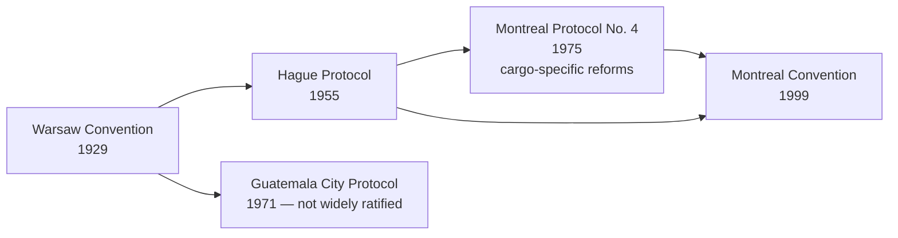
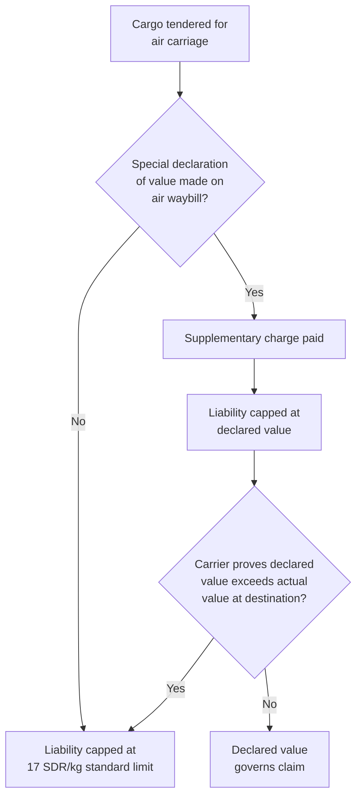

## Air Carrier Liability and the Montreal Convention

### Overview

Air carrier liability for international cargo loss, damage, or delay is governed by a succession of international conventions paralleling the maritime regime's evolution: the original **Warsaw Convention (1929)**, its numerous amending protocols, and the modern **Montreal Convention (1999)**, which has now superseded Warsaw for the great majority of international air carriage. Unlike the fragmented maritime landscape where multiple regimes coexist without a dominant successor, Montreal has achieved broad global ratification and is now the primary governing regime for international air cargo liability.

### Historical Development

**Key Points**

- The pre-1999 landscape was notoriously fragmented — the "Warsaw System" comprised the original convention plus several amending protocols, with different countries ratifying different combinations, creating significant uncertainty about which liability limits applied to a given shipment.
- The Montreal Convention 1999 was drafted specifically to consolidate and modernize this fragmented system into a single, unified instrument.
- Montreal Convention liability limits are subject to periodic revision via a built-in review mechanism (unlike Warsaw, which required a new protocol for each change).

### The Warsaw Convention (1929) — Legacy Framework

- **Scope:** International carriage of passengers, baggage, and cargo by air.
- **Liability limit (cargo):** Originally 250 gold francs per kilogram (a unit later interpreted and converted inconsistently across jurisdictions, similar to the Hague Rules' gold-value problem in maritime law).
- **Carrier defenses:** Liability could be avoided if the carrier proved it took all necessary measures to avoid the damage, or that it was impossible to take such measures.
- **Documentation requirements:** Strict requirements for the air waybill; historically, failure to comply with certain documentary requirements could result in loss of the right to limit liability (a consequence later softened in Montreal).

Montreal Protocol No. 4 (1975), where ratified, converted the gold franc limit to Special Drawing Rights (SDR) terms (17 SDR per kilogram for cargo) and simplified documentation requirements — but adoption remained inconsistent prior to Montreal 1999.

### The Montreal Convention (1999)

Formally the "Convention for the Unification of Certain Rules for International Carriage by Air," Montreal 1999 consolidated the Warsaw System into a single modern instrument and has been ratified by the large majority of aviation nations, effectively becoming the default governing regime for international air cargo today.

**Key features for cargo:**

- **Liability limit:** 17 SDR per kilogram of cargo (aligned with the Montreal Protocol No. 4 figure), subject to periodic review and adjustment by the ICAO depositary under the convention's built-in revision mechanism.
- **Basis of liability:** The carrier is liable for damage sustained in the event of destruction, loss, or damage to cargo, provided the event causing the loss took place during the "carriage by air" — but is **not liable** if it proves the damage resulted from: (a) an inherent defect, quality, or vice of the cargo; (b) defective packing performed by a person other than the carrier; (c) an act of war or armed conflict; or (d) an act of public authority carried out in connection with the entry, exit, or transit of the cargo.
- **Strict/near-strict liability structure for cargo:** Unlike the fault-based defenses under Warsaw, cargo liability under Montreal is closer to strict liability within the enumerated exceptions above — there is no general "all reasonable measures" defense available for cargo claims as there is for passenger delay claims.
- **Unbreakable limit for cargo:** Critically, the cargo liability limit under Montreal is **unbreakable** — meaning it cannot be exceeded even in cases of the carrier's willful misconduct or gross negligence (a significant contrast to the passenger liability provisions, where certain limits can be broken).
- **Electronic documentation:** Explicit recognition of electronic air waybills and electronic record-keeping, modernizing the strict paper-based documentation rules of Warsaw.
- **Time bar:** Two years from the date of arrival at destination (or the date the aircraft ought to have arrived, or the date carriage stopped) to bring an action.

$$L_{Montreal\ cargo} = 17 \times W_{kg}\ SDR$$

### Declared Value / Special Declaration of Interest

A shipper can exceed the standard per-kilogram limit by making a **special declaration of interest in delivery** at the time of shipment (declaring a higher value on the air waybill) and paying a supplementary charge, in which case the carrier's liability is fixed at the declared amount rather than the statutory per-kilogram limit — unless the carrier proves the declared value exceeds the cargo's actual value at destination.

### Air Waybill Requirements

The air waybill (AWB) serves as the contract of carriage, evidence of receipt of goods, and (unlike a maritime bill of lading) is generally **not a document of title** — it is non-negotiable. Montreal requires certain particulars but, unlike Warsaw, non-compliance with documentary formalities no longer automatically strips the carrier of its right to limit liability.

**Key Points**

- Because the AWB is non-negotiable, it cannot be used to transfer ownership of goods in transit the way an order bill of lading can in maritime shipping — this is a structurally important distinction for trade finance and letter of credit transactions involving air freight.
- The AWB typically comes in a three-original set (for carrier, consignee, and shipper) plus additional copies for other parties in the chain.

### Comparative Summary: Montreal vs. Warsaw for Cargo

| Feature | Warsaw (Original) | Montreal Protocol No. 4 | Montreal Convention 1999 |
| --- | --- | --- | --- |
| Liability limit (cargo) | 250 gold francs/kg | 17 SDR/kg | 17 SDR/kg (subject to periodic revision) |
| Cargo liability basis | Fault-based defenses | Fault-based defenses | Near-strict, limited enumerated exceptions |
| Limit breakable for willful misconduct (cargo)? | Historically yes | Varied by ratification | No — unbreakable for cargo |
| Documentation formality consequence | Could strip liability limit | Softened | Further softened; electronic AWB recognized |
| Global ratification breadth | Fragmented ("Warsaw System") | Partial | Broad, now dominant regime |

### Example

A shipper tenders 200 kg of electronic components for international air carriage without making a special declaration of value. In transit, the shipment is damaged due to mishandling by the carrier's ground staff.

$$L_{max} = 17 \times 200 = 3{,}400\ SDR$$

Because Montreal's cargo liability limit is unbreakable, the carrier's maximum exposure is 3,400 SDR (converted to the relevant currency) regardless of the goods' actual value or the degree of carrier fault — reinforcing, as with maritime carriage, the commercial necessity of first-party cargo insurance to close the liability gap between actual cargo value and the statutory limit.

If the shipper had instead made a special declaration of value of, say, $50,000 USD-equivalent and paid the applicable supplementary charge, the carrier's liability would be capped at that declared value instead (absent the carrier proving the declared value exceeded actual value at destination).

### Interaction with Cargo Insurance and Trade Documentation

- **Liability gap** — as with maritime carriage, the air liability limit is typically well below the actual commercial value of high-value air cargo (electronics, pharmaceuticals, perishables), making marine/air cargo insurance (see Marine Cargo Insurance Fundamentals; Institute Cargo Clauses (Air) is a parallel wording to the sea clauses, adapted for air transit duration) commercially essential.
- **Jurisdiction and forum** — Montreal specifies permissible jurisdictions for bringing an action (e.g., domicile of the carrier, principal place of business, place of destination), relevant to dispute resolution planning.
- **Relationship to freight forwarder liability** — where a freight forwarder issues its own house air waybill (HAWB) as a non-vessel-operating intermediary, the forwarder's liability to the shipper may be governed by its own terms and conditions (potentially referencing Montreal limits or forwarder association standard terms) layered on top of, and distinct from, the underlying carrier's Montreal liability to the forwarder.

**Related Topics**

- Marine Cargo Insurance Fundamentals
- Sea Carrier Liability: Hague, Hague Visby, Hamburg, and Rotterdam Rules
- Institute Cargo Clauses A, B, and C
- Freight Forwarder Liability and House Air Waybills
- Air Waybills and Non-Negotiable Transport Documents