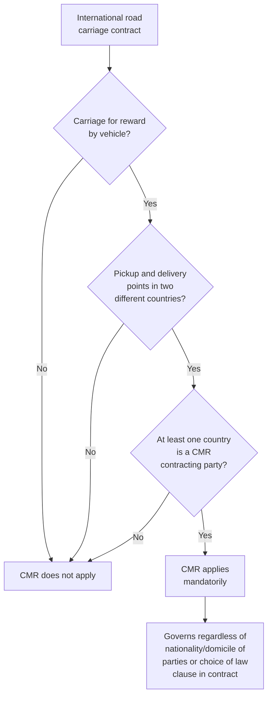
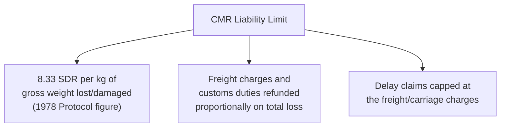
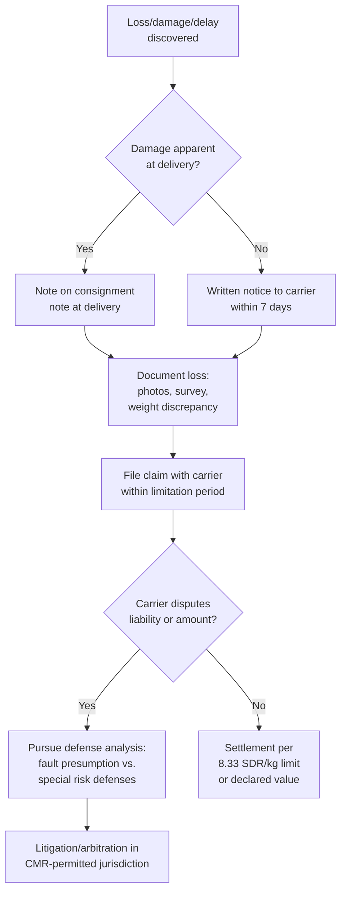

## Road Carrier Liability and the CMR Convention

### Overview

International road carrier liability is primarily governed by the **CMR Convention** — the Convention on the Contract for the International Carriage of Goods by Road (from its French title, *Convention relative au contrat de transport international de marchandises par route*), signed in Geneva in 1956 and amended by a 1978 Protocol. CMR applies to contracts for the carriage of goods by road vehicle for reward, where the place of taking over the goods and the place designated for delivery are situated in two different countries, at least one of which is a contracting party. It is the road-transport analogue to the Hague-Visby Rules (sea) and Montreal Convention (air), and is widely adopted across Europe and increasingly beyond.

### Scope of Application

**Key Points**

- CMR applies **mandatorily** once its scope conditions are met — parties cannot contract out of it, and any contractual clause purporting to derogate from CMR to the detriment of the claimant is void.
- CMR governs the *international* leg specifically — purely domestic road carriage within a single country typically falls under that country's domestic transport law instead.
- CMR applies regardless of the value or nature of the goods, the type of vehicle, or the nationality/place of business of the parties, provided the geographic and contractual conditions above are met.

### The CMR Consignment Note

The consignment note (analogous to a bill of lading or air waybill) serves as prima facie evidence of the contract of carriage, the conditions of the contract, and the carrier's receipt of the goods.

- Typically issued in three original copies (for the sender, the carrier, and to accompany the goods to the consignee).
- Must contain prescribed particulars: place and date of taking over the goods, names/addresses of sender/carrier/consignee, description and packaging of goods, gross weight, and other specified information.
- **Not a document of title** — like the air waybill, the CMR consignment note is generally non-negotiable, distinguishing it from an order/negotiable maritime bill of lading.
- Absence, irregularity, or loss of the consignment note does not affect the existence or validity of the contract of carriage — CMR still applies.

### Carrier's Period of Responsibility and Basis of Liability

- **Period of responsibility:** From the time the carrier takes over the goods until the time of delivery.
- **Basis of liability:** The carrier is liable for total or partial loss of the goods, for damage occurring between the time of taking over and delivery, and for delay in delivery.
- **Presumption of fault:** Similar in structure to the Hamburg Rules' approach — the carrier is presumed liable, and bears the burden of proving one of the specified defenses applies.

### Carrier Defenses

The carrier can avoid or reduce liability by proving the loss, damage, or delay was caused by:

1. **Claimant's own fault** — wrongful act or neglect of the claimant.
2. **Claimant's instructions** — instructions given by the claimant not resulting from carrier fault.
3. **Inherent vice** — inherent vice of the goods themselves.
4. **Circumstances the carrier could not avoid** — circumstances which the carrier could not avoid and the consequences of which it was unable to prevent.

**Special risk defenses** (a defined list shifting the burden back to the claimant to disprove causation) include:

- Use of open, unsheeted vehicles when expressly agreed and stated in the consignment note.
- Lack or defective condition of packing, for goods liable to wastage/damage when unpacked or defectively packed.
- Handling, loading, stowage, or unloading of goods by the sender/consignee or persons on their behalf.
- Nature of certain goods particularly exposed to loss (e.g., breakage, rust, decay, evaporation, loss through normal wastage).
- Insufficient or inadequate marking/numbering of packages.
- Carriage of livestock.

### Liability Limits

$$L_{CMR} = 8.33 \times W_{kg}$$

**Key Points**

- Unlike the Hague-Visby dual per-package/per-kilogram structure, CMR's primary limit is calculated purely on a **per-kilogram gross weight** basis (8.33 SDR/kg under the 1978 Protocol, which converted the original 1956 gold-franc figure).
- As with Montreal (air) and Hague-Visby (sea), a shipper can declare a higher value in the consignment note and pay a supplementary charge to secure a higher liability limit, or make a special "declaration of interest in delivery" for delay-related loss.
- **The limit is breakable** — unlike Montreal's unbreakable cargo limit, CMR liability limits do not apply if the damage resulted from the carrier's **willful misconduct or default equivalent to willful misconduct** (a concept interpreted variably across national courts, similar to historical interpretation issues under Hague).

### Delay Claims

Delay is explicitly compensable under CMR (unlike the default position under some maritime regimes), but compensation for delay alone is capped at the amount of the carriage charges — a narrower recovery than for loss or damage claims, unless a special declaration of interest in delivery has been made and paid for.

### Time Bar and Notice Requirements

- **General limitation period:** one year from delivery (or from the date delivery should have occurred, or from the date the goods should have been made available).
- **Extended limitation period:** three years in cases of willful misconduct or default equivalent to willful misconduct.
- **Notice of loss/damage:**
  - Apparent damage: must be noted on the consignment note at time of delivery, or notified in writing within 7 days (excluding Sundays/holidays) for damage not apparent at delivery.
  - Delay claims: written notice generally required within 21 days of the goods being placed at the consignee's disposal, or the right to compensation may be lost.

### Claims and Recovery Process

### Successive Carriers

Where international road carriage under a single consignment note is performed by successive carriers (e.g., a shipment handed off between hauliers across multiple countries), each successive carrier becomes a party to the contract of carriage under the terms of the consignment note and is liable for the entire carriage, subject to a right of recourse among the carriers for apportioning responsibility for where the loss/damage actually occurred.

### Example

A shipment of 3,000 kg of goods carried by road from Germany to Poland under a CMR consignment note is damaged in transit due to a traffic accident not caused by the sender's fault.

$$L_{max} = 8.33 \times 3{,}000 = 24{,}990\ SDR$$

1. Damage is noted on the consignment note at delivery (or written notice given within 7 days if not apparent).
2. The consignee/claimant documents the loss and files a claim with the carrier.
3. The carrier is presumed liable; it may attempt to invoke a special risk defense (unlikely to apply here, as a traffic accident is not among the enumerated special risks) or argue circumstances it could not avoid.
4. Absent a successful defense, liability is capped at 24,990 SDR — converted to the relevant currency — regardless of the goods' actual commercial value, again illustrating the liability gap that cargo insurance is designed to close.
5. If the claimant can demonstrate willful misconduct or an equivalent default (e.g., a grossly negligent breach of a known safety obligation), the 8.33 SDR/kg cap could potentially be broken, subject to the applicable national court's interpretation of that standard.

### Comparative Note: CMR vs. Sea/Air Regimes

| Feature | CMR (Road) | Hague-Visby (Sea) | Montreal (Air) |
| --- | --- | --- | --- |
| Liability limit basis | 8.33 SDR/kg only | Higher of per-package or per-kg | 17 SDR/kg only |
| Limit breakable for willful misconduct? | Yes | Generally yes (varies by jurisdiction) | No (cargo) |
| Burden of proof | Presumed carrier fault | Enumerated carrier defenses | Near-strict, enumerated exceptions |
| Delay explicitly compensable | Yes (capped at freight charges) | Not standard | Yes (passenger); cargo delay less standardized |
| Document negotiability | Non-negotiable | Can be negotiable (order B/L) | Non-negotiable |

**Related Topics**

- Sea Carrier Liability: Hague, Hague Visby, Hamburg, and Rotterdam Rules
- Air Carrier Liability and the Montreal Convention
- Marine Cargo Insurance Fundamentals
- Institute Cargo Clauses A, B, and C
- Multimodal Transport Documents and Combined Transport Liability