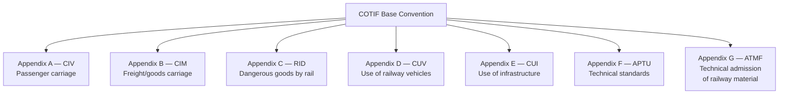
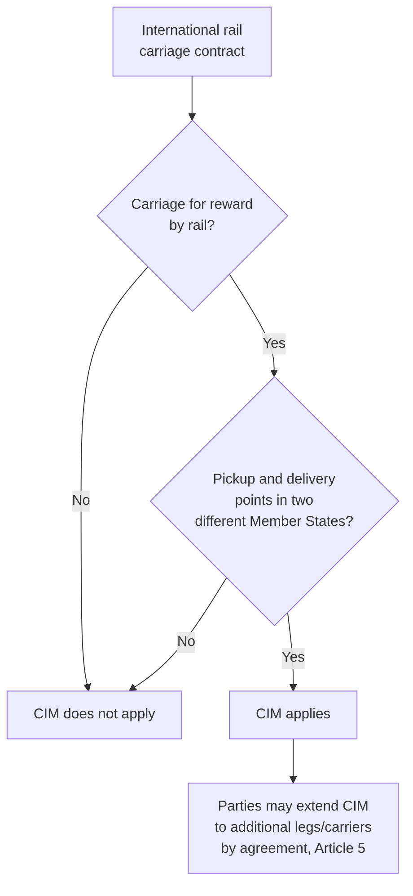
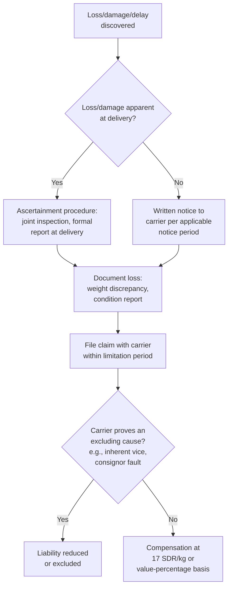

## Rail Carrier Liability Under COTIF and the CIM Uniform Rules

### Overview

International rail carrier liability for cargo is governed by **COTIF** — the Convention concerning International Carriage by Rail (*Convention relative aux transports internationaux ferroviaires*) — specifically its **Appendix B, the CIM Uniform Rules** (*Uniform Rules concerning the Contract of International Carriage of Goods by Rail*). COTIF is administered by **OTIF**, the Intergovernmental Organisation for International Carriage by Rail, headquartered in Bern. The original 1980 convention was substantially revised by the **1999 Vilnius Protocol**, which restructured COTIF into a base convention plus a series of lettered appendices (A through G), with CIM as Appendix B governing freight. CIM is the rail-transport analogue to the CMR Convention (road), Hague-Visby/Hamburg/Rotterdam Rules (sea), and Montreal Convention (air).

### Structure of COTIF (Post-Vilnius Protocol)

**Key Points**

- CIM (Appendix B) is the operative instrument for freight liability questions; RID (Appendix C) separately governs the safety/handling regime for dangerous goods by rail and is frequently relevant alongside CIM for hazardous cargo shipments.
- OTIF membership extends beyond the EU to encompass a wide geographic scope across Europe, North Africa, and parts of Asia via bilateral extension and member state accession, making CIM the dominant rail freight liability regime across this broad corridor.

### Scope of Application

CIM applies to every contract for the international carriage of goods by rail for reward when the place of taking over the goods and the place designated for delivery are situated in two different COTIF Member States, irrespective of the place of business and nationality of the contracting parties, applying "to every contract of carriage of goods by rail for reward when the place of taking over of the goods and the place designated for delivery are situated in two different Member States, irrespective of the place of business and the nationality of the parties to the contract of carriage." [lineas](https://prd.lineas.net/media/rc1b0nnk/cotif_appendix_b_cim.pdf)

**Key Points**

- As with CMR, CIM is designed to apply mandatorily once its scope conditions are met, though the carrier may voluntarily extend its liability and the CIM regime's application beyond the strict international leg by contractual agreement.
- A consignment note (transport document) is required in practice but, as with CMR and the air waybill, its absence, irregularity, or loss does not affect the existence or validity of the underlying contract of carriage — the transport document serves an evidentiary rather than constitutive function.

### Period of Responsibility and Basis of Liability

The carrier's liability period runs from the time the carrier takes over the goods from the consignor until the time the carrier delivers the goods to the consignee. The carrier is liable for loss, damage, and delay occurring during this period, but is relieved of liability where the loss, damage, or delay resulted from the fault of the person entitled (consignor/consignee), their instructions, the inherent nature of the goods, or circumstances the carrier could not avoid and the consequences of which it was unable to prevent.

**Specific grounds excluding carrier liability** include: carriage in an open, unsheeted wagon where agreed; lack of or inadequate packaging; loading performed by the consignor; the particular nature of certain goods exposed to loss (breakage, rust, deterioration); insufficient or inadequate marking/numbering of packages; and carriage of live animals.

### Liability Limits

Under the current CIM Uniform Rules (Vilnius Protocol/1999 regime), the carrier's maximum liability for total or partial loss of goods is set at **17 SDR per kilogram of gross mass lost or missing** (Article 30, §2 CIM), as an alternative to a percentage-of-value basis (Article 32, §1 CIM) ascertained at the place of destination. Article 23 ff. of the CIM Uniform Rules regulates the carrier's liability between the time of taking over of the goods and the time of delivery, and the maximum limit of the carrier's causal liability toward the customer in the event of total or partial loss is set at 17 SDR (approximately 23 EUR) per missing kilogram of gross mass, or a percentage of the loss in value of the goods ascertained at the place of destination. [cit-rail](https://cit-rail.org/de/cit-news/article/203/the-cim-working-group-resumes-with-fresh-momentum-in-2025/)

$$L_{CIM\ loss/damage} = 17 \times W_{kg,\ missing\ or\ damaged}$$

For **delay claims**, compensation under CIM is capped at **four times the carriage charges**, per multiple industry summaries of the regime, with delay compensated at "four times the carriage charges" for COTIF-CIM international shipments. [un](https://digitallibrary.un.org/record/566920/files/A_CN.9_WG.III_WP.53-EN.pdf)

$$L_{CIM\ delay} = 4 \times Freight_{charges}$$

**Key Points**

- CIM's per-kilogram figure (17 SDR/kg) is notably higher than CMR's road-carriage figure (8.33 SDR/kg) and matches the Montreal Convention's air cargo figure — a useful cross-modal reference point when comparing liability exposure across transport legs in a multimodal routing.
- As with CMR and the maritime/air regimes, a shipper can typically declare a higher "interest in delivery" value at the time of contracting (subject to a supplementary charge) to secure a higher liability ceiling than the statutory per-kilogram limit.

### Time Bar

Claims arising under CIM are generally subject to a **one-year limitation period**, extended to a longer period (commonly cited as three years, consistent with the pattern seen in CMR) in cases of willful misconduct or an equivalent degree of fault. [Unverified — the precise extended limitation period and its exact triggering standard should be confirmed against the current consolidated CIM text, as this detail was not fully confirmed in available sources for this response]

### Comparative Summary: CIM vs. Other Unimodal Regimes

| Feature | CIM (Rail) | CMR (Road) | Montreal (Air, cargo) | Hague-Visby (Sea) |
| --- | --- | --- | --- | --- |
| Liability limit basis | 17 SDR/kg | 8.33 SDR/kg | 17 SDR/kg | Higher of per-package or per-kg |
| Delay compensation | Capped at 4× carriage charges | Capped at carriage charges | Less standardized for cargo | Not standard |
| Governing body | OTIF | UNECE (originating) | ICAO/depositary states | IMO-adjacent, national implementation |
| Geographic reach | Europe, North Africa, parts of Asia (OTIF members) | Primarily Europe and adjoining regions | Global (broad ratification) | Global (major shipping nations) |
| Document negotiability | Non-negotiable | Non-negotiable | Non-negotiable | Can be negotiable |

### Claims Process Workflow

### Example

A shipment of 4,000 kg of industrial equipment is carried by rail from Germany to Poland under a CIM consignment note. Part of the shipment (500 kg) is confirmed lost in transit due to circumstances not attributable to the consignor.

$$L_{max} = 17 \times 500 = 8{,}500\ SDR$$

1. Loss is ascertained via a joint inspection/formal report procedure at the point of delivery (or discovery).
2. The consignee documents the shortfall against the consignment note's stated gross weight.
3. A claim is filed with the carrier within the applicable limitation period.
4. Absent a successful carrier defense (e.g., proof the loss stemmed from inherent vice of the goods or consignor-caused packaging deficiency), compensation is capped at 8,500 SDR for the lost portion — converted to the relevant currency — again illustrating the liability gap between statutory carrier liability and the goods' actual commercial value that drives demand for first-party cargo insurance.

### Relevance to Multimodal and Trade Compliance Planning

- **Modal liability comparison** — logistics and compliance professionals routing cargo via rail (e.g., China-Europe rail corridors, intra-European rail freight) should factor CIM's 17 SDR/kg limit into risk and insurance planning, noting it is materially higher than the CMR road-carriage limit for the same cargo weight.
- **Multimodal contracts** — where a single movement combines rail with other modes (rail-sea, rail-road), the applicable liability regime for a given leg typically depends on where the loss occurred (a "network system" approach common across combined transport documents), making documentation of the loss location commercially significant.
- **RID overlay** — for dangerous goods moved by rail internationally, RID (COTIF Appendix C) compliance operates alongside, not instead of, CIM's liability framework.

**Related Topics**

- Road Carrier Liability and the CMR Convention
- Sea Carrier Liability: Hague, Hague Visby, Hamburg, and Rotterdam Rules
- Air Carrier Liability and the Montreal Convention
- Marine Cargo Insurance Fundamentals
- Multimodal Transport Documents and Combined Transport Liability
- RID: International Carriage of Dangerous Goods by Rail