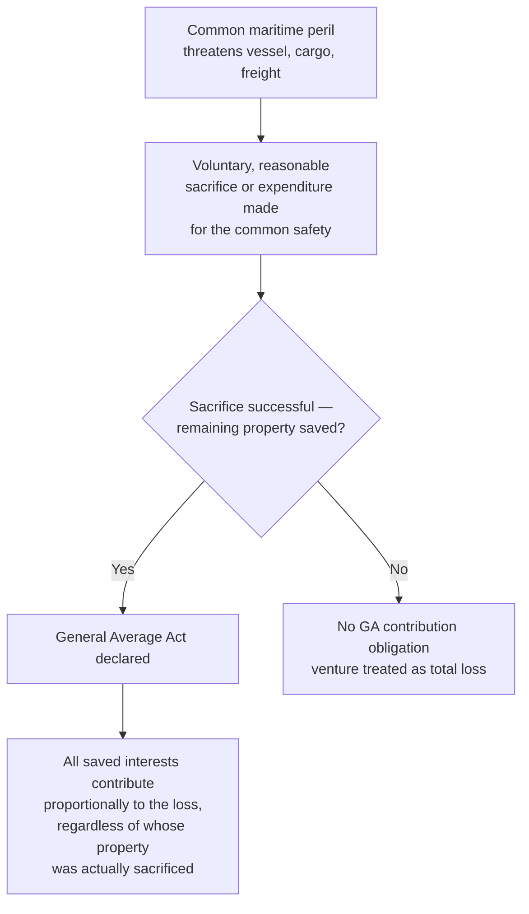
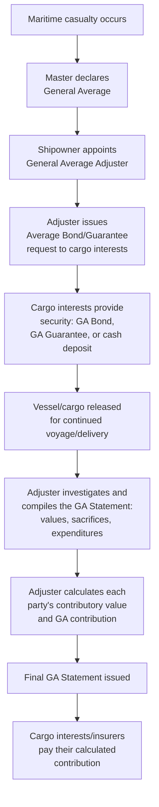
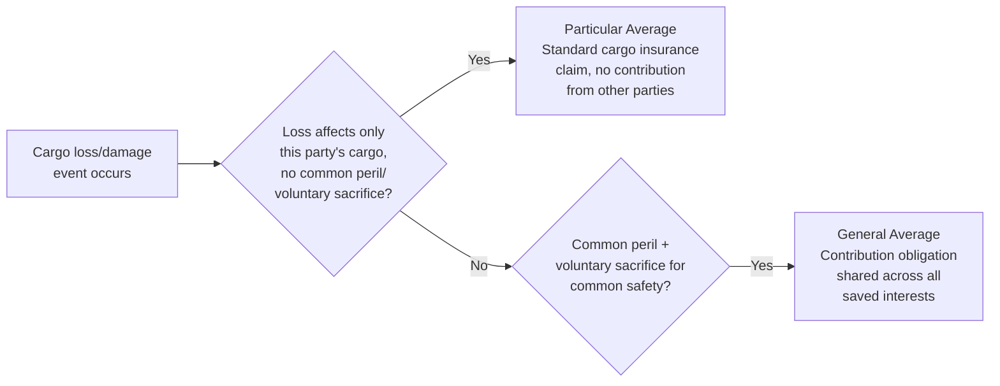

## General Average and Claims Handling

### Overview

General average is one of the oldest surviving doctrines in maritime law — a principle whereby extraordinary sacrifices or expenditures intentionally and reasonably made for the common safety of a marine venture (the vessel, cargo, and freight at risk) are shared proportionally among all parties whose property was saved by the sacrifice. Unlike particular average (an ordinary insured loss affecting only one party's property), general average creates a legal obligation for cargo owners to contribute financially even when their own goods were undamaged, simply because they benefited from the sacrifice that saved the common venture.

### Foundational Principle

**Key Points**

- Three conditions must generally be met for a valid general average act: (1) a common peril threatening the entire venture, (2) a voluntary and intentional sacrifice or extraordinary expenditure, and (3) the sacrifice must be reasonable and successful in preserving the remaining property.
- General average is fundamentally different from an ordinary insurance claim — it is a *contribution obligation between cargo interests and the shipowner*, not directly a claim against an insurer, though cargo insurance typically covers the insured's GA contribution as part of standard coverage.
- The doctrine predates modern insurance by centuries and reflects ancient maritime custom (often traced to Rhodian sea law) formalized into modern international practice via the **York-Antwerp Rules**.

### The York-Antwerp Rules

Because general average is a matter of contract (incorporated by reference into the bill of lading) rather than a self-executing international treaty, the **York-Antwerp Rules** (first adopted 1890, most recently revised in 2016, with the 1994 and 2004 versions also still in common contractual use) provide the standardized set of rules almost universally incorporated into bills of lading and charter parties to govern how general average is adjusted.

**Key Points**

- Multiple versions of the York-Antwerp Rules remain in concurrent commercial use (1974, 1994, 2004, 2016) because the applicable version is whichever one the bill of lading or charter party specifies — there is no single mandatory global version.
- The Rules are organized into lettered "Rule Paragraph" (numbered Rules I through XXII plus lettered Rules A through G in some versions) covering both general principles and specific categories of sacrifice/expenditure.

### Common Examples of General Average Acts

| Category | Example |
| --- | --- |
| **Sacrifice** | Jettison of cargo to lighten a stranded/distressed vessel |
| **Sacrifice** | Deliberate stranding of the vessel to avoid a worse casualty |
| **Sacrifice** | Fire-fighting damage to cargo/vessel (water damage from extinguishing a fire) |
| **Sacrifice** | Cutting away wreckage or damaged rigging to save the vessel |
| **Expenditure** | Cost of towage or salvage assistance to a vessel in distress |
| **Expenditure** | Port of refuge expenses — costs of entering a port of refuge, including cargo discharge/reloading, to effect necessary repairs |
| **Expenditure** | Extra fuel/time costs incurred to reach a port of refuge |

### The General Average Adjustment Process

**Key Points**

- The **General Average Adjuster** is a specialized maritime professional (often a member of the Association of Average Adjusters) appointed by the shipowner to investigate the casualty, determine which losses/expenditures qualify as general average, and calculate each party's proportional contribution — a process that can take months or years to finalize for complex casualties.
- Before cargo is released, the shipowner typically requires cargo interests (or their insurers) to provide **security** — commonly a **General Average Bond** (a personal undertaking to pay) combined with a **General Average Guarantee** from the cargo's insurer, or in some cases a cash deposit — because the shipowner has a maritime lien on the cargo for unpaid GA contributions.

### Contributory Value and the Adjustment Formula

Each party's GA contribution is calculated proportionally, based on the **contributory value** of their saved property relative to the total contributory value of the venture:

$$Contribution_{party} = \frac{V_{contributory,\ party}}{V_{contributory,\ total}} \times Loss_{general\ average}$$

Where:

- $V_{contributory,\ party}$ is generally the value of that party's property as actually saved (net of any general average sacrifice attributable to it), at the place and time the venture terminates.
- $Loss_{general\ average}$ is the aggregate of all amounts allowed as general average sacrifice and expenditure under the applicable York-Antwerp Rules.
- Freight at risk (earned only if the goods are delivered) and the vessel's value also contribute alongside cargo, apportioned across all three interests: ship, cargo, and freight.

### Role of Cargo Insurance in General Average

- **ICC (A), (B), and (C)** all typically cover the insured's general average contribution and any associated salvage charges, making this one of the few risk categories covered even under the narrowest ICC (C) form.
- The cargo insurer typically issues the **General Average Guarantee** directly to the shipowner/adjuster on the cargo owner's behalf, allowing the goods to be released without the cargo owner personally posting a cash bond.
- Because GA contribution is a contractual/legal obligation rather than a "peril," insurers cover it as a distinct insured item under the policy's general average clause, separate from the underlying cause of the casualty itself (which must still generally trace to an insured peril or, for ICC (A), simply not be excluded).

### Claims Handling: General Average vs. Particular Average

**Key Points**

- Most cargo losses in practice are **particular average** — an isolated loss to one shipment (e.g., water damage to a single container) that does not involve a common peril or a voluntary sacrifice for the benefit of the whole venture, and is handled as a standard first-party insurance claim.
- **General average** is comparatively rare but can involve very large aggregate sums (e.g., major container ship groundings or fires affecting thousands of containers), making it a significant contingent exposure for any cargo owner shipping by sea, even cargo that itself sustains no direct damage.

### Claims Handling Workflow (Practical Steps for a Cargo Owner)

1. **Notification** — the cargo owner/consignee receives notice from the carrier or adjuster that General Average has been declared for the voyage.
2. **Insurer notification** — promptly notify the cargo insurer, who will typically issue the required GA Guarantee directly to the adjuster.
3. **Documentation** — provide the adjuster with the commercial invoice and other documents establishing the contributory value of the cargo.
4. **Security provision** — insurer-issued guarantee (or cash deposit if uninsured) is provided to secure release of the cargo.
5. **Await adjustment** — the GA Statement can take a substantial period to finalize; the cargo owner/insurer's exposure remains open until the adjuster issues the final statement.
6. **Contribution payment** — once the final GA Statement is issued, the calculated contribution is paid (typically by the insurer, up to policy limits, on the insured's behalf).

### Example

A container vessel suffers an engine room fire mid-voyage. The crew successfully extinguishes the fire, but firefighting water damages several containers, and the vessel must divert to a port of refuge for repairs, incurring significant additional port and fuel costs.

1. **GA declaration** — the shipowner's P&I correspondent/adjuster declares General Average, as the fire constituted a common peril and the firefighting/diversion were voluntary, reasonable measures for the common safety.
2. **Security requested** — all cargo interests aboard (whether their specific containers were damaged or not) are asked to provide a GA Guarantee before their cargo is released.
3. **Cargo owner response** — a cargo owner whose containers were entirely undamaged still must provide security and will still owe a proportional contribution, because their goods benefited from the successful firefighting and continued voyage.
4. **Adjustment** — the adjuster calculates: (a) the value of cargo/equipment sacrificed or damaged by firefighting as GA sacrifice, (b) port of refuge and related extra expenses as GA expenditure, and (c) apportions the total across all cargo interests, the vessel, and freight based on contributory value.
5. **Settlement** — each cargo owner's insurer pays the calculated contribution under the policy's general average clause, typically without affecting the cargo owner's own separate particular average claim (if any) for directly damaged goods.

### Consequences of Non-Provision of Security

If a cargo interest fails to provide the required GA security, the shipowner is generally entitled to exercise a **lien on the cargo**, withholding delivery until security is posted — creating significant commercial pressure to respond promptly to a GA declaration even where the cargo owner's own goods are undamaged.

**Related Topics**

- Marine Cargo Insurance Fundamentals
- Institute Cargo Clauses A, B, and C
- Sea Carrier Liability: Hague, Hague Visby, Hamburg, and Rotterdam Rules
- Salvage Law and Salvage Awards
- Claims Documentation and Survey Reports