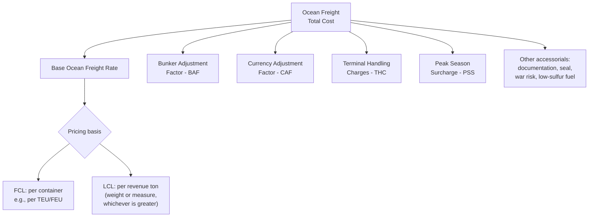
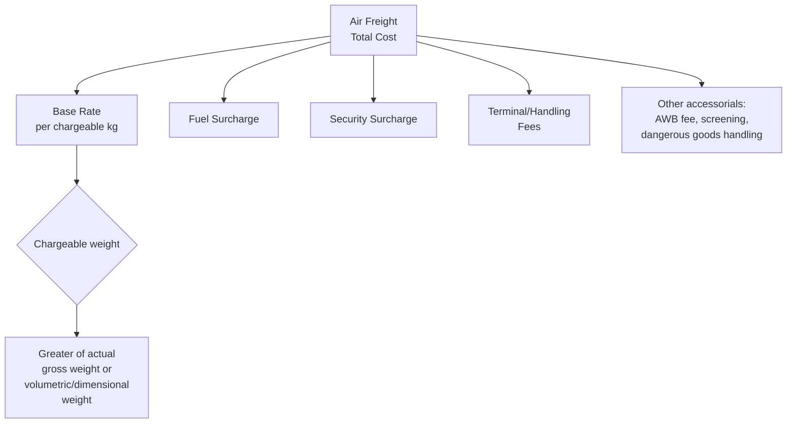
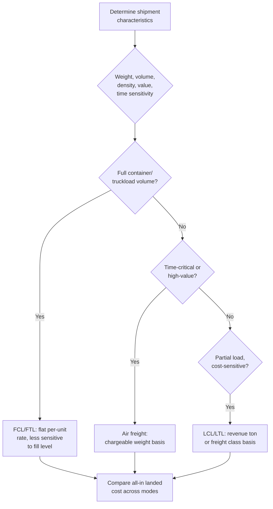

## Freight Rate Structures by Mode

### Overview

Freight rate structures define how carriers price the movement of cargo, and the underlying pricing logic differs substantially across transport modes due to differences in capacity constraints, cost drivers, regulatory frameworks, and market structure. Understanding how a rate is built — not just its final quoted figure — is essential to cost forecasting, carrier negotiation, and identifying which cost components are negotiable versus regulated/fixed.

### Ocean Freight Rate Structures

- **FCL (Full Container Load)** — priced per container (commonly per TEU — twenty-foot equivalent unit — or FEU — forty-foot equivalent unit), largely independent of how full the container actually is.
- **LCL (Less than Container Load)** — priced per **revenue ton** (also called "weight or measurement," W/M), the greater of actual weight or volumetric weight, since LCL consolidators charge for the space/weight a shipment occupies within a shared container.
- **Bunker Adjustment Factor (BAF)** — a variable surcharge passing through fuel cost volatility, adjusted periodically (monthly or quarterly) based on prevailing bunker fuel prices.
- **Currency Adjustment Factor (CAF)** — a surcharge protecting carriers against currency fluctuation risk where freight is quoted in a currency different from the carrier's cost base.
- **Terminal Handling Charges (THC)** — port-specific charges for handling the container at origin and destination terminals, distinct from the line-haul ocean freight itself.
- **Peak Season Surcharge (PSS)** — applied during high-demand periods (e.g., pre-holiday retail restocking) to ration scarce vessel capacity.

$$Rate_{FCL} = Base_{per\ container} + BAF + CAF + THC_{origin} + THC_{dest} + PSS + Accessorials$$

$$Rate_{LCL} = Base_{per\ revenue\ ton} \times \max(W_{ton},\ V_{cbm}/1) + Accessorials$$

(LCL revenue ton conversion commonly uses 1 cubic meter = 1 revenue ton as the volumetric threshold, though the exact conversion ratio varies by trade lane and carrier.)

### Air Freight Rate Structures

Air freight is priced on **chargeable weight** — the greater of actual gross weight or volumetric (dimensional) weight, since aircraft cargo capacity is constrained by both weight and volume.

$$W_{volumetric} = \frac{L_{cm} \times W_{cm} \times H_{cm}}{6{,}000}$$

$$W_{chargeable} = \max(W_{actual\ kg},\ W_{volumetric})$$

(The IATA-standard volumetric divisor of 6,000 cm³/kg is the most common convention; some carriers or cargo types use alternate divisors such as 5,000 or 7,000 depending on the specific tariff and commodity.) [Unverified — the applicable divisor should be confirmed with the specific carrier's current tariff, as conventions vary]

**Key Points**

- Air freight rates are typically structured in **weight breaks** (e.g., minimum charge, then per-kg rates for 45kg+, 100kg+, 300kg+ bands), with the per-kg rate generally decreasing as the weight band increases — but the total charge for a given shipment is calculated at whichever weight break produces the *lowest total cost*, so shippers sometimes benefit from "rating up" to a higher weight break.
- Air freight rates are more volatile and time-sensitive than ocean rates, often quoted for short validity periods given daily/weekly capacity and demand fluctuation.

### Ocean vs. Air: Chargeable Basis Comparison

| Mode | Pricing unit | Typical rate basis |
| --- | --- | --- |
| Ocean FCL | Per container (TEU/FEU) | Flat rate regardless of fill level |
| Ocean LCL | Per revenue ton (W/M) | Greater of weight or volume |
| Air | Per chargeable kg | Greater of actual or volumetric weight |
| Road (FTL) | Per shipment/trip, or per km/mile | Distance, vehicle type, sometimes weight-capped |
| Road (LTL) | Per weight class/hundredweight | Freight class, density, weight |
| Rail | Per container/wagon or per ton-km | Varies significantly by market structure |

### Road Freight Rate Structures

**Full Truckload (FTL):**

- Typically priced per shipment/trip or per mile/kilometer, reflecting that the truck is dedicated to a single shipper's cargo regardless of how full the trailer actually is.
- Cost drivers: distance, fuel surcharge (often indexed to a published diesel price index), equipment type (dry van, reefer, flatbed), and accessorials (detention, layover, tolls).

$$Rate_{FTL} = (Rate_{per\ mile} \times Distance) + Fuel_{surcharge} + Accessorials$$

**Less than Truckload (LTL):**

- Priced using a **freight class** system (in North America, the **NMFC — National Motor Freight Classification**), which groups commodities into classes (commonly 18 classes, ranging roughly from class 50 to class 500) based on density, stowability, handling, and liability.
- Lower freight class numbers generally indicate denser, easier-to-handle freight with lower rates; higher class numbers indicate lower-density, harder-to-handle, or higher-liability freight with higher rates.
- Rates are calculated per hundredweight (CWT) within the applicable class and weight break, subject to minimum charges.

$$Rate_{LTL} = Rate_{per\ CWT,\ class} \times \frac{W_{lb}}{100} + Accessorials$$

**Key Points**

- Freight class is determined largely by **density** (pounds per cubic foot) — low-density, bulky items (e.g., empty containers, foam products) typically receive a higher (more expensive) class than dense items (e.g., machinery) of the same weight.
- LTL carriers typically apply a base tariff (e.g., a CzarLite or similar published base rate) minus a negotiated discount percentage, meaning the effective rate a shipper pays is often a substantial discount off a nominal published tariff rather than the tariff rate itself.

### Rail Freight Rate Structures

- **Containerized intermodal rail** — typically priced per container (similar logic to ocean FCL), often as a combined door-to-door or ramp-to-ramp rate bundling rail line-haul with drayage.
- **Bulk/carload rail** — priced per railcar or per ton-mile/ton-kilometer, heavily influenced by commodity type, route, and whether the shipper owns/leases private railcars versus using carrier-supplied equipment.
- **Regulatory context** — rail freight pricing structures and the degree of regulatory oversight vary significantly by jurisdiction (e.g., differing common-carrier obligations and rate regulation frameworks between regions), which is a material factor in negotiating rail rates. [Unverified — the specific regulatory framework governing rail rate-setting should be confirmed for the jurisdiction and commodity in question, as this varies substantially by country]

### Rate Structure Selection Workflow

### Example: Comparing Chargeable Basis Impact

A shipment of lightweight but bulky packaging materials: 500 kg actual weight, dimensions yielding 4 cubic meters volume.

**Air freight chargeable weight** (using 6,000 divisor, dimensions in cm):

$$W_{volumetric} = \frac{4{,}000{,}000\ cm^3}{6{,}000} = 667\ kg$$

$$W_{chargeable} = \max(500,\ 667) = 667\ kg$$

The shipper is charged for 667 kg (volumetric), not the actual 500 kg — illustrating why low-density cargo is often disproportionately expensive to ship by air relative to its actual weight, and why LTL freight class systems apply a similar density-based logic for road transport.

**Ocean LCL revenue ton basis** (same shipment, 4 CBM vs 500 kg = 0.5 revenue ton by weight):

$$Rate_{basis} = \max(0.5\ ton,\ 4\ CBM) = 4\ revenue\ tons$$

The shipper is charged based on the 4 CBM volumetric figure, again illustrating that low-density cargo is priced by volume rather than actual weight across nearly all modes.

**Key Points**

- Low-density, high-volume cargo consistently triggers volumetric/dimensional pricing across ocean LCL, air, and road LTL — a critical packaging and cost-optimization consideration (e.g., compressing packaging, choosing denser packing configurations) regardless of mode.
- Comparing modes on a true all-in landed cost basis requires normalizing for these differing chargeable bases, not just comparing quoted "per kg" or "per ton" headline rates.

**Next Steps**

- Incoterms and Freight Cost Allocation
- Freight Forwarder Roles and NVOCC Structures
- Demurrage, Detention, and Accessorial Charges
- Freight Rate Negotiation and Contract Structures
- Landed Cost Calculation Methodologies