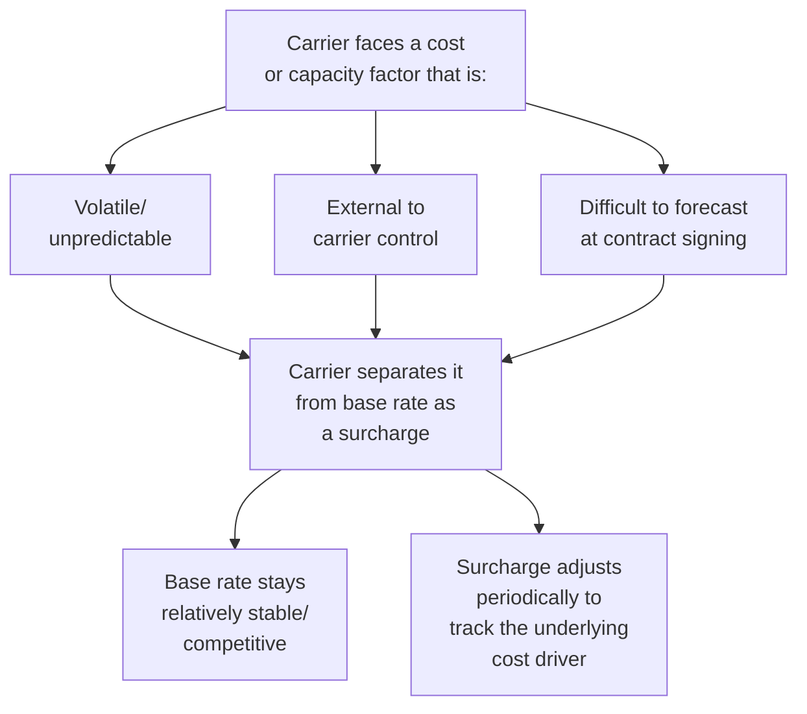
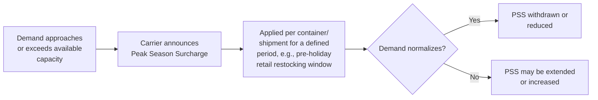
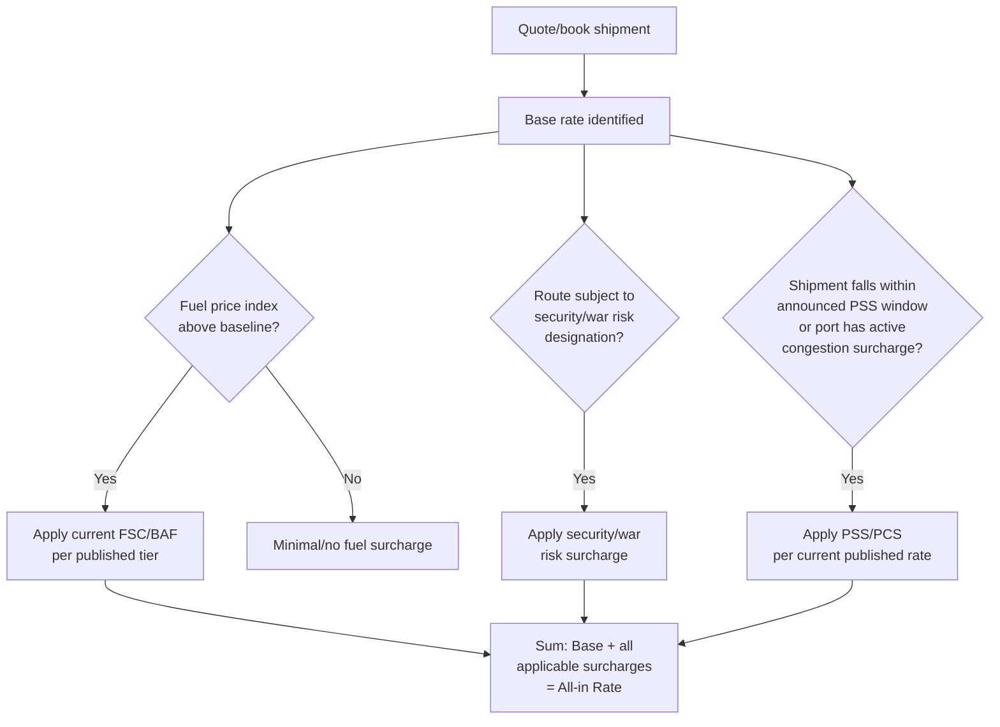

## Surcharges: Fuel, Security, Peak Season, and Congestion

### Overview

Surcharges are variable, ancillary charges layered on top of a carrier's base freight rate to pass through specific, often volatile or externally-driven cost factors that carriers prefer not to bake into their headline base rates. Because base rates are frequently the primary point of competitive comparison and contract negotiation, surcharges function as a mechanism for carriers to recover cost volatility, capacity constraints, or regulatory compliance costs without renegotiating the base rate itself — making them a critical, and sometimes contentious, component of total freight cost.

### Why Surcharges Exist (Structural Rationale)

**Key Points**

- Surcharges are typically published and adjusted on a defined cycle (weekly, monthly, or quarterly) rather than fixed for the life of a rate agreement, which base rates often are.
- Because surcharges can materially affect total landed freight cost, shippers negotiating rate contracts should scrutinize surcharge mechanisms and adjustment triggers as closely as the base rate itself — a low base rate with volatile, poorly-capped surcharges can produce a higher effective total cost than a higher base rate with more predictable surcharges.

### Fuel Surcharges

The most universal surcharge category across all modes, designed to pass through fuel price volatility without requiring base rate renegotiation.

| Mode | Common name | Typical basis |
| --- | --- | --- |
| Ocean | Bunker Adjustment Factor (BAF) / Bunker Surcharge | Indexed to bunker fuel price benchmarks, adjusted monthly/quarterly |
| Air | Fuel Surcharge (FSC) | Indexed to jet fuel price, often per-kg, adjusted periodically |
| Road | Fuel Surcharge (FSC) | Indexed to a published diesel price index (e.g., a national/regional average), adjusted weekly, often via a sliding scale table |

**Key mechanics:**

- Most road fuel surcharge programs use a **sliding scale table**: as the reference diesel price crosses defined thresholds (e.g., every $0.06–0.10 increment), the surcharge percentage or per-mile amount adjusts to the corresponding tier.
- Ocean BAF is sometimes further split into a **Low Sulphur Surcharge (LSS)** or similar, specifically passing through the incremental cost of compliant low-sulfur fuel required under environmental regulations (e.g., IMO 2020 global sulfur cap compliance).

$$FSC_{road} = Rate_{base} \times \left( \frac{P_{diesel,\ current} - P_{diesel,\ baseline}}{Increment} \right) \times Adjustment_{per\ increment}$$

### Security Surcharges

Charges recovering the cost of regulatory or carrier-imposed security compliance measures, most prominent in air cargo.

- **Air Security Surcharge (SCC/SEC)** — recovers costs associated with mandatory cargo screening, known shipper program compliance, and airport/aviation security regulations.
- **War Risk Surcharge** — a distinct, less frequent surcharge applied when a carrier's route transits an area of elevated conflict/piracy risk, reflecting increased war risk insurance premiums passed through to cargo.
- **ISPS (International Ship and Port Facility Security) charges** — ocean-specific charges recovering compliance costs with the ISPS Code, a security framework adopted by the IMO for ports and vessels.

### Peak Season Surcharges (PSS)

Applied by carriers — most visibly in ocean freight — during periods of unusually high demand relative to available capacity, functioning as a capacity-rationing and cost-recovery mechanism.

**Key Points**

- PSS is most associated with ocean container shipping ahead of major retail peak seasons (e.g., pre-holiday restocking in Q3/Q4 in many markets), when demand for container capacity on major trade lanes (particularly Asia-to-US/Europe lanes) spikes.
- PSS timing, magnitude, and duration are carrier-announced and can vary significantly year to year based on actual market conditions, making it one of the harder surcharge categories to forecast contractually.
- Air freight also experiences peak-season capacity and rate pressure (e.g., around major shopping periods), though it is more commonly reflected through general rate volatility than a formally labeled "PSS" line item. [Inference — labeling conventions vary by carrier and mode]

### Congestion Surcharges

Applied when carriers or terminals face abnormal operational delays or bottlenecks — port congestion, equipment shortages, or infrastructure strain — that increase the carrier's cost of serving a given port or lane.

- **Port Congestion Surcharge (PCS)** — applied by ocean carriers when a specific port experiences significant vessel waiting times, berth delays, or yard congestion, reflecting the carrier's increased vessel/equipment dwell costs.
- **Equipment shortage-related surcharges** — sometimes bundled into or applied alongside congestion surcharges when container/chassis availability becomes constrained at a given location.
- Congestion surcharges are typically **route- or port-specific** rather than blanket/global, reflecting the localized nature of the underlying operational disruption.

### Comparative Surcharge Summary

| Surcharge type | Primary driver | Typical mode(s) | Adjustment frequency |
| --- | --- | --- | --- |
| Fuel (BAF/FSC) | Fuel price volatility | All modes | Weekly to quarterly |
| Security (SCC/ISPS) | Regulatory compliance cost | Air, ocean | Relatively stable, periodic review |
| War Risk | Elevated conflict/piracy risk on specific routes | Ocean, air | Event-driven, route-specific |
| Peak Season (PSS) | Demand exceeding capacity | Primarily ocean | Seasonal, carrier-announced |
| Congestion (PCS) | Port/terminal operational delay | Ocean | Event-driven, port-specific |

### Surcharge Determination Workflow

### Example

An ocean FCL shipment from a major Asian export port to a US West Coast port during a high-demand pre-holiday period, where the destination port is also experiencing berth congestion.

**Illustrative components (values are illustrative, not current market rates):**

| Component | Amount (USD/container) |
| --- | --- |
| Base ocean freight | 1,800 |
| BAF (Bunker Adjustment Factor) | 250 |
| Terminal Handling Charges (origin + destination) | 300 |
| Peak Season Surcharge | 400 |
| Port Congestion Surcharge (destination) | 200 |
| **All-in rate** | **2,950** |

In this illustration, surcharges (BAF + THC + PSS + PCS) total $1,150 — over 60% of the base freight rate — demonstrating why total landed freight cost analysis must account for the full surcharge stack rather than comparing base rates alone. [Inference — the relative proportion of surcharges to base rate shown here is illustrative for demonstration purposes; actual proportions fluctuate substantially with market conditions and should not be treated as a typical benchmark]

### Commercial and Contractual Considerations

- **Surcharge caps and floors** — shippers negotiating annual or multi-year freight contracts often seek to negotiate caps on fuel surcharge escalation or minimum notice periods before a new surcharge (e.g., PSS or PCS) takes effect.
- **All-in rate quoting** — some carriers and forwarders offer "all-in" quotes bundling base rate and anticipated surcharges into a single figure, trading rate transparency for cost predictability; shippers should clarify whether an all-in quote is guaranteed or subject to later surcharge adjustment.
- **Surcharge transparency requirements** — in some jurisdictions, regulatory or industry transparency initiatives require carriers to publish surcharge schedules and provide advance notice of changes, though the specific requirements vary by regulatory regime and mode. [Unverified — specific current transparency/notice requirements vary by jurisdiction and regulatory body and should be confirmed against current regulations for the relevant trade lane]

**Related Topics**

- Freight Rate Structures by Mode
- Demurrage, Detention, and Accessorial Charges
- Freight Rate Negotiation and Contract Structures
- Incoterms and Freight Cost Allocation
- Landed Cost Calculation Methodologies