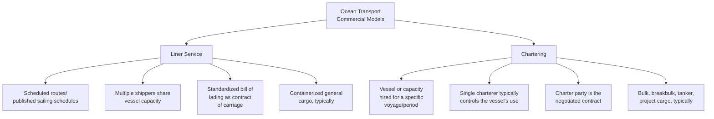
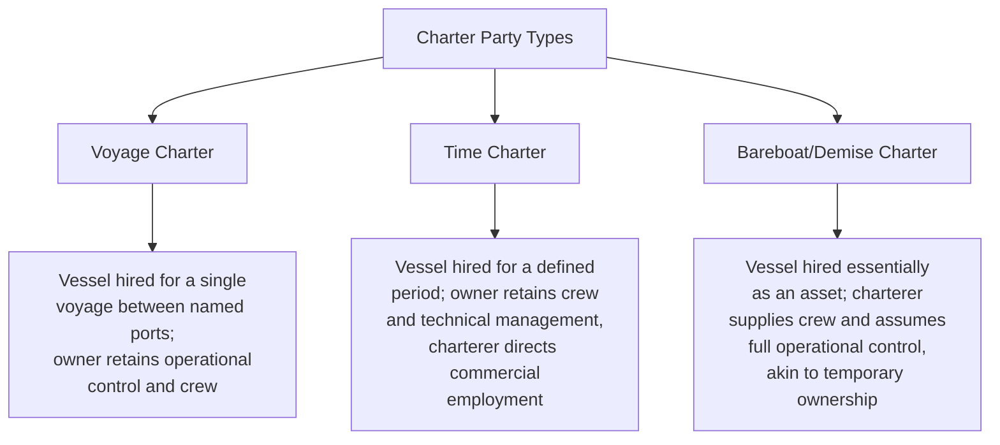
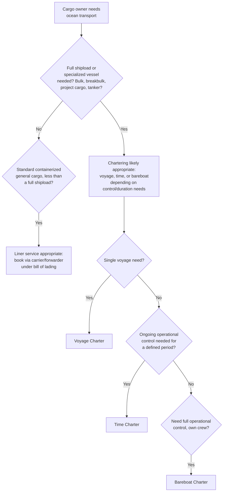

## Charter Parties Versus Liner Service Agreements

### Overview

Ocean transport commercially operates through two fundamentally distinct service and contracting models: **liner service** (scheduled, containerized, multi-shipper service operating under published tariffs and standardized bills of lading) and **chartering** (the hire of an entire vessel, or its capacity, under a negotiated charter party contract, typically for bulk, breakbulk, or project cargo). Understanding which model applies determines the governing contract type, the applicable liability regime, pricing mechanics, and the commercial flexibility available to the cargo interest.

### Structural Distinction

**Key Points**

- Liner service is a **common carriage** model — the carrier holds itself out to the public to carry goods for any shipper on published terms.
- Chartering is a **private contract of affreightment** negotiated bilaterally between the vessel owner (or disponent owner) and the charterer for that specific arrangement.
- The two models are not mutually exclusive within an industry — a single shipping company might operate liner container services on one set of routes while chartering out or in tonnage for bulk operations on another.

### Liner Service Agreements

**Key characteristics:**

- **Published schedules and tariffs** — liner carriers operate on fixed, advertised routes and sailing frequencies, with rates historically published in tariffs (though rate-setting has evolved significantly with the decline of conference systems in many jurisdictions).
- **Bill of Lading as contract** — the individual shipper's contract of carriage is the bill of lading (or sea waybill), typically a carrier's standard-form document incorporating the carrier's standard terms and conditions and the applicable cargo liability convention (Hague, Hague-Visby, Hamburg, etc.).
- **Service Contracts** — larger shippers often negotiate a **Service Contract** (in the US, a specific regulatory instrument under the Shipping Act framework) with a liner carrier or alliance, committing to a minimum volume in exchange for negotiated rates and service commitments over a defined period — distinct from, but complementary to, the individual bill of lading governing each shipment.
- **Vessel-Sharing Agreements (VSAs) and Alliances** — liner carriers frequently cooperate through alliances and slot-sharing arrangements, sharing vessel capacity across member lines on a given route without merging their individual commercial/pricing operations.

### Charter Parties

A **charter party** is the negotiated contract governing the hire of a vessel (or its cargo-carrying capacity), taking several distinct forms:

**Voyage Charter:**

- Charterer pays for the carriage of an agreed cargo quantity between specified load and discharge ports, for a single voyage (or a defined series of voyages).
- Owner bears voyage operating costs (fuel, port charges) and retains full operational/navigational control via its own master and crew.
- Freight is typically calculated per ton of cargo carried, or as a lump sum for the voyage.
- **Laytime and demurrage** are central concepts: the charter party specifies a permitted period (laytime) for loading/discharging, with **demurrage** payable by the charterer if that period is exceeded, and sometimes **despatch** payable by the owner if loading/discharging finishes early.

**Time Charter:**

- Charterer hires the vessel for a defined period (months to years), paying hire (typically calculated daily or per month, often quoted per deadweight ton).
- Charterer directs the vessel's commercial employment (which cargoes, which ports) within the charter party's trading limits, but the owner's crew remains responsible for navigation and vessel operation.
- Charterer bears voyage costs (fuel, port charges) during the charter period; owner bears vessel operating/capital costs (crew wages, maintenance, insurance).

**Bareboat (Demise) Charter:**

- Charterer takes the vessel essentially as a bare asset, supplying its own crew and assuming full operational, technical, and commercial control — functionally similar to a lease of the vessel itself.
- Owner's role is reduced to that of a financier/asset owner for the charter period; the charterer effectively becomes the disponent owner.

### Comparative Cost and Risk Allocation

| Cost/Responsibility | Voyage Charter | Time Charter | Bareboat Charter |
| --- | --- | --- | --- |
| Vessel crew and navigation | Owner | Owner | Charterer |
| Fuel (bunkers) | Owner | Charterer | Charterer |
| Port charges/canal dues | Owner | Charterer | Charterer |
| Vessel maintenance/insurance (hull) | Owner | Owner | Charterer (typically) |
| Commercial routing decisions | Owner (fixed voyage) | Charterer | Charterer |
| Freight/hire calculation basis | Per ton or lump sum, per voyage | Per day/month, per charter period | Per day/month, per charter period |

### Standard Charter Party Forms

Charter parties are typically based on standardized industry forms, negotiated and amended via rider clauses for the specific fixture, rather than drafted entirely from scratch:

- **GENCON** — a widely used general-purpose voyage charter party form (developed by BIMCO, the Baltic and International Maritime Council).
- **NYPE (New York Produce Exchange)** — a widely used standard time charter party form.
- **Asbatankvoy** — a common standard form for tanker voyage charters.
- Specific commodity trades (grain, coal, tankers) often have their own commonly used standard forms reflecting trade-specific customs and risk allocation.

### Liability Regime Differences

**Key Points**

- Liner shipments under a bill of lading are governed by the applicable cargo liability convention (Hague, Hague-Visby, Hamburg, or Rotterdam — see the corresponding topic on sea carrier liability), which applies mandatorily and cannot generally be contracted around to the cargo owner's detriment.
- Charter party liability is primarily a matter of the negotiated contract terms between owner and charterer — the parties have much greater freedom to allocate risk as they see fit, since a charterer (unlike an individual liner shipper) is typically viewed as a sophisticated commercial party capable of negotiating its own protections.
- Where a charter party vessel also issues bills of lading to third-party cargo owners (common when a charterer sub-lets cargo space), those bills of lading typically remain subject to the mandatory cargo liability convention as between the carrier and that third-party cargo interest, even though the charter party itself between owner and charterer is governed by its own separately negotiated terms.

### Selection Workflow: Which Model Applies

### Example

A mining company needs to export 50,000 metric tons of bulk iron ore from a single origin port to a single destination port, on a one-time basis.

1. **Model selection** — bulk cargo of this scale is not suited to liner container service; the company (or its trading counterparty responsible for freight) arranges a **voyage charter**.
2. **Vessel sourcing** — a shipbroker identifies a suitable bulk carrier and negotiates terms with the owner, typically using a standard form (e.g., a form appropriate to the ore trade) as the base, with rider clauses for specifics.
3. **Freight terms** — freight is agreed per metric ton of cargo loaded, with laytime specified for loading and discharge operations (e.g., a stated number of hours based on typical port loading rates).
4. **Demurrage exposure** — if loading at the origin port takes longer than the agreed laytime due to delays outside the owner's control, the charterer (cargo interest or its trading counterparty) owes demurrage for the excess time, calculated per the charter party's demurrage rate.
5. **Liability** — cargo loss/damage claims during the voyage are governed by the charter party's terms (as between owner and charterer) and, if a bill of lading is also issued for the cargo, by the applicable cargo liability convention as between the carrier and the cargo interest under that bill.

Contrast: the same mining company shipping a small quantity of packaged mining equipment spare parts would instead book space with a liner carrier via a standard container booking, receiving a bill of lading as the contract of carriage, with no charter party involved at all.

**Related Topics**

- Sea Carrier Liability: Hague, Hague Visby, Hamburg, and Rotterdam Rules
- Freight Rate Structures by Mode
- Demurrage, Detention, and Accessorial Charges
- Bills of Lading and Transport Documentation
- Freight Rate Negotiation and Contract Structures