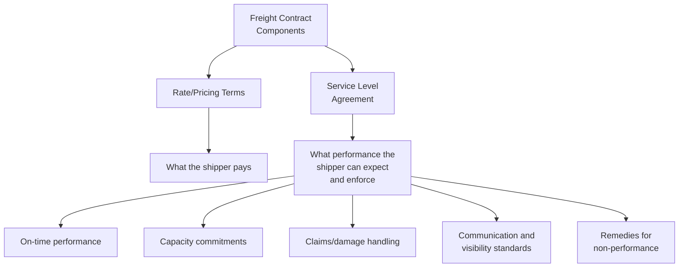
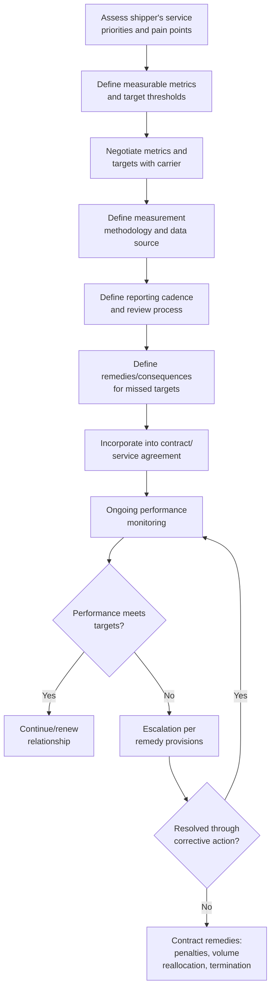

## Service Level Agreements with Carriers

### Overview

A Service Level Agreement (SLA) with a carrier is a negotiated commercial arrangement that defines measurable performance commitments — beyond price alone — governing how a carrier will service a shipper's freight. While rate negotiation determines cost, SLAs govern reliability, capacity assurance, responsiveness, and accountability, and are typically layered on top of (or embedded within) an underlying rate contract, service contract, or transportation agreement. Well-structured SLAs give shippers a contractual basis to hold carriers accountable and provide carriers with clearer expectations for capacity planning.

### Why SLAs Matter Beyond Rate Negotiation

**Key Points**

- A low freight rate with poor service reliability can produce a higher total cost of ownership than a higher rate with strong, enforceable service commitments — stockouts, expedited replacement shipments, and production disruptions from missed deliveries often exceed the rate premium of a more reliable carrier.
- SLAs are most impactful for shippers with meaningful negotiating leverage (significant volume, strategic lanes) — smaller or occasional shippers may have limited ability to negotiate custom SLA terms and instead rely on a carrier's standard service commitments.

### Core Components of a Carrier SLA

**1. On-Time Performance Metrics**

- **On-Time Pickup (OTP)** and **On-Time Delivery (OTD)** — typically defined against an agreed appointment window (e.g., within a defined number of hours/minutes of the scheduled time) and expressed as a target percentage (e.g., 95% OTD).
- **Transit time commitments** — defined expected transit duration for specific lanes, sometimes with a guaranteed-service tier at a premium price point.

**2. Capacity Commitments**

- **Volume/capacity guarantees** — a carrier's commitment to provide a defined level of capacity (e.g., a guaranteed number of containers/trucks per week) in exchange for the shipper's minimum volume commitment.
- **Tender acceptance rate** — the percentage of shipment tenders the carrier commits to accept under the agreement, particularly relevant in trucking where carriers can decline tenders during tight capacity markets.
- **Peak season/priority provisions** — how capacity commitments are honored (or adjusted) during high-demand periods.

**3. Communication and Visibility Standards**

- **Track-and-trace requirements** — expected frequency and method of shipment status updates (EDI, API integration, portal access, milestone messaging).
- **Exception notification timelines** — how quickly the carrier must notify the shipper of a delay, damage, or other service exception once known.
- **Proactive vs. reactive communication expectations** — whether the carrier is expected to flag issues proactively or only respond to shipper inquiries.

**4. Claims and Damage Handling**

- **Claims acknowledgment and resolution timelines** — committed response times for claim filing acknowledgment, investigation, and settlement.
- **Documentation requirements** — what the carrier commits to provide to support claims investigation (POD, photos, incident reports).
- Note: the underlying liability limits themselves (e.g., CMR's 8.33 SDR/kg, Montreal's 17 SDR/kg) are typically governed by the applicable convention/regulation rather than the SLA — the SLA instead governs the *process and responsiveness* around claims, not the fundamental liability cap.

**5. Quality and Compliance Standards**

- **Equipment condition standards** — cleanliness, maintenance, and suitability requirements for the cargo type (e.g., temperature-controlled equipment calibration for reefer freight).
- **Regulatory/certification compliance** — carrier commitments regarding safety ratings, insurance minimums, and applicable certifications (e.g., food safety certifications for food-grade transport, hazmat certifications).
- **Driver/crew conduct and safety standards** — particularly relevant for facility access and safety-sensitive environments.

### SLA Development and Negotiation Workflow

### Remedies and Consequences for Non-Performance

**Key Points**

- **Performance-based pricing adjustments** — some SLAs tie a portion of the rate (or a rebate/bonus structure) directly to performance metrics, rewarding carriers who exceed targets and penalizing those who fall short.
- **Volume reallocation rights** — the shipper reserves the right to shift volume away from an underperforming carrier toward alternate carriers in a multi-carrier routing guide, without necessarily terminating the relationship entirely.
- **Corrective action plans (CAPs)** — a structured process requiring the underperforming carrier to identify root causes and implement specific improvements within a defined timeframe before more severe remedies apply.
- **Termination rights** — contracts typically define specific performance thresholds or repeated failures that trigger a right to terminate the agreement, distinct from routine contract expiration.
- Enforceability of financial penalties for service failures varies by jurisdiction and contract law — some remedies are more practically enforceable (volume shifts, non-renewal) than direct monetary penalties, which can face legal scrutiny as unenforceable penalty clauses in certain jurisdictions if not structured as a genuine pre-estimate of loss (liquidated damages). [Unverified — enforceability of specific penalty/liquidated damages structures depends on the governing law of the contract and should be confirmed with qualified legal counsel for the specific jurisdiction]

### Measurement and Data Considerations

- **Data source alignment** — SLAs should specify whether performance is measured using the carrier's own reported data, the shipper's TMS (Transportation Management System) data, or a third-party/neutral data source, since discrepancies between carrier-reported and shipper-observed performance are a common source of dispute.
- **Appointment/window definitions** — precise definition of what counts as "on time" (e.g., delivery within a 2-hour appointment window vs. delivery by end of day) materially affects how favorably or unfavorably a given performance level is scored.
- **Exclusions and force majeure carve-outs** — SLAs typically exclude delays caused by factors outside carrier control (weather, port/customs delays, shipper-caused delays such as late cargo readiness) from performance calculations, requiring clear definition of what qualifies as an excusable delay.

### Comparative SLA Focus by Mode

| Mode | Typical primary SLA focus |
| --- | --- |
| Ocean (liner) | Schedule reliability, equipment availability, booking confirmation rates |
| Air | Space confirmation reliability, transit time adherence, temperature excursion rates (for sensitive cargo) |
| Road (FTL/LTL) | Tender acceptance rate, on-time pickup/delivery, claims ratio |
| Rail (intermodal) | Transit time consistency, equipment availability, terminal dwell time |
| Parcel/small package | On-time delivery percentage, first-attempt delivery success rate |

### Example

A consumer electronics importer negotiates an annual ocean freight service contract with a major carrier for a key Asia-to-US trade lane, incorporating the following SLA elements:

1. **Capacity commitment** — carrier guarantees a minimum weekly container allocation during the contract period, with a defined escalation process if bookings are rolled (bumped to a later sailing) beyond an agreed threshold.
2. **Schedule reliability target** — carrier commits to a target on-time arrival percentage (measured against the original published schedule for the booked sailing), reported monthly.
3. **Equipment availability** — carrier commits to providing containers meeting specified condition standards at the origin port within an agreed lead time of the booking.
4. **Exception communication** — carrier commits to notifying the shipper within a defined number of hours of any known vessel delay, rollover, or equipment shortage affecting a confirmed booking.
5. **Remedy structure** — repeated rolled bookings beyond the agreed threshold in a given quarter trigger a review meeting and, if unresolved, permit the shipper to reallocate a defined percentage of committed volume to a secondary carrier without breaching its own minimum volume commitment under the contract.
6. **Quarterly business review (QBR)** — both parties commit to a structured quarterly review of performance data against all agreed metrics, providing a formal forum to address emerging issues before they escalate to contract remedies.

### SLA Governance: Ongoing Relationship Management

**Key Points**

- SLAs are most effective when paired with a structured governance cadence (regular business reviews) rather than treated as a static contract exhibit reviewed only at renewal.
- Shippers with multi-carrier routing guides often use comparative SLA performance data across carriers to inform future volume allocation decisions at contract renewal, creating an ongoing performance-based competitive dynamic among carrier partners.

**Related Topics**

- Freight Rate Structures by Mode
- Freight Rate Negotiation and Contract Structures
- Charter Parties Versus Liner Service Agreements
- Demurrage, Detention, and Accessorial Charges
- Carrier Selection and Routing Guides