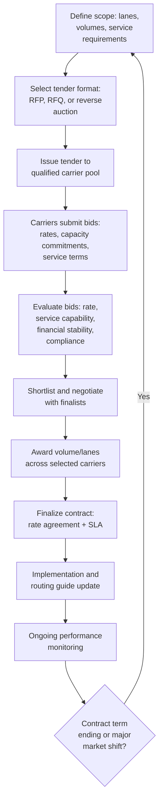
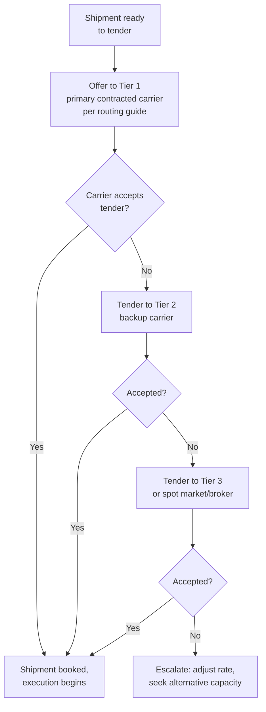

## Freight Tendering and Rate Negotiation


### Overview

Freight tendering and rate negotiation is the structured commercial process by which shippers solicit, evaluate, and contract freight capacity from carriers. It spans both the periodic strategic sourcing process (typically annual or multi-year tenders for base network capacity) and ongoing tactical negotiation (spot rate requests, mid-contract renegotiation, capacity crunch responses). The process directly determines a shipper's freight cost base and, combined with the Service Level Agreement layer, its overall carrier performance outcomes.

### Tendering Process Overview



### Tender Formats

**1. Request for Proposal (RFP)**

- Broader, more qualitative solicitation used when service capability, network fit, and strategic partnership potential matter as much as price.
- Carriers respond with detailed proposals covering rates, capacity, technology/visibility capability, service commitments, and sometimes value-added services.
- Typically used for large, strategic, or complex sourcing events (e.g., a full network-wide truckload RFP, an annual ocean service contract negotiation).

**2. Request for Quote (RFQ)**

- Narrower, more price-focused solicitation used when requirements are well-defined and the primary differentiator among qualified carriers is rate.
- Faster cycle time than a full RFP; often used for well-established, standardized lanes or modes.

**3. Reverse Auction**

- Carriers bid competitively against each other in real time (via an online platform), with rates typically decreasing as the auction progresses.
- Favors price as the dominant selection criterion; less suited to complex service requirements that are hard to standardize into a bid format.
- Can create carrier relationship friction if used excessively or without regard to service quality, since it emphasizes price competition over partnership.

**Key Points**

- Larger, more strategic sourcing events (annual network-wide bids, multi-year ocean contracts) typically favor RFP format to properly weigh service capability alongside price.
- Reverse auctions are most appropriate for high-volume, commoditized, well-specified lanes where service differentiation among qualified carriers is minimal.
- Many shippers use a hybrid approach: an initial RFP to qualify and shortlist carriers on capability/service, followed by a reverse auction or RFQ round among the shortlisted carriers to finalize pricing.

### Bid Evaluation Criteria

Beyond headline rate, a rigorous tender evaluation typically weighs:

- **Total cost, not just base rate** — including anticipated accessorials, fuel surcharge mechanism terms, and any minimum volume/revenue commitments.
- **Capacity reliability** — carrier's track record and stated capability to consistently service the committed volume, particularly during peak periods.
- **Financial stability** — carrier's financial health, relevant especially for smaller carriers or during periods of sector volatility, since carrier insolvency mid-contract creates significant supply chain disruption.
- **Compliance and safety record** — safety ratings, insurance coverage adequacy, regulatory compliance history.
- **Technology and visibility capability** — EDI/API integration capability, track-and-trace systems, TMS compatibility.
- **References and incumbent performance** — for carriers with an existing relationship, actual historical performance data; for new carriers, references from comparable shippers.

### Rate Negotiation Dynamics

```plaintext
===MERMAID_DIAGRAM">
flowchart LR
    A[Shipper Leverage<br/>Factors] --> A1[Committed volume size]
    A --> A2[Lane density/<br/>backhaul balance]
    A --> A3[Payment terms/speed]
    A --> A4[Multi-year commitment]
    B[Carrier Leverage<br/>Factors] --> B1[Capacity market<br/>tightness]
    B --> B2[Fuel/cost environment]
    B --> B3[Lane desirability<br/>for carrier's network]
    B --> B4[Shipper's payment<br/>history/reliability]
    A1 --> C[Negotiated Rate<br/>Outcome]
    A2 --> C
    A3 --> C
    A4 --> C
    B1 --> C
    B2 --> C
    B3 --> C
    B4 --> C
```

**Key Points**

- **Lane density and backhaul balance** materially affect achievable rates — a lane where a carrier can secure a return-haul load is generally priced more competitively than a "dead-head" lane requiring the carrier to reposition equipment empty.
- **Market capacity conditions** (tight vs. loose capacity market) shift negotiating leverage significantly between shippers and carriers over relatively short timeframes, particularly in trucking spot markets.
- **Committed volume and contract duration** are among the shipper's strongest levers — carriers generally price a guaranteed, predictable volume commitment more favorably than uncertain or purely spot-based business, since it supports the carrier's own capacity and network planning.

### Contract Rate vs. Spot Rate

| Dimension | Contract Rate | Spot Rate |
| --- | --- | --- |
| Duration | Fixed for a defined term (often annual) | Single shipment/short-term |
| Volume commitment | Typically tied to a minimum volume commitment | None |
| Rate stability | Stable for the contract term | Highly variable, reflects real-time market conditions |
| Typical use | Base/core network volume | Overflow capacity, unplanned needs, tight-capacity gap-filling |
| Negotiation venue | Formal RFP/RFQ tender process | Direct carrier/broker inquiry, digital freight marketplaces |

**Key Points**

- Most shippers operate a hybrid model: a contracted "primary" carrier for the bulk of predictable volume, supplemented by spot market capacity for overflow, seasonal peaks, or lanes with insufficient volume to justify a dedicated contract.
- During periods of tight capacity, spot rates can exceed contract rates significantly, creating an incentive for carriers to prioritize spot freight over contracted commitments unless the contract includes meaningful tender acceptance/capacity guarantee provisions (see Service Level Agreements with Carriers) with real consequences for non-performance.
- During periods of loose/soft capacity, spot rates can fall below contract rates, creating pressure from the shipper side to renegotiate or shift volume toward the spot market — underscoring why contract terms addressing mid-term rate review mechanisms are valuable to both parties.

### Freight Tendering Workflow (Tactical/Shipment-Level)

Distinct from the strategic annual sourcing process, day-to-day freight tendering refers to how individual shipments are offered to carriers within an established routing guide:



**Key Points**

- A **routing guide** codifies the tendering sequence (which carrier is offered a given lane's freight first, second, etc.) based on the outcomes of the strategic tender process — it operationalizes the negotiated contracts into day-to-day execution logic.
- **Tender acceptance rate** (the percentage of tenders a contracted carrier actually accepts, versus declining/rejecting) is a key performance metric feeding back into the SLA framework and future volume allocation decisions.

### Example

A mid-sized manufacturer runs its annual truckload freight tender covering 40 core lanes representing 80% of its national shipping volume.

1. **Scope definition** — the shipper compiles historical volume, lane, and service-level data for the 40 lanes to be tendered.
2. **Format selection** — given the scale and strategic importance, the shipper issues an RFP to a pool of 15 qualified carriers, requesting rate proposals alongside service capability responses (technology, safety record, capacity commitments).
3. **Bid evaluation** — proposals are scored on a weighted basis combining rate competitiveness, service capability, and carrier financial/safety profile, not rate alone.
4. **Award strategy** — rather than awarding all 40 lanes to a single carrier, the shipper diversifies awards across 5 primary carriers based on network fit (each carrier's strength on specific lane corridors) and to maintain competitive tension and capacity resilience.
5. **Contract finalization** — awarded carriers sign a one-year rate agreement incorporating an SLA (on-time performance targets, tender acceptance rate commitments) and a fuel surcharge mechanism indexed to a published diesel price table.
6. **Routing guide implementation** — the shipper's TMS is updated so that each lane's freight is automatically tendered first to its designated primary carrier per the new contract, with designated backup carriers for each lane in case of tender rejection.
7. **Mid-year review** — if a specific lane's contracted carrier consistently underperforms on tender acceptance or on-time delivery, the shipper uses SLA remedy provisions to shift volume toward a backup carrier ahead of the next full tender cycle.

**Related Topics**

- Freight Rate Structures by Mode
- Service Level Agreements with Carriers
- Surcharges: Fuel, Security, Peak Season, and Congestion
- Charter Parties Versus Liner Service Agreements
- Carrier Selection and Routing Guides