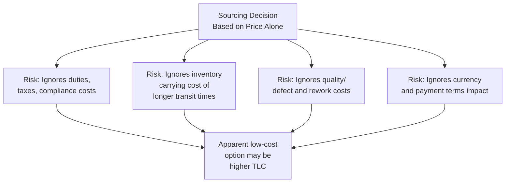
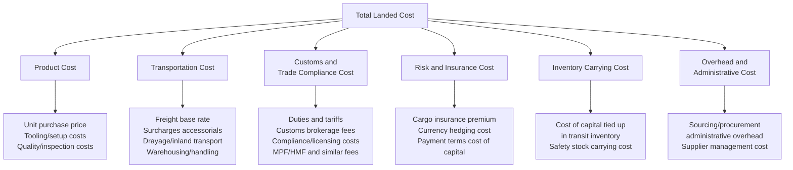
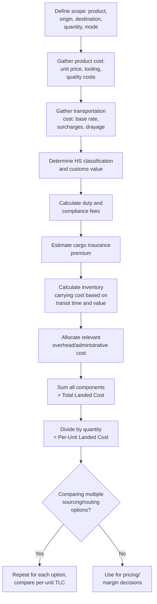

## Total Landed Cost Calculation

### Overview

Total Landed Cost (TLC) is the fully-loaded cost of acquiring, transporting, and delivering a product to its final destination, encompassing every cost element incurred from the point of origin through to the buyer's receiving dock — not merely the purchase price or the freight rate in isolation. TLC is the essential analytical framework for comparing sourcing options, evaluating mode/routing decisions, and setting accurate product costing, since a lower unit purchase price or a lower quoted freight rate can be offset (or even reversed) by other cost components that are easy to overlook in isolation.

### Why Purchase Price and Freight Rate Alone Are Insufficient

**Key Points**

- Comparing two suppliers or two sourcing origins purely on unit price or FOB freight cost is one of the most common and costly errors in procurement and supply chain decision-making.
- TLC analysis is especially critical when comparing sourcing options across different countries of origin, since duty rates, compliance burden, and transit time can vary substantially even for functionally identical products.

### Core Components of Total Landed Cost

### 1. Product Cost

- **Unit purchase price** — the base negotiated price per unit, typically the starting point but rarely the full picture.
- **Tooling, setup, and minimum order quantity (MOQ) amortization** — one-time or per-order costs amortized across the relevant unit volume.
- **Quality and inspection costs** — third-party inspection fees, defect/rework rates, and their associated cost impact, which can vary meaningfully by supplier/origin.

### 2. Transportation Cost

Covers the full physical movement cost stack (see Freight Rate Structures by Mode and Surcharges topics for detail):

- Base freight rate (mode-specific pricing basis).
- Applicable surcharges (fuel, security, peak season, congestion).
- Origin and destination drayage/inland transportation.
- Terminal handling, warehousing, and cross-dock/consolidation charges.

### 3. Customs and Trade Compliance Cost

- **Duties and tariffs** — calculated per the applicable HS classification, customs valuation method, and country of origin (including any trade remedy duties such as AD/CVD or Section 301/232 where applicable — see the corresponding customs compliance topics).
- **Customs brokerage fees** — fees charged by a licensed customs broker for entry preparation and filing.
- **Compliance and licensing costs** — costs associated with obtaining required import/export licenses or permits.
- **Processing fees** — administrative fees such as the US Merchandise Processing Fee (MPF) or Harbor Maintenance Fee (HMF), or equivalent charges in other jurisdictions.

$$Duty = V_{customs} \times Rate_{duty}$$

### 4. Risk and Insurance Cost

- **Cargo insurance premium** — the cost of marine/air cargo coverage (see Marine Cargo Insurance Fundamentals), which itself varies by declared value, ICC coverage level, and commodity risk profile.
- **Currency risk/hedging cost** — where transactions occur in a foreign currency, the cost of hedging instruments or the unhedged exposure to exchange rate movement between order and payment dates.
- **Cost of payment terms** — the implicit financing cost associated with payment terms (e.g., cash-in-advance vs. open account vs. letter of credit fees), which affects the buyer's cost of capital.

### 5. Inventory Carrying Cost

Often the most underweighted component in landed cost analysis, particularly when comparing sourcing options with meaningfully different transit times:

$$Cost_{carrying} = V_{inventory} \times r_{carrying} \times \frac{T_{days}}{365}$$

where $V_{inventory}$ is the value of inventory in transit or held as safety stock, $r_{carrying}$ is the annual carrying cost rate (typically expressed as a percentage reflecting cost of capital, storage, obsolescence, and shrinkage risk combined), and $T_{days}$ is the relevant holding/transit period.

**Key Points**

- A longer transit time (e.g., ocean freight from a distant origin) ties up capital in transit inventory for longer, and often requires holding more safety stock to buffer against the longer, less flexible replenishment cycle — both of which add real cost not captured in the freight rate or purchase price alone.
- This is a primary reason a nearshoring or faster-transit sourcing option can sometimes produce a lower TLC than a lower-unit-price, longer-transit-time alternative, once inventory carrying cost is properly included.

### 6. Overhead and Administrative Cost

- Internal procurement, logistics, and trade compliance staff time attributable to managing a given supplier/lane relationship.
- Supplier relationship management and quality oversight costs, which can differ meaningfully by geography and supplier maturity.

### Total Landed Cost Formula (Summary)

$$TLC = P_{unit} \times Q + Freight_{total} + Duty + Fees_{compliance} + Insurance + Cost_{carrying} + Overhead_{allocated}$$

$$TLC_{per\ unit} = \frac{TLC}{Q}$$

### TLC Calculation Workflow

### Example: Comparing Two Sourcing Origins

A buyer is comparing 10,000 units of a product from two potential origins, evaluating landed cost rather than unit price alone.

| Component | Origin A | Origin B |
| --- | --- | --- |
| Unit price | $10.00 | $9.20 |
| Ocean freight (total, 10,000 units) | $8,000 | $14,000 |
| Duty rate | 3% | 8% |
| Transit time | 18 days | 35 days |
| Cargo insurance (approx.) | $300 | $320 |

**Origin A calculation:**

$$Product\ Cost = 10.00 \times 10{,}000 = 100{,}000$$

$$Customs\ Value \approx 100{,}000 + 8{,}000 = 108{,}000$$

$$Duty = 108{,}000 \times 0.03 = 3{,}240$$

$$Carrying\ Cost \approx 108{,}000 \times 0.15 \times \frac{18}{365} \approx 799$$

$$TLC_A \approx 100{,}000 + 8{,}000 + 3{,}240 + 300 + 799 = 112{,}339$$

$$TLC_{A,\ per\ unit} \approx \$11.23$$

**Origin B calculation:**

$$Product\ Cost = 9.20 \times 10{,}000 = 92{,}000$$

$$Customs\ Value \approx 92{,}000 + 14{,}000 = 106{,}000$$

$$Duty = 106{,}000 \times 0.08 = 8{,}480$$

$$Carrying\ Cost \approx 106{,}000 \times 0.15 \times \frac{35}{365} \approx 1{,}524$$

$$TLC_B \approx 92{,}000 + 14{,}000 + 8{,}480 + 320 + 1{,}524 = 116{,}324$$

$$TLC_{B,\ per\ unit} \approx \$11.63$$

**Result:** Despite Origin B having a lower unit price ($9.20 vs. $10.00, an 8% apparent savings), the fully-loaded landed cost is actually *higher* per unit ($11.63 vs. $11.23) once freight, the higher applicable duty rate, and the longer transit time's carrying cost impact are included — illustrating precisely why TLC analysis is essential rather than optional for sourcing comparisons. [Illustrative figures used for demonstration; a real analysis requires accurate, current inputs for each cost component]

### Common Pitfalls in TLC Analysis

**Key Points**

- **Omitting inventory carrying cost** — the single most common gap, particularly when comparing near-source vs. far-source options with meaningfully different transit times.
- **Using outdated or placeholder duty rates** — duty rates change with trade policy actions (see Duties, Tariffs, and Import Taxes; Export Controls and Trade Sanctions); a stale duty assumption can materially skew the analysis.
- **Ignoring currency/payment terms cost** — particularly relevant for cross-border sourcing where invoicing currency and payment terms differ meaningfully between supplier options.
- **Failing to update TLC models when trade policy or freight market conditions shift** — TLC is not a one-time calculation but should be revisited periodically, especially for strategic, high-volume sourcing decisions, given the volatility of duty rates, surcharges, and freight capacity conditions.
- **Applying TLC inconsistently across comparison options** — using different assumptions (e.g., different carrying cost rates or overhead allocation methods) for each option being compared undermines the validity of the comparison.

### Applications of TLC Analysis

- **Sourcing decisions** — comparing supplier/origin options on a true cost basis, as illustrated above.
- **Make-vs-buy and nearshoring evaluations** — assessing whether shifting production closer to end markets reduces total cost once transit time, duty, and carrying cost effects are included, not just direct labor/production cost differentials.
- **Pricing and margin analysis** — ensuring product pricing reflects the true fully-loaded cost of goods delivered, not merely factory-gate or FOB cost.
- **Mode and routing selection** — evaluating whether a faster, more expensive freight mode (e.g., air vs. ocean) is justified by the resulting reduction in inventory carrying cost and stockout risk for time-sensitive or high-value goods.

**Related Topics**

- Freight Rate Structures by Mode
- Customs Valuation Methods
- Duties, Tariffs, and Import Taxes
- Surcharges: Fuel, Security, Peak Season, and Congestion
- Incoterms and Freight Cost Allocation