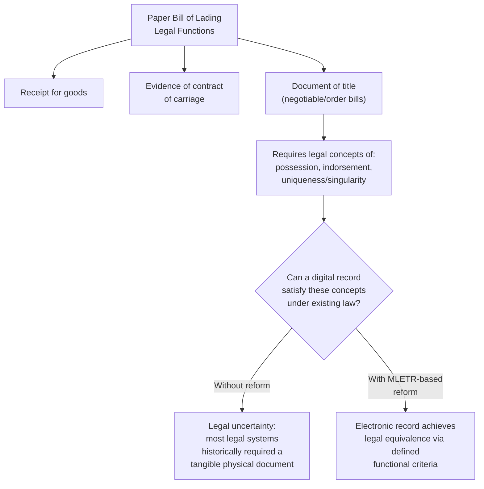
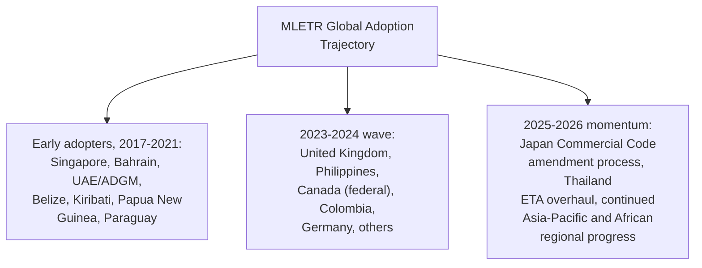
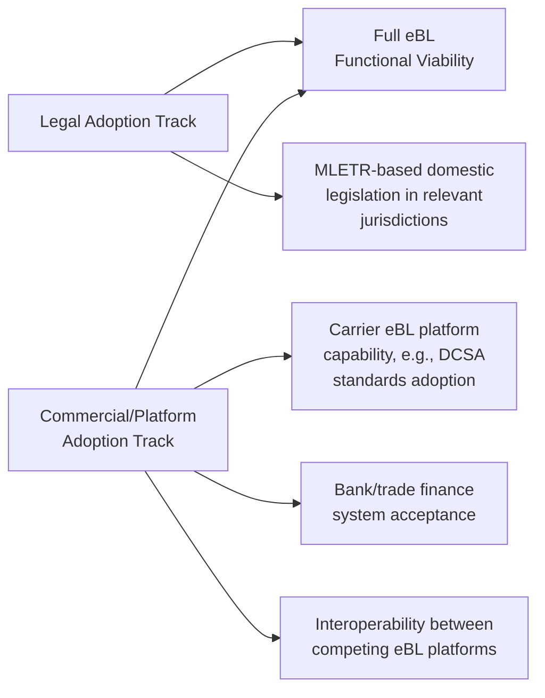
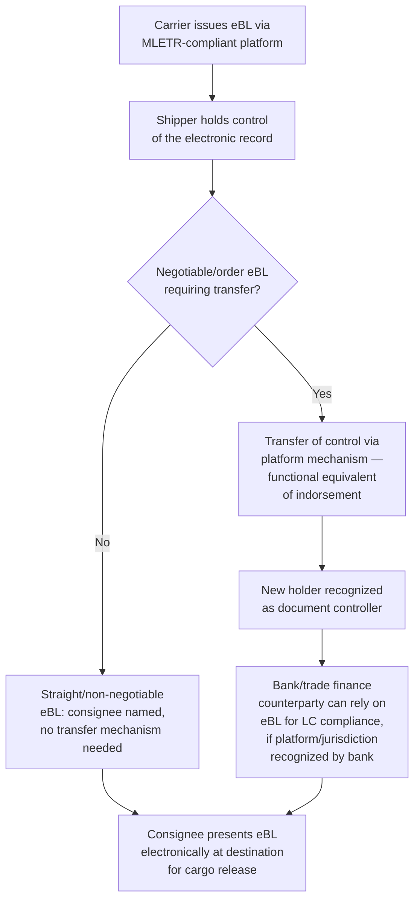

## Electronic Bills of Lading and the MLETR

### Overview

An electronic bill of lading (eBL) is the digital equivalent of the traditional paper bill of lading, intended to serve the same three legal functions — receipt for goods, evidence of the contract of carriage, and (for negotiable/order bills) a document of title — entirely in electronic form. The central legal obstacle to eBL adoption has historically been that most legal systems, developed for a paper-based commercial world, required a document of title to be a tangible, physical instrument capable of "possession" and "indorsement," concepts that do not translate naturally to a digital record. The **UNCITRAL Model Law on Electronic Transferable Records (MLETR)**, adopted in 2017, is the primary international legal framework designed to resolve this obstacle by enabling electronic records to achieve full legal equivalence with paper transferable documents.

### The Core Legal Problem MLETR Solves

**Key Points**

- The document-of-title function is the crux of the legal challenge — a straight (non-negotiable) bill of lading or a sea waybill is comparatively simple to digitize since it does not need to be "possessed" or transferred to pass title; a negotiable/order bill of lading, used extensively in letter-of-credit trade finance, is the harder case MLETR specifically addresses.
- Without a functioning eBL legal framework, an electronic record could serve as data/evidence but could not reliably replace the legal title-transfer function that the underlying commercial and trade finance system depends on for negotiable shipments.

### MLETR's Functional Equivalence Approach

Rather than mandating a specific technology, MLETR adopts a **technology-neutral, functional equivalence** approach — defining the legal functions a paper document performs and specifying criteria an electronic record must meet to achieve the same legal effect, regardless of the underlying technology (blockchain/DLT, centralized registry platforms, or other systems).

**Core requirements an electronic transferable record must satisfy (illustrative structure):**

- **Reliable method** — use of a reliable method to identify the electronic record as the electronic transferable record, to render it capable of being subject to control, and to retain its integrity.
- **Singularity/uniqueness** — a method ensuring the electronic record cannot exist in more than one authoritative, controllable instance at a time (addressing the double-spend/double-transfer risk inherent to digital copies).
- **Control** — a legal and technical concept substituting for physical "possession," identifying the person entitled to exercise control over the electronic record at any given time.
- **Integrity** — a reliable method to ensure the record has not been altered from the time of its creation, aside from any authorized change.

**Key Points**

- MLETR is a **model law**, not a treaty — it does not automatically apply in any country; each jurisdiction must separately enact domestic legislation adopting its principles for MLETR to have binding legal effect in that jurisdiction.
- Because MLETR is technology-neutral, jurisdictions implementing it do not mandate a specific platform or technology (e.g., blockchain is not required), leaving room for multiple competing eBL platforms to operate under the same legal framework provided they satisfy the functional criteria.

### Global Adoption Status

Adoption has accelerated significantly since MLETR's 2017 publication, though implementation remains uneven across major trading jurisdictions.

- Early implementers included Bahrain, Belize, Kiribati, Papua New Guinea, Paraguay, Singapore, the United Arab Emirates, and the Abu Dhabi Global Market free zone.
- By 2024, numerous additional countries had adopted MLETR-compatible laws, with the Philippines, Canada, Colombia, and Germany basing their laws on the UNCITRAL text. [aseanaccess](https://www.aseanaccess.com/news/1638-increased-usage-of-electronic-bills-of-lading-in-global-trade-pushed.html)
- The United Kingdom's Electronic Trade Documents Act 2023, based on MLETR, allows digital trade documents including bills of lading to have the same legal effect as paper documents provided reliable electronic systems are used. [judiciary](https://www.judiciary.uk/speech-by-the-master-of-the-rolls-getting-the-paper-out-of-international-trade-and-finance-why-not-now/)
- Japan has been preparing to amend its Commercial Code to permit electronic bills of lading consistent with MLETR principles, with a bill expected before its legislature with implementation targeted for a subsequent fiscal year, while broader Asia-Pacific progress includes ASEAN's negotiation of digital trade commitments under its Digital Economy Framework Agreement. [fiata](https://fiata.org/n/mletr-advances-eu-ics2-and-aviation-security-updates-and-upcoming-events/)
- In Africa, the African Continental Free Trade Area has embedded a commitment to MLETR within its Digital Trade Protocol. [fiata](https://fiata.org/n/mletr-advances-eu-ics2-and-aviation-security-updates-and-upcoming-events/)
- Thailand has separately been advancing a proposed overhaul of its Electronic Transactions Act incorporating MLETR-aligned principles for electronic transferable instruments. [Unverified — current legislative status should be confirmed against current Thai legislative records, as bills in process can be amended or delayed]

**Key Points**

- Adoption remains a patchwork — a shipment's eBL enforceability depends on whether *both* the relevant origin/destination jurisdictions (and often the governing law of the underlying contract) have enacted MLETR-based legislation, making cross-border consistency an ongoing practical challenge.
- The United States has not adopted MLETR directly; existing US law (notably UCC Article 7 provisions on electronic documents of title, and federal frameworks like UETA/E-SIGN) addresses electronic documents through a different, longer-standing legal architecture rather than MLETR adoption. [Unverified — the precise current interplay between MLETR and US electronic commerce law is a specialized legal question that should be confirmed with qualified counsel for any specific transaction]

### Commercial Adoption and Industry Momentum

Distinct from the legal/legislative adoption discussed above, actual commercial usage of eBLs has been growing but still represents a minority of global bill of lading volume.

Approximately 10% of bills of lading currently exist in digital form, though momentum is accelerating — an industry survey found that 49% of surveyed shipping companies, banks, and logistics operators reported using electronic bills of lading, up from 33% roughly two years earlier. The Digital Container Shipping Association (DCSA) has driven significant progress, with the world's top ten container shipping lines having committed to 100% eBL adoption by 2030. [tradefinanceglobal](https://www.tradefinanceglobal.com/?p=155810)[tradefinanceglobal](https://www.tradefinanceglobal.com/?p=155810)

**Key Points**

- Legal adoption (MLETR-based legislation) and commercial/technical adoption (carrier and platform capability) are two separate, mutually-reinforcing tracks — a legally sound eBL framework is of limited practical use without carrier platform capability and bank/trade-finance acceptance, and vice versa.
- **Interoperability** between competing eBL platforms (e.g., different registry/ledger providers used by different carriers) remains a practical friction point, as a shipper or bank interacting with multiple carriers may need to engage with multiple distinct eBL systems.

### Practical Mechanics of an eBL Transaction

### Benefits of eBL Adoption

- **Speed** — elimination of physical document courier time, particularly valuable on short transit lanes where paper documents can arrive after the vessel (a long-standing "original bill of lading crisis" problem on fast trade lanes).
- **Cost reduction** — industry projections have suggested full eBL adoption could yield billions of dollars in direct cost savings and unlock tens of billions in additional global trade by streamlining processes and reducing delays. [aseanaccess](https://www.aseanaccess.com/news/1638-increased-usage-of-electronic-bills-of-lading-in-global-trade-pushed.html)
- **Fraud reduction** — reduced risk of paper document forgery, loss, or duplicate presentation, given the "singularity" control mechanism MLETR-based systems require.
- **Environmental benefit** — reduction in physical courier logistics and paper usage, cited as a secondary benefit alongside the primary efficiency gains.

### Remaining Barriers

**Key Points**

- **Fragmented legal adoption** — as noted above, not all trading partners have enacted MLETR-based law, creating residual legal uncertainty for cross-border shipments touching non-adopting jurisdictions.
- **Bank and trade finance system readiness** — letters of credit and other trade finance instruments require the issuing/confirming bank's own systems and policies to accept eBLs, which has lagged carrier-side capability in some markets.
- **Platform interoperability** — the existence of multiple, sometimes non-interoperable eBL platforms creates friction, particularly for freight forwarders and banks that must interact with shipments across many different carriers.
- **Industry inertia and established practice** — decades of paper-based trade finance practice, training, and institutional familiarity represent a genuine adoption barrier independent of the legal or technical readiness of eBL systems.

### Example

A shipper in Germany exports goods to a buyer in Singapore under a letter of credit, with both Germany and Singapore having enacted MLETR-based legislation.

1. The carrier issues an eBL via its chosen MLETR-compliant electronic platform, rather than a paper bill of lading.
2. The shipper, as the initial holder/controller of the eBL, arranges for the negotiable eBL to be transferred (the platform's functional equivalent of indorsement) to the confirming bank as part of the letter of credit documentary presentation process.
3. Provided the confirming bank's own policies accept eBL presentation under that specific platform, the bank reviews the electronic documents for LC compliance without requiring physical document courier.
4. Upon payment/acceptance, control of the eBL is transferred to the buyer (or its bank, per the LC structure), who then presents the eBL electronically to the carrier's agent at the Singapore destination to secure cargo release — with both jurisdictions' MLETR-based law recognizing the electronic transfers as legally equivalent to paper indorsement and delivery throughout.

**Related Topics**

- Bills of Lading and Transport Documentation
- Charter Parties Versus Liner Service Agreements
- Letters of Credit and Trade Finance Documentation
- Sea Carrier Liability: Hague, Hague Visby, Hamburg, and Rotterdam Rules
- Digital Freight Platforms and Interoperability Standards