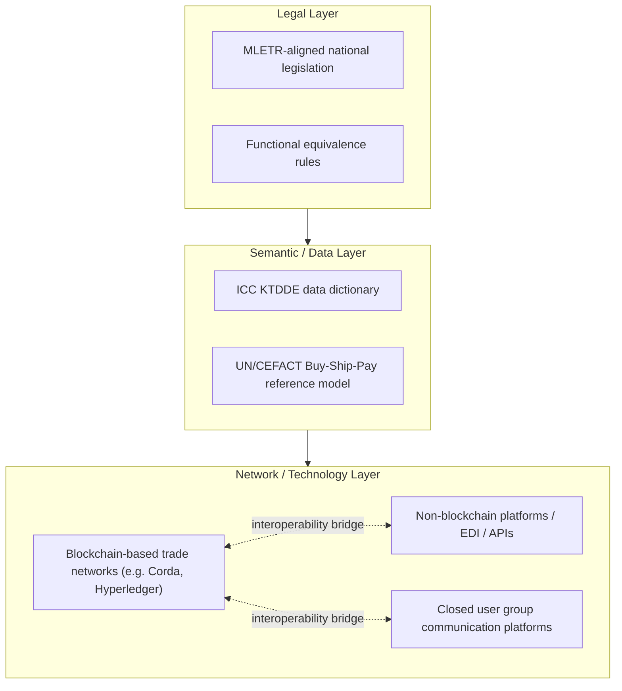
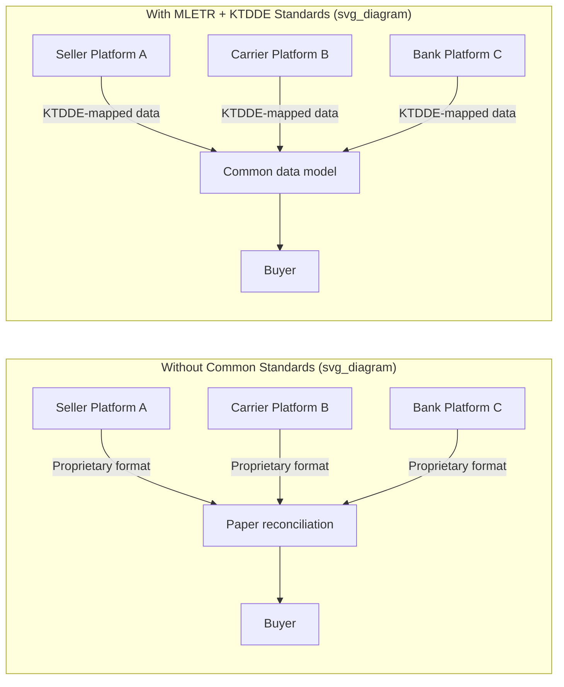

## ICC Digital Trade Standards and Interoperability Rules

### Definition and Scope

The ICC Digital Trade Standards and Interoperability Rules refer to the body of frameworks, legal instruments, and technical standards coordinated principally by the International Chamber of Commerce (ICC), through its **Digital Standards Initiative (DSI)**, to make electronic trade documents and data exchanges legally valid, technically consistent, and interoperable across jurisdictions, industries, and technology platforms. This body of work sits at the intersection of trade law, data standardization, and supply chain digitalization, and directly determines whether logistics and Incoterms-related documentation (bills of lading, certificates of origin, warehouse receipts, insurance certificates) can move as electronic records with the same legal standing as paper.

The core problem this framework addresses is **"digital islands"**: proprietary blockchain networks, port community systems, and carrier platforms that each digitize trade documents in incompatible formats, forcing parties back onto paper (or manual re-keying) whenever a transaction crosses network boundaries.

### The ICC Digital Standards Initiative (DSI)

**Key Points**

- Launched 4 March 2020 as the **ICC Digital Trade Standards Initiative**, later renamed the **Digital Standards Initiative (DSI)**.
- A collaborative cross-industry effort to enable the standardisation of digital trade, building on prior initiatives aiming to digitise trade through open trade and technology standards that promote interoperability. [iccwbo](https://iccwbo.org/news-publications/news/digital-trade-standards-initiative-launches-under-the-umbrella-of-icc/)
- Formalised as an independent entity with seed funding from the Asian Development Bank (ADB) and the government of Singapore, headquartered in Singapore. [gtreview](https://www.gtreview.com/news/fintech/icc-lands-funding-from-adb-and-singapore-govt-for-digital-trade-standards-initiative/)
- DSI traces part of its lineage to the Universal Trade Network (UTN), originally initiated by blockchain firms TradeIX and R3 together with banks in the Marco Polo network, whose initial focus was interoperability between Corda-based networks with a longer-term goal of becoming technology-agnostic to enable a "network-of-networks." [gtreview](https://www.gtreview.com/news/fintech/icc-lands-funding-from-adb-and-singapore-govt-for-digital-trade-standards-initiative/)
- Mandate: coordinate standardization of data formats and processes rather than duplicate existing standards bodies; membership is open across industries and geographies rather than restricted to a single consortium.
- Rationale given by ICC leadership: digitisation historically occurred through bilateral agreements requiring shared platforms, producing siloed data and bespoke trade-finance processes — DSI exists to connect these "digital islands" so market forces, not platform lock-in, drive customer experience improvements. [iccwbo](https://iccwbo.org/news-publications/news/digital-trade-standards-initiative-launches-under-the-umbrella-of-icc/)

### Core Standards and Frameworks Under DSI

**Key Trade Documents and Data Elements (KTDDE)**

A foundational DSI framework that defines standardized data elements for the most common trade documents (invoices, bills of lading, certificates of origin, packing lists). It establishes a common data dictionary so that a document generated on one platform maps predictably onto the same fields expected by a counterparty, bank, or customs authority on a different platform.

**UN/CEFACT Buy-Ship-Pay Reference Data Model**

DSI's KTDDE work is explicitly aligned with the **UN Centre for Trade Facilitation and Electronic Business (UN/CEFACT)** Buy-Ship-Pay Reference Data Model, which models the end-to-end trade transaction lifecycle (commercial, logistics, financial, and regulatory data flows) as a single semantic reference rather than siloed document types.

**Call to Action for Digital Trade**

A joint initiative between ICC DSI and UN/CEFACT (hosted by UNECE) launched to unify public and private sectors around adopting standards that ensure seamless data flow and robust digital trade processes, building on the KTDDE framework and the Buy-Ship-Pay Reference Data Model. It was announced at the 42nd UN/CEFACT Forum in Geneva, emphasizing standardized digital trade processes to reduce costs and build digital trust at scale. [etradeforall](https://etradeforall.org/fr/node/14025)[tradefinanceglobal](https://tradefinanceglobal.com/posts/joint-icc-unece-initiative-calls-enhanced-global-digital-trade-interoperability/amp)

**eATA Carnet (Digital ATA Carnet)**

[Unverified] ICC's digital ATA Carnet system (eATA) went live on 1 June 2026, transitioning from paper carnets — which allow temporary duty- and tax-free admission of cross-border goods for up to one year — across 30 countries spanning the 27 EU member states, Norway, Switzerland, and the UK. This is a concrete, deployed interoperability rollout directly relevant to logistics: it digitizes a customs instrument used heavily in exhibitions, trade shows, and temporary equipment movements. [esscert](https://www.esscert.com/press-room/digital-trade-insights-q2-2026)

### MLETR: The Legal Interoperability Layer

Technical standards alone cannot make an electronic bill of lading legally equivalent to a paper one — that requires domestic legal reform. This is the role of the **UNCITRAL Model Law on Electronic Transferable Records (MLETR)**, adopted by UNCITRAL in 2017, and it is the legal backbone that ICC DSI promotes and tracks.

**Core legal principles of MLETR**

- **Functional equivalence** — an electronic record can satisfy legal requirements that a paper document be used, provided the electronic record performs the same function.
- **Technology neutrality** — the law does not mandate blockchain, a specific database, or any particular technical architecture.
- **Model neutrality / uniform interpretation** — jurisdictions adopt the model law's substance while adapting it into domestic legislative form, with interpretation guided by MLETR's international origin to preserve uniformity across enacting states.

MLETR enables the legal use of electronic versions of transferable documents and instruments — such as bills of lading, promissory notes, and warehouse receipts — that traditionally rely on paper-based processes, giving them the same legal validity as their paper counterparts. Under MLETR, no party is required to use a mandated technology; closed user group solutions can operate purely as communication platforms exchanging MLETR-compliant digital originals. The only requirement is that the relevant jurisdiction adopts an enabling legal framework. [tradefinanceglobal](https://tradefinanceglobal.com/?p=131283)[tradefinanceglobal](https://www.tradefinanceglobal.com/?p=80765)

**Adoption status** [Unverified — figures below reflect recent reporting and are subject to further legislative change]

As of recent ICC DSI reporting, 61.5% of global exports come from economies that have either aligned with or committed to MLETR. France became the first EU member state to fully transpose MLETR into domestic law, via Decree No. 2025-811, establishing legal equivalence between paper and electronic transferable records with technical and legal safeguards covering reliability, integrity, and traceability. Countries that have adopted MLETR include Bahrain, Belize, France, Kiribati, Papua New Guinea, Paraguay, Singapore, Timor-Leste, the United Arab Emirates, and the United Kingdom (via the Electronic Trade Documents Act). MLETR provisions have also been embedded directly into trade agreements, including Article 8.4 of the Singapore–Australia Digital Economy Agreement, Article 2.3 of the Digital Economic Partnership Agreement (DEPA), and Article 14.4 of the Australia–UK Free Trade Agreement. [MLETR Advances, EU ICS2 and Aviation Security Updates, and Upcoming Events +3](https://fiata.org/n/mletr-advances-eu-ics2-and-aviation-security-updates-and-upcoming-events/)

[Inference] The wide variance in adoption timelines — reportedly as short as roughly one year in Belize versus multi-year processes elsewhere — suggests implementation speed correlates with the complexity of aligning MLETR against existing domestic commercial and evidentiary law (e.g., the UK's four-year process to enact the Electronic Trade Documents Act) rather than technical readiness.

**Ongoing legal reform tools**

ICC DSI's "Enabling digital trade through legal reform" guide notes that MLETR adoption remains uneven despite being a critical enabler of paperless trade, with global trade continuing to depend heavily on physically handled paper documents, slowing transactions, increasing costs, and exposing supply chains to risk. [Unverified] A related ICC DSI guide targets trade stakeholders directly, aiming to provide a clear, practical introduction to MLETR and how legal reform enables use of electronic transferable records (ETRs) across global trade and trade finance. [iccwbo](https://iccwbo.org/news-publications/guide/enabling-digital-trade-through-legal-reform-a-guide-for-policymakers-and-practitioners/)[esscert](https://www.esscert.com/press-room/digital-trade-insights-q2-2026)

### Relationship to Incoterms and Logistics Documentation

Digital trade standards and interoperability rules interact with Incoterms rules primarily through the **documentary obligations** each Incoterms rule assigns to buyer and seller:

| Incoterms Element | Document Type Affected | Interoperability Dependency |
| --- | --- | --- |
| Transfer of risk (e.g., FOB, CIF) | Bill of Lading (title document) | MLETR-enabled jurisdictions permit an electronic B/L to serve as a document of title with the same negotiability as paper |
| Proof of delivery (e.g., DAP, DPU) | Delivery note, waybill | Requires common data schema (KTDDE) so consignee systems can validate delivery data regardless of originating platform |
| Insurance obligation (CIF, CIP) | Insurance certificate | Interoperable standards allow certificates to be verified across insurer and bank platforms without re-keying |
| Customs clearance (all rules, export/import) | Certificate of origin, customs declarations, ATA Carnets | eATA and similar digitized customs instruments depend on multi-jurisdictional platform recognition |

[Inference] Because Incoterms rules themselves are silent on the *medium* of documentation (paper vs. electronic) and instead specify *who* bears the obligation to produce or accept a document, the enforceability of an electronic version of that document is entirely dependent on the underlying jurisdiction's legal treatment (MLETR alignment) rather than on the Incoterms rules text.

### Technical Interoperability Architecture (Conceptual)

The interoperability model promoted by DSI is best understood as a layered stack, separating legal validity, semantic data standards, and transport/network technology so that no layer forces a specific choice at another layer.

This layering explains why ICC DSI describes itself as technology-agnostic: standardization work concentrates on the legal and semantic layers, leaving network/technology choice to market participants.

### Illustrative Diagram: Trade Document Flow With and Without Interoperability

### Practical Example: Electronic Bill of Lading Under a CIF Contract

**Example**

A seller in France ships goods to a buyer in Singapore under **CIF** terms. The seller's freight forwarder issues an electronic bill of lading (eB/L) on a blockchain-based trade platform.

1. **Legal validity check**: Because France transposed MLETR via Decree No. 2025-811 and Singapore is an established MLETR-adopting jurisdiction, the eB/L can be treated as a functional equivalent of a paper bill of lading and retains its negotiability as a document of title in both jurisdictions.
2. **Data standardization check**: The eB/L's data fields (shipper, consignee, vessel, cargo description, freight terms) are mapped to KTDDE-defined elements so that the buyer's bank, operating on a different platform, can programmatically validate the document against a letter of credit without manual re-entry.
3. **Network interoperability check**: If the carrier's platform runs on a different distributed ledger than the bank's trade finance platform, an interoperability bridge (or a shared standard message format) allows the document's authenticity and endorsement chain to be verified across both networks.
4. **Outcome**: The buyer takes delivery against the electronic original; risk transfer under CIF occurred at the seller's port of shipment as usual, but the entire post-shipment documentary chain — negotiation, endorsement, bank presentation — occurred without paper.

[Inference] Failure at any one of these three checks (legal, semantic, or network) forces the transaction back to a paper workaround, which is the practical reason why MLETR adoption gaps between trading partner jurisdictions remain a primary bottleneck to end-to-end paperless trade even where technical platforms are fully interoperable.

### Key Organizations and Their Roles

- **ICC DSI** — coordinates cross-industry standards, publishes KTDDE, tracks MLETR adoption, issues policymaker guides, and delivers deployed instruments like eATA.
- **UNCITRAL** — authored and maintains MLETR as the model legal text for national adoption.
- **UNECE / UN/CEFACT** — maintains the Buy-Ship-Pay Reference Data Model and co-leads the Call to Action for Digital Trade.
- **UN ESCAP** — jointly maintains the MLETR adoption tracker with ICC.
- **National legislatures** — enact MLETR-aligned domestic law (e.g., UK's Electronic Trade Documents Act, France's Decree No. 2025-811).
- **Multilateral development banks (e.g., ADB)** — provide funding and research quantifying the economic case for adoption (e.g., projected export gains from full MLETR alignment).

### Common Pitfalls and Practical Considerations

- **Assuming technical interoperability implies legal validity.** A perfectly interoperable data format does not make an electronic document legally negotiable if the relevant jurisdiction has not enacted MLETR-aligned legislation.
- **Assuming MLETR mandates blockchain.** MLETR does not require any mandated technology — it establishes the legal framework, leaving the technology choice to market participants. [tradefinanceglobal](https://www.tradefinanceglobal.com/?p=80765)
- **Ignoring counterparty jurisdiction mismatch.** A transaction between an MLETR-adopting jurisdiction and a non-adopting one typically cannot rely on the electronic original functioning as a document of title in the non-adopting jurisdiction, forcing a hybrid paper/digital process.
- **Conflating DSI standards with a single mandatory protocol.** DSI's role is coordination and standard-setting, not operating a single mandatory network; adoption is voluntary and market-driven.

**Related Topics**

- UNCITRAL Model Law on Electronic Transferable Records (MLETR) — detailed legal mechanics
- Electronic Bills of Lading (eB/L) and negotiability under national law
- UN/CEFACT Buy-Ship-Pay Reference Data Model
- ICC eRules and eUCP (electronic presentation under documentary credits)
- Blockchain interoperability protocols in trade finance (Corda, Hyperledger Fabric, network-of-networks models)
- ICC ATA Carnet system and eATA digital rollout
- Trade Finance Distributed Ledger Technology (DLT) platforms (e.g., Marco Polo, we.trade legacy architectures)
- Digital Economy Agreements (DEA/DEPA) as legal vehicles for cross-border digital trade rules