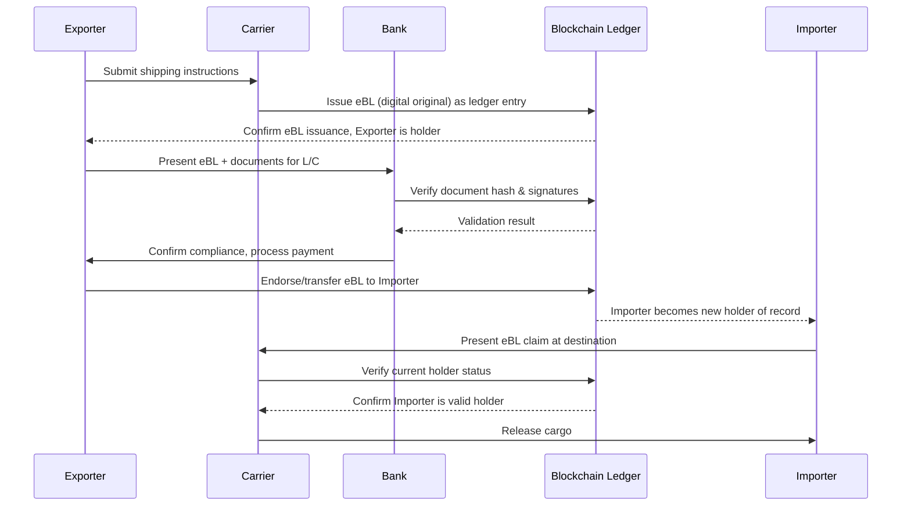

## Blockchain Applications in Trade Documentation

### Overview

Blockchain applications in trade documentation refer to the use of distributed ledger technology (DLT) to create, transmit, validate, and store trade-related documents — such as bills of lading, letters of credit, certificates of origin, and customs declarations — in a shared, tamper-evident digital format. The objective is to replace paper-based or siloed electronic workflows with a single, cryptographically verifiable record accessible to all authorized parties in a trade transaction simultaneously.

### The Problem Blockchain Addresses

**Key Points**

- Traditional trade documentation relies on sequential, physical, or bilateral electronic exchange of documents between exporters, importers, banks, freight forwarders, customs authorities, and carriers.
- A single shipment can require 20–30 documents and involve interactions with dozens of parties, historically creating delays, duplication, and fraud risk.
- The **Bill of Lading (B/L)**, in particular, is both a receipt of goods, evidence of a contract of carriage, and a document of title — meaning the physical (or trusted electronic) original must be transferred to transfer ownership, which is difficult to digitize with ordinary databases because databases are controlled by a single party and could, in principle, allow the same document to be "duplicated" or asserted by two holders at once.
- Blockchain's core value proposition here is solving the **double-spend problem for documents of title**: ensuring only one party can hold a valid, transferable original at any given time, without a central intermediary.

### Core Technical Concepts

#### Distributed Ledger Structure

A blockchain used for trade documentation is typically a **permissioned (private/consortium) ledger** rather than a public, permissionless one like Bitcoin's. Key architectural elements:

- **Nodes**: Each participating organization (bank, carrier, customs authority, trader) typically runs its own node, giving it a synchronized copy of the ledger state.
- **Consensus mechanism**: Since participants are known and vetted (unlike public chains), consortium chains commonly use lighter-weight consensus protocols such as **Practical Byzantine Fault Tolerance (PBFT)**, Raft, or IBFT (Istanbul BFT), rather than energy-intensive Proof-of-Work.
- **Smart contracts**: Self-executing code stored on the ledger that automatically enforces business logic (e.g., releasing payment once a digital B/L is marked "delivered").
- **Cryptographic hashing**: Each block contains a hash of the previous block, forming an immutable chain; any alteration to historical data is immediately detectable.

#### Permissioned vs. Public Blockchain in Trade

| Attribute | Permissioned (Consortium) | Public |
| --- | --- | --- |
| Access | Restricted to vetted members | Open to anyone |
| Consensus | PBFT, Raft, IBFT | Proof-of-Work, Proof-of-Stake |
| Throughput | High (hundreds–thousands TPS) | Lower (public chains) |
| Data privacy | Configurable per-channel/node | Fully transparent by default |
| Common platforms | Hyperledger Fabric, Corda, Quorum | Ethereum mainnet |
| Typical use in trade | Nearly universal | Rare (pilots only) |

Nearly all production and pilot trade documentation platforms use permissioned architectures because trade data (pricing, cargo details, counterparties) is commercially sensitive.

### Key Application Areas

#### 1. Electronic Bills of Lading (eBLs)

**Key Points**

- The eBL is the flagship blockchain use case because it solves the "singularity" requirement — only one valid holder of the document of title must exist at any time.
- Blockchain-based title registries function as an electronic equivalent of the paper original, with transfer of "possession" recorded as a ledger transaction (change of controlling party) rather than physical handover.
- Legal recognition has historically lagged technology; the **UNCITRAL Model Law on Electronic Transferable Records (MLETR, 2017)** provides the legal template many jurisdictions (Singapore, UK via the Electronic Trade Documents Act 2023, Bahrain, others) have adopted to give eBLs the same legal standing as paper B/Ls.
- Major platforms: TradeLens (Maersk/IBM, discontinued 2023), WaveBL, Bolero, essDOCS, CargoX, and the Electronic Trade Documents-compliant offerings from major carriers.

**Example**

A shipment from Rotterdam to Singapore: the exporter's bank issues an eBL via a platform like WaveBL. Ownership transfer during a string sale (multiple resales while goods are in transit) is executed as ledger transactions in minutes rather than days of courier-based paper handling, and each transfer is cryptographically signed and timestamped.

#### 2. Letters of Credit (L/C) and Trade Finance

- Smart contracts can encode L/C terms so that presentation of compliant digital documents (invoice, packing list, eBL) automatically triggers verification and payment instructions, reducing the multi-day manual document-checking process banks traditionally perform.
- Notable historical platforms: **we.trade** (European bank consortium, built on Hyperledger Fabric; ceased operations 2022), **Contour** (formerly Voltron, R3 Corda-based), **Marco Polo** (Corda-based; ceased operations 2023). [Unverified: platform availability and operational status change frequently; verify current operational status before citing specific vendors in a commercial context.]
- The pattern that persists despite individual platform failures: reduction of L/C document-checking cycle time from ~5–10 days to near real-time via automated matching against ISBP/UCP 600 rules encoded as contract logic.

#### 3. Certificates of Origin and Customs Documentation

- Blockchain registries allow chambers of commerce to issue digitally signed certificates of origin that customs authorities can verify instantly against the ledger rather than checking physical stamps/seals.
- Examples: the **International Chamber of Commerce's eRules** initiatives and various national single-window integrations exploring DLT for customs pre-clearance.
- Reduces fraud risk from forged paper certificates and accelerates customs clearance by allowing pre-verification before physical goods arrival.

#### 4. Supply Chain Provenance and Certificates (e.g., certificates of inspection, phytosanitary certificates)

- Each handling event (origin harvest, inspection, fumigation, loading) is recorded as an immutable ledger entry, creating an auditable chain of custody.
- Commonly combined with **IoT sensors** (temperature, humidity, GPS) whose readings are hashed and written to the ledger, useful for perishables and pharmaceuticals requiring cold-chain compliance evidence.

### How a Blockchain Trade Document Transaction Works (Simplified Flow)

### Architecture Diagram (svg_diagram)

<svg xmlns="http://www.w3.org/2000/svg" viewBox="0 0 800 420">
<text x="400" y="30" font-size="18" font-weight="bold" text-anchor="middle" fill="#1a1a1a">Blockchain Trade Documentation Network (svg_diagram)</text>
<rect x="30" y="70" width="150" height="70" rx="8" fill="#dbeafe" stroke="#2563eb" stroke-width="1.5" />
<text x="105" y="100" font-size="13" text-anchor="middle" fill="#1e3a8a">Exporter Node</text>
<text x="105" y="118" font-size="11" text-anchor="middle" fill="#1e3a8a">(Ledger Copy)</text>
<rect x="230" y="70" width="150" height="70" rx="8" fill="#dcfce7" stroke="#16a34a" stroke-width="1.5" />
<text x="305" y="100" font-size="13" text-anchor="middle" fill="#14532d">Carrier Node</text>
<text x="305" y="118" font-size="11" text-anchor="middle" fill="#14532d">(Ledger Copy)</text>
<rect x="430" y="70" width="150" height="70" rx="8" fill="#fef3c7" stroke="#d97706" stroke-width="1.5" />
<text x="505" y="100" font-size="13" text-anchor="middle" fill="#78350f">Bank Node</text>
<text x="505" y="118" font-size="11" text-anchor="middle" fill="#78350f">(Ledger Copy)</text>
<rect x="620" y="70" width="150" height="70" rx="8" fill="#fce7f3" stroke="#db2777" stroke-width="1.5" />
<text x="695" y="100" font-size="13" text-anchor="middle" fill="#831843">Customs Node</text>
<text x="695" y="118" font-size="11" text-anchor="middle" fill="#831843">(Ledger Copy)</text>
<rect x="230" y="200" width="340" height="90" rx="10" fill="#ede9fe" stroke="#7c3aed" stroke-width="2" />
<text x="400" y="230" font-size="15" font-weight="bold" text-anchor="middle" fill="#4c1d95">Shared Consensus Layer</text>
<text x="400" y="250" font-size="11" text-anchor="middle" fill="#4c1d95">(PBFT / IBFT / Raft)</text>
<text x="400" y="268" font-size="11" text-anchor="middle" fill="#4c1d95">Smart Contracts + Document Hashes</text>
<line x1="105" y1="140" x2="330" y2="200" stroke="#94a3b8" stroke-width="1.5" />
<line x1="305" y1="140" x2="370" y2="200" stroke="#94a3b8" stroke-width="1.5" />
<line x1="505" y1="140" x2="450" y2="200" stroke="#94a3b8" stroke-width="1.5" />
<line x1="695" y1="140" x2="500" y2="200" stroke="#94a3b8" stroke-width="1.5" />
<rect x="230" y="330" width="340" height="60" rx="8" fill="#f1f5f9" stroke="#475569" stroke-width="1.5" />
<text x="400" y="355" font-size="12" text-anchor="middle" fill="#1e293b">Off-chain Storage (IPFS / encrypted DB)</text>
<text x="400" y="373" font-size="10" text-anchor="middle" fill="#475569">Full documents; only hashes go on-chain</text>
<line x1="400" y1="290" x2="400" y2="330" stroke="#475569" stroke-width="1.5" stroke-dasharray="4,3" />
</svg>

### On-Chain vs. Off-Chain Data Design

A critical, frequently misunderstood architectural pattern:

- **On-chain**: Only cryptographic hashes, transaction metadata, ownership/state changes, and smart contract logic are stored directly on the ledger. This keeps the chain lightweight and avoids storing sensitive commercial data where all consortium nodes might see it.
- **Off-chain**: The actual document content (PDF, structured data, images) is stored in conventional or distributed storage (e.g., IPFS, encrypted cloud databases) with only a hash reference on-chain to verify integrity.
- This hybrid design addresses two constraints: blockchain storage is expensive/inefficient for large files, and full transparency of commercial terms to all consortium members is often undesirable.

### Legal and Regulatory Considerations

**Key Points**

- **MLETR (2017)**: UNCITRAL's model law is the primary international legal framework enabling electronic transferable records to have equivalent legal status to paper documents, addressing "singularity," "control," and "integrity" requirements.
- Jurisdictional adoption is uneven: the UK's Electronic Trade Documents Act 2023 is a significant enactment; the US addresses this partly through the Uniform Commercial Code's electronic document provisions and UETA; many jurisdictions have not yet adopted MLETR-equivalent legislation. [Unverified: legislative status changes over time; verify current adoption status for any specific jurisdiction before relying on it.]
- Without harmonized legal recognition across all jurisdictions in a trade route, parties may still need to produce a paper original as a fallback, limiting the practical benefit of full digitization.
- **UCP 600 and eUCP**: The ICC's eUCP supplement adapts Uniform Customs and Practice for Documentary Credits to allow electronic presentation, relevant when smart contracts automate L/C document checking.

### Benefits

- **Speed**: Document transfer and verification reduced from days to minutes/hours.
- **Fraud reduction**: Cryptographic signatures and immutable audit trails make forged or duplicated documents (e.g., "phantom" bills of lading used for double financing fraud) far harder to perpetrate.
- **Cost reduction**: Fewer intermediaries, less courier/printing cost, faster capital release in trade finance.
- **Transparency and auditability**: All authorized parties see the same synchronized state, reducing disputes over document status.
- **Automation**: Smart contracts can trigger payments, releases, or customs actions automatically upon predefined conditions being met.

### Limitations and Challenges

- **Legal fragmentation**: Not all jurisdictions recognize electronic transferable records; a single non-adopting jurisdiction in a trade corridor can force reversion to paper.
- **Network effects problem**: Blockchain trade platforms only deliver value if most/all counterparties (bank, carrier, customs, insurer) join the same network; several high-profile platforms (TradeLens, Marco Polo, we.trade) shut down due to insufficient industry-wide adoption. [Inference: this pattern suggests the primary barrier to blockchain trade documentation adoption is coordination/network effects rather than the underlying technology's technical feasibility.]
- **Interoperability**: Competing consortium platforms (built on Hyperledger Fabric, Corda, Quorum) often cannot communicate with each other, fragmenting liquidity of adoption.
- **Integration cost**: Legacy ERP, customs, and banking systems require substantial middleware investment to interface with DLT platforms.
- **Governance**: Consortium blockchains require agreement on node operation, data privacy rules, and dispute resolution — a non-technical, organizational challenge.
- **Scalability of consensus**: While permissioned chains scale better than public ones, extremely high-volume global trade flows still require careful throughput planning.

### Comparison: Blockchain vs. Traditional EDI for Trade Documents

| Dimension | Traditional EDI | Blockchain-based |
| --- | --- | --- |
| Data model | Bilateral, point-to-point messages | Shared, multi-party ledger state |
| Trust model | Relies on trusted intermediary/counterparty | Cryptographic consensus among nodes |
| Document of title transfer | Requires paper original or trusted third-party registry | Native support via controlled ledger state |
| Auditability | Fragmented across each bilateral link | Single shared, immutable audit trail |
| Setup complexity | Lower (mature standards like EDIFACT) | Higher (consortium governance, node setup) |
| Fraud resistance (duplication) | Moderate | High (singularity enforcement) |

### Practical Implementation Considerations

- **Platform selection**: Choice between Hyperledger Fabric (modular, channel-based privacy), R3 Corda (built specifically for regulated financial/legal use cases, no global broadcast of transactions), and Ethereum-based private deployments (Quorum) depends on privacy, throughput, and governance requirements.
- **Identity and access management**: Permissioned networks require a certificate authority or membership service (e.g., Fabric's Membership Service Provider) to onboard and authenticate participating organizations.
- **Standards alignment**: Integration with existing standards (UN/CEFACT, EDIFACT, ANSI X12) is necessary since blockchain platforms rarely replace all existing trade data infrastructure outright — they typically sit alongside it.

### Related Topics

- Electronic Bills of Lading and the MLETR framework in depth
- Smart contract design patterns for trade finance automation
- Hyperledger Fabric vs. R3 Corda architectural comparison
- Digital trade finance platforms and correspondent banking integration
- IoT and blockchain integration for cold-chain and provenance tracking
- Single Window customs systems and DLT-based pre-clearance
- Cybersecurity and key management for permissioned blockchain networks
- Interoperability protocols between competing DLT trade platforms