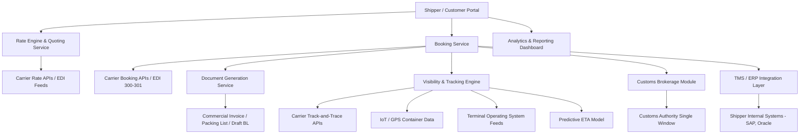

## Digital Freight Booking and Forwarding Platforms

### Overview

Digital freight booking and forwarding platforms are software systems that digitize the process of quoting, booking, managing, and tracking freight shipments across ocean, air, road, and rail modes. They replace traditional manual workflows — phone calls, faxes, emails, and spreadsheet-based rate negotiation with freight forwarders and carriers — with online marketplaces or SaaS platforms that provide instant rate quotes, digital booking confirmation, shipment visibility, and integrated documentation.

### Market Landscape and Categories

**Key Points**

- **Digital freight forwarders (asset-light)**: Companies that act as forwarders but operate primarily through a technology platform rather than a traditional agent network. Examples include Flexport, Forto, and Zencargo. They aggregate capacity from ocean/air carriers and truckers, then resell to shippers with a digital front end.
- **Freight marketplaces / booking platforms**: Platforms connecting shippers directly with carriers or forwarders for spot-rate booking, similar in concept to e-commerce marketplaces. Examples include Freightos (ocean/air freight marketplace and rate index), uShip, and Convoy (trucking, ceased operations 2023).
- **Carrier-direct digital booking portals**: Ocean carriers (Maersk, MSC, CMA CGM, Hapag-Lloyd) and airlines increasingly offer direct online instant booking via their own portals or API, reducing reliance on intermediaries for standard bookings.
- **Digital forwarding software for traditional forwarders**: Platforms like CargoWise (WiseTech Global) and Magaya provide traditional freight forwarders with the back-office and customer-facing digital tools to compete without becoming a "digital-native" forwarder themselves.

### Core Functional Components

#### 1. Rate Management and Instant Quoting

- Aggregates spot and contract rates from multiple carriers into a searchable database.
- Uses APIs to pull live rate data directly from carrier systems where available, or maintains negotiated rate cards updated periodically.
- Rate engines apply markup, surcharges (BAF - Bunker Adjustment Factor, CAF - Currency Adjustment Factor, THC - Terminal Handling Charge, PSS - Peak Season Surcharge) and margin rules automatically to generate a landed, all-in customer quote.

**Example**

A shipper enters origin (Shanghai), destination (Los Angeles), container type (40ft HC), and cargo details into a booking platform. The system queries its rate database, applies applicable surcharges and the forwarder's margin, and returns an instant all-in quote (ocean freight + THC + documentation fee + customs brokerage estimate) within seconds, compared to the traditional 24–48 hour manual quoting turnaround.

#### 2. Digital Booking and Confirmation

- Once a rate is accepted, the platform generates a digital booking request transmitted to the carrier (often via **EDI 300/301 messages** or modern REST APIs where carriers support them).
- Automatically generates or pre-fills key documents: booking confirmation, shipping instructions (SI), and draft bill of lading data.
- Some platforms integrate directly with **carrier booking APIs** (e.g., Maersk's Ocean Products API, INTTRA — now part of E2open — which aggregates booking connectivity across many ocean carriers).

#### 3. Shipment Visibility and Tracking

- Aggregates tracking data from multiple sources: carrier track-and-trace APIs, GPS/IoT devices on containers or trucks, terminal operating systems, and milestone event feeds.
- Provides a unified dashboard showing container/shipment status (gate-in, loaded, vessel departed, vessel arrived, customs cleared, gate-out) regardless of which carrier is handling the shipment.
- Predictive ETA models increasingly use machine learning trained on historical AIS (Automatic Identification System) vessel data, port congestion patterns, and weather to refine estimated arrival times beyond the carrier's own static ETA.

#### 4. Documentation Automation

- Auto-generates or validates commercial invoices, packing lists, certificates of origin, and draft bills of lading using data entered once at booking.
- Reduces data-entry duplication errors, a major historical source of shipment delays and demurrage/detention charges.
- Increasingly integrates with **blockchain-based eBL platforms** (see related topic) for paperless title transfer.

#### 5. Integration Layer (APIs and EDI)

**Key Points**

- **EDI (Electronic Data Interchange)**: Legacy but still dominant standard for carrier-forwarder-shipper data exchange, using message formats like EDIFACT (IFTMIN, IFTSTA) or ANSI X12 (304, 310, 315).
- **REST/JSON APIs**: Increasingly preferred for real-time integration; major carriers have published API portals (e.g., Maersk Developer Portal, CMA CGM APIs) enabling direct programmatic booking and tracking.
- **TMS (Transportation Management System) integration**: Booking platforms typically expose APIs or EDI connections so that a shipper's own TMS or ERP (SAP, Oracle) can trigger bookings automatically based on order data, without manual re-entry.

### System Architecture (Typical Digital Forwarding Platform)

### Architecture Diagram (svg_diagram)

<svg xmlns="http://www.w3.org/2000/svg" viewBox="0 0 800 380">
<text x="400" y="30" font-size="18" font-weight="bold" text-anchor="middle" fill="#1a1a1a">Digital Freight Platform Layers (svg_diagram)</text>
<rect x="50" y="60" width="700" height="60" rx="8" fill="#dbeafe" stroke="#2563eb" stroke-width="1.5" />
<text x="400" y="95" font-size="14" text-anchor="middle" fill="#1e3a8a">Customer-Facing Layer: Quoting, Booking Portal, Tracking Dashboard, Document Center</text>
<rect x="50" y="140" width="700" height="60" rx="8" fill="#dcfce7" stroke="#16a34a" stroke-width="1.5" />
<text x="400" y="175" font-size="14" text-anchor="middle" fill="#14532d">Business Logic Layer: Rate Engine, Booking Workflow, Document Automation, Customs Module</text>
<rect x="50" y="220" width="700" height="60" rx="8" fill="#fef3c7" stroke="#d97706" stroke-width="1.5" />
<text x="400" y="255" font-size="14" text-anchor="middle" fill="#78350f">Integration Layer: REST/JSON APIs, EDI (EDIFACT / ANSI X12), Webhooks</text>
<rect x="50" y="300" width="700" height="60" rx="8" fill="#fce7f3" stroke="#db2777" stroke-width="1.5" />
<text x="400" y="335" font-size="14" text-anchor="middle" fill="#831843">External Systems: Ocean/Air Carriers, Truckers, Customs, IoT Devices, Terminals, Shipper ERP/TMS</text>
<line x1="400" y1="120" x2="400" y2="140" stroke="#475569" stroke-width="2" />
<line x1="400" y1="200" x2="400" y2="220" stroke="#475569" stroke-width="2" />
<line x1="400" y1="280" x2="400" y2="300" stroke="#475569" stroke-width="2" />
</svg>

### Business Model Variants

| Model | Description | Examples |
| --- | --- | --- |
| Asset-light digital forwarder | Owns customer relationship and margin; subcontracts actual transport | Flexport, Forto |
| Neutral marketplace | Connects many shippers to many carriers/forwarders; takes commission or subscription fee | Freightos |
| Carrier-direct portal | Carrier sells capacity directly online, disintermediating forwarders for standard bookings | Maersk Spot, CMA CGM eCommerce |
| Forwarder software vendor | Sells the digital tooling to traditional forwarders (B2B SaaS, not itself a forwarder) | CargoWise, Magaya |

### Benefits

- **Speed**: Quote-to-booking cycle reduced from days to minutes for standard lanes.
- **Price transparency**: Shippers can compare rates across providers more easily, reducing information asymmetry that traditionally favored forwarders.
- **Reduced administrative burden**: Automated document generation cuts manual data entry and associated errors.
- **Improved visibility**: Real-time tracking reduces "where is my container" inquiries and improves inventory planning for shippers.
- **Scalability for SMEs**: Small and mid-sized shippers gain access to competitive rates and service levels previously reserved for large-volume shippers with dedicated forwarder relationships.

### Limitations and Challenges

- **Complex/non-standard cargo**: Platforms handle standardized container/parcel shipments well but struggle with breakbulk, project cargo, hazardous materials, or highly negotiated contract terms requiring human expertise.
- **Carrier API fragmentation**: Not all carriers expose equally mature APIs; many bookings still rely on EDI or manual fallback, limiting full end-to-end automation. [Unverified: the specific set of carriers offering real-time API booking versus EDI-only connectivity changes as carriers modernize; verify current carrier API coverage before making platform selection decisions.]
- **Rate volatility**: Spot rate marketplaces can expose shippers to significant price swings (as seen dramatically during 2021–2022 container shipping disruptions), whereas traditional contracted relationships offer more rate stability.
- **Disintermediation tension**: Carrier-direct booking portals compete with the same digital forwarders that rely on carrier capacity, creating channel conflict.
- **Data quality dependency**: Predictive ETA and visibility features are only as good as the underlying data feeds; gaps in IoT coverage or inconsistent carrier status updates reduce accuracy. [Inference: this suggests visibility quality varies significantly by trade lane and carrier, rather than being a uniform platform capability.]
- **Integration cost for shippers**: Realizing full automation benefits typically requires the shipper's own TMS/ERP to be integrated via API/EDI, which is a nontrivial IT investment for smaller shippers.

### Comparison: Traditional Forwarding vs. Digital Platform Booking

| Dimension | Traditional Forwarding | Digital Platform |
| --- | --- | --- |
| Quote turnaround | Hours to days (manual) | Seconds to minutes (automated) |
| Rate transparency | Low (negotiated, opaque) | High (published or algorithmically generated) |
| Documentation | Manual, email-based | Automated, template-driven |
| Visibility | Periodic manual updates | Real-time dashboard |
| Best suited for | Complex, negotiated, non-standard cargo | Standardized container/parcel/FCL-LCL freight |
| Relationship model | High-touch, relationship-based | Self-service, API-driven |

### Key Terms

- **FCL/LCL**: Full Container Load / Less than Container Load — booking granularity affecting rate structure.
- **Spot rate vs. contract rate**: Spot rates fluctuate with market demand; contract rates are pre-negotiated for a fixed period, typically offering price stability at potential cost of flexibility.
- **NVOCC (Non-Vessel Operating Common Carrier)**: A forwarder that issues its own bills of lading without owning vessels — the legal structure underlying many digital forwarders' operations.
- **API vs. EDI**: API integration is real-time and request-response based; EDI is typically batch-oriented and message-queue based, reflecting its legacy design origins.

### Related Topics

- Blockchain applications in trade documentation (eBL integration with booking platforms)
- Transportation Management Systems (TMS) architecture and selection
- Ocean carrier alliance structures and capacity allocation
- Freight rate indices and benchmarking (Freightos Baltic Index, Shanghai Containerized Freight Index)
- API vs. EDI integration strategies in logistics IT
- Predictive analytics and machine learning for ETA forecasting
- Customs brokerage automation and single window systems