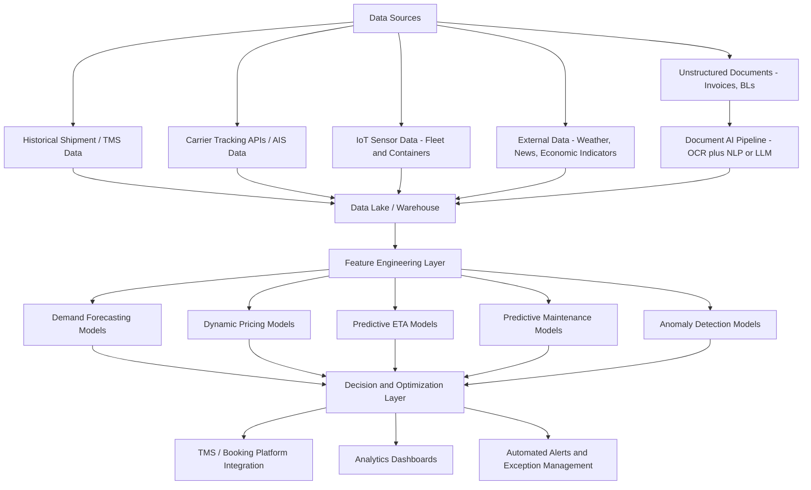

## Artificial Intelligence in Freight Management

### Overview

Artificial Intelligence (AI) in freight management refers to the application of machine learning, predictive analytics, natural language processing (NLP), and optimization algorithms to automate, forecast, and optimize decisions across the freight lifecycle — including demand forecasting, route and network optimization, dynamic pricing, predictive maintenance, document processing, and customer service. Unlike rule-based automation, AI systems learn patterns from historical and real-time data to improve decisions over time and handle variability that static rules cannot.

### Core AI/ML Techniques Used in Freight Management

**Key Points**

- **Supervised learning**: Trained on labeled historical data to predict outcomes such as ETA, demand volume, or freight rates. Common algorithms: gradient boosting (XGBoost, LightGBM), random forests, and neural networks.
- **Time-series forecasting**: Specialized models (ARIMA, Prophet, LSTM neural networks, Temporal Fusion Transformers) predict future values like shipment volumes, rate trends, or port congestion based on historical patterns.
- **Optimization algorithms**: Not strictly "AI" in the learning sense, but frequently paired with ML — includes linear programming, mixed-integer programming, and metaheuristics (genetic algorithms, simulated annealing) for route and load optimization, often called "prescriptive analytics."
- **Reinforcement learning (RL)**: Used in more advanced dynamic routing and fleet dispatch systems where an agent learns optimal sequential decisions through simulated trial and error, though production RL deployment in freight remains less mature than supervised approaches. [Inference: based on the relative novelty and computational complexity of RL compared to established optimization methods, RL adoption in production freight systems is likely earlier-stage than marketing materials sometimes suggest.]
- **Computer vision**: Used for automated cargo inspection, damage detection, container/license plate recognition, and warehouse robotics guidance.
- **Natural Language Processing (NLP) / Large Language Models (LLMs)**: Used for extracting structured data from unstructured documents (invoices, bills of lading, customs forms), chatbot-based customer service, and email/booking request parsing.

### Key Application Areas

#### 1. Demand Forecasting

- ML models ingest historical shipment volumes, seasonality patterns, macroeconomic indicators, and even external signals (weather, social media trends, retail sales data) to forecast future freight demand at the lane, mode, or SKU level.
- Improves capacity planning, reduces empty running (deadheading), and supports better carrier rate negotiation by anticipating volume commitments.

**Example**

A retailer's logistics team uses a gradient-boosting model trained on 3 years of order history, promotional calendars, and regional weather data to forecast weekly container demand for the Shanghai–Los Angeles lane 8–12 weeks ahead, allowing earlier booking at more favorable contract rates versus reactive spot-market booking.

#### 2. Dynamic Pricing and Rate Prediction

- Freight marketplaces and digital forwarders use ML pricing engines that adjust freight quotes in near real-time based on capacity utilization, fuel costs, seasonal demand, and competitor pricing signals — conceptually similar to airline revenue management.
- Predictive rate models help shippers benchmark quoted rates against a data-driven "fair market rate" estimate rather than relying solely on forwarder-provided quotes.

#### 3. Route and Network Optimization

- Combines optimization algorithms with ML-predicted inputs (traffic patterns, port congestion, weather-adjusted transit times) to determine optimal routing, mode selection, and consolidation strategies.
- **Last-mile delivery optimization**: Vehicle routing problem (VRP) solvers augmented with ML-predicted delivery time windows and traffic conditions to minimize total delivery cost/time across a fleet.
- Network design optimization determines optimal warehouse/hub locations and flow allocation using a combination of historical demand data and predictive models.

#### 4. Predictive ETA and Visibility

- ML models trained on AIS vessel tracking data, historical port dwell times, weather patterns, and carrier schedule reliability produce more accurate ETAs than carriers' own static schedule-based estimates.
- Continuously updated as new tracking signals arrive, providing dynamic rather than fixed predictions.

#### 5. Predictive Maintenance

- Applies to owned/leased fleet assets (trucks, containers with IoT sensors, warehouse equipment): ML models analyze sensor data (vibration, temperature, engine diagnostics) to predict component failure before it occurs, enabling maintenance scheduling that avoids unplanned breakdowns and associated shipment delays.

#### 6. Document Intelligence and Automation

- **Optical Character Recognition (OCR) + NLP** pipelines extract structured data (shipper, consignee, HS codes, weights, values) from unstructured documents like commercial invoices, packing lists, and bills of lading.
- Increasingly, **LLM-based extraction** handles documents with variable formats and layouts more robustly than traditional template-based OCR, reducing the manual data-entry burden in customs brokerage and booking workflows.
- Used for automated compliance checking — flagging discrepancies between declared HS codes, invoice values, and shipment weight/dimensions that might indicate errors or trigger customs scrutiny.

#### 7. Risk Management and Anomaly Detection

- ML anomaly-detection models flag unusual patterns that may indicate fraud (e.g., mismatched cargo weight/value ratios, suspicious routing changes) or operational risk (e.g., carrier financial distress signals, geopolitical disruption indicators).
- Supply chain risk platforms aggregate news, weather, and geopolitical data feeds, using NLP to classify and score potential disruption events (port strikes, natural disasters, sanctions) relevant to a shipper's specific routes and suppliers.

#### 8. Customer Service Automation

- AI chatbots and virtual assistants handle routine shipment status inquiries, booking modifications, and document requests, escalating complex cases to human agents.
- NLP-based email parsing automatically triages and routes incoming booking requests or exception notifications to the appropriate internal team or system.

### System Architecture (Typical AI-Enabled Freight Management Stack)

### Architecture Diagram (svg_diagram)

<svg xmlns="http://www.w3.org/2000/svg" viewBox="0 0 800 400">
<text x="400" y="30" font-size="18" font-weight="bold" text-anchor="middle" fill="#1a1a1a">AI Freight Management Data Flow (svg_diagram)</text>
<rect x="30" y="60" width="150" height="55" rx="8" fill="#dbeafe" stroke="#2563eb" stroke-width="1.5" />
<text x="105" y="92" font-size="12" text-anchor="middle" fill="#1e3a8a">Raw Data Sources</text>
<rect x="230" y="60" width="150" height="55" rx="8" fill="#dcfce7" stroke="#16a34a" stroke-width="1.5" />
<text x="305" y="92" font-size="12" text-anchor="middle" fill="#14532d">Data Lake / Storage</text>
<rect x="430" y="60" width="150" height="55" rx="8" fill="#fef3c7" stroke="#d97706" stroke-width="1.5" />
<text x="505" y="85" font-size="12" text-anchor="middle" fill="#78350f">Feature Engineering</text>
<text x="505" y="102" font-size="10" text-anchor="middle" fill="#78350f">and Model Training</text>
<rect x="630" y="60" width="150" height="55" rx="8" fill="#fce7f3" stroke="#db2777" stroke-width="1.5" />
<text x="705" y="85" font-size="12" text-anchor="middle" fill="#831843">Prediction/Inference</text>
<text x="705" y="102" font-size="10" text-anchor="middle" fill="#831843">Serving Layer</text>
<line x1="180" y1="87" x2="230" y2="87" stroke="#475569" stroke-width="2" marker-end="url(#arrow)" />
<line x1="380" y1="87" x2="430" y2="87" stroke="#475569" stroke-width="2" marker-end="url(#arrow)" />
<line x1="580" y1="87" x2="630" y2="87" stroke="#475569" stroke-width="2" marker-end="url(#arrow)" />
<rect x="130" y="180" width="540" height="140" rx="10" fill="#ede9fe" stroke="#7c3aed" stroke-width="2" />
<text x="400" y="205" font-size="14" font-weight="bold" text-anchor="middle" fill="#4c1d95">Application Layer</text>
<rect x="150" y="220" width="150" height="40" rx="6" fill="#ffffff" stroke="#7c3aed" />
<text x="225" y="245" font-size="11" text-anchor="middle" fill="#4c1d95">Demand Forecasting</text>
<rect x="325" y="220" width="150" height="40" rx="6" fill="#ffffff" stroke="#7c3aed" />
<text x="400" y="245" font-size="11" text-anchor="middle" fill="#4c1d95">Dynamic Pricing</text>
<rect x="500" y="220" width="150" height="40" rx="6" fill="#ffffff" stroke="#7c3aed" />
<text x="575" y="245" font-size="11" text-anchor="middle" fill="#4c1d95">Predictive ETA</text>
<rect x="150" y="270" width="150" height="40" rx="6" fill="#ffffff" stroke="#7c3aed" />
<text x="225" y="295" font-size="11" text-anchor="middle" fill="#4c1d95">Predictive Maintenance</text>
<rect x="325" y="270" width="150" height="40" rx="6" fill="#ffffff" stroke="#7c3aed" />
<text x="400" y="295" font-size="11" text-anchor="middle" fill="#4c1d95">Anomaly Detection</text>
<rect x="500" y="270" width="150" height="40" rx="6" fill="#ffffff" stroke="#7c3aed" />
<text x="575" y="295" font-size="11" text-anchor="middle" fill="#4c1d95">Document AI</text>
<line x1="400" y1="115" x2="400" y2="180" stroke="#475569" stroke-width="2" />
</svg>

### Data Requirements and Model Lifecycle

| Stage | Description |
| --- | --- |
| Data collection | Historical TMS/ERP records, carrier APIs, IoT telemetry, external data feeds |
| Data cleaning | Handling missing values, standardizing units (HS codes, currencies, weight units), deduplication |
| Feature engineering | Deriving predictive variables: lag features for time series, port congestion indices, seasonality flags |
| Model training | Selecting algorithm class based on problem type (regression, classification, time-series, optimization) |
| Validation | Backtesting against historical outcomes; cross-validation; monitoring for overfitting |
| Deployment | Serving predictions via API to TMS, booking platforms, or dashboards |
| Monitoring | Tracking model drift as freight market conditions change (e.g., post-pandemic rate volatility invalidated many pre-2020 forecasting models) |

### Benefits

- **Improved forecast accuracy**: Reduces both stockouts (under-forecasting) and excess capacity costs (over-forecasting) compared to manual/spreadsheet-based planning.
- **Cost reduction**: Route optimization and dynamic pricing reduce empty miles, fuel consumption, and overpayment on freight spend.
- **Faster exception handling**: Anomaly detection and automated alerts surface problems (delays, damage risk, compliance issues) earlier than manual monitoring.
- **Reduced manual labor**: Document AI and chatbots offload repetitive tasks, allowing staff to focus on exception handling and relationship management.
- **Better risk visibility**: NLP-based risk monitoring provides earlier warning of disruptions than traditional reactive approaches.

### Limitations and Challenges

- **Data quality dependency**: AI model performance is fundamentally bounded by the completeness and accuracy of underlying data; fragmented or siloed freight data (common in logistics) significantly limits achievable model accuracy. [Inference: given the well-documented data fragmentation across carriers, forwarders, and shippers in logistics, this is likely the single largest practical barrier to AI effectiveness in freight, more so than algorithm choice.]
- **Black-box interpretability**: Complex models (deep learning, gradient boosting ensembles) can be difficult to explain to operational staff or auditors, complicating trust and regulatory compliance in some contexts.
- **Market volatility and regime shifts**: Models trained on historical data can fail during unprecedented disruptions (e.g., COVID-19 rate spikes, Suez Canal blockage, Red Sea rerouting) where historical patterns do not hold. [Unverified: the degree of model degradation during specific disruption events varies by model design and retraining frequency; general claims about AI model failure during black-swan events should be treated as illustrative rather than universally quantified.]
- **Integration complexity**: Deploying AI predictions into operational workflows (TMS, booking systems) requires significant systems integration work beyond the model itself.
- **Talent and infrastructure requirements**: Building and maintaining ML pipelines requires data science and MLOps expertise that many traditional logistics organizations are still developing internally.
- **Cold-start problem**: New lanes, new customers, or new carriers lack historical data, limiting model accuracy until sufficient data accumulates.

### Comparison: Rule-Based Automation vs. AI-Driven Freight Management

| Dimension | Rule-Based Automation | AI-Driven |
| --- | --- | --- |
| Adaptability | Fixed logic; requires manual rule updates | Learns and adapts as new data arrives |
| Handling of variability | Struggles with edge cases outside defined rules | Better generalizes to novel but similar patterns |
| Transparency | Fully explainable | Can be less interpretable (depending on model type) |
| Setup effort | Lower initial complexity | Higher upfront data/model development effort |
| Best suited for | Stable, well-defined processes (e.g., standard document routing) | Forecasting, pricing, and optimization under uncertainty |

### Related Topics

- Digital freight booking and forwarding platforms (AI-powered rate engines)
- Predictive analytics for supply chain risk management
- Internet of Things (IoT) in fleet and container monitoring
- Warehouse robotics and computer vision applications
- Blockchain applications in trade documentation (combined with AI document processing)
- Transportation Management System (TMS) architecture
- MLOps and model governance in logistics technology