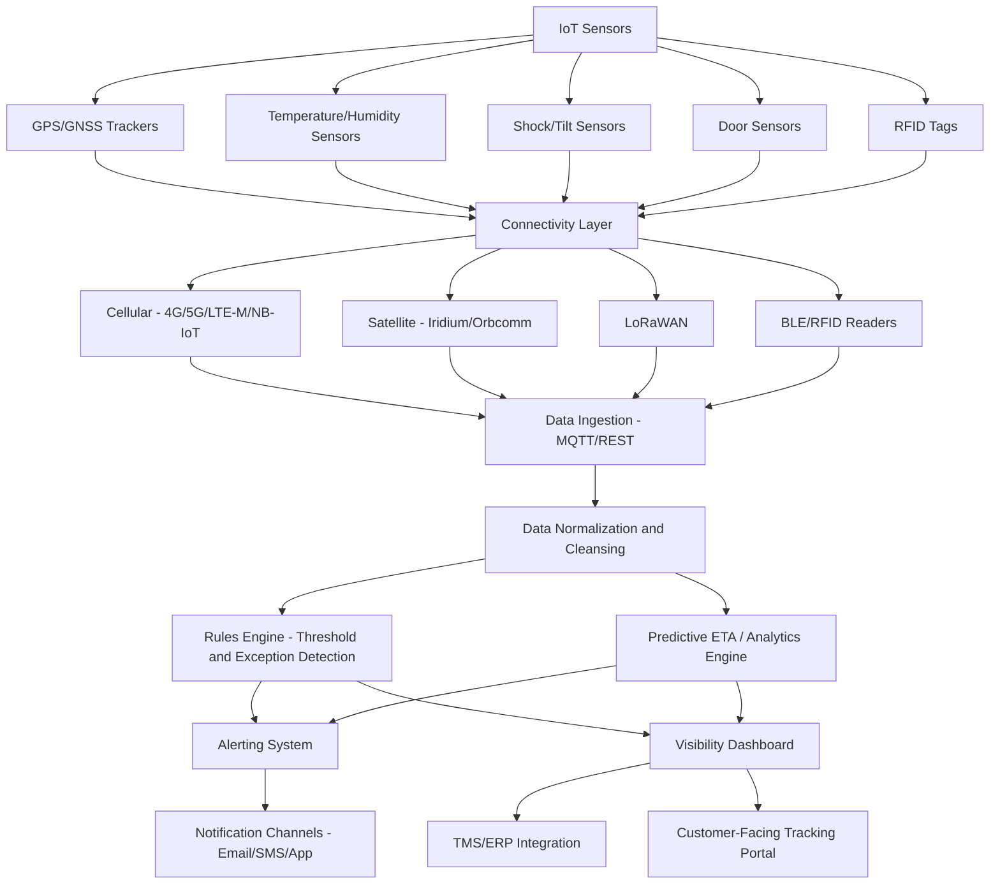

## Internet of Things and Real Time Cargo Visibility

<syllabot_broad_topic/>

### Overview

The Internet of Things (IoT) in the context of cargo visibility refers to networks of connected physical sensors and devices — attached to containers, pallets, vehicles, or individual goods — that continuously capture and transmit data such as location, temperature, humidity, shock, light exposure, and door-open events. Combined with cloud platforms and analytics, IoT enables **real-time (or near real-time) supply chain visibility**, replacing periodic manual status checks with continuous, automated monitoring throughout a shipment's journey.

### Core Technical Components

#### 1. Sensor/Device Layer

**Key Points**

- **GPS/GNSS trackers**: Provide location data; battery-powered units attached to containers or trailers, often designed for multi-year operation with low-power modes.
- **Environmental sensors**: Measure temperature, humidity, shock/vibration, tilt, and light exposure — critical for cold-chain (pharmaceuticals, perishables) and fragile/high-value cargo.
- **Door sensors**: Detect container door open/close events, useful for security and chain-of-custody verification.
- **RFID (Radio-Frequency Identification) tags**: Passive or active tags for pallet/item-level identification, read by fixed or handheld readers at warehouse and terminal checkpoints.
- **Bluetooth Low Energy (BLE) beacons**: Used for short-range, low-power tracking within warehouses or yards where GPS signal may be unreliable (indoor environments).

#### 2. Connectivity Layer

| Technology | Range | Power Use | Typical Use Case |
| --- | --- | --- | --- |
| Cellular (4G/5G/LTE-M/NB-IoT) | Wide area | Moderate–High | Over-the-road trucking, active tracking |
| Satellite (Iridium, Orbcomm) | Global, including ocean | Moderate | Ocean container tracking with no cellular coverage |
| LoRaWAN | Long range (km), low bandwidth | Very low | Yard/port tracking, low-frequency updates |
| BLE | Short range (meters) | Very low | Indoor warehouse tracking, asset tagging |
| RFID (passive) | Centimeters–meters | None (passive) | Item/pallet identification at fixed checkpoints |

- **Satellite connectivity** is essential for ocean cargo tracking since cellular networks have no coverage mid-ocean; devices switch to satellite transmission once cellular signal is lost, often at reduced data transmission frequency to conserve battery.
- **LTE-M and NB-IoT** are cellular IoT standards specifically designed for low-power, low-bandwidth device communication, extending battery life compared to standard cellular modems.

#### 3. Data Platform and Integration Layer

- Ingests raw sensor telemetry (often via **MQTT** or similar lightweight publish-subscribe messaging protocols suited to constrained devices).
- Normalizes data from multiple device manufacturers and carrier systems into a unified format, since a single supply chain often involves multiple IoT vendors and carrier-provided tracking systems with differing data structures.
- Applies business rules and thresholds (e.g., temperature excursion alerts if cold-chain cargo exceeds a defined range for a defined duration).
- Feeds data into visibility dashboards, TMS/ERP systems, and increasingly into **predictive ETA models** (see AI in Freight Management).

#### 4. Application/Visibility Layer

- Unified dashboards displaying shipment location, condition, and milestone status across multiple carriers and modes.
- Automated exception alerts (delay, temperature excursion, unexpected route deviation, unauthorized door opening).
- API/webhook integration allowing visibility data to flow into customer-facing tracking portals or downstream systems (e.g., automatically notifying a retailer's inventory system when a shipment's ETA changes).

### System Architecture

### Architecture Diagram (svg_diagram)

<svg xmlns="http://www.w3.org/2000/svg" viewBox="0 0 800 400">
<text x="400" y="30" font-size="18" font-weight="bold" text-anchor="middle" fill="#1a1a1a">IoT Cargo Visibility Pipeline (svg_diagram)</text>
<rect x="30" y="60" width="140" height="90" rx="8" fill="#dbeafe" stroke="#2563eb" stroke-width="1.5" />
<text x="100" y="90" font-size="12" text-anchor="middle" fill="#1e3a8a">Sensor Layer</text>
<text x="100" y="108" font-size="10" text-anchor="middle" fill="#1e3a8a">GPS, Temp,</text>
<text x="100" y="123" font-size="10" text-anchor="middle" fill="#1e3a8a">Shock, Door,</text>
<text x="100" y="138" font-size="10" text-anchor="middle" fill="#1e3a8a">RFID</text>
<rect x="220" y="60" width="140" height="90" rx="8" fill="#dcfce7" stroke="#16a34a" stroke-width="1.5" />
<text x="290" y="90" font-size="12" text-anchor="middle" fill="#14532d">Connectivity</text>
<text x="290" y="108" font-size="10" text-anchor="middle" fill="#14532d">Cellular,</text>
<text x="290" y="123" font-size="10" text-anchor="middle" fill="#14532d">Satellite,</text>
<text x="290" y="138" font-size="10" text-anchor="middle" fill="#14532d">LoRaWAN, BLE</text>
<rect x="410" y="60" width="140" height="90" rx="8" fill="#fef3c7" stroke="#d97706" stroke-width="1.5" />
<text x="480" y="90" font-size="12" text-anchor="middle" fill="#78350f">Data Platform</text>
<text x="480" y="108" font-size="10" text-anchor="middle" fill="#78350f">Ingestion,</text>
<text x="480" y="123" font-size="10" text-anchor="middle" fill="#78350f">Normalization,</text>
<text x="480" y="138" font-size="10" text-anchor="middle" fill="#78350f">Rules Engine</text>
<rect x="600" y="60" width="170" height="90" rx="8" fill="#fce7f3" stroke="#db2777" stroke-width="1.5" />
<text x="685" y="90" font-size="12" text-anchor="middle" fill="#831843">Visibility Layer</text>
<text x="685" y="108" font-size="10" text-anchor="middle" fill="#831843">Dashboards,</text>
<text x="685" y="123" font-size="10" text-anchor="middle" fill="#831843">Alerts,</text>
<text x="685" y="138" font-size="10" text-anchor="middle" fill="#831843">TMS/Customer Portal</text>
<line x1="170" y1="105" x2="220" y2="105" stroke="#475569" stroke-width="2" marker-end="url(#arrow2)" />
<line x1="360" y1="105" x2="410" y2="105" stroke="#475569" stroke-width="2" marker-end="url(#arrow2)" />
<line x1="550" y1="105" x2="600" y2="105" stroke="#475569" stroke-width="2" marker-end="url(#arrow2)" />
<rect x="150" y="220" width="500" height="120" rx="10" fill="#ede9fe" stroke="#7c3aed" stroke-width="2" />
<text x="400" y="245" font-size="13" font-weight="bold" text-anchor="middle" fill="#4c1d95">Example: Cold-Chain Shipment Flow</text>
<text x="400" y="270" font-size="11" text-anchor="middle" fill="#4c1d95">Sensor logs temp every 5 min --&gt; Satellite uplink at sea</text>
<text x="400" y="290" font-size="11" text-anchor="middle" fill="#4c1d95">--&gt; Platform checks against 2-8C threshold</text>
<text x="400" y="310" font-size="11" text-anchor="middle" fill="#4c1d95">--&gt; Excursion detected --&gt; Alert sent to quality team</text>
</svg>

### Key Application Areas

#### 1. Cold Chain Monitoring

**Example**

A pharmaceutical shipment requiring 2–8°C storage is fitted with a temperature logger transmitting readings every 5–15 minutes via cellular (on land) or satellite (at sea). If temperature exceeds the threshold for more than a defined duration (e.g., 30 minutes), the platform automatically alerts the quality assurance team and logs the excursion event with timestamp and duration for regulatory compliance documentation (relevant to Good Distribution Practice / GDP requirements).

#### 2. Container and Asset Tracking

- Real-time location tracking of ocean containers, rail cars, and trailers reduces "dark" periods where shipment location is unknown between milestone events.
- Reduces asset detention/demurrage costs by providing precise visibility into container dwell time at ports and terminals.

#### 3. Security and Chain of Custody

- Door sensors and tamper-evident seals with IoT connectivity detect unauthorized access, supporting anti-theft and anti-tampering objectives, particularly relevant for high-value or sensitive cargo.
- Geofencing alerts trigger notifications if a shipment deviates from its planned route or enters/exits a defined zone unexpectedly.

#### 4. Yard and Warehouse Visibility

- BLE and RFID-based indoor positioning provide granular visibility into container/trailer location within a port yard or distribution center where GPS accuracy is degraded.
- Automated gate-in/gate-out detection via RFID reduces manual check-in processes.

#### 5. Predictive Analytics Integration

- IoT-derived location and condition data feeds into AI/ML models (see AI in Freight Management) to improve ETA prediction accuracy and detect anomalies indicating potential delays or damage risk.

### Data Standards and Interoperability

- **GS1 standards**: Provide globally recognized barcoding/RFID identification standards (GTIN, SSCC) enabling interoperability of item and pallet identification across different supply chain partners.
- **Open API/webhook models**: Most modern visibility platforms expose REST APIs to integrate with TMS/ERP systems rather than relying on proprietary, closed data silos.
- Lack of universal standardization across IoT device manufacturers remains a practical integration challenge, often requiring visibility platform vendors (e.g., project44, FourKites, Shippeo) to build and maintain custom connectors for each device/carrier data source.

### Benefits

- **Reduced "track and trace" manual effort**: Automated data collection replaces manual status checks and phone calls to carriers.
- **Improved product quality assurance**: Continuous condition monitoring (temperature, shock) reduces spoilage and damage-related losses, particularly for perishables and pharmaceuticals.
- **Faster exception response**: Real-time alerts enable proactive intervention (e.g., rerouting, expedited handling) before minor issues escalate into significant delays or losses.
- **Enhanced security**: Tamper detection and geofencing reduce theft and diversion risk.
- **Data-driven process improvement**: Historical IoT data reveals systemic bottlenecks (e.g., consistently long dwell times at a specific port) that can inform network design decisions.

### Limitations and Challenges

- **Connectivity gaps**: Ocean transit, remote regions, and certain warehouse environments can create gaps in continuous tracking, requiring devices to buffer and batch-transmit data once connectivity resumes.
- **Battery life vs. data frequency trade-off**: More frequent location/condition reporting drains battery faster; device design must balance granularity against multi-week or multi-year operational life expectations.
- **Cost**: Outfitting a large fleet or container pool with IoT sensors involves significant capital investment, and cost-effectiveness may vary depending on cargo value and shipment frequency. [Inference: given that sensor and connectivity costs are a fixed or semi-fixed expense per shipment, the value case is likely strongest for high-value or highly sensitive cargo rather than uniformly across all freight types.]
- **Data overload**: Continuous granular data streams can overwhelm operations teams without effective rules-based filtering and alert prioritization; raw data without an effective analytics/rules layer offers limited practical value.
- **Standardization fragmentation**: Multiple competing device manufacturers, communication protocols, and data formats complicate building a single unified visibility view across a multi-carrier, multi-vendor supply chain.
- **Data security and privacy**: IoT devices transmitting location and cargo data create potential attack surfaces; securing device-to-cloud communication (encryption, authentication) is essential but adds implementation complexity.

### Comparison: Traditional Milestone Tracking vs. IoT Real-Time Visibility

| Dimension | Traditional Milestone Tracking | IoT Real-Time Visibility |
| --- | --- | --- |
| Update frequency | Periodic (at defined checkpoints) | Continuous or near-continuous |
| Data granularity | Status/location only | Location, condition, environmental data |
| Latency | Hours to days | Minutes (near real-time) |
| Exception detection | Reactive (after inquiry) | Proactive (automated alerts) |
| Investment required | Lower (relies on carrier-reported milestones) | Higher (sensor hardware, connectivity, platform) |
| Best suited for | Standard, low-risk cargo | High-value, sensitive, or regulated cargo |

### Related Topics

- Artificial intelligence in freight management (predictive ETA using IoT data)
- Cold chain logistics and pharmaceutical distribution compliance
- Blockchain applications in trade documentation (IoT data hashing for provenance)
- Digital freight booking and forwarding platforms (visibility integration)
- Warehouse Management Systems (WMS) and RFID-based inventory tracking
- Supply chain risk management and geofencing-based security monitoring