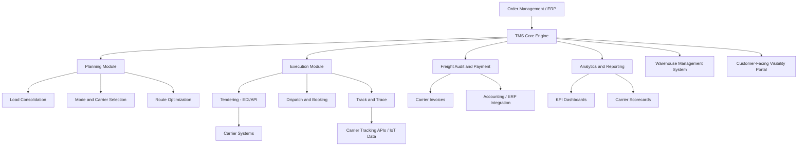

## Transportation Management Systems

### Overview

A Transportation Management System (TMS) is a logistics software platform used to plan, execute, optimize, and monitor the physical movement of goods across inbound and outbound freight, spanning all transport modes. It serves as the operational hub connecting shippers, carriers, and logistics service providers, managing functions from load planning and carrier selection through freight audit and payment. TMS platforms are typically categorized as core enterprise software within the broader Supply Chain Management (SCM) technology stack, sitting alongside Warehouse Management Systems (WMS) and Enterprise Resource Planning (ERP) systems.

### Core Functional Modules

#### 1. Planning and Optimization

**Key Points**

- **Load building/consolidation**: Combines multiple orders into optimal shipment loads to maximize container/trailer utilization and minimize per-unit shipping cost.
- **Mode and carrier selection**: Determines optimal transport mode (truckload, LTL, rail, air, ocean) and carrier based on cost, transit time, service level requirements, and contractual commitments.
- **Route optimization**: Uses algorithms (often vehicle routing problem / VRP solvers) to determine optimal sequencing and routing for multi-stop deliveries, minimizing distance, time, or cost subject to constraints (delivery windows, vehicle capacity, driver hours-of-service regulations).
- **Network/continuous move optimization**: Identifies opportunities to combine outbound and return-leg freight to reduce empty miles (deadheading), a significant cost driver in trucking.

#### 2. Execution

- **Tendering**: Automatically offers shipments to carriers based on predefined rules (contracted rate, routing guide priority), often via EDI or API, with automatic fallback to secondary/tertiary carriers if the primary carrier rejects the tender.
- **Booking and dispatch**: Confirms carrier assignment and communicates pickup/delivery instructions.
- **Track and trace**: Monitors shipment status in real time, integrating with carrier tracking APIs and increasingly with IoT/GPS data feeds for granular visibility.
- **Exception management**: Flags and alerts on delays, missed pickups, or service failures, often triggering automated workflows (e.g., rebooking, customer notification).

#### 3. Freight Audit and Payment

- Validates carrier invoices against contracted rates and actual shipment details (weight, distance, accessorial charges) to identify billing discrepancies.
- Automates payment processing and general ledger coding for accounting integration.
- A well-implemented freight audit module commonly identifies billing errors (overcharges, duplicate billing) that represent a meaningful percentage of freight spend if left unchecked, though the specific percentage varies significantly by organization and carrier relationship. [Unverified: commonly cited industry figures for freight bill error rates vary widely by source and should not be treated as a fixed benchmark for any given organization.]

#### 4. Analytics and Reporting

- Provides KPI dashboards covering on-time delivery performance, cost-per-mile/cost-per-shipment, carrier scorecards, and freight spend analysis by lane, mode, or business unit.
- Supports network modeling and scenario analysis for strategic decisions (e.g., evaluating the cost impact of shifting volume between carriers or modes).

### TMS Architecture

### Architecture Diagram (svg_diagram)

<svg xmlns="http://www.w3.org/2000/svg" viewBox="0 0 800 420">
<text x="400" y="30" font-size="18" font-weight="bold" text-anchor="middle" fill="#1a1a1a">TMS Functional Architecture (svg_diagram)</text>
<rect x="300" y="55" width="200" height="50" rx="8" fill="#1e293b" />
<text x="400" y="85" font-size="13" font-weight="bold" text-anchor="middle" fill="#ffffff">TMS Core Engine</text>
<rect x="30" y="140" width="170" height="80" rx="8" fill="#dbeafe" stroke="#2563eb" stroke-width="1.5" />
<text x="115" y="165" font-size="12" font-weight="bold" text-anchor="middle" fill="#1e3a8a">Planning</text>
<text x="115" y="182" font-size="10" text-anchor="middle" fill="#1e3a8a">Load Building,</text>
<text x="115" y="197" font-size="10" text-anchor="middle" fill="#1e3a8a">Carrier Selection,</text>
<text x="115" y="212" font-size="10" text-anchor="middle" fill="#1e3a8a">Route Optimization</text>
<rect x="230" y="140" width="170" height="80" rx="8" fill="#dcfce7" stroke="#16a34a" stroke-width="1.5" />
<text x="315" y="165" font-size="12" font-weight="bold" text-anchor="middle" fill="#14532d">Execution</text>
<text x="315" y="182" font-size="10" text-anchor="middle" fill="#14532d">Tendering,</text>
<text x="315" y="197" font-size="10" text-anchor="middle" fill="#14532d">Dispatch,</text>
<text x="315" y="212" font-size="10" text-anchor="middle" fill="#14532d">Track and Trace</text>
<rect x="430" y="140" width="170" height="80" rx="8" fill="#fef3c7" stroke="#d97706" stroke-width="1.5" />
<text x="515" y="165" font-size="12" font-weight="bold" text-anchor="middle" fill="#78350f">Freight Audit</text>
<text x="515" y="182" font-size="10" text-anchor="middle" fill="#78350f">Invoice Matching,</text>
<text x="515" y="197" font-size="10" text-anchor="middle" fill="#78350f">Payment Processing</text>
<rect x="630" y="140" width="150" height="80" rx="8" fill="#fce7f3" stroke="#db2777" stroke-width="1.5" />
<text x="705" y="165" font-size="12" font-weight="bold" text-anchor="middle" fill="#831843">Analytics</text>
<text x="705" y="182" font-size="10" text-anchor="middle" fill="#831843">KPI Dashboards,</text>
<text x="705" y="197" font-size="10" text-anchor="middle" fill="#831843">Scorecards</text>
<line x1="350" y1="105" x2="150" y2="140" stroke="#94a3b8" stroke-width="1.5" />
<line x1="380" y1="105" x2="330" y2="140" stroke="#94a3b8" stroke-width="1.5" />
<line x1="420" y1="105" x2="500" y2="140" stroke="#94a3b8" stroke-width="1.5" />
<line x1="450" y1="105" x2="690" y2="140" stroke="#94a3b8" stroke-width="1.5" />
<rect x="150" y="270" width="500" height="90" rx="8" fill="#f1f5f9" stroke="#475569" stroke-width="1.5" />
<text x="400" y="295" font-size="12" font-weight="bold" text-anchor="middle" fill="#1e293b">Integration Layer</text>
<text x="400" y="315" font-size="10" text-anchor="middle" fill="#475569">ERP (SAP, Oracle) - WMS - Carrier EDI/API - IoT Visibility Feeds</text>
<text x="400" y="333" font-size="10" text-anchor="middle" fill="#475569">Customer Portals - Financial Systems</text>
<line x1="400" y1="220" x2="400" y2="270" stroke="#475569" stroke-width="2" />
</svg>

### Deployment Models

| Model | Description | Typical Fit |
| --- | --- | --- |
| On-premise | Software installed and maintained on company-owned infrastructure | Large enterprises with strict data control requirements or legacy IT investment |
| Cloud/SaaS | Vendor-hosted, subscription-based, accessed via web | Most modern implementations; lower upfront cost, faster deployment |
| Hybrid | Combination of on-premise core systems with cloud-based modules | Enterprises with existing ERP infrastructure adding modern TMS capability |

Cloud/SaaS has become the dominant deployment model for new TMS implementations due to lower upfront capital cost, faster time-to-value, and easier integration with carrier networks that vendors maintain centrally. [Unverified: exact market share splits between deployment models vary by source and shipper segment; treat this as a general market direction rather than a precise statistic.]

### Major TMS Vendor Categories

- **Enterprise/ERP-integrated**: SAP Transportation Management, Oracle Transportation Management (OTM) — deeply integrated with broader ERP suites, suited to large multinational shippers.
- **Best-of-breed/standalone**: MercuryGate, Blue Yonder (formerly JDA), Manhattan Associates TMS — specialized transportation functionality, often with strong optimization capability.
- **Freight forwarder-focused**: CargoWise, Magaya — designed for forwarders/3PLs managing multi-client, multi-mode freight operations rather than shippers managing their own freight.
- **SMB/mid-market cloud platforms**: Various lighter-weight cloud TMS solutions targeting small-to-mid-sized shippers with simpler feature sets and faster implementation timelines.

### Integration Points

**Key Points**

- **ERP systems** (SAP, Oracle, Microsoft Dynamics): Provide order and inventory data that trigger shipment planning; TMS feeds shipment cost and status data back for accounting and reporting.
- **WMS (Warehouse Management System)**: Coordinates outbound shipment readiness with transportation planning, particularly for cross-docking and wave-planning scenarios.
- **Carrier systems**: Via EDI (204, 214, 210 transaction sets for tender, status, invoice) or modern REST APIs for real-time booking and tracking.
- **Visibility platforms**: Many organizations layer specialized visibility platforms (project44, FourKites) on top of TMS for enhanced real-time tracking beyond native TMS capability.
- **Freight marketplaces/digital booking platforms**: Increasingly integrated to supplement contracted carrier capacity with spot-market options during peak demand.

### Key Performance Indicators (KPIs) Tracked

| KPI | Description |
| --- | --- |
| On-time delivery (OTD) / On-time pickup (OTP) | Percentage of shipments meeting scheduled windows |
| Freight cost per unit (per mile, per shipment, per pound) | Core cost efficiency metric |
| Load/capacity utilization | Percentage of available trailer/container capacity used |
| Carrier scorecard metrics | Composite score of cost, service, and compliance performance per carrier |
| Freight audit savings | Value of billing discrepancies identified and corrected |
| Tender acceptance rate | Percentage of carrier tenders accepted on first offer (indicator of routing guide health) |

### Benefits

- **Cost reduction**: Load consolidation, mode optimization, and freight audit typically deliver measurable freight spend savings compared to manual planning processes.
- **Improved service levels**: Systematic carrier selection and proactive exception management improve on-time performance.
- **Operational efficiency**: Automates manual tasks (tendering, invoice matching) that would otherwise require significant administrative labor.
- **Data-driven decision making**: Centralized data supports carrier negotiation, network design, and continuous improvement initiatives.
- **Scalability**: Enables handling of growing shipment volumes without proportional increases in transportation planning staff.

### Limitations and Challenges

- **Implementation complexity**: Enterprise TMS implementations, particularly ERP-integrated ones, can involve lengthy timelines and significant change management effort.
- **Data quality dependency**: Optimization quality depends on accurate master data (carrier rates, transit times, location data); poor data quality undermines even sophisticated optimization algorithms.
- **Integration burden**: Connecting to a fragmented landscape of carrier EDI/API standards, especially with smaller regional carriers who may lack modern API capability, remains a persistent operational challenge.
- **Change management**: Shifting from manual, relationship-based planning to systematic, algorithm-driven decisions can face internal resistance from experienced planning staff.
- **Total cost of ownership**: Beyond license/subscription fees, organizations must account for integration, training, and ongoing carrier connectivity maintenance costs.

### Comparison: TMS vs. Adjacent Systems

| System | Primary Focus | Relationship to TMS |
| --- | --- | --- |
| TMS | Planning and executing freight movement | Core focus of this topic |
| WMS | Managing warehouse inventory and operations | Coordinates with TMS on outbound shipment readiness |
| ERP | Enterprise-wide financial and operational data | Provides order data to TMS; receives cost/accounting data back |
| Visibility platform | Real-time tracking across carriers | Often layered on top of or integrated with TMS |
| Digital freight booking platform | Marketplace-style rate shopping and booking | Can feed bookings into TMS or operate as an alternative front-end |

### Related Topics

- Digital freight booking and forwarding platforms (integration with TMS tendering)
- Artificial intelligence in freight management (AI-enhanced route and load optimization)
- Internet of Things and real-time cargo visibility (feeding TMS tracking modules)
- Warehouse Management Systems (WMS) architecture and integration
- Freight audit and payment processes
- EDI standards in logistics (204, 214, 210 transaction sets)
- Carrier relationship management and routing guide design