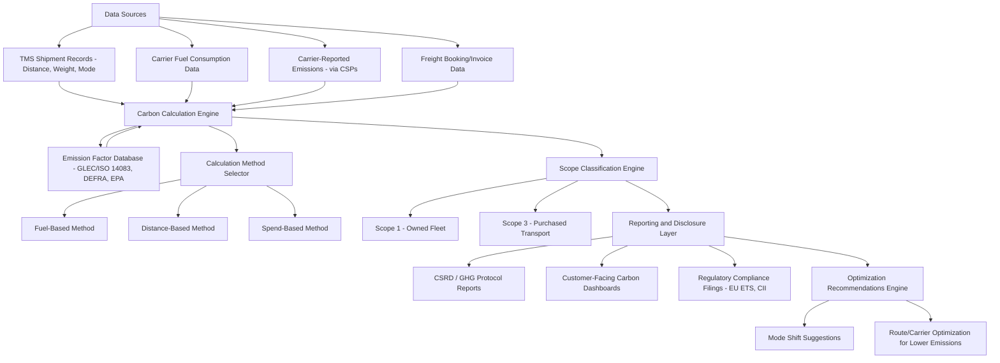

## Green Logistics and Freight Carbon Accounting

### Overview

Green logistics refers to the design and operation of supply chain and transportation activities aimed at minimizing environmental impact, particularly greenhouse gas (GHG) emissions, while maintaining service and cost efficiency. Freight carbon accounting is the technical discipline of measuring, calculating, and reporting the GHG emissions associated with moving goods, providing the quantitative foundation that green logistics initiatives, regulatory compliance, and corporate sustainability disclosures rely upon.

### Regulatory and Standards Landscape

**Key Points**

- **GHG Protocol**: The most widely used international accounting standard for corporate GHG emissions, categorizing emissions into three scopes:
  - **Scope 1**: Direct emissions from owned/controlled sources (e.g., a company's own truck fleet fuel combustion).
  - **Scope 2**: Indirect emissions from purchased electricity, steam, heating, and cooling.
  - **Scope 3**: All other indirect emissions in the value chain, including "purchased transportation and distribution" — this is where most third-party freight (ocean, air, rail, trucking by external carriers) emissions are reported, and for most shippers represents the largest single source of transportation-related emissions.
- **GLEC Framework (Global Logistics Emissions Council)**, now incorporated into the **ISO 14083:2023** standard, provides a harmonized methodology specifically for calculating and reporting logistics emissions across all transport modes, addressing the historical problem of inconsistent, non-comparable carbon calculation methods used by different carriers and shippers.
- **IMO (International Maritime Organization) regulations**: Include the **Carbon Intensity Indicator (CII)** and **Energy Efficiency Existing Ship Index (EEXI)**, mandatory operational and technical efficiency metrics for ocean vessels, alongside the IMO's revised GHG strategy targeting net-zero emissions from international shipping by or around 2050. [Unverified: specific interim targets and dates within IMO's GHG strategy are subject to periodic revision; verify current targets against IMO's latest published strategy before citing specific figures.]
- **EU ETS (Emissions Trading System) extension to shipping**: Since 2024, large vessels calling at EU ports are included in the EU's carbon trading scheme, requiring shipping companies to purchase allowances corresponding to their emissions. [Unverified: phase-in percentages and scope details have been subject to legislative adjustment; verify current EU ETS maritime provisions before relying on specific compliance thresholds.]
- **CSRD (Corporate Sustainability Reporting Directive)**: EU regulation requiring large companies to disclose detailed sustainability data, including Scope 3 transportation emissions, increasing pressure on shippers to obtain accurate carbon data from logistics providers.

### Core Carbon Accounting Methodology

#### Calculation Approaches

- **Fuel-based method**: Calculates emissions directly from actual fuel consumption data (liters/gallons of diesel, bunker fuel, jet fuel) multiplied by fuel-specific emission factors. Considered the most accurate method when actual consumption data is available.
- **Distance-based method**: Estimates emissions using distance traveled, cargo weight/volume, and mode-specific average emission factors (e.g., grams CO2e per tonne-kilometer) when actual fuel data is unavailable. This is the most common method for shippers who lack direct access to carrier fuel consumption data.
- **Spend-based method**: Estimates emissions based on freight spend multiplied by an industry-average emissions-per-dollar factor; the least accurate method, typically used only when neither fuel nor activity (distance/weight) data is available.

#### The Core Formula (Distance-Based, Simplified)

$$E = D \times W \times EF$$

Where $E$ is emissions (kg CO2e), $D$ is distance traveled (km), $W$ is cargo weight or TEU count, and $EF$ is the mode- and vehicle-specific emission factor (e.g., grams CO2e per tonne-km).

**Example**

A 20-tonne shipment traveling 1,000 km by heavy-duty diesel truck, using an illustrative emission factor of approximately 62 grams CO2e per tonne-km for that vehicle class, would yield an estimated $20 \times 1000 \times 0.062 = 1240$ kg CO2e. [Inference: actual emission factors vary significantly by vehicle age, fuel type, load factor, and route conditions (e.g., terrain, congestion); this is illustrative of the calculation method rather than a universally applicable factor. Always source current, mode-and-region-specific emission factors from an authoritative database such as GLEC/ISO 14083 reference tables, DEFRA, or EPA SmartWay.]

### Emissions by Transport Mode (Relative Carbon Intensity)

**Key Points**

- **Ocean freight**: Generally the lowest carbon intensity per tonne-km among long-haul modes due to the large economies of scale of container vessels, though absolute emissions remain significant given the volume of global trade carried by sea.
- **Rail freight**: Also relatively low carbon intensity per tonne-km compared to road, particularly for electrified rail networks.
- **Road freight (trucking)**: Higher carbon intensity per tonne-km than rail or ocean, though often necessary for last-mile and flexible point-to-point delivery where rail/ocean infrastructure doesn't reach.
- **Air freight**: By a substantial margin the highest carbon intensity per tonne-km of any major freight mode, due to the energy density required for flight; typically reserved for time-sensitive or high-value/low-weight cargo specifically because of this cost and carbon premium. [Inference: the general mode ranking (air highest, then road, then rail/ocean lowest) is well-established and consistent across major emission factor databases (GLEC, DEFRA, EPA), though the precise multiplier between modes varies by source, vehicle/vessel specifics, and load factor, so specific numeric multipliers should be sourced from a current reference database rather than treated as fixed constants.]

### System Architecture for Carbon Accounting Platforms

### Architecture Diagram (svg_diagram)

<svg xmlns="http://www.w3.org/2000/svg" viewBox="0 0 800 380">
<text x="400" y="30" font-size="18" font-weight="bold" text-anchor="middle" fill="#1a1a1a">Freight Carbon Accounting Flow (svg_diagram)</text>
<rect x="30" y="60" width="160" height="70" rx="8" fill="#dbeafe" stroke="#2563eb" stroke-width="1.5" />
<text x="110" y="90" font-size="12" text-anchor="middle" fill="#1e3a8a">Activity Data</text>
<text x="110" y="108" font-size="10" text-anchor="middle" fill="#1e3a8a">Distance, Weight,</text>
<text x="110" y="122" font-size="10" text-anchor="middle" fill="#1e3a8a">Fuel, Mode</text>
<rect x="240" y="60" width="160" height="70" rx="8" fill="#dcfce7" stroke="#16a34a" stroke-width="1.5" />
<text x="320" y="90" font-size="12" text-anchor="middle" fill="#14532d">Emission Factors</text>
<text x="320" y="108" font-size="10" text-anchor="middle" fill="#14532d">GLEC/ISO 14083,</text>
<text x="320" y="122" font-size="10" text-anchor="middle" fill="#14532d">DEFRA, EPA</text>
<rect x="450" y="60" width="160" height="70" rx="8" fill="#fef3c7" stroke="#d97706" stroke-width="1.5" />
<text x="530" y="90" font-size="12" text-anchor="middle" fill="#78350f">Calculation Engine</text>
<text x="530" y="108" font-size="10" text-anchor="middle" fill="#78350f">E = D x W x EF</text>
<rect x="660" y="60" width="120" height="70" rx="8" fill="#fce7f3" stroke="#db2777" stroke-width="1.5" />
<text x="720" y="90" font-size="12" text-anchor="middle" fill="#831843">Scope 1/3</text>
<text x="720" y="108" font-size="10" text-anchor="middle" fill="#831843">Classification</text>
<line x1="190" y1="95" x2="240" y2="95" stroke="#475569" stroke-width="2" marker-end="url(#arrow3)" />
<line x1="400" y1="95" x2="450" y2="95" stroke="#475569" stroke-width="2" marker-end="url(#arrow3)" />
<line x1="610" y1="95" x2="660" y2="95" stroke="#475569" stroke-width="2" marker-end="url(#arrow3)" />
<rect x="150" y="200" width="500" height="120" rx="10" fill="#ede9fe" stroke="#7c3aed" stroke-width="2" />
<text x="400" y="225" font-size="13" font-weight="bold" text-anchor="middle" fill="#4c1d95">Reporting and Action Layer</text>
<text x="400" y="250" font-size="10" text-anchor="middle" fill="#4c1d95">CSRD / GHG Protocol Disclosure Reports</text>
<text x="400" y="270" font-size="10" text-anchor="middle" fill="#4c1d95">Customer Carbon Dashboards</text>
<text x="400" y="290" font-size="10" text-anchor="middle" fill="#4c1d95">Mode-Shift and Route Optimization Recommendations</text>
<line x1="400" y1="130" x2="400" y2="200" stroke="#475569" stroke-width="2" />
</svg>

### Key Technology and Operational Levers for Emissions Reduction

**Key Points**

- **Mode shift**: Shifting freight from higher-carbon modes (air, road) to lower-carbon modes (rail, ocean) where transit time requirements allow.
- **Load consolidation and network optimization**: Improving vehicle/container fill rates reduces emissions per unit of cargo moved (directly reducing the $W$ utilization efficiency in the emissions calculation).
- **Alternative fuels and propulsion**:
  - **Biofuels and renewable diesel** for existing truck/vessel fleets without requiring new engine technology.
  - **Electric vehicles (EVs)** for last-mile and regional trucking, constrained by current battery range and charging infrastructure for long-haul applications.
  - **Hydrogen fuel cells**: Emerging technology particularly relevant for heavy-duty long-haul trucking where battery weight/range trade-offs are less favorable.
  - **Alternative marine fuels**: Methanol, ammonia, and LNG (liquefied natural gas) as lower-carbon bunker fuel alternatives being adopted by major ocean carriers, alongside ongoing methane slip and lifecycle emissions debates for LNG specifically. [Unverified: the lifecycle carbon benefit of LNG as a marine fuel is contested in the literature due to methane slip concerns; treat specific claims about LNG's net climate benefit as an area of ongoing technical and scientific debate rather than settled fact.]
- **Route and speed optimization**: Slow steaming (reducing vessel speed) significantly reduces fuel consumption and emissions per voyage, though at the cost of longer transit times — a direct trade-off between service level and carbon intensity.
- **Warehouse and facility efficiency**: Renewable energy procurement, efficient building design, and electrified material handling equipment reduce Scope 1/2 emissions in the broader logistics network (though this extends beyond pure "freight" carbon accounting into facility-level accounting).

### Carbon Accounting Software and Platforms

- Dedicated freight carbon accounting platforms (e.g., EcoTransIT World, various GLEC-certified calculators integrated into TMS and visibility platforms) apply standardized emission factors to shipment activity data to generate auditable emissions reports.
- Increasingly integrated directly into TMS and digital freight booking platforms, allowing shippers to see estimated carbon impact alongside cost and transit time at the point of booking or carrier selection — sometimes referred to as a "green routing guide."
- **Primary vs. secondary data**: A key quality distinction is between "primary data" (actual carrier-reported fuel consumption or telematics data for the specific shipment) and "secondary data" (industry-average emission factors applied to generic shipment characteristics); primary data produces more accurate, shipment-specific figures but requires carriers to have the measurement and data-sharing infrastructure to provide it.

### Benefits

- **Regulatory compliance**: Meeting mandatory disclosure requirements (CSRD, SEC climate disclosure rules where applicable, EU ETS) avoids penalties and legal risk.
- **Customer and investor demand**: Increasing numbers of large shippers require carbon data from logistics providers as part of vendor selection and ESG reporting obligations.
- **Cost synergies**: Many emissions-reduction levers (load consolidation, route optimization, slow steaming) also reduce fuel costs, aligning sustainability and cost-efficiency objectives.
- **Risk mitigation**: Early adoption of low-carbon fuel and technology reduces exposure to future regulatory tightening and carbon pricing mechanisms.
- **Competitive differentiation**: Verified low-carbon logistics credentials can serve as a market differentiator, particularly in industries facing consumer or regulatory pressure on supply chain sustainability.

### Limitations and Challenges

- **Data availability and quality**: Many carriers, particularly smaller regional trucking and forwarding operations, lack the systems to provide granular, shipment-level fuel consumption data, forcing reliance on less accurate distance/spend-based estimation methods.
- **Standardization gaps**: Despite ISO 14083/GLEC harmonization efforts, inconsistent application across carriers and regions can still produce non-comparable figures between different providers' reported emissions.
- **Scope 3 complexity**: Since purchased transportation typically falls under Scope 3, and Scope 3 emissions depend on data from third parties (carriers) with varying data maturity and disclosure incentives, achieving audit-grade accuracy remains genuinely difficult across a complex, multi-tier logistics network.
- **Cost of low-carbon alternatives**: Alternative fuels and electric/hydrogen vehicles often carry a cost premium and infrastructure requirement (charging/refueling networks) that limits near-term large-scale adoption, particularly for long-haul trucking and ocean shipping. [Inference: given the current maturity gap between conventional and alternative fuel infrastructure, near-term emissions reductions in freight are likely to come disproportionately from efficiency/optimization measures (load consolidation, routing, slow steaming) rather than wholesale fuel-technology transitions, though this balance will shift as alternative fuel infrastructure matures.]
- **Greenwashing risk**: Reliance on low-quality secondary data or selective reporting can create a gap between reported and actual environmental performance, an area of increasing regulatory and stakeholder scrutiny.

### Comparison: Carbon Calculation Methods

| Method | Data Requirement | Accuracy | Typical Use Case |
| --- | --- | --- | --- |
| Fuel-based | Actual fuel consumption per shipment/vehicle | Highest | Own fleet operations; carriers with telematics |
| Distance-based | Distance, weight/volume, mode-specific factors | Moderate | Most common shipper-side estimation when carrier fuel data unavailable |
| Spend-based | Freight expenditure only | Lowest | Fallback when no activity data available |

### Related Topics

- Artificial intelligence in freight management (AI-driven route optimization for emissions reduction)
- Internet of Things and real-time cargo visibility (telematics data for primary emissions data)
- Alternative marine fuels and vessel propulsion technology
- Corporate Sustainability Reporting Directive (CSRD) and Scope 3 disclosure requirements
- EU Emissions Trading System (ETS) extension to maritime shipping
- Incoterms and allocation of environmental responsibility in trade contracts
- Circular economy and reverse logistics sustainability practices