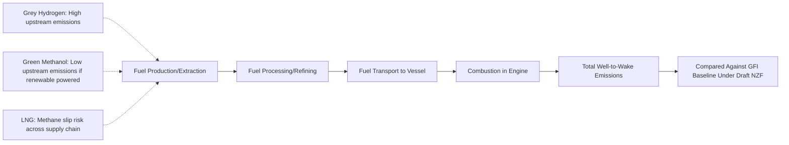

## IMO Decarbonization Targets and Alternative Marine Fuels

### Overview

The International Maritime Organization (IMO), the United Nations specialized agency responsible for regulating international shipping, has established a progressive regulatory framework aimed at decarbonizing the global shipping industry, which accounts for a significant share of global trade-related greenhouse gas (GHG) emissions. This framework combines binding emissions-intensity targets, a global fuel standard, and — pending final adoption — an economic pricing mechanism, alongside driving demand for alternative marine fuels to replace conventional heavy fuel oil (HFO) and marine diesel.

### The 2023 IMO GHG Strategy

**Key Points**

- The **2023 Revised IMO GHG Strategy** (adopted at MEPC 80, July 2023) sets the overarching ambition: net-zero GHG emissions from international shipping by or around, i.e. close to, 2050. [DNV](https://www.dnv.com/maritime/hub/decarbonize-shipping/key-drivers/regulations/imo-regulations/ghg-vision/)[Globalmaritimeforum](https://globalmaritimeforum.org/insight/the-implications-of-the-imo-revised-ghg-strategy-for-shipping/)
- **Indicative checkpoints**: reduce total annual GHG emissions from international shipping by at least 20%, striving for 30%, by 2030, and by at least 70%, striving for 80%, by 2040, both measured against a 2008 baseline. [International Maritime Organization](https://www.imo.org/en/mediacentre/hottopics/pages/cutting-ghg-emissions.aspx)
- **Carbon intensity target**: the strategy envisages a reduction in carbon intensity of international shipping by at least 40% by 2030. [International Maritime Organization](https://www.imo.org/en/mediacentre/hottopics/pages/cutting-ghg-emissions.aspx)
- **Alternative fuel uptake target**: a target of at least 5% uptake of zero or near-zero GHG emission technologies, fuels, and/or energy sources by 2030. [Globalmaritimeforum](https://globalmaritimeforum.org/insight/the-implications-of-the-imo-revised-ghg-strategy-for-shipping/)
- Emissions are assessed on a **well-to-wake basis**, meaning the full lifecycle of a fuel — from production/extraction through combustion — is counted, not just tailpipe/funnel emissions. This is significant because it prevents fuels with low combustion emissions but high production-stage emissions (e.g., certain LNG or grey hydrogen pathways) from being credited as fully "clean."

### The IMO Net-Zero Framework (NZF): Current Status

**This is an area of active, ongoing regulatory development, and the following reflects the situation as of late September 2026:**

- At **MEPC 83 (April 2025)**, the IMO approved draft net-zero regulations combining mandatory emissions limits and a global GHG pricing mechanism — the first such combination across an entire industry sector. [International Maritime Organization](https://www.imo.org/en/mediacentre/pressbriefings/pages/imo-approves-netzero-regulations.aspx)
- The framework's technical element is a **Global Fuel Standard**, requiring ships to reduce, over time, their annual greenhouse gas fuel intensity (GFI) — how much GHG is emitted per unit of energy used, with two compliance tiers: a Base Target and a stricter Direct Compliance Target, where ships meeting the latter become eligible to earn "surplus units". [International Maritime Organization](https://www.imo.org/en/mediacentre/pressbriefings/pages/imo-approves-netzero-regulations.aspx)[International Maritime Organization](https://www.imo.org/en/mediacentre/pressbriefings/pages/imo-approves-netzero-regulations.aspx)
- The economic element proposed a **GHG pricing mechanism**: applying to a share of international shipping emissions from 2028, with an initial price of USD 100 per tonne of CO2, generating an estimated USD 11-13 billion annually to fund the transition to zero/near-zero fuels and support a "just and equitable transition" for developing states and small island nations. [European Commission](https://transport.ec.europa.eu/news-events/news/landmark-agreement-towards-achieving-net-zero-emissions-global-shipping-2050-2025-04-11_en)
- **However, formal adoption did not go as originally planned.** The new regulations were considered for adoption at an extraordinary MEPC session in October 2025, but the committee remained divided; a majority voted to adjourn the meeting for one year. As a result, the amendments were not adopted, and the session will resume in October 2026, meaning the earliest possible entry into force is now 1 March 2028. [DNV](https://www.dnv.com/maritime/insights/topics/net-zero-framework/)
- This is a material change from earlier reporting (mid-2025) which had anticipated formal adoption in October 2025 with entry into force in 2027 and compliance starting in 2028. **[Note: given the postponement, treat any pre-October-2025 source describing a 2027 entry-into-force date as superseded; the current expected earliest entry into force is 2028, and even that remains contingent on the outcome of the deferred October 2026 session.]** [Maersk](https://www.maersk.com/insights/sustainability/2025/08/29/imo-net-zero-framework)

### Compliance Mechanics of the Draft Framework

| Element | Description |
| --- | --- |
| Global Fuel Standard (GFI) | Ships must progressively reduce grams of CO2-equivalent per megajoule of energy used, compared to a fossil baseline |
| Base Target | Minimum compliance threshold; ships exceeding this incur obligations to acquire remedial units |
| Direct Compliance Target | Stricter threshold; ships achieving this earn tradeable surplus units |
| Flexibility mechanisms | Compliance balances can be banked, sold, pooled across a fleet, or cancelled |
| Remedial units | Purchased by ships that fail to meet the Base Target, functioning as a de facto carbon price on non-compliant emissions |

### Existing Operational and Technical Regulations (Already in Force)

Separately from the pending Net-Zero Framework, several IMO measures are already operative under MARPOL Annex VI:

- **EEDI (Energy Efficiency Design Index)**: requires new ships to be built and designed to be more energy efficient, a mandatory technical standard in force since 2013 for newly built vessels. [DNV](https://www.dnv.com/maritime/hub/decarbonize-shipping/key-drivers/regulations/imo-regulations/ghg-vision/)
- **EEXI (Energy Efficiency Existing Ship Index)**: Extends technical efficiency requirements to existing vessels, assessed at their first survey after 2023.
- **CII (Carbon Intensity Indicator)**: An annual operational efficiency rating (A through E) assigned to ships based on actual carbon intensity of operations, with underperforming ships required to submit corrective action plans.

### Alternative Marine Fuels Landscape

#### 1. LNG (Liquefied Natural Gas)

- Currently the most widely adopted alternative marine fuel in terms of installed engine capacity and bunkering infrastructure.
- Produces lower CO2 emissions at combustion than heavy fuel oil, but its climate benefit on a well-to-wake basis is contested due to **methane slip** (unburned methane escaping during combustion and fuel handling), since methane is a far more potent greenhouse gas than CO2 over short time horizons. This is a genuinely disputed area in the scientific and policy literature rather than a settled question.

#### 2. Methanol

- Liquid at ambient temperature, simplifying storage and bunkering compared to cryogenic fuels like LNG or hydrogen.
- Can be produced as "green methanol" from renewable electricity and captured CO2 (e-methanol) or from biomass (bio-methanol), though current global production capacity for green variants remains a fraction of total demand.
- Adopted by major container carriers (notably Maersk) in newbuild dual-fuel vessel orders, positioning it as a leading contender among scalable low-carbon fuel pathways.

#### 3. Ammonia

- Contains no carbon, so combustion produces zero direct CO2 emissions, making it attractive as a long-term zero-carbon fuel pathway.
- Significant unresolved technical and safety challenges: ammonia is toxic, requires new engine designs (not yet at full commercial maturity), and combustion can produce nitrous oxide (N2O), itself a potent greenhouse gas, if not properly controlled.
- Considered by many industry stakeholders a longer-horizon solution compared to methanol, pending engine technology maturation and safety framework development. [Inference: given ammonia's earlier stage of commercial engine deployment relative to methanol and LNG, its near-term (pre-2030) fleet share is likely to remain small, though this is a directional inference from technology readiness rather than a specific forecast.]

#### 4. Hydrogen

- Zero-carbon at point of use, but low volumetric energy density and cryogenic storage requirements (liquid hydrogen at approximately -253°C) pose significant challenges for long-haul ocean shipping, making it more immediately relevant to short-sea shipping, ferries, and port operations than deep-sea trade routes.
- **Fuel cells** (as opposed to combustion engines) are one proposed hydrogen utilization pathway, offering higher efficiency but currently limited to smaller vessel applications.

#### 5. Biofuels

- Drop-in or blended biofuels (e.g., biodiesel, hydrotreated vegetable oil) can be used in existing engines with minimal modification, offering a near-term decarbonization lever without requiring new vessel newbuilds.
- Scalability is constrained by feedstock availability and competition with other sectors (aviation, road transport) also pursuing biofuel-based decarbonization.

### Well-to-Wake Emissions Comparison (Conceptual)

### Industry Response Mechanisms

- **Green shipping corridors**: The Clydebank Declaration, launched in 2021 alongside COP26, aims to support the establishment of at least six green shipping corridors by 2050, with close to 30 initiatives having emerged since, involving more than 110 stakeholders across the value chain. These are defined trade routes where public-private partnerships commit to deploying zero-emission fuel infrastructure and vessels ahead of broader regulatory mandates. [Globalmaritimeforum](https://globalmaritimeforum.org/insight/the-implications-of-the-imo-revised-ghg-strategy-for-shipping/)
- **Dual-fuel newbuild ordering**: Major container and bulk carriers have increasingly ordered dual-fuel vessels (capable of running on both conventional fuel and methanol, LNG, or ammonia-ready configurations) to hedge against fuel-pathway uncertainty while regulatory and infrastructure clarity develops.
- **EU ETS maritime extension**: Operating in parallel to (and independent of) the IMO framework, the EU's inclusion of shipping in its Emissions Trading System since 2024 has created a regional carbon price that applies regardless of the IMO framework's adoption timeline, meaning vessels calling at EU ports already face carbon costs.

### Benefits of the Framework (as Designed)

- **Global regulatory certainty**: A single global standard reduces the risk of a fragmented patchwork of regional/national rules that could complicate international vessel operations.
- **Investment signal**: A confirmed pricing mechanism and fuel standard would give fuel producers, shipyards, and engine manufacturers clearer demand signals to justify capital investment in alternative fuel production and bunkering infrastructure.
- **Just transition funding**: The proposed pricing mechanism's revenue allocation toward developing states and small island nations aims to address concerns about disproportionate impacts on trade-dependent, remote economies.

### Limitations and Challenges

- **Regulatory uncertainty following the October 2025 postponement**: The one-year adjournment introduces material delay and uncertainty for shipowners and fuel investors who had been planning around a 2027–2028 compliance timeline; the eventual outcome of the October 2026 session remains genuinely uncertain at this time.
- **Divided member state positions**: Delay reflects disagreement among IMO member states regarding equitable treatment of remote, transport-dependent, and food-security-vulnerable states, an unresolved tension underlying the framework's fate. [Wikipedia](https://en.wikipedia.org/wiki/IMO_Net-Zero_Framework)
- **Fuel availability gap**: Alternative fuels remain limited and expensive today, meaning even a fully adopted framework would require years of infrastructure buildout before compliant fuel supply could meet fleet-wide demand. [Maersk](https://www.maersk.com/insights/sustainability/2025/08/29/imo-net-zero-framework)
- **Ambition-implementation gap**: Critics, including some environmental groups, have argued that the draft framework's projected revenues will not be sufficient to support adequate uptake of zero- and near-zero GHG fuels, nor fully enable a just and equitable transition, and that current targets fall short of Paris Agreement 1.5°C-aligned trajectories. This is a contested area where industry, NGO, and IMO member state assessments diverge. [T&E](https://www.transportenvironment.org/uploads/files/Impact-of-the-IMOs-draft-Net-Zero-Framework-April-2025.pdf)
- **Technology readiness variance**: Alternative fuel pathways are at markedly different maturity levels (methanol and LNG relatively mature; ammonia and hydrogen earlier-stage for deep-sea shipping), meaning the "alternative fuels" category should not be treated as a single homogeneous solution with uniform near-term availability.

### Related Topics

- Green logistics and freight carbon accounting (GHG Protocol Scope 3, ISO 14083/GLEC)
- EU Emissions Trading System (ETS) extension to maritime shipping
- Green shipping corridors and the Clydebank Declaration
- Vessel newbuild strategy and dual-fuel engine technology
- Carbon Intensity Indicator (CII) and EEXI compliance for existing fleets
- Hydrogen and ammonia bunkering infrastructure development
- Just transition frameworks in international climate policy