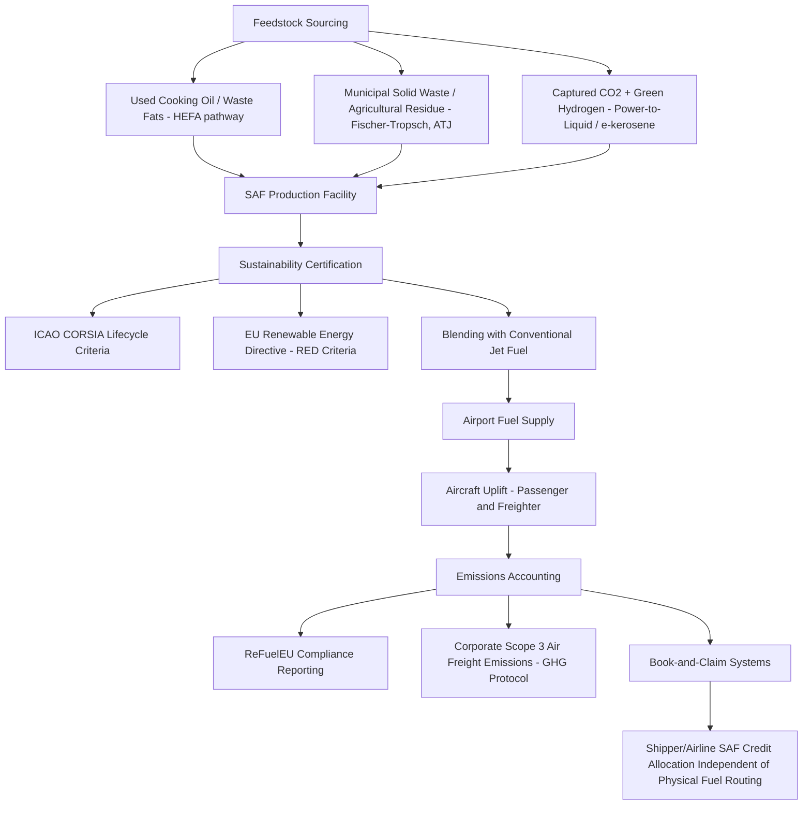

## Sustainable Aviation Fuel and Air Freight Emissions

### Overview

Sustainable Aviation Fuel (SAF) is a category of alternative jet fuel produced from renewable or waste-derived feedstocks — rather than fossil crude oil — designed to be a "drop-in" replacement usable in existing aircraft engines and fuel infrastructure without modification. SAF is widely regarded by the aviation industry as the single most significant lever for reducing air freight and passenger aviation's carbon footprint over the coming decades, given the limited near-term viability of full electrification or hydrogen propulsion for long-haul commercial aircraft.

### Why Air Freight Emissions Are a Distinct Problem

**Key Points**

- Air freight has the highest carbon intensity per tonne-kilometer of any major freight mode, by a substantial margin, due to the energy density required for flight compared to surface or sea transport.
- Unlike road or rail freight, aviation has no mature, scalable path to electrification for long-haul routes given current battery energy density limitations, making liquid fuel substitution (SAF) the primary near-to-medium-term decarbonization lever rather than a transition to alternative propulsion architecture.
- Air cargo is typically used specifically for time-sensitive, high-value, or perishable goods precisely because of its cost and carbon premium over sea/rail alternatives, meaning demand for air freight capacity is relatively inelastic to carbon costs in many use cases (e.g., pharmaceuticals, e-commerce express, perishable seafood).
- A meaningful share of global air cargo travels in the belly-hold of passenger aircraft rather than dedicated freighters, meaning air freight emissions are partly a function of passenger aviation's decarbonization trajectory as well.

### What Qualifies as SAF

- **Feedstock categories**:
  - **Used cooking oil (UCO) and waste fats/oils**: Currently the dominant commercial SAF feedstock pathway via the **HEFA (Hydroprocessed Esters and Fatty Acids)** production process.
  - **Municipal solid waste and agricultural residues**: Processed via Fischer-Tropsch synthesis or alcohol-to-jet (ATJ) pathways.
  - **Synthetic/e-fuels (Power-to-Liquid)**: Produced from captured CO2 and green hydrogen using renewable electricity; often termed **e-kerosene** or **eSAF**. These carry the highest production cost currently but the strongest long-term scalability potential since they are not feedstock-constrained in the way waste-oil pathways are.
- **Sustainability certification**: SAF must meet lifecycle greenhouse gas emissions-reduction criteria under frameworks such as the EU's Renewable Energy Directive (RED) and ICAO's **CORSIA (Carbon Offsetting and Reduction Scheme for International Aviation)**, which sets the international sustainability and lifecycle accounting standards used to certify eligible SAF batches.
- **Blending requirement**: SAF is typically certified for blending with conventional jet fuel up to defined percentage limits (historically up to 50% for most approved pathways), rather than as a 100% substitute, though 100% SAF test flights have been conducted by several manufacturers and operators.

### Regulatory Landscape (Current Status)

**Key Points — as of late September 2026:**

- **ReFuelEU Aviation (EU Regulation 2023/2405)**: The EU's core SAF policy, part of the "Fit for 55" package, mandates that aviation fuel suppliers blend a progressively increasing minimum share of SAF into jet fuel supplied at EU airports:
  - 2% minimum SAF share from 2025
  - Rising to 6% by 2030
  - Escalating further toward 70% by 2050
  - A separate sub-mandate specifically for synthetic e-fuels (RFNBOs), starting around 1.2% in 2030 and rising to 35% by 2050.
- **Compliance confirmed for the first mandate period**: EASA's 2026 ReFuelEU Aviation Annual Technical Report (published September 2026) confirmed that EU aviation fuel suppliers supplied 39.3 million tonnes of aviation fuel in 2025, of which 1.1 million tonnes (2.8%) was SAF — exceeding the mandatory 2% minimum for that year.
- **2030 production capacity outlook**: EASA's assessment indicates EU SAF production capacity is projected to remain on track to meet the 6% blending target by 2030, though the report noted the synthetic e-fuel (RFNBO) sub-mandate faces a materially higher execution risk, with the sector still at an early demonstration stage — around 50 e-fuel projects were reported as awaiting final investment decisions as of the 2026 report.
- **EU Sustainable Transport Investment Plan (STIP)**: Published November 2025, this plan targets mobilizing approximately €2 billion in investment for the sustainable fuel sector during 2026–2027, specifically aimed at unblocking e-kerosene projects struggling to reach final investment decisions.
- **Flexibility mechanism**: Until 2034, fuel suppliers can meet blending obligations as a weighted average across all EU airports they supply, rather than meeting the exact percentage at every individual airport; after 2034 this flexibility ends and compliance must be met airport-by-airport.
- **Switzerland**: Has signaled intent to adopt an equivalent mandate, with blending quotas expected to take effect in 2026. [Unverified: exact implementation timing and final Swiss regulatory text should be confirmed against current Swiss federal sources, as adoption timelines for aligning non-EU jurisdictions can shift.]
- **Global context (ICAO CORSIA)**: At the 2023 ICAO CAAF/3 conference, member states agreed a global aspirational goal of reducing international aviation CO2 emissions by 5% by 2030 through SAF and other cleaner energy sources — notably an aspirational goal rather than a binding mandate, in contrast to the EU's legally binding blending requirements.

### Production Capacity and Cost Reality

- As of 2024 baseline data, SAF represented only approximately 0.53% of global jet fuel use, underscoring how early-stage the transition remains relative to long-term 2050 targets.
- SAF is currently estimated at roughly 3 to 10 times the cost of conventional jet fuel, though costs are expected to decline as production technologies scale and mature — the scale of eventual cost reduction remains a genuinely uncertain, forward-looking projection rather than an established fact. [Unverified: SAF cost premiums vary significantly by feedstock pathway (waste-oil-based HEFA SAF is markedly cheaper than synthetic e-kerosene) and by region; treat any single cost multiplier as illustrative rather than universal.]
- Industry estimates suggest 100+ additional SAF production plants may need to be built in the EU alone by 2050 to meet escalating mandate volumes, with roughly 40 of these envisioned as large-scale e-fuel (synthetic) facilities specifically.

### SAF Value Chain and Certification Flow

### Book-and-Claim Accounting

**Key Points**

- Because SAF is typically blended into the general jet fuel supply at limited production/distribution hubs rather than physically loaded onto every specific flight, the industry uses **book-and-claim** accounting systems to allocate the environmental benefit of SAF purchases to specific customers (airlines, freight forwarders, or corporate shippers) regardless of which physical aircraft the SAF molecules end up in.
- This mirrors renewable energy certificate (REC) mechanisms used in electricity markets, and allows a shipper purchasing "SAF-backed" air freight to claim emissions reduction credit even though the specific shipment's aircraft may not have physically used SAF.
- Book-and-claim systems require robust chain-of-custody and anti-double-counting safeguards to maintain credibility, an area subject to ongoing standard-setting by bodies such as RSB (Roundtable on Sustainable Biomaterials) and industry SAF certificate frameworks.

### Air Freight Carbon Accounting Integration

- SAF usage (whether physical or book-and-claim) is incorporated into corporate Scope 3 emissions reporting for shippers using air freight, following the same GHG Protocol / ISO 14083 frameworks used across other freight modes (see Green Logistics and Freight Carbon Accounting).
- Air cargo carriers and integrators (FedEx, DHL, UPS) have introduced SAF-linked "green" freight products, allowing corporate shippers to pay a premium to fund SAF purchase and claim a proportional emissions reduction against their air freight Scope 3 footprint.
- Emission factor databases (GLEC/ISO 14083) increasingly include SAF-blend-adjusted emission factors distinct from standard fossil-jet-fuel factors, though the maturity and standardization of these blended factors varies by database and is an evolving area.

### Complementary Technical and Operational Levers

Beyond fuel substitution, several operational measures reduce air freight emissions intensity:

- **Fleet modernization**: Newer aircraft generations offer materially improved fuel efficiency per tonne-km compared to older models, making fleet renewal a meaningful (if capital-intensive) lever independent of SAF adoption.
- **Load factor optimization**: Maximizing cargo hold utilization reduces emissions per unit of freight carried, directly analogous to load consolidation in surface freight.
- **Operational efficiency**: Optimized flight routing, reduced holding patterns, and single-engine taxiing reduce fuel burn incrementally.
- **Modal shift consideration**: For freight where transit time flexibility exists, shifting from air to ocean or rail can produce order-of-magnitude emissions reductions, though this requires supply chain lead-time flexibility that not all cargo categories (e.g., urgent medical shipments) possess.

### Benefits

- **Drop-in compatibility**: SAF requires no new aircraft, engines, or airport fuel infrastructure, unlike hydrogen or electric propulsion pathways, allowing near-term deployment across the existing global fleet.
- **Regulatory compliance pathway**: Provides airlines and fuel suppliers a clear, quantifiable mechanism to meet binding mandates like ReFuelEU Aviation.
- **Lifecycle emissions reduction**: Well-certified SAF pathways can deliver substantial lifecycle GHG reductions compared to conventional jet fuel, depending on feedstock and production pathway.
- **Investment and innovation signal**: Binding mandates create demand certainty that supports capital investment in new production capacity and next-generation pathways (e-kerosene).

### Limitations and Challenges

- **Feedstock scalability**: Waste-oil-based (HEFA) SAF, the most mature and cost-competitive pathway today, is fundamentally constrained by finite global supplies of used cooking oil and waste fats/oils, limiting how far this pathway alone can scale toward 2050 targets.
- **Cost premium**: The current multi-fold cost premium over conventional jet fuel creates a real economic barrier to voluntary uptake beyond regulatory minimums, particularly for cost-sensitive air freight segments.
- **Production capacity lag**: Even with confirmed compliance for the 2025 mandate period, the synthetic e-fuel sub-mandate in particular faces meaningful execution risk given the early stage of demonstration-scale e-kerosene projects.
- **Investment bottleneck**: A substantial number of e-fuel projects remain stalled awaiting final investment decisions, reflecting a broader "chicken-and-egg" market dynamic between demand certainty and production investment that policy measures like the EU's STIP are specifically designed to address.
- **Certification and book-and-claim integrity**: The credibility of book-and-claim systems depends on robust anti-double-counting and chain-of-custody standards that are still maturing industry-wide.
- **Aviation-specific limits on alternatives**: Unlike surface freight, aviation has no near-term electrification or hydrogen pathway for long-haul routes, meaning SAF adoption pace essentially determines aviation's decarbonization trajectory for the foreseeable future, with limited fallback options if production scale-up underperforms targets. [Inference: given the current absence of a viable long-haul alternative propulsion pathway, aviation's overall sector decarbonization timeline is likely to be more sensitive to SAF production scale-up rates than most other freight modes are to their respective alternative fuel pathways.]

### Comparison: SAF Production Pathways

| Pathway | Feedstock | Maturity | Cost (relative) | Scalability Constraint |
| --- | --- | --- | --- | --- |
| HEFA | Used cooking oil, waste fats | Most mature, dominant today | Lowest of SAF options | Limited by finite waste-oil supply |
| Fischer-Tropsch / ATJ | Municipal solid waste, agricultural residue | Moderate | Moderate-high | Feedstock logistics and collection infrastructure |
| Power-to-Liquid (e-kerosene) | Captured CO2 + green hydrogen | Early/demonstration stage | Highest | Renewable electricity and green hydrogen availability |

### Related Topics

- Green logistics and freight carbon accounting (Scope 3 air freight emissions integration)
- IMO decarbonization targets and alternative marine fuels (comparative modal decarbonization pathways)
- ICAO CORSIA framework and international aviation emissions offsetting
- Book-and-claim systems and renewable certificate markets
- Air cargo network design and belly-hold versus dedicated freighter capacity
- Modal shift decision-making between air, ocean, and rail freight