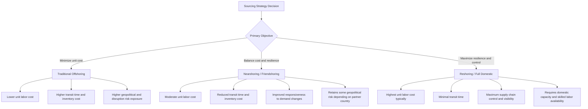

## Nearshoring and Supply Chain Reconfiguration

### Overview

Nearshoring and supply chain reconfiguration refer to the strategic relocation of manufacturing, sourcing, and production activities from distant, low-cost locations to sites geographically closer to end markets, or to a more geopolitically diversified set of locations, in response to rising costs, trade tensions, and disruption risk associated with long, globally concentrated supply chains. This trend represents a broader shift away from the decades-long "offshoring" paradigm centered on labor cost minimization, toward a paradigm balancing cost with resilience, speed, and risk mitigation.

### Definitions and Related Concepts

**Key Points**

- **Nearshoring**: Relocating production/sourcing to a country geographically close to the end market (e.g., US companies shifting manufacturing from China to Mexico).
- **Reshoring**: Relocating production back to the company's home/domestic market entirely.
- **Friendshoring (or ally-shoring)**: Relocating supply chains to countries considered politically aligned or "friendly" allies, prioritizing geopolitical alignment over pure geographic proximity.
- **Multi-shoring / China+1**: Diversifying production across multiple countries rather than full relocation, reducing dependency on any single sourcing location while retaining some presence in existing low-cost hubs.
- **Onshoring**: Sometimes used interchangeably with reshoring; occasionally used to describe initial domestic sourcing decisions rather than relocation from an existing offshore base.

### Drivers of Reconfiguration

**Key Points**

- **Geopolitical tension and trade policy**: Tariff escalation, export controls, and sanctions regimes (particularly US-China trade tensions) have materially raised the cost and risk of maintaining concentrated single-country sourcing strategies.
- **Pandemic-driven disruption exposure**: COVID-19 exposed the fragility of just-in-time, geographically concentrated global supply chains, prompting many organizations to re-evaluate resilience versus pure cost-efficiency trade-offs.
- **Rising labor costs in traditional low-cost hubs**: Wage growth in China and other established manufacturing centers has eroded some of the original labor-cost arbitrage that motivated offshoring in earlier decades.
- **Logistics cost and lead-time volatility**: Extended, multi-week ocean transit times and freight rate volatility (dramatically illustrated during 2021–2022) increase the appeal of shorter, more predictable supply chains for time-sensitive or fast-fashion-style categories.
- **Automation reducing labor cost advantage**: As manufacturing automation reduces the proportion of total production cost attributable to direct labor, the traditional cost rationale for offshoring to low-wage countries diminishes for some industries, making the incremental savings from offshoring lower relative to the logistics and inventory carrying costs of long supply chains.
- **Regulatory and ESG pressure**: Increasing scrutiny of supply chain labor practices, carbon footprint, and traceability requirements (e.g., forced labor import bans, carbon border adjustment mechanisms) adds compliance complexity to distant, opaque multi-tier supply chains.
- **Government industrial policy incentives**: Legislation such as the US CHIPS Act and Inflation Reduction Act have provided direct financial incentives for domestic or regional (North American) manufacturing in strategic sectors like semiconductors and clean energy.

### Strategic Framework for Evaluating Reconfiguration

#### Total Cost of Ownership (TCO) vs. Unit Cost

- Traditional offshoring decisions often optimized narrowly for unit production cost (labor + materials), understating the full total cost of ownership, which includes:
  - Inventory carrying costs from longer transit times and larger safety stock buffers
  - Freight and logistics costs, including exposure to rate volatility
  - Tariff and duty costs
  - Quality control and communication overhead across distance and time zones
  - Risk-adjusted cost of disruption (stockouts, expedited freight, lost sales)
- A more complete TCO framework increasingly informs sourcing decisions, sometimes tipping the calculation toward nearshoring even when nominal unit labor costs remain higher than in the original offshore location.

#### Risk-Resilience Trade-off Framework

### Regional Reconfiguration Patterns

**Key Points**

- **Mexico (North American nearshoring)**: Has emerged as a primary beneficiary of US nearshoring activity, driven by USMCA trade agreement preferences, geographic proximity, and lower labor costs relative to the US while offering substantially shorter transit times than Asia-based sourcing.
- **Southeast Asia (Vietnam, India, Bangladesh)**: Benefiting from "China+1" diversification strategies, particularly in textiles, electronics assembly, and consumer goods, as companies seek to reduce China concentration without fully exiting Asian manufacturing ecosystems.
- **Eastern Europe**: A nearshoring destination for Western European manufacturers, offering proximity, EU regulatory alignment (for EU member states), and comparatively lower labor costs than Western Europe.
- **Domestic US reshoring**: Concentrated particularly in strategic sectors receiving government incentives (semiconductors under the CHIPS Act, EV batteries and clean energy under the Inflation Reduction Act) and in industries where automation has reduced the labor cost differential's significance.

### Supply Chain and Logistics Implications

#### Network Redesign Considerations

- **Warehouse and distribution network footprint**: Shorter, regionalized supply chains often require redesigned distribution network topology — potentially more numerous, smaller regional distribution centers rather than fewer, larger centralized hubs optimized for long-haul consolidated ocean freight.
- **Transport mode shift**: Nearshoring frequently shifts primary transport mode from ocean freight (dominant in transpacific sourcing) to truck and rail (dominant in North American nearshoring from Mexico), altering the relevant carrier relationships, TMS configuration, and customs/trade compliance processes entirely.
- **Inventory strategy shift**: Shorter and more predictable lead times enable reduced safety stock levels and a shift toward more responsive, lower-inventory operating models, partially offsetting higher unit production costs through reduced working capital requirements.
- **Supplier relationship restructuring**: Reconfiguration often requires qualifying and onboarding entirely new supplier bases, involving quality audits, capacity verification, and relationship-building that can take multiple years for complex manufactured goods.

#### Trade Compliance and Customs Implications

- Reconfiguration frequently changes the applicable trade agreements, rules of origin requirements, and tariff classifications governing a company's supply chain (e.g., shifting from most-favored-nation tariff treatment on China-origin goods to preferential USMCA treatment on Mexico-origin goods, provided regional content requirements are met).
- **Rules of origin compliance** becomes a critical technical requirement: goods must meet defined regional value content thresholds to qualify for preferential tariff treatment under agreements like USMCA, requiring detailed bill-of-materials and supplier-tier documentation that many companies' existing systems are not initially equipped to track.
- Complex multi-tier supply chains reconfiguring across multiple countries simultaneously can face transitional periods of increased customs complexity as classification, valuation, and origin documentation processes are rebuilt for new supplier and routing configurations.

### Architecture: Reconfiguration Decision and Implementation Flow

<svg xmlns="http://www.w3.org/2000/svg" viewBox="0 0 800 420">
<text x="400" y="30" font-size="18" font-weight="bold" text-anchor="middle" fill="#1a1a1a">Supply Chain Reconfiguration Process (svg_diagram)</text>
<rect x="30" y="60" width="160" height="70" rx="8" fill="#dbeafe" stroke="#2563eb" stroke-width="1.5" />
<text x="110" y="90" font-size="12" text-anchor="middle" fill="#1e3a8a">Risk Assessment</text>
<text x="110" y="108" font-size="10" text-anchor="middle" fill="#1e3a8a">Geopolitical, Cost,</text>
<text x="110" y="122" font-size="10" text-anchor="middle" fill="#1e3a8a">Disruption Exposure</text>
<rect x="230" y="60" width="160" height="70" rx="8" fill="#dcfce7" stroke="#16a34a" stroke-width="1.5" />
<text x="310" y="90" font-size="12" text-anchor="middle" fill="#14532d">TCO Modeling</text>
<text x="310" y="108" font-size="10" text-anchor="middle" fill="#14532d">Labor, Logistics,</text>
<text x="310" y="122" font-size="10" text-anchor="middle" fill="#14532d">Tariff, Inventory Cost</text>
<rect x="430" y="60" width="160" height="70" rx="8" fill="#fef3c7" stroke="#d97706" stroke-width="1.5" />
<text x="510" y="90" font-size="12" text-anchor="middle" fill="#78350f">Location Selection</text>
<text x="510" y="108" font-size="10" text-anchor="middle" fill="#78350f">Nearshore, Friendshore,</text>
<text x="510" y="122" font-size="10" text-anchor="middle" fill="#78350f">Reshore, Multi-shore</text>
<rect x="630" y="60" width="150" height="70" rx="8" fill="#fce7f3" stroke="#db2777" stroke-width="1.5" />
<text x="705" y="90" font-size="12" text-anchor="middle" fill="#831843">Supplier</text>
<text x="705" y="105" font-size="10" text-anchor="middle" fill="#831843">Qualification and</text>
<text x="705" y="120" font-size="10" text-anchor="middle" fill="#831843">Onboarding</text>
<line x1="190" y1="95" x2="230" y2="95" stroke="#475569" stroke-width="2" marker-end="url(#arrow4)" />
<line x1="390" y1="95" x2="430" y2="95" stroke="#475569" stroke-width="2" marker-end="url(#arrow4)" />
<line x1="590" y1="95" x2="630" y2="95" stroke="#475569" stroke-width="2" marker-end="url(#arrow4)" />
<rect x="130" y="200" width="540" height="140" rx="10" fill="#ede9fe" stroke="#7c3aed" stroke-width="2" />
<text x="400" y="225" font-size="13" font-weight="bold" text-anchor="middle" fill="#4c1d95">Logistics Network Redesign</text>
<text x="400" y="250" font-size="10" text-anchor="middle" fill="#4c1d95">Transport mode shift (ocean to truck/rail)</text>
<text x="400" y="270" font-size="10" text-anchor="middle" fill="#4c1d95">Distribution network topology redesign</text>
<text x="400" y="290" font-size="10" text-anchor="middle" fill="#4c1d95">Inventory and safety stock strategy revision</text>
<text x="400" y="310" font-size="10" text-anchor="middle" fill="#4c1d95">Trade compliance and rules-of-origin documentation rebuild</text>
<line x1="400" y1="130" x2="400" y2="200" stroke="#475569" stroke-width="2" />
</svg>

### Technology Enablers of Reconfiguration

- **Supply chain visibility platforms**: Multi-tier supplier mapping tools help organizations understand and re-evaluate exposure across their full extended supply chain, not just direct (tier-1) suppliers, which is essential for informed reconfiguration decisions.
- **Digital twin and network modeling software**: Enables scenario analysis of alternative sourcing/distribution network configurations before committing capital to physical relocation.
- **Trade compliance software**: Automates rules-of-origin qualification, tariff classification, and preferential trade agreement documentation, which becomes significantly more complex during a transition between sourcing regions.
- **TMS reconfiguration**: As discussed in Transportation Management Systems, shifting from ocean-dominant to truck/rail-dominant freight flows requires reconfiguring carrier relationships, routing guides, and mode-selection logic within existing TMS platforms.

### Benefits of Nearshoring/Reconfiguration

- **Reduced lead time and improved responsiveness**: Shorter transit distances enable faster replenishment cycles, particularly valuable for fashion, consumer electronics, and other demand-volatile categories.
- **Lower inventory carrying costs**: Shorter, more predictable lead times reduce the safety stock buffers required to protect against demand and supply variability.
- **Reduced exposure to single-point-of-failure risk**: Diversified or regionalized sourcing reduces vulnerability to disruptions concentrated in a single country or region (natural disasters, political instability, trade restrictions).
- **Improved tariff and trade agreement positioning**: Strategic relocation to countries with favorable trade agreements can reduce or eliminate tariff exposure compared to origins subject to punitive tariffs.
- **Enhanced quality control and IP protection**: Geographic and cultural proximity can facilitate more frequent site visits, easier communication, and in some cases stronger intellectual property protection compared to more distant offshore locations.

### Limitations and Challenges

- **Higher unit production costs**: Nearshore and especially reshore locations typically carry higher direct labor and, in some cases, materials costs compared to the lowest-cost offshore alternatives, requiring the TCO calculation (not just unit cost) to justify the transition.
- **Capacity and infrastructure constraints**: Alternative sourcing regions (e.g., Mexico, Vietnam) may lack the mature industrial ecosystem, supplier density, and skilled labor pools that established manufacturing hubs like China have built over decades, creating capacity bottlenecks as multiple companies simultaneously pursue similar diversification strategies.
- **Transition time and capital cost**: Relocating manufacturing capacity, qualifying new suppliers, and rebuilding logistics networks is a multi-year undertaking involving significant capital investment, not a rapid or low-cost pivot.
- **Incomplete risk elimination**: Nearshoring or friendshoring reduces but does not eliminate geopolitical and disruption risk exposure; the chosen alternative location carries its own distinct risk profile (e.g., Mexico's own security and infrastructure considerations) rather than representing a risk-free alternative. [Inference: because every sourcing location carries some risk profile, reconfiguration decisions are more accurately understood as risk redistribution and diversification rather than risk elimination.]
- **Supply chain complexity during transition**: Operating dual/parallel supply chains during a multi-year transition period can temporarily increase operational complexity and cost before the benefits of reconfiguration are realized.
- **Regional concentration risk**: Aggressive nearshoring to a single alternative region (e.g., heavy concentration in Mexico) can recreate similar geographic concentration risk to what companies were originally trying to diversify away from, simply relocated to a new single point of failure.

### Comparison: Sourcing Strategy Trade-offs

| Dimension | Traditional Offshoring | Nearshoring | Reshoring |
| --- | --- | --- | --- |
| Unit production cost | Lowest | Moderate | Highest (typically) |
| Transit time | Longest | Short-moderate | Shortest |
| Inventory carrying cost | Highest | Moderate | Lowest |
| Geopolitical risk exposure | Varies by origin, often highest | Reduced but present | Lowest |
| Trade agreement complexity | Varies | Requires rules-of-origin compliance | Minimal (domestic) |
| Transition cost/time to implement | N/A (baseline) | High | Highest |

### Related Topics

- Green logistics and freight carbon accounting (shorter supply chains and emissions reduction)
- Transportation Management Systems (network redesign for mode shift)
- Trade compliance software and rules-of-origin documentation automation
- USMCA and regional trade agreement frameworks
- Supply chain risk management and multi-tier supplier visibility
- Incoterms selection implications for reconfigured trade lanes
- Industrial policy and government incentive programs (CHIPS Act, Inflation Reduction Act)