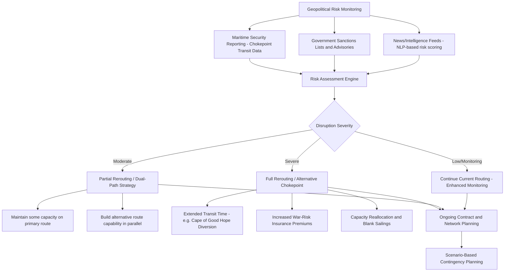

## Geopolitical Disruption and Trade Lane Risk

### Overview

Geopolitical disruption and trade lane risk refer to the exposure of global freight networks to political, military, and diplomatic events — armed conflict, sanctions regimes, chokepoint closures, trade wars, and territorial disputes — that materially alter the cost, speed, reliability, and availability of established shipping routes. Unlike weather-driven or purely commercial disruptions, geopolitical risk is characterized by prolonged uncertainty, the potential for sudden escalation, and second-order effects that cascade across capacity, rates, insurance, and network design well beyond the directly affected region.

### Key Chokepoints and Structural Vulnerabilities

**Key Points**

- Global ocean trade is heavily dependent on a small number of narrow maritime chokepoints where a large share of trade volume is geographically funneled through a limited passage, creating disproportionate systemic risk relative to the physical area involved.
- **Suez Canal / Bab el-Mandeb Strait / Red Sea**: Connects the Mediterranean to the Indian Ocean, historically the primary artery for Asia-Europe container trade, avoiding the much longer Cape of Good Hope route around Africa.
- **Strait of Hormuz**: Carries a substantial share of global seaborne oil shipments and remains widely regarded as the single largest tail risk in global energy and trade logistics due to its narrow width and the concentration of Gulf oil-exporting traffic passing through it.
- **Panama Canal**: Connects the Atlantic and Pacific, historically vulnerable to a distinct risk type — drought-driven operational restrictions on vessel draft and daily transit slots, illustrating that chokepoint risk is not exclusively military/political in origin.
- **Strait of Malacca**: The primary route between the Indian Ocean and the Pacific/South China Sea, exposed to piracy risk and broader South China Sea territorial tensions.

### Current Status of Major Ocean Disruptions (as of September 2026)

**This is a rapidly evolving situation and reflects the state of affairs as of late September 2026; readers should verify current conditions before making operational decisions:**

- The Red Sea crisis, which began with Houthi attacks on commercial shipping in late 2023, has now persisted for roughly three years and evolved through multiple distinct phases, including a ceasefire-linked pause in attacks following the Gaza peace plan beginning October 2025, then a resumption of attacks against Israel and Saudi Arabia in 2026 amid a broader regional conflict, with renewed clashes between Yemeni government forces and the Houthis emerging as recently as September 2026.
- Suez Canal throughput has remained substantially below pre-2023 levels, with most container carriers (Maersk, Hapag-Lloyd, MSC, CMA CGM) continuing to route the majority of Asia-Europe volume around the Cape of Good Hope, adding meaningfully to transit time and cost on that lane.
- Some carriers, including CMA CGM, have resumed limited Red Sea routing with naval escort during 2026, but industry sources describe this as a cautious, partial, and conditional return rather than a full normalization — container shipping in particular remains more selective about resuming Red Sea transits than tanker and bulk carrier traffic, which has shown a stronger recovery.
- Schedule reliability on major east-west lanes has remained notably impaired, and rates remain elevated relative to the pre-2023 baseline even as some stabilization has occurred.
- A structurally significant secondary risk has emerged alongside the direct disruption: because a large amount of new vessel capacity has been entering the global fleet since 2024, the ongoing Cape of Good Hope diversions have effectively been absorbing (masking) this overcapacity by extending average voyage length. Analysts have flagged that a genuine full-scale return to Suez routing could release a meaningful share of global fleet capacity back into the market rapidly, risking a sharp swing from current tight conditions to oversupply and falling rates. [Unverified: the precise scale, timing, and market impact of any such capacity release is inherently forward-looking and contested among industry analysts; treat this as a described risk scenario rather than a settled forecast.]
- **Practical implication for planners**: Multiple industry sources caution shippers against prematurely adjusting lead-time assumptions back to theoretical Suez transit times, since network reconfiguration and carrier alliance adjustments are expected to create their own reliability disruptions even as routing patterns shift.

### Categories of Geopolitical Risk Affecting Trade Lanes

#### 1. Armed Conflict and Regional Instability

- Direct physical threats to vessels (missile/drone attacks, mining, piracy) force rerouting, increase insurance costs (notably war-risk premiums), and can effectively close chokepoints to commercial traffic even without a formal blockade.
- Naval escort and convoy arrangements (as seen with some Red Sea transits) can partially mitigate risk but add cost, complexity, and scheduling constraints compared to unescorted transit.

#### 2. Sanctions and Export Control Regimes

- Sanctions targeting specific countries, entities, or goods (dual-use technology, semiconductors, defense-related items) create compliance obligations that ripple through freight forwarders, carriers, and financial institutions handling trade documentation and payment.
- **Shadow fleet phenomena**: Sanctioned oil and other commodity trade has driven the emergence of vessels operating outside conventional insurance and registration frameworks to circumvent sanctions, creating additional safety, environmental, and compliance risks for the broader shipping ecosystem.
- Sanctions compliance failures carry substantial legal and financial liability, making automated sanctions-screening integration into trade documentation and TMS platforms (see related topics) an increasingly standard risk-mitigation practice.

#### 3. Tariffs and Trade Policy Shifts

- Sudden tariff escalation or trade agreement renegotiation can rapidly alter the cost-effectiveness of established sourcing and routing decisions, a key driver of the nearshoring and supply chain reconfiguration trends discussed elsewhere in this chapter.
- Trade policy volatility increases the value of scenario planning and diversified sourcing/routing strategies, since single-lane or single-country dependency amplifies exposure to unilateral policy shifts by any one government.

#### 4. Chokepoint-Specific Operational Risk

- Distinct from conflict-driven risk, chokepoints can also face capacity constraints from infrastructure limitations (canal depth/width restrictions), environmental factors (drought affecting canal water levels), or accidents (vessel groundings blocking a narrow passage), all of which produce similar network-level disruption despite differing root causes.

### Risk Assessment and Response Framework

### Architecture: Trade Lane Risk Monitoring System (svg_diagram)

<svg xmlns="http://www.w3.org/2000/svg" viewBox="0 0 800 380">
<text x="400" y="30" font-size="18" font-weight="bold" text-anchor="middle" fill="#1a1a1a">Trade Lane Risk Monitoring Architecture (svg_diagram)</text>
<rect x="30" y="60" width="160" height="80" rx="8" fill="#dbeafe" stroke="#2563eb" stroke-width="1.5" />
<text x="110" y="85" font-size="12" text-anchor="middle" fill="#1e3a8a">Data Inputs</text>
<text x="110" y="103" font-size="10" text-anchor="middle" fill="#1e3a8a">News/NLP feeds,</text>
<text x="110" y="118" font-size="10" text-anchor="middle" fill="#1e3a8a">AIS vessel tracking,</text>
<text x="110" y="133" font-size="10" text-anchor="middle" fill="#1e3a8a">Sanctions databases</text>
<rect x="240" y="60" width="160" height="80" rx="8" fill="#dcfce7" stroke="#16a34a" stroke-width="1.5" />
<text x="320" y="90" font-size="12" text-anchor="middle" fill="#14532d">Risk Scoring Engine</text>
<text x="320" y="108" font-size="10" text-anchor="middle" fill="#14532d">Per-lane severity</text>
<text x="320" y="123" font-size="10" text-anchor="middle" fill="#14532d">classification</text>
<rect x="450" y="60" width="160" height="80" rx="8" fill="#fef3c7" stroke="#d97706" stroke-width="1.5" />
<text x="530" y="90" font-size="12" text-anchor="middle" fill="#78350f">Network Response</text>
<text x="530" y="108" font-size="10" text-anchor="middle" fill="#78350f">Rerouting engine,</text>
<text x="530" y="123" font-size="10" text-anchor="middle" fill="#78350f">Capacity reallocation</text>
<rect x="660" y="60" width="120" height="80" rx="8" fill="#fce7f3" stroke="#db2777" stroke-width="1.5" />
<text x="720" y="90" font-size="12" text-anchor="middle" fill="#831843">Alerting</text>
<text x="720" y="108" font-size="10" text-anchor="middle" fill="#831843">Shipper and</text>
<text x="720" y="123" font-size="10" text-anchor="middle" fill="#831843">Planner Dashboards</text>
<line x1="190" y1="100" x2="240" y2="100" stroke="#475569" stroke-width="2" marker-end="url(#arrow5)" />
<line x1="400" y1="100" x2="450" y2="100" stroke="#475569" stroke-width="2" marker-end="url(#arrow5)" />
<line x1="610" y1="100" x2="660" y2="100" stroke="#475569" stroke-width="2" marker-end="url(#arrow5)" />
<rect x="150" y="200" width="500" height="120" rx="10" fill="#ede9fe" stroke="#7c3aed" stroke-width="2" />
<text x="400" y="225" font-size="13" font-weight="bold" text-anchor="middle" fill="#4c1d95">Downstream Operational Impact</text>
<text x="400" y="250" font-size="10" text-anchor="middle" fill="#4c1d95">Freight rate volatility and war-risk insurance surcharges</text>
<text x="400" y="270" font-size="10" text-anchor="middle" fill="#4c1d95">Extended transit times and inventory buffer adjustments</text>
<text x="400" y="290" font-size="10" text-anchor="middle" fill="#4c1d95">Contract renegotiation and sourcing diversification decisions</text>
<line x1="400" y1="140" x2="400" y2="200" stroke="#475569" stroke-width="2" />
</svg>

### Operational and Commercial Consequences

**Key Points**

- **Extended transit times**: Rerouting around a closed or high-risk chokepoint (e.g., Cape of Good Hope diversion instead of Suez) can add well over a week to affected voyages, directly impacting inventory planning and just-in-time operating models.
- **War-risk insurance premiums**: Marine insurers apply additional premiums for vessels transiting designated high-risk zones, a direct and quantifiable cost pass-through affecting freight rates.
- **Rate volatility and blank sailings**: Carriers respond to disruption-driven capacity absorption (longer voyages consuming more vessel-days per unit of cargo delivered) by adjusting capacity deployment, which can produce both rate spikes during acute disruption and rate crashes if disrupted capacity suddenly returns to the market.
- **Container/equipment imbalances**: Extended transit times and rerouted flows can strand containers away from where they are next needed, exacerbating equipment availability issues at various ports.
- **Contract renegotiation pressure**: Prolonged disruption directly influences ongoing long-term contract rate negotiations between shippers and carriers, as both parties attempt to price in a "new normal" level of route uncertainty rather than treating disruption as a temporary anomaly.
- **Fragmented carrier strategies**: Different carrier alliances can adopt materially different risk postures toward the same disrupted route at the same time (some resuming partial transits, others remaining fully diverted), creating scheduling and capacity unpredictability for shippers using multiple carriers.

### Strategic Mitigation Approaches for Shippers and Forwarders

- **Dual-routing and network diversification**: Maintaining capability across multiple routing options (e.g., both Suez and Cape of Good Hope-capable services) rather than full dependency on a single lane, trading some cost efficiency for resilience.
- **Buffer inventory and safety stock adjustment**: Temporarily increasing safety stock or extending planning lead times to absorb transit time uncertainty during periods of elevated disruption risk.
- **Scenario-based contingency planning**: Pre-developing rerouting and sourcing contingency plans for multiple disruption severity levels, rather than reactive planning only after a disruption materializes.
- **Enhanced supply chain visibility**: Leveraging AIS vessel tracking, IoT cargo visibility, and geopolitical risk-scoring platforms (see related topics) to detect emerging disruption signals earlier and adjust routing decisions proactively rather than reactively.
- **Diversified carrier and sourcing relationships**: Avoiding overreliance on a single carrier alliance or sourcing region reduces the impact of any one actor's specific risk response (e.g., one alliance remaining cautious about a route while another resumes transit).
- **Caution against premature normalization assumptions**: Industry guidance during 2026 has specifically emphasized not resetting lead-time assumptions to pre-disruption baselines the moment a chokepoint shows signs of reopening, given the demonstrated pattern of false starts and fragmented carrier returns.

### Benefits of Robust Risk Management

- **Reduced disruption exposure**: Proactive diversification and monitoring reduce the operational and financial shock of sudden chokepoint closures or escalations.
- **Improved negotiating position**: Shippers with credible alternative routing/sourcing options retain stronger leverage in carrier rate negotiations during periods of capacity tightness.
- **Better capital allocation**: Scenario planning allows more informed decisions about safety stock levels and network investment, avoiding both over-insurance (excess buffer inventory) and under-preparedness.

### Limitations and Challenges

- **Inherent unpredictability**: Geopolitical events are, by nature, difficult to forecast with precision; risk models can identify elevated probability zones but cannot reliably predict specific escalation timing or duration.
- **Cost of resilience**: Maintaining dual-routing capability, higher safety stock, and diversified sourcing all carry real ongoing costs that must be weighed against the probability and severity of disruption — perfect resilience is neither achievable nor economically rational for most organizations.
- **Fragmented and evolving information environment**: As demonstrated in the current Red Sea situation, conditions can shift materially within weeks (ceasefires, resumed attacks, partial carrier returns), meaning any specific operational guidance risks becoming outdated quickly and should be verified against current sources before acting on it.
- **Second-order effects are hard to model**: The relationship between chokepoint disruption, fleet capacity absorption, and eventual rate normalization (as flagged by analysts regarding potential overcapacity risk upon a Suez return) involves complex, interacting variables that are difficult to forecast with confidence.
- **Sanctions compliance complexity**: Rapidly evolving sanctions regimes require continuous compliance monitoring; the emergence of "shadow fleet" activity illustrates how enforcement gaps can persist despite formal sanctions frameworks.

### Related Topics

- Nearshoring and supply chain reconfiguration (diversification as a geopolitical risk response)
- Artificial intelligence in freight management (NLP-based geopolitical risk scoring)
- Internet of Things and real-time cargo visibility (AIS tracking for chokepoint monitoring)
- Green logistics and freight carbon accounting (emissions impact of extended rerouting)
- Marine war-risk insurance and freight rate mechanics
- Sanctions compliance and trade documentation screening
- IMO decarbonization targets (interaction between rerouting and fleet emissions)